#### 目录介绍
- 01.概述与背景
  - 1.1 消息机制背景
  - 1.2 主要解决问题
  - 1.3 设计目标
- 02.消息机制架构
  - 2.1 整体架构图
  - 2.2 核心组件类图
- 03.消息机制思想
- 04.消息体设计原理
  - 4.1 消息结构设计
  - 4.2 同步和异步消息
  - 4.3 消息类型分类
- 05.消息队列设计
  - 5.1 队列数据结构
  - 5.2 消息入队算法
  - 5.3 队列核心实现
  - 5.4 队列管理策略
- 06.消息处理器设计
  - 6.1 Handler设计模式
  - 6.2 消息分发机制
  - 6.3 生命周期管理
- 07.Looper设计原理
  - 7.1 Looper设计思想
  - 7.2 Looper工作流程
  - 7.3 Looper核心实现
  - 7.4 多Looper架构设计
  - 7.5 支持多Looper
- 08.不同平台机制
  - 8.1 Android消息机制
  - 8.2 iOS消息机制


## 01.概述与背景

### 1.1 消息机制背景

在现代移动应用开发中，消息机制是解决异步编程和线程间通信的核心技术。其设计背景和必要性体现在以下几个方面：

- **多线程环境**: 现代应用需要处理UI渲染、网络请求、数据库操作等多种任务
- **异步编程需求**: 避免阻塞主线程，提升用户体验
- **事件驱动架构**: 响应用户交互、系统事件、网络回调等各种事件
- **线程安全**: 确保多线程环境下的数据一致性和操作安全性

### 1.2 主要解决问题

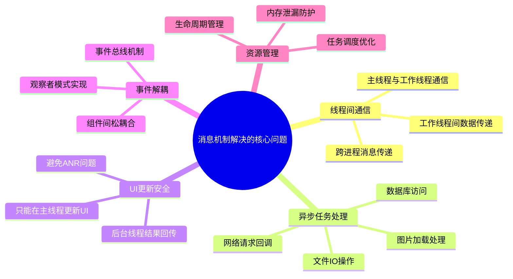

### 1.3 设计目标

| 目标 | 描述 | 实现方式 |
|------|------|----------|
| **线程安全** | 确保多线程环境下的数据一致性 | 消息队列同步机制 |
| **高性能** | 最小化消息传递开销 | 高效的队列数据结构 |
| **易用性** | 提供简洁的API接口 | 封装复杂的底层实现 |
| **可扩展性** | 支持自定义消息类型和处理器 | 插件化架构设计 |
| **可靠性** | 保证消息不丢失，按序处理 | 持久化和重试机制 |

## 02.消息机制架构

### 2.1 整体架构图

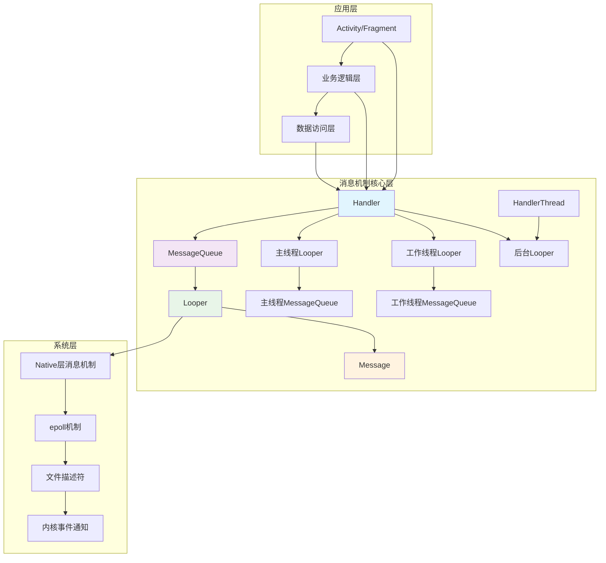

### 2.2 核心组件类图

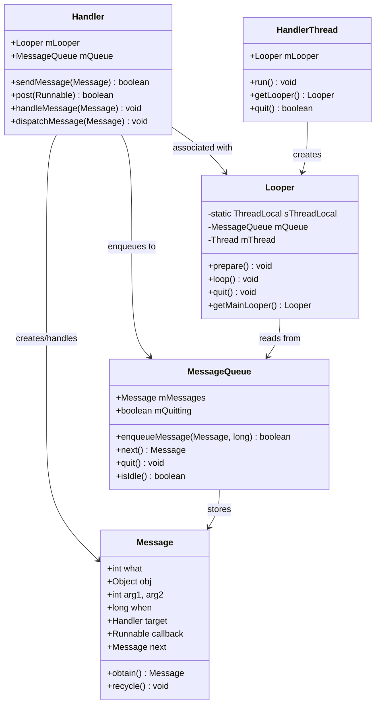

## 04.消息体设计原理

### 4.1 消息结构设计

消息是消息机制的基本单元，其设计需要考虑性能、内存管理和扩展性：

```java
public final class Message implements Parcelable {
    // 消息标识符
    public int what;
    
    // 简单数据参数
    public int arg1;
    public int arg2;
    
    // 复杂数据对象
    public Object obj;
    
    // 消息携带的数据包
    Bundle data;
    
    // 消息处理器
    Handler target;
    
    // 回调函数
    Runnable callback;
    
    // 消息发送时间
    long when;
    
    // 链表指针（用于消息队列）
    Message next;
    
    // 消息池相关
    private static final Object sPoolSync = new Object();
    private static Message sPool;
    private static int sPoolSize = 0;
    private static final int MAX_POOL_SIZE = 50;
}
```

### 4.2 同步和异步消息

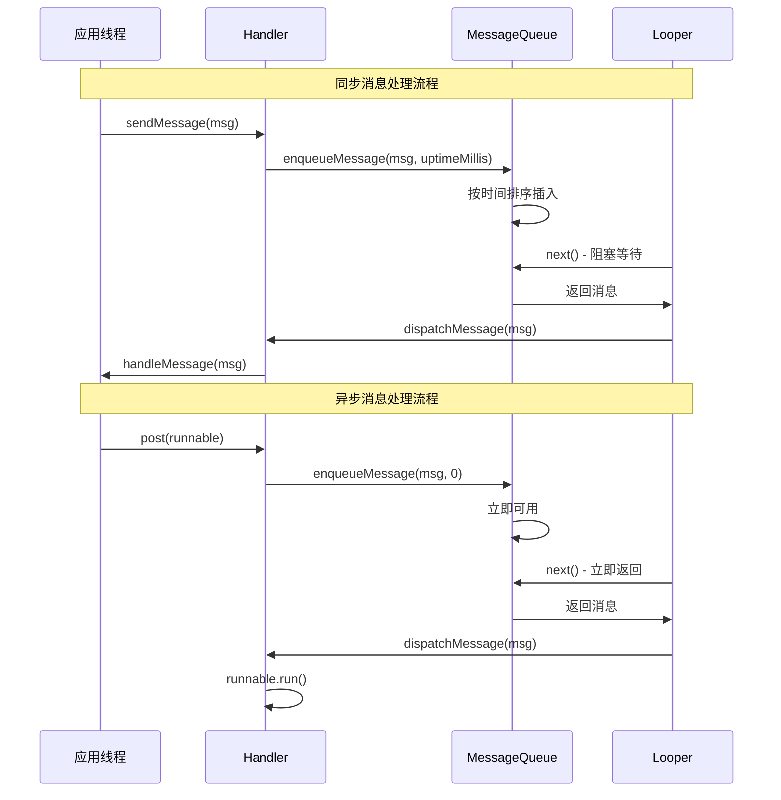

### 4.3 消息类型分类

| 消息类型 | 特点 | 使用场景 | 处理方式 |
|----------|------|----------|----------|
| **普通消息** | 按时间顺序处理 | 一般业务逻辑 | handleMessage() |
| **延时消息** | 指定时间后处理 | 定时任务、超时处理 | sendMessageDelayed() |
| **屏障消息** | 阻塞同步消息 | 优先处理异步消息 | postSyncBarrier() |
| **异步消息** | 不受屏障影响 | UI刷新、高优先级任务 | setAsynchronous(true) |
| **空闲消息** | 队列空闲时处理 | 资源清理、预加载 | IdleHandler |

## 05.消息队列设计

### 5.1 队列数据结构

消息队列采用**单链表**结构，按照消息的执行时间进行排序：

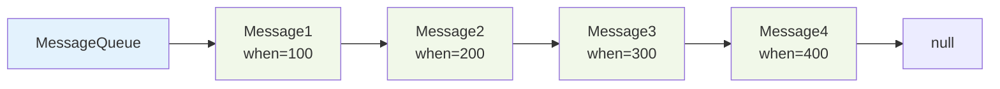

### 5.2 消息入队算法

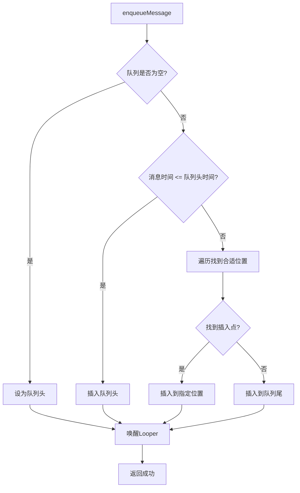

### 5.3 队列核心实现

```java
public final class MessageQueue {
    Message mMessages; // 队列头
    private final Object mLock = new Object();
    
    boolean enqueueMessage(Message msg, long when) {
        synchronized (mLock) {
            msg.when = when;
            Message p = mMessages;
            boolean needWake;
            
            // 插入到队列头部
            if (p == null || when == 0 || when < p.when) {
                msg.next = p;
                mMessages = msg;
                needWake = mBlocked;
            } else {
                // 找到合适的插入位置
                needWake = mBlocked && p.target == null && msg.isAsynchronous();
                Message prev;
                for (;;) {
                    prev = p;
                    p = p.next;
                    if (p == null || when < p.when) {
                        break;
                    }
                    if (needWake && p.isAsynchronous()) {
                        needWake = false;
                    }
                }
                msg.next = p;
                prev.next = msg;
            }
            
            // 唤醒等待的Looper
            if (needWake) {
                nativeWake(mPtr);
            }
        }
        return true;
    }
}
```

### 5.4 队列管理策略

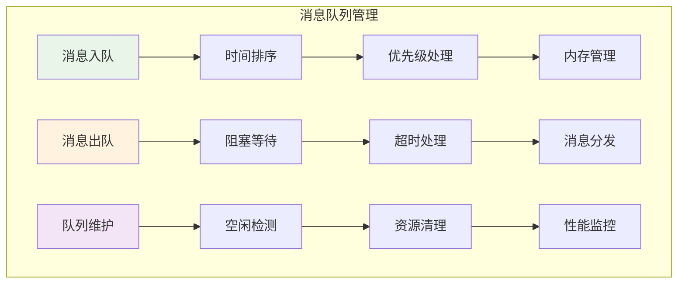

## 06.消息处理器设计

### 6.1 Handler设计模式

Handler采用**策略模式**和**模板方法模式**，提供灵活的消息处理机制：

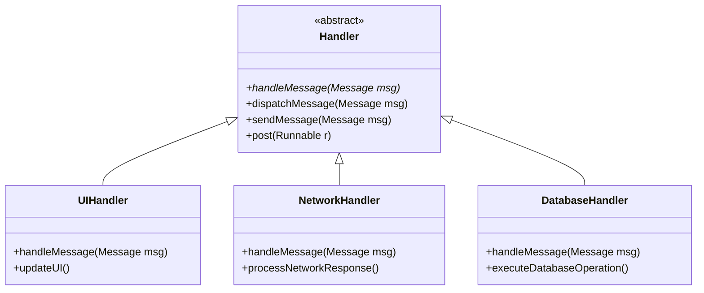

### 6.2 消息分发机制

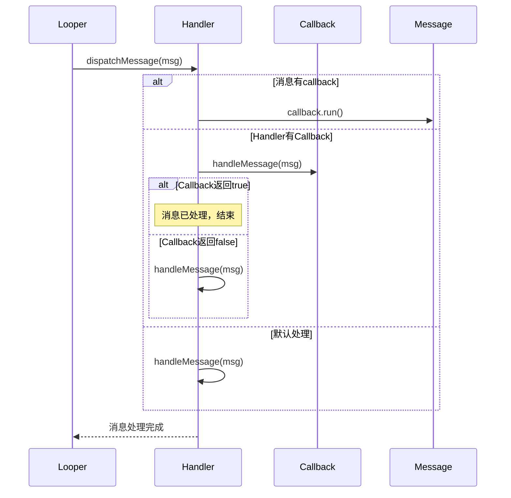


### 6.3 生命周期管理


## 07.Looper设计原理

### 7.1 Looper设计思想

Looper是消息机制的核心驱动器，采用**事件循环**模式，其设计思想包括：

1. **单线程模型**: 每个线程最多只能有一个Looper
2. **事件驱动**: 基于消息队列的事件循环
3. **阻塞等待**: 没有消息时进入休眠状态
4. **优先级调度**: 支持不同优先级的消息处理

### 7.2 Looper工作流程

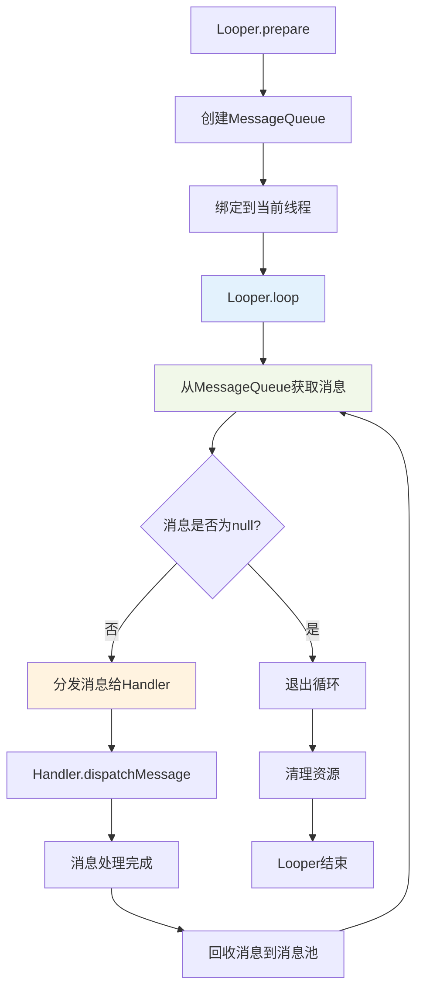

### 7.3 Looper核心实现

```java
public final class Looper {
    static final ThreadLocal<Looper> sThreadLocal = new ThreadLocal<Looper>();
    private static Looper sMainLooper;
    
    final MessageQueue mQueue;
    final Thread mThread;
    
    public static void prepare() {
        prepare(true);
    }
    
    private static void prepare(boolean quitAllowed) {
        if (sThreadLocal.get() != null) {
            throw new RuntimeException("Only one Looper may be created per thread");
        }
        sThreadLocal.set(new Looper(quitAllowed));
    }
    
    public static void loop() {
        final Looper me = myLooper();
        if (me == null) {
            throw new RuntimeException("No Looper; Looper.prepare() wasn't called on this thread.");
        }
        
        final MessageQueue queue = me.mQueue;
        
        for (;;) {
            Message msg = queue.next(); // 可能阻塞
            if (msg == null) {
                // 没有消息表示消息队列正在退出
                return;
            }
            
            try {
                msg.target.dispatchMessage(msg);
            } finally {
                msg.recycleUnchecked();
            }
        }
    }
}
```

### 7.4 多Looper架构设计

应用可以有多个Looper，每个线程最多一个：

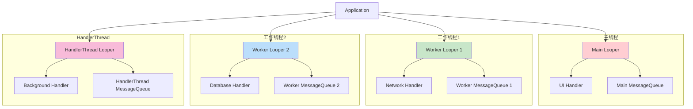

### 7.5 支持多Looper

| 原因 | 说明 | 优势 |
|------|------|------|
| **线程隔离** | 不同线程处理不同类型任务 | 避免相互影响，提高稳定性 |
| **性能优化** | 分散处理负载 | 充分利用多核CPU资源 |
| **职责分离** | UI线程专注界面更新 | 后台线程处理耗时操作 |
| **优先级管理** | 不同优先级的任务分离 | 保证关键任务及时处理 |

## 08.不同平台机制

### 8.1 Android消息机制

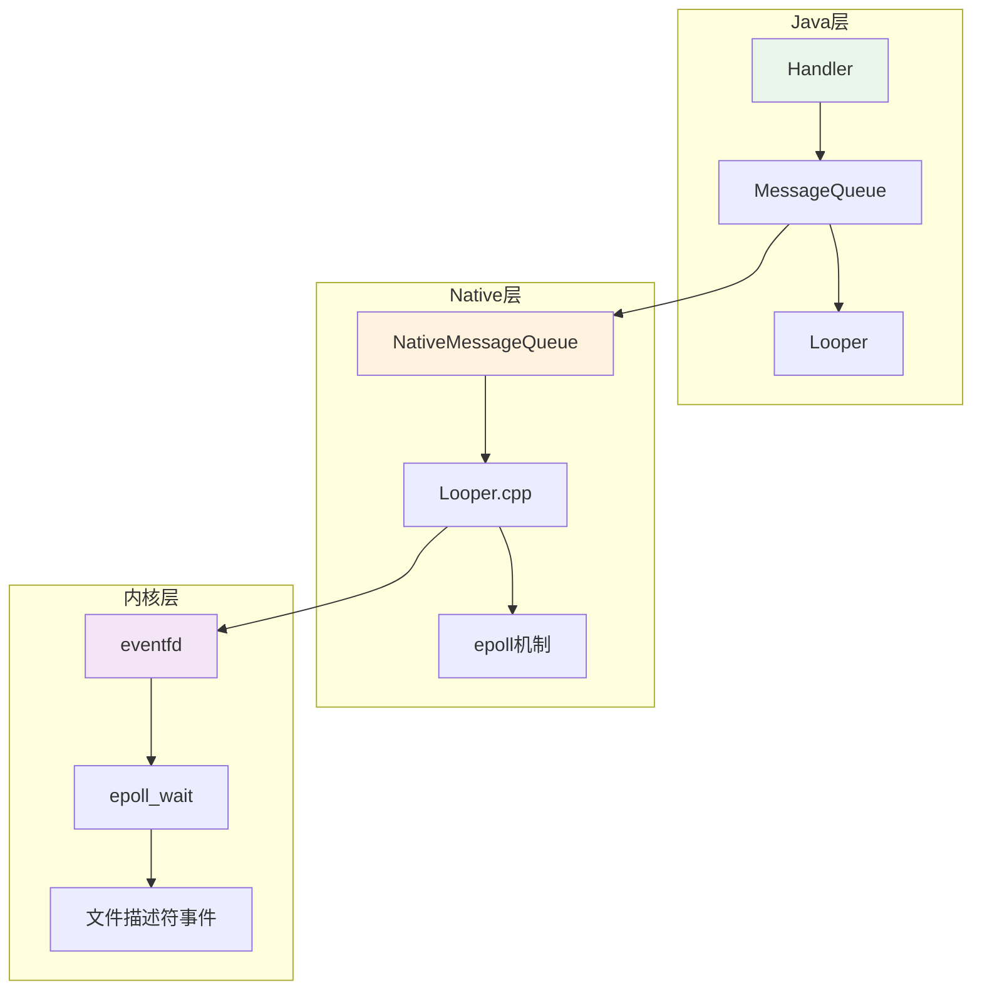

### 8.2 iOS消息机制

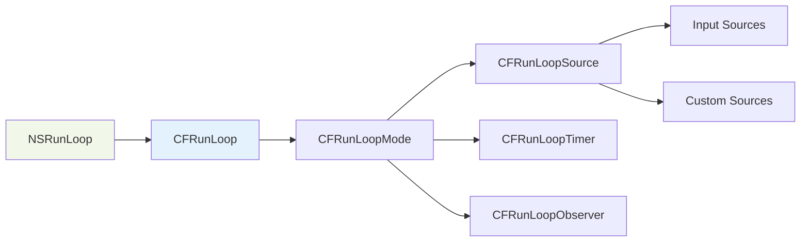


