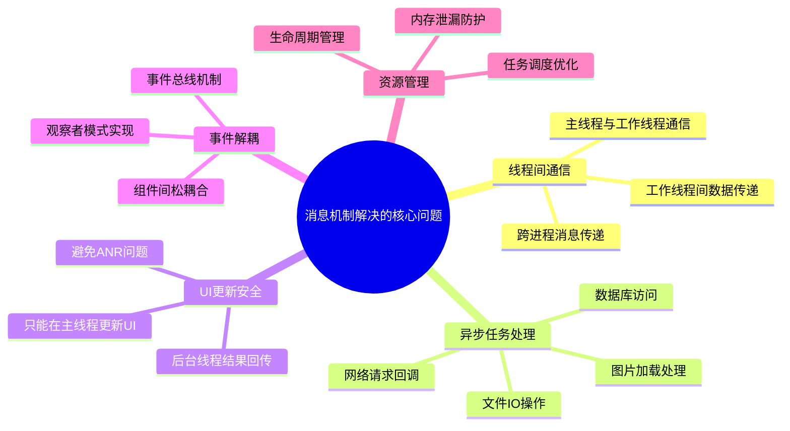
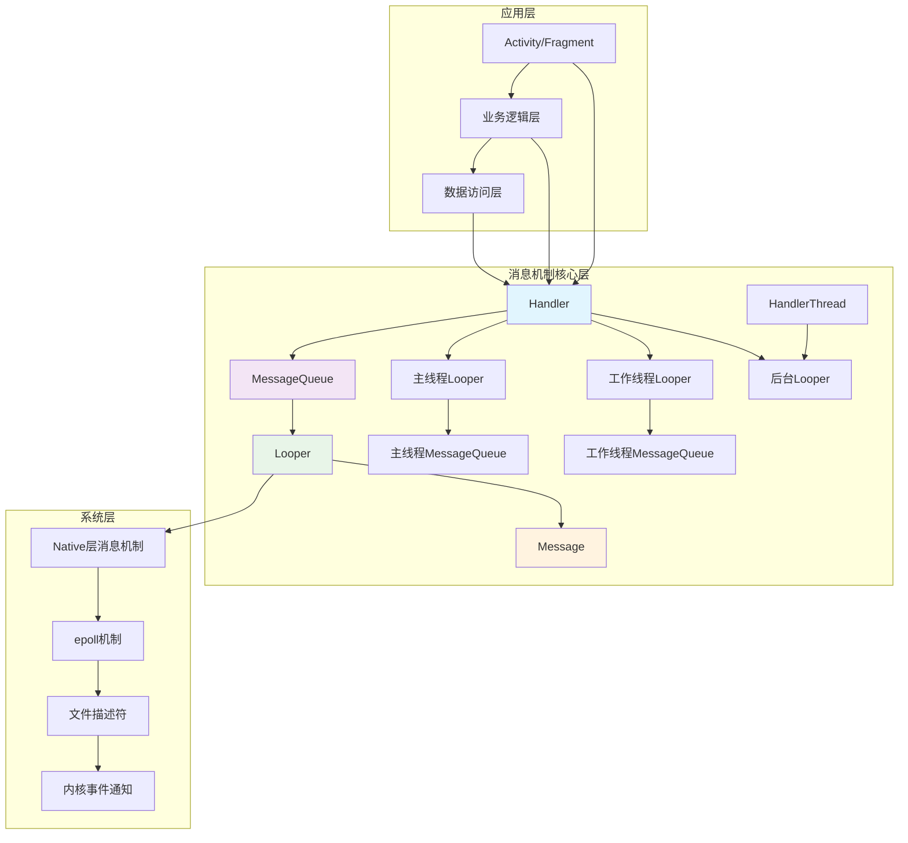
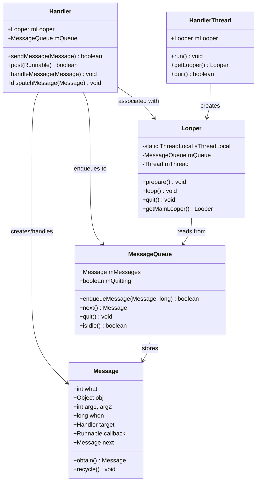
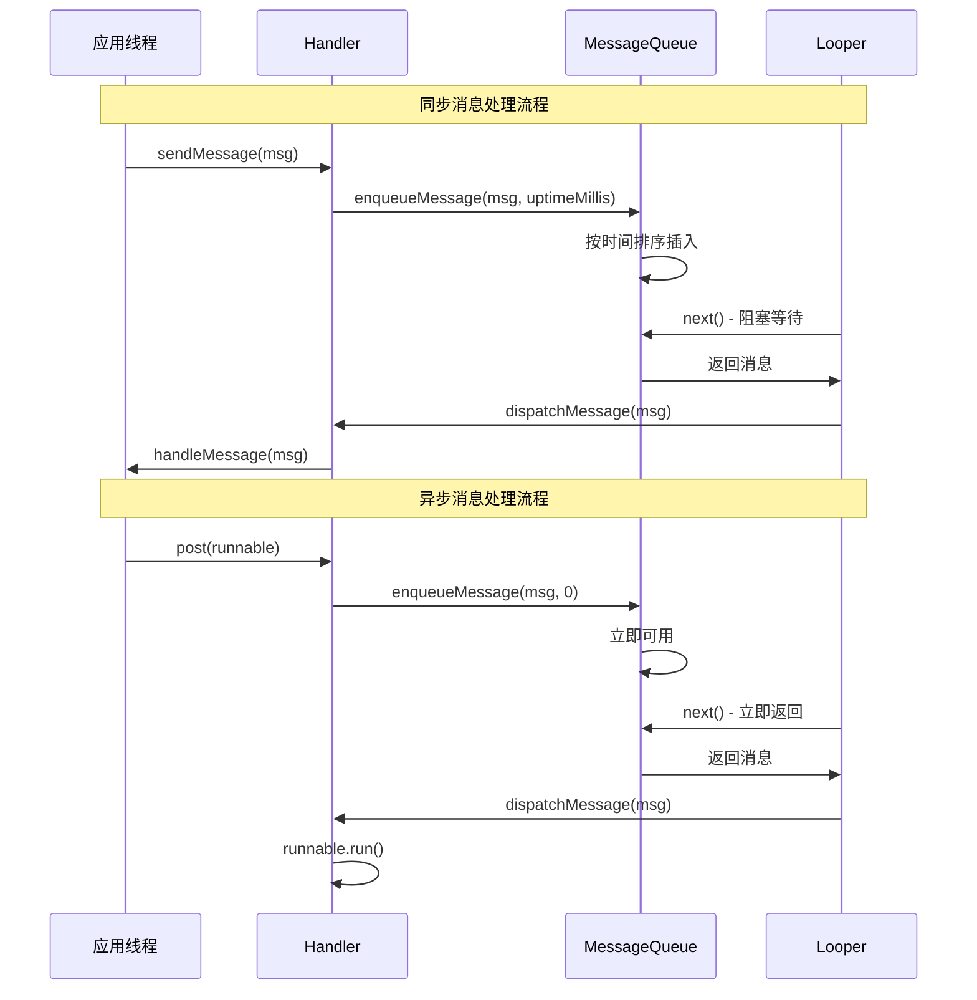

#### 目录介绍
- 01.概述与背景
  - 1.1 消息机制背景
  - 1.2 主要解决问题
  - 1.3 设计目标
- 02.消息机制架构
  - 2.1 整体架构图
  - 2.2 核心组件类图
- 03.消息机制思想
- 04.消息体设计原理
  - 4.1 消息结构设计
  - 4.2 同步和异步消息
  - 4.3 消息类型分类


## 01.概述与背景

### 1.1 消息机制背景

在现代移动应用开发中，消息机制是解决异步编程和线程间通信的核心技术。其设计背景和必要性体现在以下几个方面：

- **多线程环境**: 现代应用需要处理UI渲染、网络请求、数据库操作等多种任务
- **异步编程需求**: 避免阻塞主线程，提升用户体验
- **事件驱动架构**: 响应用户交互、系统事件、网络回调等各种事件
- **线程安全**: 确保多线程环境下的数据一致性和操作安全性

### 1.2 主要解决问题



### 1.3 设计目标

| 目标 | 描述 | 实现方式 |
|------|------|----------|
| **线程安全** | 确保多线程环境下的数据一致性 | 消息队列同步机制 |
| **高性能** | 最小化消息传递开销 | 高效的队列数据结构 |
| **易用性** | 提供简洁的API接口 | 封装复杂的底层实现 |
| **可扩展性** | 支持自定义消息类型和处理器 | 插件化架构设计 |
| **可靠性** | 保证消息不丢失，按序处理 | 持久化和重试机制 |

## 02.消息机制架构

### 2.1 整体架构图



### 2.2 核心组件类图



## 04.消息体设计原理

### 4.1 消息结构设计

消息是消息机制的基本单元，其设计需要考虑性能、内存管理和扩展性：

```java
public final class Message implements Parcelable {
    // 消息标识符
    public int what;
    
    // 简单数据参数
    public int arg1;
    public int arg2;
    
    // 复杂数据对象
    public Object obj;
    
    // 消息携带的数据包
    Bundle data;
    
    // 消息处理器
    Handler target;
    
    // 回调函数
    Runnable callback;
    
    // 消息发送时间
    long when;
    
    // 链表指针（用于消息队列）
    Message next;
    
    // 消息池相关
    private static final Object sPoolSync = new Object();
    private static Message sPool;
    private static int sPoolSize = 0;
    private static final int MAX_POOL_SIZE = 50;
}
```

### 4.2 同步和异步消息




### 4.3 消息类型分类


