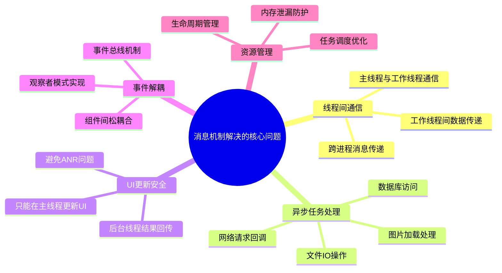

#### 目录介绍
- 01.概述与背景
  - 1.1 消息机制背景
  - 1.2 主要解决问题
  - 1.3 设计目标

## 01.概述与背景

### 1.1 消息机制背景

在现代移动应用开发中，消息机制是解决异步编程和线程间通信的核心技术。其设计背景和必要性体现在以下几个方面：

- **多线程环境**: 现代应用需要处理UI渲染、网络请求、数据库操作等多种任务
- **异步编程需求**: 避免阻塞主线程，提升用户体验
- **事件驱动架构**: 响应用户交互、系统事件、网络回调等各种事件
- **线程安全**: 确保多线程环境下的数据一致性和操作安全性

### 1.2 主要解决问题

### 1.3 设计目标

| 目标 | 描述 | 实现方式 |
|------|------|----------|
| **线程安全** | 确保多线程环境下的数据一致性 | 消息队列同步机制 |
| **高性能** | 最小化消息传递开销 | 高效的队列数据结构 |
| **易用性** | 提供简洁的API接口 | 封装复杂的底层实现 |
| **可扩展性** | 支持自定义消息类型和处理器 | 插件化架构设计 |
| **可靠性** | 保证消息不丢失，按序处理 | 持久化和重试机制 |

