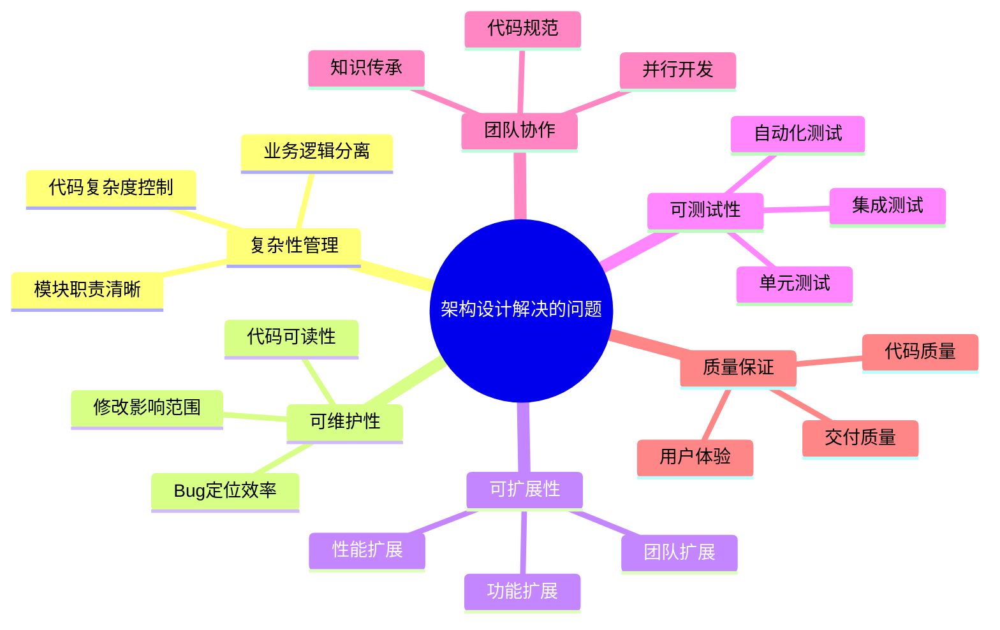

#### 目录介绍
- 01.为何做架构设计
  - 1.1 解决核心问题

## 01.为何做架构设计

### 1.1 解决核心问题

```mermaid
mindmap
  root((架构设计解决的问题))
    复杂性管理
      代码复杂度控制
      业务逻辑分离
      模块职责清晰
    可维护性
      代码可读性
      修改影响范围
      Bug定位效率
    可扩展性
      功能扩展
      性能扩展
      团队扩展
    可测试性
      单元测试
      集成测试
      自动化测试
    团队协作
      并行开发
      代码规范
      知识传承
    质量保证
      代码质量
      交付质量
      用户体验
```

