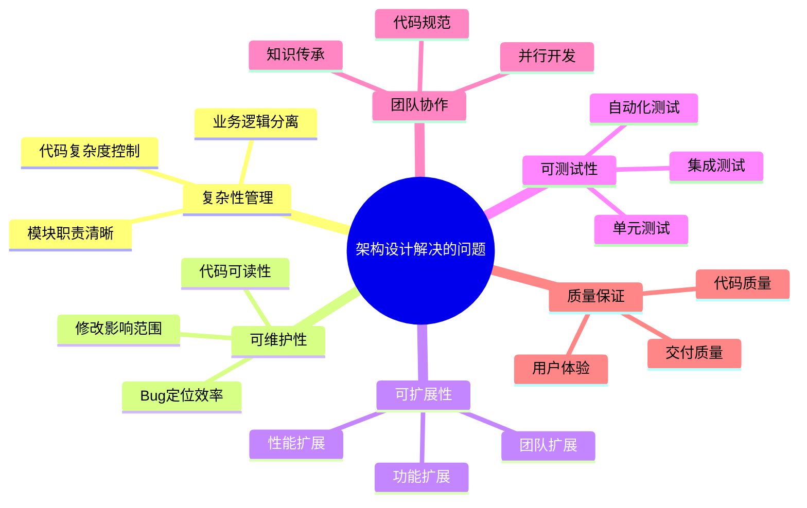
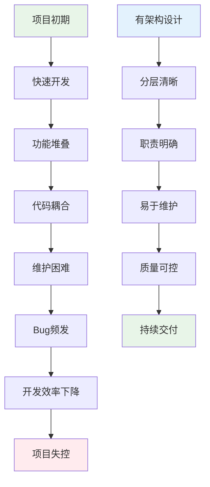
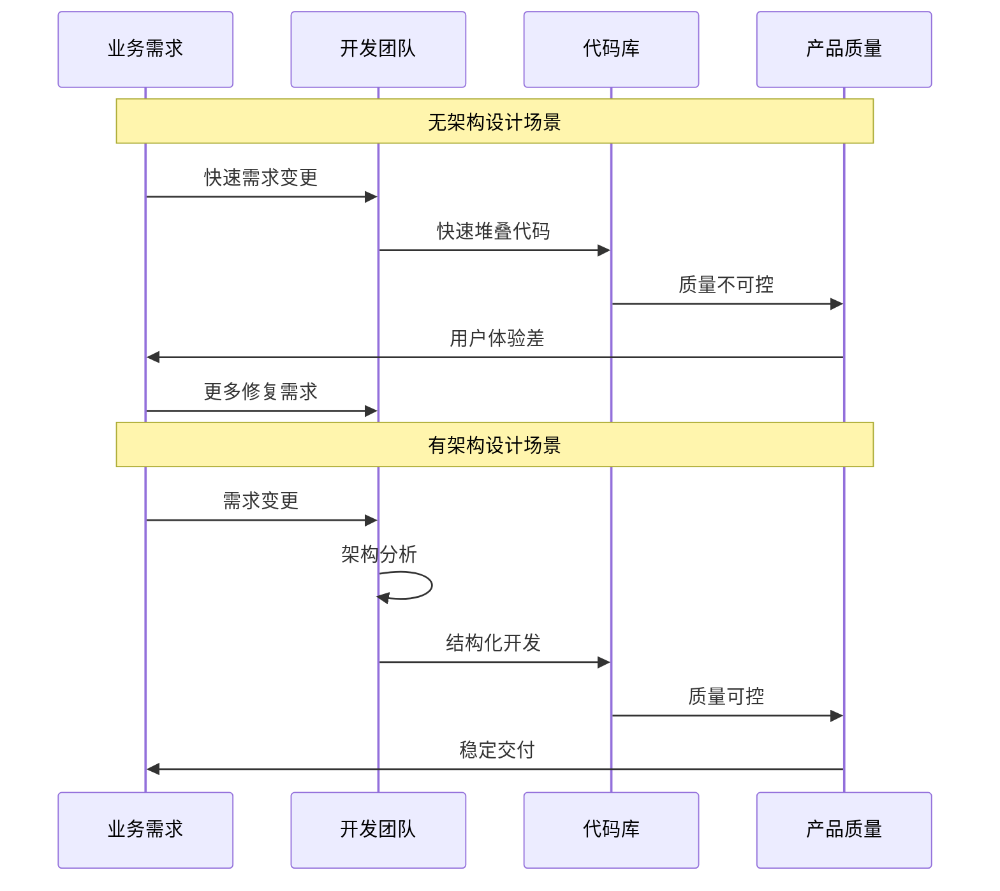

#### 目录介绍
- 01.为何做架构设计
  - 1.1 解决核心问题
  - 1.2 开发遇到问题
  - 1.3 架构设计的价值
  - 1.4 架构的必要性

## 01.为何做架构设计

### 1.1 解决核心问题

### 1.2 开发遇到问题

### 1.3 架构设计的价值

| 维度 | 无架构设计 | 有架构设计 | 价值体现 |
|------|------------|------------|----------|
| **开发效率** | 初期快，后期慢 | 初期慢，后期快 | 长期效率提升 |
| **代码质量** | 难以保证 | 质量可控 | 减少技术债务 |
| **团队协作** | 混乱无序 | 规范有序 | 提升协作效率 |
| **维护成本** | 越来越高 | 相对稳定 | 降低维护成本 |
| **扩展能力** | 困难重重 | 相对容易 | 支持业务发展 |

### 1.4 架构的必要性

