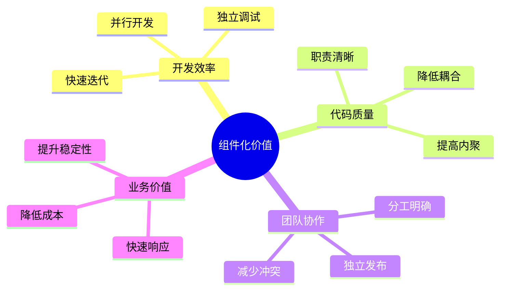
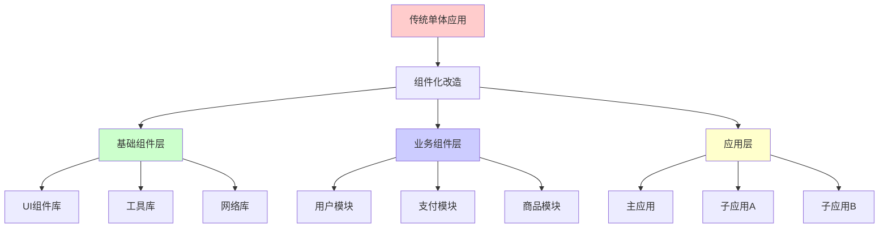
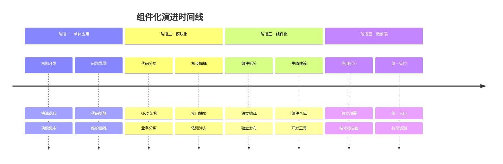

# 组件化项目实践
#### 目录介绍
- 01.为何要做组件化
  - 1.1 业务背景介绍
  - 1.2 组件化的价值
- 02.核心解决的问题
  - 2.1 核心问题域
  - 2.2 问题解决架构图
- 03.项目演进过程
  - 3.1 演进路径
  - 3.2 演进架构对比
  - 3.3 渐进式迁移流程

## 01.为何要做组件化

### 1.1 业务背景介绍

随着移动应用和Web应用的快速发展，项目规模不断扩大，传统的单体应用架构面临诸多挑战：

- **代码规模膨胀**：单个项目代码量动辄几十万行，维护困难
- **团队协作复杂**：多团队并行开发时，代码冲突频繁
- **编译时间过长**：全量编译耗时严重影响开发效率
- **技术债务累积**：模块间耦合严重，重构成本高
- **复用性差**：相似功能在不同项目中重复开发

### 1.2 组件化的价值

## 02.核心解决的问题

### 2.1 核心问题域

| 问题类别 | 具体问题 | 组件化解决方案 |
|---------|---------|---------------|
| **开发效率** | 编译时间长、调试困难 | 独立编译、独立调试 |
| **代码质量** | 耦合严重、职责不清 | 明确边界、单一职责 |
| **团队协作** | 代码冲突、并行困难 | 独立仓库、独立发布 |
| **业务复用** | 重复开发、维护成本高 | 组件复用、统一维护 |
| **技术演进** | 技术栈升级困难 | 渐进式升级、技术隔离 |

### 2.2 问题解决架构图

## 03.项目演进过程

### 3.1 演进路径

### 3.2 演进架构对比

### 3.3 渐进式迁移流程

