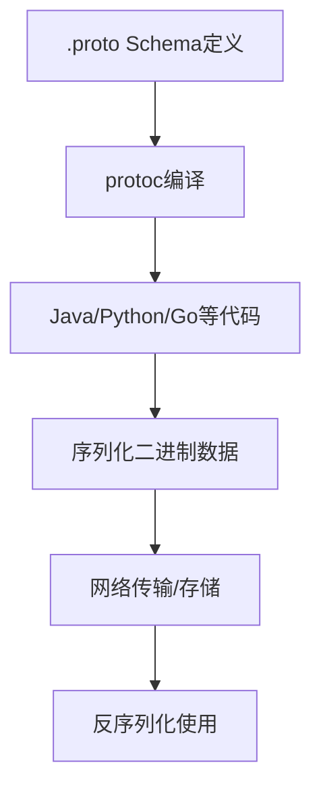

#### 目录介绍
- 01.数据选取背景
  - 1.1 思考一个问题
  - 1.7 核心特性对比
- 02.核心设计思想
- 03.1
- 04.JSON数据设计
  - 4.1 JSON设计思想
  - 4.2 JSON用例
  - 4.3 核心优势
  - 4.4 适用场景
- 05.ProtoBuf数据设计
  - 5.1 Pb设计思想
  - 5.2 ProtoBuf用例
  - 5.3 核心优势
- 06.XML数据设计
  - 6.1 XML设计思想


## 01.数据选取背景

### 1.1 思考一个问题

JSON、Protocol Buffers (ProtoBuf) 和 XML 是三种最重要的数据序列化格式。在开发中，你一般用哪一种，它们使用背景是什么？

### 1.7 核心特性对比

| 特性 | JSON | Protocol Buffers (ProtoBuf) | XML |
|------|------|----------------------------|------|
| **设计哲学** | **简单、易读、JavaScript 友好** | **高效、小型、跨语言 RPC** | **强大、可扩展、文档标记** |
| **数据模型** | 简单（对象、数组、基本类型） | 强类型、结构化 Schema | 树形结构、标签、属性 |
| **可读性** | **优秀**（人类易读） | **差**（二进制格式） | **良好**（但冗长） |
| **序列化大小** | 中等 | **极小**（比 JSON 小 3-10 倍） | 大（最冗长） |
| **处理速度** | 快（解析/序列化） | **极快** | 慢（解析复杂） |
| **Schema 要求** | 无（动态类型） | **必需**（.proto 文件） | 可选（DTD, XSD） |
| **扩展性** | 好（灵活但无约束） | **优秀**（向前/向后兼容） | 优秀（但复杂） |


## 04.JSON数据设计

### 4.1 JSON设计思想

设计思想：Web 的通用语

**核心**：源于 JavaScript，旨在实现**简单、轻量、人类可读**的数据交换。

### 4.2 JSON用例

语法示例

```json
{
  "user": {
    "id": 12345,
    "name": "Alice",
    "email": "alice@example.com",
    "isActive": true,
    "tags": ["developer", "javascript"],
    "profile": {
      "age": 28,
      "avatar": null
    }
  },
  "metadata": {
    "version": "1.0",
    "timestamp": "2023-11-28T10:30:00Z"
  }
}
```

### 4.4 适用场景

适用场景

- **Web APIs** (RESTful APIs 的事实标准)
- **配置文件** (package.json, tsconfig.json)
- **前端-后端通信**
- **NoSQL 数据库** (MongoDB 的文档格式)


## 05.ProtoBuf数据设计

### 5.1 Pb设计思想

设计思想：高性能序列化

**核心**：Google 开发的**二进制协议**，专注于**效率、速度和跨语言兼容性**。

工作流程



### 5.2 ProtoBuf用例


定义 Schema (`user.proto`)

```proto
syntax = "proto3";

message User {
    int32 id = 1;           // 字段编号 (关键!)
    string name = 2;
    string email = 3;
    bool is_active = 4;
    repeated string tags = 5;  // 重复字段（数组）
    
    message Profile {
        int32 age = 1;
        string avatar_url = 2;
    }
    
    Profile profile = 6;
    Role role = 7;          // 枚举类型
}

enum Role {
    UNKNOWN = 0;
    ADMIN = 1;
    USER = 2;
    GUEST = 3;
}

message UserResponse {
    repeated User users = 1;
    int32 total_count = 2;
}
```

2. 编译生成代码

```bash
# 生成 Java 代码
protoc --java_out=./src user.proto

# 生成 Python 代码  
protoc --python_out=./src user.proto

# 生成 Go 代码
protoc --go_out=./src user.proto
```


3. 使用示例 (Python)

```python
# 生成的代码示例
import user_pb2

# 创建对象
user = user_pb2.User()
user.id = 12345
user.name = "Alice"
user.email = "alice@example.com"
user.tags.extend(["developer", "javascript"])

# 序列化为二进制
binary_data = user.SerializeToString()
print("序列化大小:", len(binary_data))  # 可能只有 30-50 字节

# 从二进制反序列化
new_user = user_pb2.User()
new_user.ParseFromString(binary_data)

print(f"用户: {new_user.name}, ID: {new_user.id}")
```

### 5.3 核心优势

## 06.XML数据设计

### 6.1 XML设计思想

设计思想：文档与数据的统一

**核心**：**可扩展标记语言**，适合表示**复杂文档结构和元数据**。


