# 缓存设计技术思想
#### 目录介绍
- 1.缓存核心思想
  - 1.1 缓存基本概念
  - 1.2 缓存方案思考
  - 1.3 不同端的应用
  - 1.4 缓存性能原理
- 2.缓存类型分类
  - 2.1 存储介质分类
  - 2.2 多级缓存架构
  - 2.3 访问模式分类
  - 2.4 部署方式分类
- 3.缓存使用场景
  - 3.1 主要解决问题
  - 3.2 Web缓存场景
  - 3.3 移动应用场景
  - 3.4 后端服务缓存
- 4.缓存设计思想
  - 4.1 通用缓存思路
  - 4.2 缓存策略设计
  - 4.3 缓存容量设计
  - 4.4 缓存失效策略
  - 4.5 缓存淘汰算法
  - 4.6 缓存设计原则
- 5.K-V框架设计
  - 5.1 K-V框架背景
  - 5.2 K-V框架设计
- 5.LRU缓存原理
  - 5.1 LRU算法思想
  - 5.2 LRU数据结构设计
  - 5.3 LRU操作流程
  - 5.4 LRU实现代码
  - 5.5 LFU算法设计
- 6.通用缓存策略
  - 6.1 过期策略分类
  - 6.2 TTL设计模式
  - 6.3 淘汰策略对比
  - 6.4 分层架构设计
  - 6.5 分层缓存数据流


## 01.缓存核心思想

### 1.1 缓存基本概念

缓存是一种用空间换时间的技术，通过将频繁访问的数据存储在访问速度更快的存储介质中，减少计算或IO开销，从而显著提高系统性能。

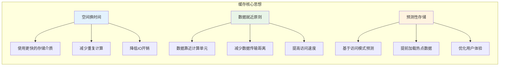

### 1.2 缓存方案思考

- 问题1：各种缓存方案，分别是如何保证数据安全的，其内部使用到了哪些锁？由于引入锁，给效率上带来了什么影响？
- 问题2：各种缓存方案，进程不安全是否会导致数据丢失，如何处理数据丢失情况？如何处理脏数据，其原理大概是什么？
- 问题3：各种缓存方案使用场景是什么？有什么缺陷，为了解决缺陷做了些什么？比如sp存在缺陷的替代方案是DataStore，为何这样？
- 问题4：各种缓存方案，他们的缓存效率是怎样的？如何对比？接入该库后，如何做数据迁移，如何覆盖操作？

### 1.3 不同端的应用

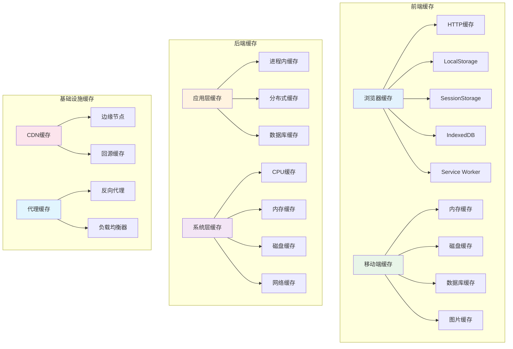

### 1.4 缓存性能原理

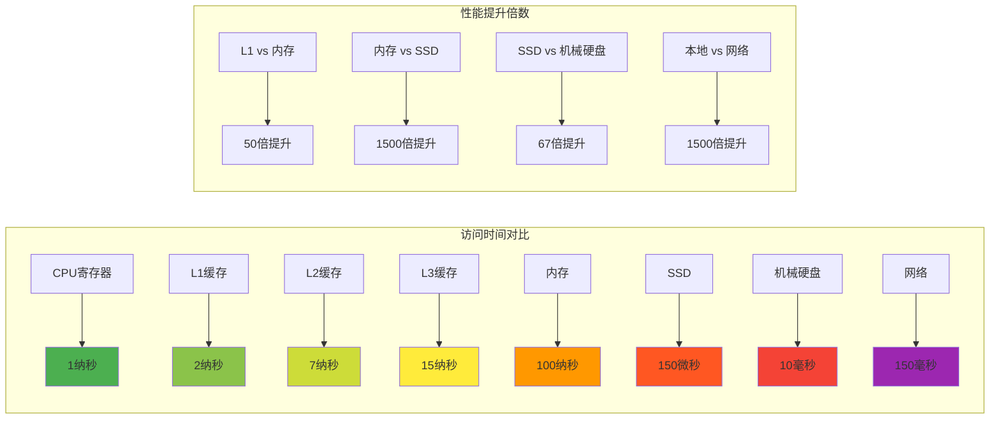

## 02.缓存类型分类

### 2.1 存储介质分类

比较常见的是内存缓存以及磁盘缓存。1.内存缓存，这里的内存主要指的存储器缓存；2.磁盘缓存，这里主要指的是外部存储器，手机的话指的就是存储卡。

内存缓存：通过预先消耗应用的一点内存来存储数据，便可快速的为应用中的组件提供数据，是一种典型的以空间换时间的策略。

磁盘缓存：读取磁盘文件要比直接从内存缓存中读取要慢一些，而且需要在一个UI主线程外的线程中进行，因为磁盘的读取速度是不能够保证的，磁盘文件缓存显然也是一种以空间换时间的策略。

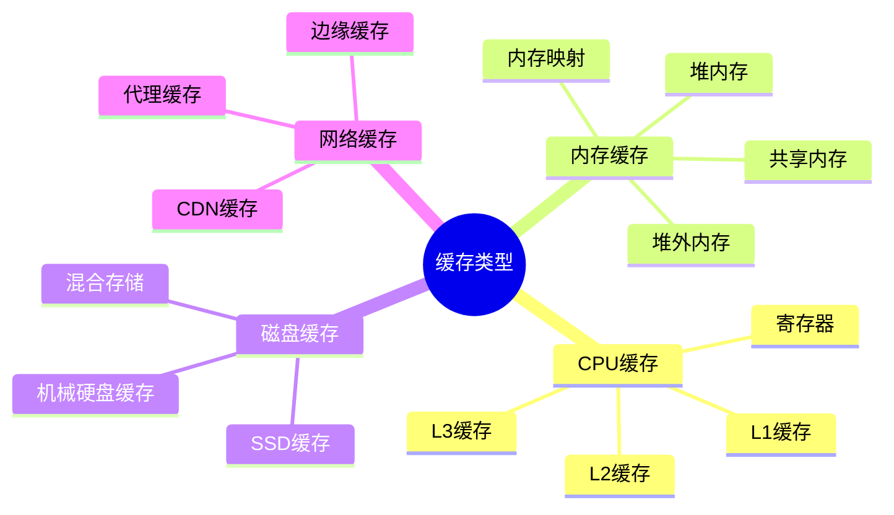

### 2.2 多级缓存架构

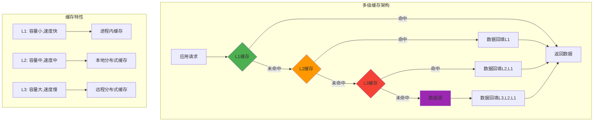

### 2.3 访问模式分类

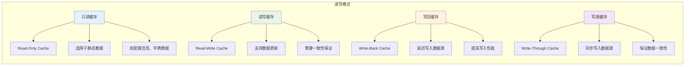

### 2.4 部署方式分类

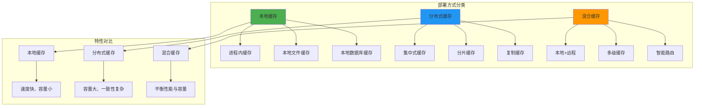

## 3.缓存使用场景

### 3.1 主要解决问题

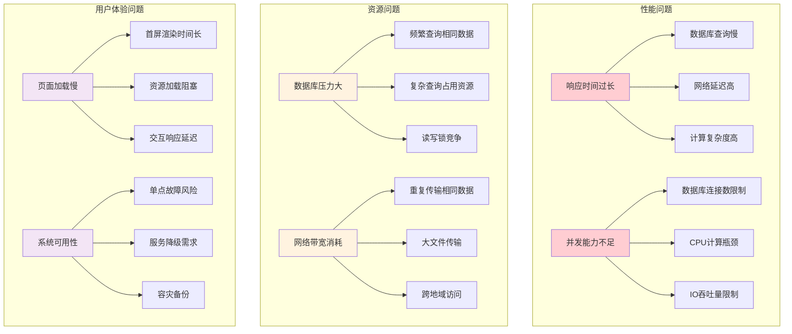

### 3.2 Web缓存场景

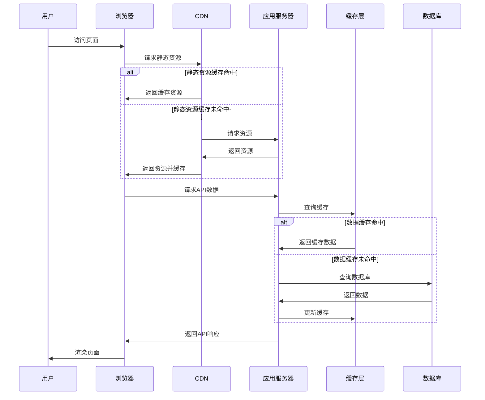

### 3.3 移动应用场景

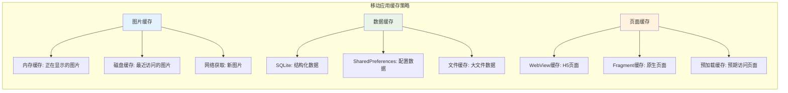

### 3.4 后端服务缓存

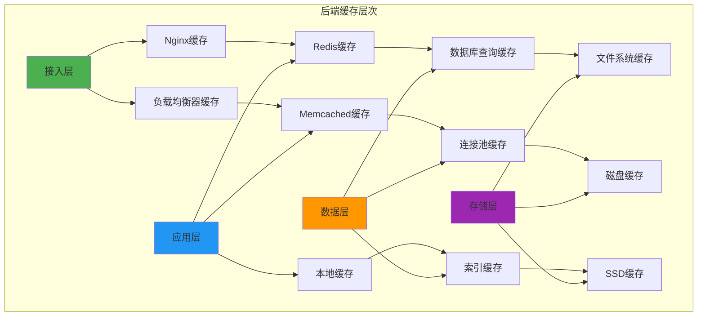

## 4.缓存设计思想

### 4.1 通用缓存思路

> 通用缓存的设计思路主要包括以下几个方面

1. 缓存策略选择：选择适当的缓存策略是通用缓存设计的重要一步。常见的缓存策略包括最近最少使用（LRU）、最近最久未使用（LRU-K）、先进先出（FIFO）等。根据具体应用场景和需求，选择合适的缓存策略来平衡缓存的命中率和缓存空间的利用效率。
2. 缓存容量管理：通用缓存需要考虑缓存容量的管理，以避免缓存溢出或过度占用内存。可以设置缓存容量上限，并采用合适的替换策略来管理缓存中的数据，以保持缓存的有效性。
3. 数据一致性：在多线程或分布式环境下，通用缓存需要考虑数据一致性的问题。合理的缓存设计应该保证数据在缓存中的一致性，避免脏数据或数据不一致的情况发生。可以采用锁机制、缓存失效策略或一致性协议等方法来实现数据一致性。
4. 缓存预热：为了提高缓存的命中率，通用缓存可以采用缓存预热的策略。在系统启动或负载较低的时候，提前加载热门数据到缓存中，以减少后续请求的响应时间。
5. 缓存失效策略：通用缓存需要考虑缓存数据的有效期，避免过期数据的使用。可以采用基于时间的失效策略或基于数据变更的失效策略，以确保缓存中的数据始终是最新的。
6. 性能监控与调优：通用缓存设计需要进行性能监控和调优，以确保缓存的性能和效率。可以监控缓存的命中率、缓存访问时间等指标，并根据实际情况进行调整和优化。

### 4.2 缓存策略设计

**缓存的核心思想主要是什么呢**

一般来说，缓存核心步骤主要包含缓存的添加、获取和删除这三类操作。那么为什么还要删除缓存呢？不管是内存缓存还是硬盘缓存，它们的缓存大小都是有限的。

当缓存满了之后，再想其添加缓存，这个时候就需要删除一些旧的缓存并添加新的缓存。这个跟线程池满了以后的线程处理策略相似！

**缓存的常见的策略有那些**

- FIFO(first in first out)：先进先出策略，相似队列。
- LFU(less frequently used)：最少使用策略，`RecyclerView`的缓存采用了此策略。
- LRU(least recently used)：最近最少使用策略，`Glide`在进行内存缓存的时候采用了此策略。


### 4.3 缓存容量设计

缓存容量，就是缓存的大小。每一种缓存，总会有一个最大的容量，到达这个限度以后，那么就须要进行缓存清理了框架。这个时候就需要删除一些旧的缓存并添加新的缓存。


### 4.4 缓存失效策略

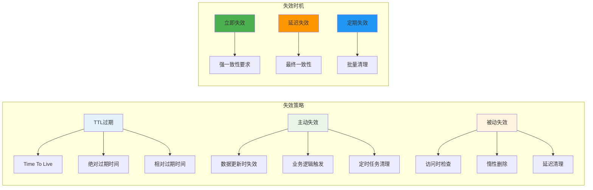

### 4.5 缓存淘汰算法

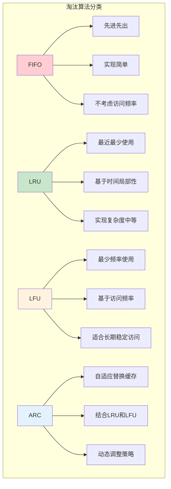

### 4.6 缓存设计原则

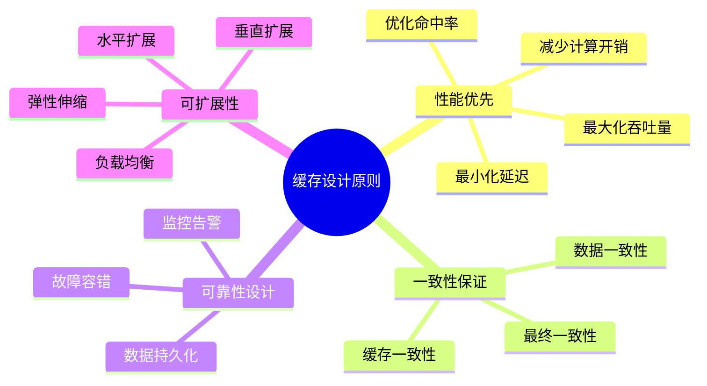

## 5.K-V框架设计

### 5.1 K-V框架背景

项目中很多地方使用缓存方案 

有的用`sp`，有的用`mmkv`，有的用`lru`，有的用`DataStore`，有的用`sqlite`，如何打造通用api切换操作不同存储方案？

缓存方案众多，且各自使用场景有差异，如何选择合适的缓存方式？

针对不同场景选择什么缓存方式，同时思考如何替换之前老的存储方案，而不用花费很大的时间成本！

### 5.2 K-V框架设计

思考一个K-V框架的设计：

- 问题1-线程安全：使用K-V存储一般会在多线程环境中执行，因此框架有必要保证多线程并发安全，并且优化并发效率；
- 问题2-内存缓存：由于磁盘 IO 操作是耗时操作，因此框架有必要在业务层和磁盘文件之间增加一层内存缓存；
- 问题3-事务：由于磁盘 IO 操作是耗时操作，因此框架有必要将支持多次磁盘 IO 操作聚合为一次磁盘写回事务，减少访问磁盘次数；
- 问题4-事务串行化：由于程序可能由多个线程发起写回事务，因此框架有必要保证事务之间的事务串行化，避免先执行的事务覆盖后执行的事务；
- 问题5-异步或同步写回：由于磁盘 IO 是耗时操作，因此框架有必要支持后台线程异步写回；有时候又要求数据读写是同步的；
- 问题6-增量更新：由于磁盘文件内容可能很大，因此修改 K-V 时有必要支持局部修改，而不是全量覆盖修改；
- 问题7-变更回调：由于业务层可能有监听 K-V 变更的需求，因此框架有必要支持变更回调监听，并且防止出现内存泄漏；
- 问题8-多进程：由于程序可能有多进程需求，那么框架如何保证多进程数据同步？
- 问题9-可用性：由于程序运行中存在不可控的异常和 Crash，因此框架有必要尽可能保证系统可用性，尽量保证系统在遇到异常后的数据完整性；
- **问题10-高效性：性能永远是要考虑的问题，解析、读取、写入和序列化的性能如何提高和权衡**；
- 问题11-安全性：如果程序需要存储敏感数据，如何保证数据完整性和保密性；
- 问题12-数据迁移：如果项目中存在旧框架，如何将数据从旧框架迁移至新框架，并且保证可靠性；
- 问题13-研发体验：是否模板代码冗长，是否容易出错。各种K—V框架使用体验如何？


## 5.LRU缓存原理

### 5.1 LRU算法思想

```mermaid
graph LR
    subgraph "LRU核心思想"
        A[时间局部性原理] --> A1[最近访问的数据]
        A --> A2[很可能再次被访问]
        
        B[淘汰策略] --> B1[淘汰最久未使用的数据]
        B --> B2[为新数据腾出空间]
        
        C[数据结构] --> C1[双向链表 + 哈希表]
        C --> C2[O(1)时间复杂度]
    end
    
    style A fill:#e3f2fd
    style B fill:#e8f5e8
    style C fill:#fff3e0
```

### 5.2 LRU数据结构设计

```mermaid
graph TB
    subgraph "LRU Cache结构"
        A[HashMap] --> A1[key -> Node映射]
        A --> A2[O(1)查找时间]
        
        B[双向链表] --> B1[维护访问顺序]
        B --> B2[头部: 最近访问]
        B --> B3[尾部: 最久未访问]
        
        C[Node节点] --> C1[key: 键值]
        C --> C2[value: 数据值]
        C --> C3[prev: 前驱指针]
        C --> C4[next: 后继指针]
    end
    
    A1 --> C
    B1 --> C
    
    style A fill:#4caf50
    style B fill:#2196f3
    style C fill:#ff9800
```

### 5.3 LRU操作流程

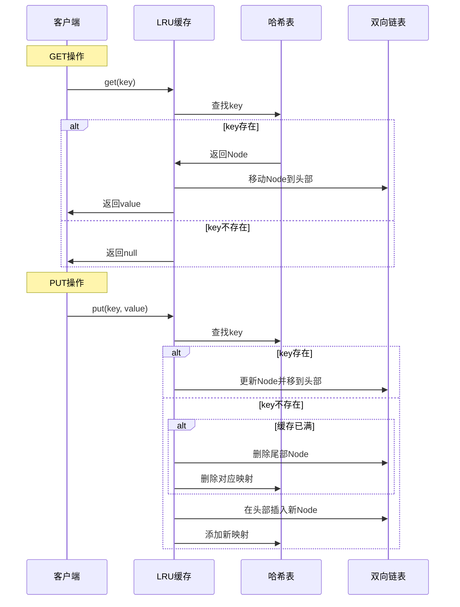

### 5.4 LRU实现代码

```cpp
class LRUCache {
private:
    struct Node {
        int key, value;
        Node* prev;
        Node* next;
        Node(int k = 0, int v = 0) : key(k), value(v), prev(nullptr), next(nullptr) {}
    };
    
    unordered_map<int, Node*> cache;
    Node* head;
    Node* tail;
    int capacity;
    
    void addToHead(Node* node) {
        node->prev = head;
        node->next = head->next;
        head->next->prev = node;
        head->next = node;
    }
    
    void removeNode(Node* node) {
        node->prev->next = node->next;
        node->next->prev = node->prev;
    }
    
    void moveToHead(Node* node) {
        removeNode(node);
        addToHead(node);
    }
    
    Node* removeTail() {
        Node* lastNode = tail->prev;
        removeNode(lastNode);
        return lastNode;
    }
    
public:
    LRUCache(int capacity) : capacity(capacity) {
        head = new Node();
        tail = new Node();
        head->next = tail;
        tail->prev = head;
    }
    
    int get(int key) {
        auto it = cache.find(key);
        if (it == cache.end()) {
            return -1;
        }
        
        Node* node = it->second;
        moveToHead(node);
        return node->value;
    }
    
    void put(int key, int value) {
        auto it = cache.find(key);
        
        if (it != cache.end()) {
            Node* node = it->second;
            node->value = value;
            moveToHead(node);
        } else {
            Node* newNode = new Node(key, value);
            
            if (cache.size() >= capacity) {
                Node* tail_node = removeTail();
                cache.erase(tail_node->key);
                delete tail_node;
            }
            
            cache[key] = newNode;
            addToHead(newNode);
        }
    }
};
```

### 5.5 LFU算法设计

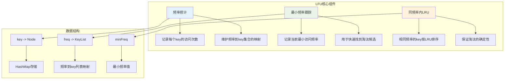


## 6.通用缓存策略

### 6.1 过期策略分类

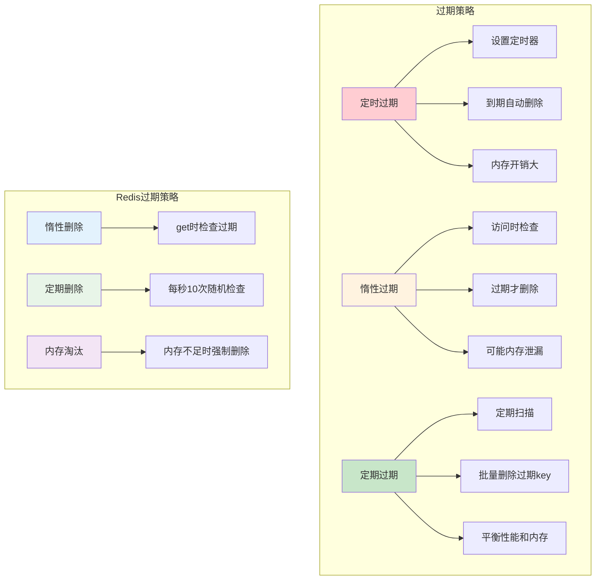

### 6.2 TTL设计模式

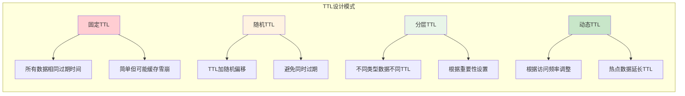

### 6.3 淘汰策略对比


### 6.4 分层架构设计

```mermaid
graph TB
    subgraph "分层缓存架构"
        A[L1: 进程内缓存] --> A1[容量: 小]
        A --> A2[速度: 极快]
        A --> A3[一致性: 弱]
        
        B[L2: 本地缓存] --> B1[容量: 中]
        B --> B2[速度: 快]
        B --> B3[一致性: 中]
        
        C[L3: 分布式缓存] --> C1[容量: 大]
        C --> C2[速度: 中]
        C --> C3[一致性: 强]
        
        D[L4: 数据源] --> D1[容量: 最大]
        D --> D2[速度: 慢]
        D --> D3[一致性: 最强]
    end
    
    A --> B
    B --> C
    C --> D
    
    style A fill:#4caf50
    style B fill:#8bc34a
    style C fill:#cddc39
    style D fill:#ffeb3b
```

### 6.5 分层缓存数据流

```mermaid
sequenceDiagram
    participant App as 应用
    participant L1 as L1缓存
    participant L2 as L2缓存
    participant L3 as L3缓存
    participant DB as 数据库
    
    App->>L1: 查询数据
    
    alt L1命中
        L1->>App: 返回数据
    else L1未命中
        L1->>L2: 查询L2
        
        alt L2命中
            L2->>L1: 返回数据并更新L1
            L1->>App: 返回数据
        else L2未命中
            L2->>L3: 查询L3
            
            alt L3命中
                L3->>L2: 返回数据并更新L2
                L2->>L1: 更新L1
                L1->>App: 返回数据
            else L3未命中
                L3->>DB: 查询数据库
                DB->>L3: 返回数据并更新L3
                L3->>L2: 更新L2
                L2->>L1: 更新L1
                L1->>App: 返回数据
            end
        end
    end
```

## 7. 缓存设计哲学与权衡

### 7.1 缓存设计哲学

#### 7.1.1 核心设计理念

```mermaid
mindmap
  root((缓存设计哲学))
    简单性原则
      KISS原则
      避免过度设计
      易于理解和维护
      降低复杂度
    性能优先
      响应时间最小化
      吞吐量最大化
      资源利用率优化
      用户体验提升
    可靠性保证
      数据一致性
      故障容错
      优雅降级
      监控告警
    可扩展性
      水平扩展能力
      垂直扩展能力
      弹性伸缩
      未来需求适应
    成本效益
      开发成本
      运维成本
      硬件成本
      机会成本
```

#### 7.1.2 设计权衡矩阵

```mermaid
graph TB
    subgraph "缓存设计权衡"
        A[性能 vs 一致性] --> A1[强一致性牺牲性能]
        A --> A2[高性能可能数据不一致]
        
        B[容量 vs 成本] --> B1[大容量高成本]
        B --> B2[成本控制限制容量]
        
        C[复杂度 vs 效果] --> C1[复杂算法效果好]
        C --> C2[简单方案易维护]
        
        D[可用性 vs 一致性] --> D1[高可用可能数据不一致]
        D --> D2[强一致性可能影响可用性]
    end
    
    subgraph "权衡策略"
        E[业务优先级] --> E1[根据业务重要性选择]
        F[分层设计] --> F1[不同层级不同策略]
        G[动态调整] --> G1[根据运行时状态调整]
        H[监控反馈] --> H1[基于监控数据优化]
    end
    
    A --> E
    B --> F
    C --> G
    D --> H
    
    style A fill:#ffcdd2
    style B fill:#fff3e0
    style C fill:#f3e5f5
    style D fill:#fce4ec
    style E fill:#c8e6c9
    style F fill:#c8e6c9
    style G fill:#c8e6c9
    style H fill:#c8e6c9
```

### 7.2 实际应用中的权衡

#### 7.2.1 电商系统缓存权衡

```mermaid
graph LR
    subgraph "电商系统缓存策略"
        A[商品信息] --> A1[读多写少]
        A --> A2[可接受短暂不一致]
        A --> A3[使用TTL + 异步更新]
        
        B[库存信息] --> B1[读写频繁]
        B --> B2[强一致性要求]
        B --> B3[使用分布式锁 + 短TTL]
        
        C[用户会话] --> C1[读写频繁]
        C --> C2[可用性优先]
        C --> C3[使用本地缓存 + 复制]
        
        D[订单信息] --> D1[写多读少]
        D --> D2[强一致性要求]
        D --> D3[直接操作数据库]
    end
    
    style A fill:#c8e6c9
    style B fill:#fff3e0
    style C fill:#e3f2fd
    style D fill:#ffcdd2
```

#### 7.2.2 社交媒体缓存权衡

```mermaid
graph TD
    subgraph "社交媒体缓存策略"
        A[用户动态] --> A1[时效性要求高]
        A --> A2[可接受最终一致性]
        A --> A3[多级缓存 + 推拉结合]
        
        B[热门内容] --> B1[访问量巨大]
        B --> B2[读多写少]
        B --> B3[CDN + 长TTL]
        
        C[用户关系] --> C1[变化频率低]
        C --> C2[一致性要求中等]
        C --> C3[本地缓存 + 定期同步]
        
        D[实时消息] --> D1[实时性要求极高]
        D --> D2[可用性优先]
        D --> D3[内存队列 + 持久化]
    end
    
    style A fill:#e8f5e8
    style B fill:#e3f2fd
    style C fill:#fff3e0
    style D fill:#f3e5f5
```

### 7.3 缓存反模式与最佳实践

#### 7.3.1 常见反模式

```mermaid
graph LR
    subgraph "缓存反模式"
        A[缓存穿透] --> A1[查询不存在的数据]
        A --> A2[绕过缓存直击数据库]
        A --> A3[解决: 布隆过滤器/空值缓存]
        
        B[缓存雪崩] --> B1[大量缓存同时失效]
        B --> B2[数据库压力激增]
        B --> B3[解决: 随机TTL/熔断机制]
        
        C[缓存击穿] --> C1[热点数据过期]
        C --> C2[并发请求击穿缓存]
        C --> C3[解决: 分布式锁/预加载]
        
        D[缓存污染] --> D1[低频数据占用缓存]
        D --> D2[影响缓存命中率]
        D --> D3[解决: 智能淘汰算法]
    end
    
    style A fill:#ffcdd2
    style B fill:#ffcdd2
    style C fill:#ffcdd2
    style D fill:#ffcdd2
```

#### 7.3.2 最佳实践总结

```mermaid
graph TD
    subgraph "缓存最佳实践"
        A[设计阶段] --> A1[明确缓存目标]
        A --> A2[选择合适的缓存类型]
        A --> A3[设计合理的key结构]
        A --> A4[规划容量和TTL]
        
        B[实现阶段] --> B1[实现缓存预热]
        B --> B2[处理缓存穿透]
        B --> B3[避免缓存雪崩]
        B --> B4[保证数据一致性]
        
        C[运维阶段] --> C1[监控缓存指标]
        C --> C2[定期性能调优]
        C --> C3[容量规划调整]
        C --> C4[故障应急处理]
        
        D[优化阶段] --> D1[分析访问模式]
        D --> D2[优化缓存策略]
        D --> D3[调整淘汰算法]
        D --> D4[升级缓存架构]
    end
    
    style A fill:#e3f2fd
    style B fill:#e8f5e8
    style C fill:#fff3e0
    style D fill:#f3e5f5
```

---

## 8. 局部性原理与分层实现

### 8.1 局部性原理详解

#### 8.1.1 局部性原理基础

```mermaid
graph TB
    subgraph "局部性原理"
        A[时间局部性] --> A1[最近访问的数据]
        A --> A2[很可能再次被访问]
        A --> A3[基础: 程序执行的循环性]
        
        B[空间局部性] --> B1[相邻的数据]
        B --> B2[很可能被一起访问]
        B --> B3[基础: 数据结构的连续性]
        
        C[顺序局部性] --> C1[按顺序访问的数据]
        C --> C2[下一个数据很可能被访问]
        C --> C3[基础: 程序执行的顺序性]
    end
    
    subgraph "缓存有效性原因"
        D[程序行为特征] --> D1[80/20法则]
        D --> D2[热点数据集中]
        D --> D3[访问模式可预测]
        
        E[数据访问模式] --> E1[循环访问]
        E --> E2[批量访问]
        E --> E3[关联访问]
    end
    
    A --> D
    B --> E
    C --> E
    
    style A fill:#e3f2fd
    style B fill:#e8f5e8
    style C fill:#fff3e0
    style D fill:#4caf50
    style E fill:#4caf50
```

#### 8.1.2 局部性原理在不同场景的体现

```mermaid
graph LR
    subgraph "Web应用局部性"
        A[用户行为] --> A1[浏览相关页面]
        A --> A2[重复访问收藏页面]
        A --> A3[按时间顺序浏览]
        
        B[数据访问] --> B1[用户信息频繁查询]
        B --> B2[相关商品一起展示]
        B --> B3[热门内容集中访问]
    end
    
    subgraph "数据库局部性"
        C[查询模式] --> C1[相同条件重复查询]
        C --> C2[关联表连接查询]
        C --> C3[范围查询连续数据]
        
        D[索引访问] --> D1[B+树顺序访问]
        D --> D2[热点索引页面]
        D --> D3[相邻记录批量读取]
    end
    
    style A fill:#e3f2fd
    style B fill:#e8f5e8
    style C fill:#fff3e0
    style D fill:#f3e5f5
```

### 8.2 分层缓存实现

#### 8.2.1 CPU缓存层次

```mermaid
graph TB
    subgraph "CPU缓存层次结构"
        A[CPU核心] --> B[L1缓存]
        B --> C[L2缓存]
        C --> D[L3缓存]
        D --> E[主内存]
        
        F[L1特性] --> F1[容量: 32KB-64KB]
        F --> F2[延迟: 1-2周期]
        F --> F3[带宽: 最高]
        
        G[L2特性] --> G1[容量: 256KB-1MB]
        G --> G2[延迟: 3-7周期]
        G --> G3[带宽: 高]
        
        H[L3特性] --> H1[容量: 8MB-32MB]
        H --> H2[延迟: 15-30周期]
        H --> H3[带宽: 中]
        
        I[内存特性] --> I1[容量: GB级别]
        I --> I2[延迟: 100-300周期]
        I --> I3[带宽: 低]
    end
    
    B --> F
    C --> G
    D --> H
    E --> I
    
    style B fill:#4caf50
    style C fill:#8bc34a
    style D fill:#cddc39
    style E fill:#ffeb3b
```

#### 8.2.2 应用层分层缓存

```mermaid
graph TB
    subgraph "应用层分层缓存架构"
        A[浏览器缓存] --> A1[内存缓存: 当前页面资源]
        A --> A2[磁盘缓存: 历史访问资源]
        A --> A3[HTTP缓存: 协议层缓存]
        
        B[CDN缓存] --> B1[边缘节点: 用户就近访问]
        B --> B2[区域节点: 区域热点内容]
        B --> B3[中心节点: 全局内容分发]
        
        C[应用服务缓存] --> C1[进程内缓存: 热点数据]
        C --> C2[本地缓存: 共享数据]
        C --> C3[分布式缓存: 集群共享]
        
        D[数据库缓存] --> D1[查询缓存: SQL结果]
        D --> D2[缓冲池: 数据页面]
        D --> D3[索引缓存: 索引页面]
    end
    
    A --> B
    B --> C
    C --> D
    
    style A fill:#e3f2fd
    style B fill:#e8f5e8
    style C fill:#fff3e0
    style D fill:#f3e5f5
```

### 8.3 缓存预取策略

#### 8.3.1 预取算法

```mermaid
graph LR
    subgraph "预取策略"
        A[顺序预取] --> A1[检测顺序访问模式]
        A --> A2[预取后续数据块]
        A --> A3[适用于流式数据]
        
        B[关联预取] --> B1[分析数据访问关联性]
        B --> B2[预取相关数据]
        B --> B3[适用于图数据结构]
        
        C[时间预取] --> C1[基于时间模式预测]
        C --> C2[在访问高峰前预取]
        C --> C3[适用于周期性访问]
        
        D[机器学习预取] --> D1[训练访问模式模型]
        D --> D2[智能预测下次访问]
        D --> D3[适用于复杂场景]
    end
    
    style A fill:#e3f2fd
    style B fill:#e8f5e8
    style C fill:#fff3e0
    style D fill:#f3e5f5
```

#### 8.3.2 预取实现流程

```mermaid
sequenceDiagram
    participant App as 应用
    participant Cache as 缓存层
    participant Predictor as 预取器
    participant DataSource as 数据源
    
    App->>Cache: 访问数据A
    Cache->>Predictor: 记录访问模式
    Predictor->>Predictor: 分析访问模式
    
    alt 检测到模式
        Predictor->>Cache: 预测需要数据B
        Cache->>DataSource: 异步预取数据B
        DataSource->>Cache: 返回数据B
        Cache->>Cache: 存储预取数据
    end
    
    App->>Cache: 访问数据B
    Cache->>App: 命中预取数据，快速返回
    
    Note over Predictor: 持续学习和优化预取策略
```

### 8.4 缓存性能优化

#### 8.4.1 性能优化策略

```mermaid
graph TD
    subgraph "缓存性能优化"
        A[命中率优化] --> A1[优化淘汰算法]
        A --> A2[调整缓存容量]
        A --> A3[改进预取策略]
        A --> A4[优化数据分布]
        
        B[延迟优化] --> B1[减少网络跳数]
        B --> B2[优化序列化]
        B --> B3[使用连接池]
        B --> B4[批量操作]
        
        C[吞吐量优化] --> C1[并发访问优化]
        C --> C2[读写分离]
        C --> C3[分片策略]
        C --> C4[异步处理]
        
        D[内存优化] --> D1[压缩存储]
        D --> D2[对象池化]
        D --> D3[内存映射]
        D --> D4[垃圾回收优化]
    end
    
    style A fill:#4caf50
    style B fill:#2196f3
    style C fill:#ff9800
    style D fill:#9c27b0
```

#### 8.4.2 性能监控指标

```mermaid
graph LR
    subgraph "关键性能指标"
        A[命中率指标] --> A1[缓存命中率]
        A --> A2[各层命中率]
        A --> A3[热点数据命中率]
        
        B[延迟指标] --> B1[平均响应时间]
        B --> B2[P99响应时间]
        B --> B3[网络延迟]
        
        C[吞吐量指标] --> C1[QPS/TPS]
        C --> C2[并发连接数]
        C --> C3[带宽利用率]
        
        D[资源指标] --> D1[内存使用率]
        D --> D2[CPU使用率]
        D --> D3[网络使用率]
    end
    
    subgraph "监控工具"
        E[Prometheus] --> E1[指标收集]
        F[Grafana] --> F1[可视化展示]
        G[ELK Stack] --> G1[日志分析]
        H[APM工具] --> H1[性能追踪]
    end
    
    A --> E
    B --> F
    C --> G
    D --> H
    
    style A fill:#4caf50
    style B fill:#2196f3
    style C fill:#ff9800
    style D fill:#9c27b0
```

---

## 总结

### 核心要点回顾

1. **缓存本质**：用空间换时间，基于局部性原理提升系统性能
2. **分层设计**：从CPU缓存到应用缓存的多层次架构
3. **策略选择**：根据业务特点选择合适的缓存策略和算法
4. **权衡考虑**：在性能、一致性、成本之间找到最佳平衡点
5. **持续优化**：基于监控数据不断调优缓存配置和策略

### 缓存设计决策树

```mermaid
graph TD
    A[开始设计缓存] --> B{数据访问特征}
    
    B -->|读多写少| C[考虑缓存]
    B -->|写多读少| D[谨慎使用缓存]
    B -->|读写均衡| E[评估缓存收益]
    
    C --> F{一致性要求}
    F -->|强一致性| G[Write-Through + 短TTL]
    F -->|最终一致性| H[Cache-Aside + 长TTL]
    F -->|弱一致性| I[Write-Behind + 异步更新]
    
    E --> J{性能要求}
    J -->|高性能| K[多级缓存]
    J -->|一般性能| L[单级缓存]
    
    D --> M[直接访问数据源]
    
    G --> N[选择缓存类型]
    H --> N
    I --> N
    K --> N
    L --> N
    
    N --> O{部署方式}
    O -->|单机| P[本地缓存]
    O -->|分布式| Q[分布式缓存]
    O -->|混合| R[多级缓存]
    
    P --> S[实施监控]
    Q --> S
    R --> S
    M --> S
    
    style C fill:#c8e6c9
    style G fill:#4caf50
    style H fill:#8bc34a
    style I fill:#cddc39
    style K fill:#2196f3
    style L fill:#03a9f4
```

### 最佳实践总结

```mermaid
graph LR
    subgraph "缓存设计最佳实践"
        A[设计原则] --> A1[简单性优先]
        A --> A2[性能导向]
        A --> A3[可观测性]
        A --> A4[渐进式优化]
        
        B[实现要点] --> B1[合理的TTL设置]
        B --> B2[有效的淘汰策略]
        B --> B3[完善的监控体系]
        B --> B4[优雅的降级机制]
        
        C[运维关键] --> C1[容量规划]
        C --> C2[性能调优]
        C --> C3[故障处理]
        C --> C4[版本升级]
    end
    
    style A fill:#e3f2fd
    style B fill:#e8f5e8
    style C fill:#fff3e0
```

通过深入理解缓存的设计原理和实现策略，我们可以构建高效、可靠的缓存系统，显著提升应用性能和用户体验。缓存设计是一个需要持续优化的过程，需要根据业务发展和技术演进不断调整和完善。


