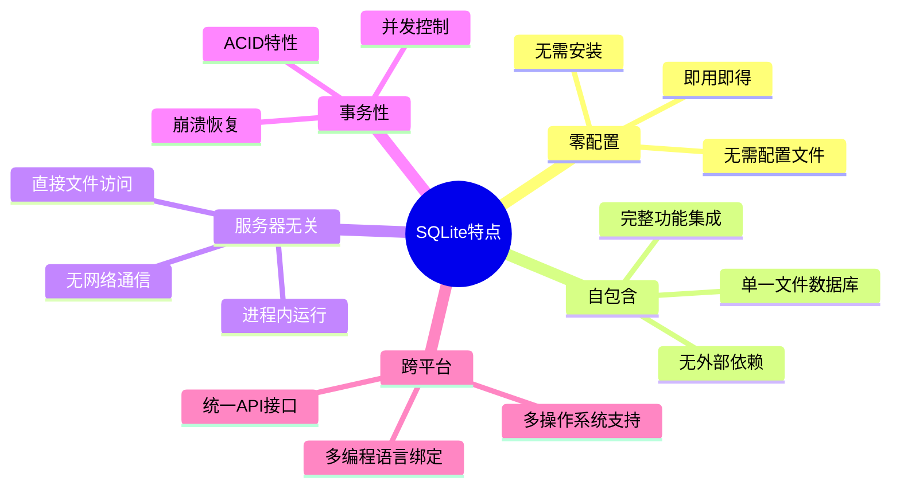
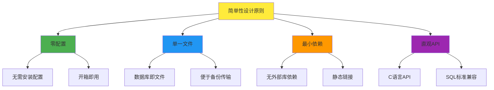
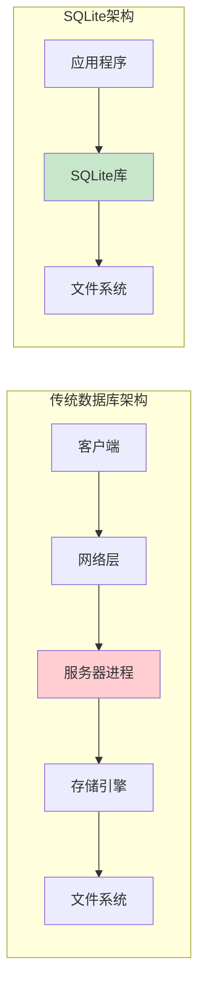
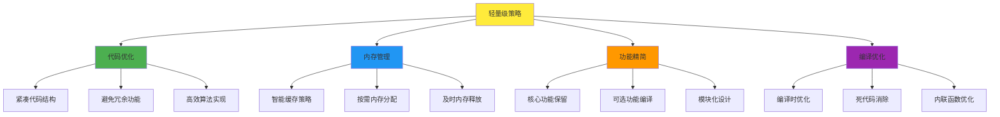
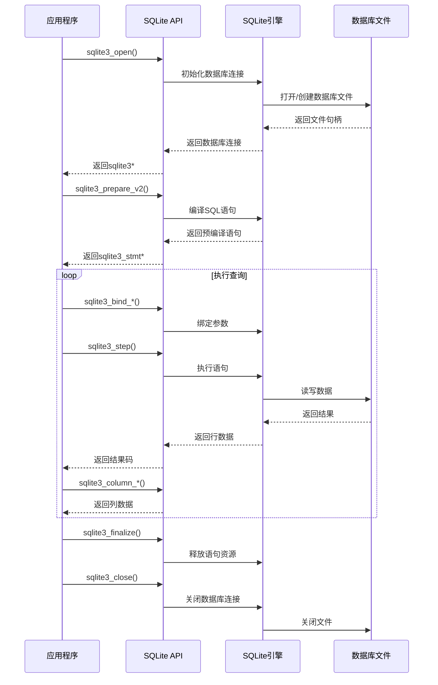
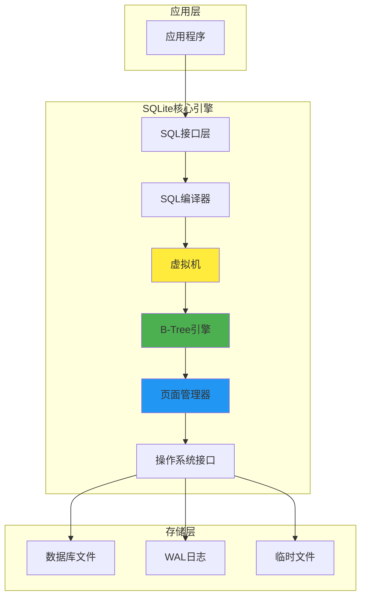
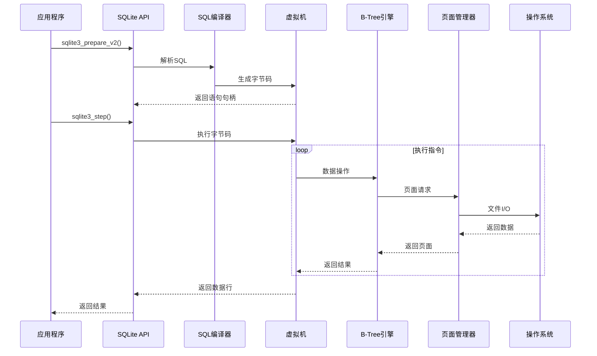
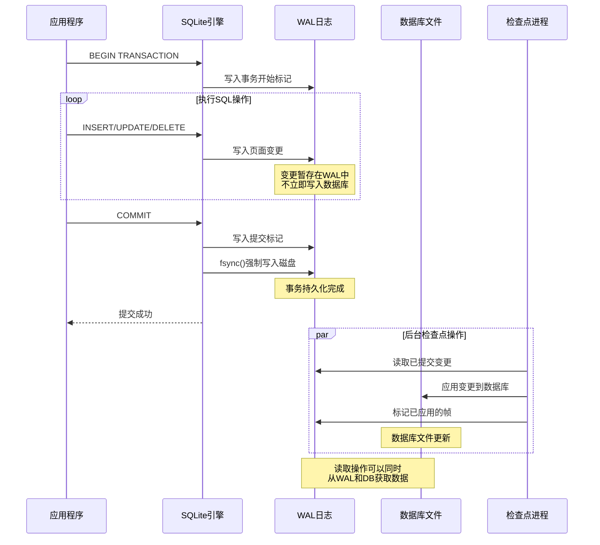
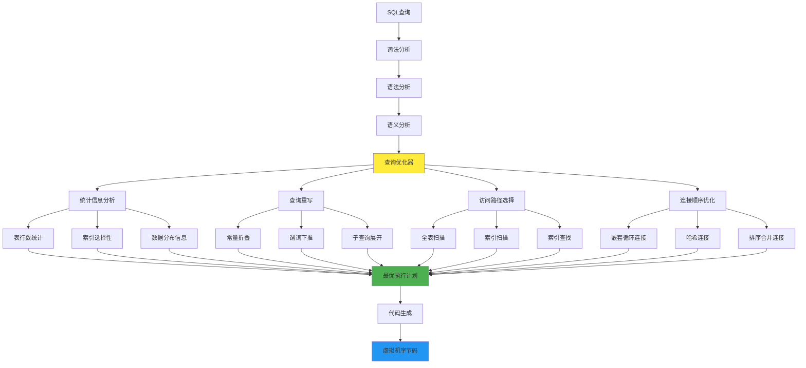

# SQLite 设计技术方案

## 目录

1. [概述](#概述)
2. [SQLite核心设计思想](#sqlite核心设计思想)
3. [轻量级实现机制](#轻量级实现机制)
4. [SQLite操作步骤](#sqlite操作步骤)
5. [跨平台使用方案](#跨平台使用方案)
6. [数据库设计通用步骤](#数据库设计通用步骤)
7. [事务处理核心设计](#事务处理核心设计)
8. [存储引擎设计原理](#存储引擎设计原理)
9. [事务原子性保证](#事务原子性保证)
10. [查询优化机制](#查询优化机制)
11. [跨平台实现](#跨平台实现)
12. [整体架构设计](#整体架构设计)
13. [代码示例](#代码示例)
14. [总结](#总结)

---

## 概述

SQLite是一个轻量级的关系型数据库管理系统，以其零配置、自包含、服务器无关的特性而闻名。它被广泛应用于移动设备、嵌入式系统、桌面应用程序等各种平台。本技术方案将深入分析SQLite的设计理念、技术实现和应用方案。

### SQLite特点概览



---

## SQLite核心设计思想

### 1. 设计哲学

SQLite的设计遵循以下核心理念：

#### 1.1 简单性优先



#### 1.2 可靠性保证

- **ACID事务特性**：确保数据完整性
- **崩溃恢复机制**：自动恢复未完成事务
- **数据类型灵活性**：动态类型系统
- **SQL标准兼容**：支持大部分SQL-92标准

### 2. 架构设计原则



**优势对比**：
- **简化架构**：消除网络层和服务器进程
- **降低延迟**：直接内存访问，无网络开销
- **减少资源**：无需独立服务器进程
- **提高可靠性**：减少故障点

---

## 轻量级实现机制

### 1. 内存占用优化

#### 1.1 资源对比分析

| 组件 | 传统数据库 | SQLite | 节省比例 |
|------|------------|--------|----------|
| 服务器进程 | 50-200MB | 0MB | 100% |
| 网络缓冲 | 10-50MB | 0MB | 100% |
| 连接池 | 20-100MB | 0MB | 100% |
| 页面缓存 | 可配置 | 2-10MB | 80-95% |
| 代码大小 | 10-50MB | 1-2MB | 90% |

#### 1.2 轻量级实现策略



### 2. 性能优化机制

#### 2.1 缓存策略实现

```c
// SQLite页面缓存实现
typedef struct PCache {
    PgHdr *pDirty;          // 脏页链表
    PgHdr *pDirtyTail;      // 脏页链表尾部
    PgHdr *pSynced;         // 已同步页面
    int nRefSum;            // 引用计数总和
    int szCache;            // 缓存大小
    int szSpill;            // 溢出阈值
    int szPage;             // 页面大小
    int szExtra;            // 额外空间
    u8 bPurgeable;          // 可清理标志
    int (*xStress)(void*, PgHdr*); // 压力回调
    void *pStress;          // 压力回调参数
    pcache1 *pCache;        // 缓存实例
} PCache;

// 智能缓存管理
int sqlite3PcacheFetch(
    PCache *pCache,         // 缓存对象
    Pgno pgno,             // 页面号
    int createFlag,        // 创建标志
    PgHdr **ppPage         // 输出页面
) {
    // 1. 检查缓存中是否存在
    PgHdr *pPage = pcache1Fetch(pCache->pCache, pgno, createFlag);
    
    if (pPage) {
        // 2. 更新LRU链表
        pcache1PinPage(pPage);
        *ppPage = pPage;
        return SQLITE_OK;
    }
    
    // 3. 缓存未命中，从磁盘加载
    return loadPageFromDisk(pCache, pgno, ppPage);
}
```

---

## SQLite操作步骤

### 1. 基本操作流程



### 2. 详细操作步骤

#### 2.1 数据库连接管理

```c
#include <sqlite3.h>
#include <stdio.h>
#include <stdlib.h>

// 1. 打开数据库连接
int open_database(const char* db_path, sqlite3** db) {
    int rc = sqlite3_open(db_path, db);
    
    if (rc != SQLITE_OK) {
        fprintf(stderr, "无法打开数据库: %s\n", sqlite3_errmsg(*db));
        sqlite3_close(*db);
        return rc;
    }
    
    // 设置性能优化参数
    sqlite3_exec(*db, "PRAGMA journal_mode=WAL", NULL, NULL, NULL);
    sqlite3_exec(*db, "PRAGMA synchronous=NORMAL", NULL, NULL, NULL);
    sqlite3_exec(*db, "PRAGMA cache_size=10000", NULL, NULL, NULL);
    
    printf("数据库连接成功\n");
    return SQLITE_OK;
}

// 2. 执行DDL语句
int create_tables(sqlite3* db) {
    const char* sql = 
        "CREATE TABLE IF NOT EXISTS users ("
        "    id INTEGER PRIMARY KEY AUTOINCREMENT,"
        "    name TEXT NOT NULL,"
        "    email TEXT UNIQUE NOT NULL,"
        "    age INTEGER CHECK(age >= 0),"
        "    created_at DATETIME DEFAULT CURRENT_TIMESTAMP"
        ");"
        
        "CREATE INDEX IF NOT EXISTS idx_users_email ON users(email);"
        "CREATE INDEX IF NOT EXISTS idx_users_name ON users(name);";
    
    char* err_msg = NULL;
    int rc = sqlite3_exec(db, sql, NULL, NULL, &err_msg);
    
    if (rc != SQLITE_OK) {
        fprintf(stderr, "创建表失败: %s\n", err_msg);
        sqlite3_free(err_msg);
        return rc;
    }
    
    printf("表创建成功\n");
    return SQLITE_OK;
}
```

---

## 整体架构设计

### 1. 系统架构图



### 2. 核心组件交互时序图



---

## 事务处理核心设计

### 1. ACID特性实现

#### 1.1 ACID特性架构

```mermaid
graph TD
    subgraph "原子性 Atomicity"
        A1[事务开始标记]
        A2[操作日志记录]
        A3[全部成功提交]
        A4[任一失败回滚]
        A5[崩溃恢复机制]
    end
    
    subgraph "一致性 Consistency"
        C1[约束检查]
        C2[触发器执行]
        C3[外键约束]
        C4[CHECK约束]
        C5[业务规则验证]
    end
    
    subgraph "隔离性 Isolation"
        I1[锁机制]
        I2[MVCC多版本]
        I3[隔离级别]
        I4[死锁检测]
        I5[并发控制]
    end
    
    subgraph "持久性 Durability"
        D1[WAL日志]
        D2[强制同步]
        D3[检查点机制]
        D4[数据文件更新]
        D5[备份恢复]
    end
    
    A1 --> A2
    A2 --> A3
    A2 --> A4
    A4 --> A5
    
    C1 --> C2
    C2 --> C3
    C3 --> C4
    C4 --> C5
    
    I1 --> I2
    I2 --> I3
    I3 --> I4
    I4 --> I5
    
    D1 --> D2
    D2 --> D3
    D3 --> D4
    D4 --> D5
    
    style A3 fill:#4caf50
    style A4 fill:#f44336
    style C5 fill:#ffeb3b
    style I5 fill:#2196f3
    style D5 fill:#ff9800
```



### 2. WAL机制详解

#### 2.1 WAL工作流程



---

## 查询优化机制

### 1. 查询优化器架构



### 2. 索引选择决策树

```mermaid
graph TD
    A[查询条件分析] --> B{是否有WHERE条件?}
    B -->|否| C[全表扫描]
    B -->|是| D{条件列是否有索引?}
    D -->|否| C
    D -->|是| E{索引类型判断}
    
    E --> F[唯一索引]
    E --> G[普通索引]
    E --> H[复合索引]
    
    F --> I{等值查询?}
    I -->|是| J[索引唯一查找<br/>成本: O(log n)]
    I -->|否| K[索引范围扫描]
    
    G --> L{查询类型}
    L --> M[等值查询<br/>索引查找]
    L --> N[范围查询<br/>索引扫描]
    L --> O[模糊查询<br/>前缀匹配]
    
    H --> P{复合索引匹配度}
    P --> Q[完全匹配<br/>最优性能]
    P --> R[部分匹配<br/>较好性能]
    P --> S[前缀匹配<br/>一般性能]
    
    J --> T[选择索引访问]
    K --> T
    M --> T
    N --> T
    O --> T
    Q --> T
    R --> T
    S --> T
    C --> U[选择全表扫描]
    
    style T fill:#4caf50
    style U fill:#ffcdd2
```

---

## 总结

SQLite作为一个轻量级的嵌入式数据库，通过其独特的设计理念和技术实现，在众多应用场景中展现出了卓越的性能和可靠性。

### 核心优势

1. **零配置特性**：无需安装和配置，开箱即用
2. **轻量级设计**：占用资源少，适合资源受限环境
3. **ACID事务**：完整的事务支持，保证数据一致性
4. **跨平台兼容**：支持多种操作系统和编程语言
5. **高性能**：优化的B+树存储和智能查询优化
6. **可靠性强**：完善的错误处理和崩溃恢复机制

### 适用场景

- **移动应用**：Android、iOS应用的本地数据存储
- **嵌入式系统**：IoT设备、工业控制系统
- **桌面应用**：配置文件、缓存数据存储
- **Web应用**：开发测试环境、小型网站
- **数据分析**：临时数据处理、报表生成

### 技术特色

- **现代C++实现**：高效的内存管理和算法优化
- **WAL日志机制**：提供优秀的并发性能和数据安全
- **智能查询优化**：基于成本的查询计划选择
- **灵活的类型系统**：动态类型支持，简化开发
- **完善的API设计**：简洁易用的编程接口

SQLite的成功证明了"简单即是美"的设计哲学，它通过精心的架构设计和技术实现，为开发者提供了一个功能强大、性能优异、使用简便的数据库解决方案。

