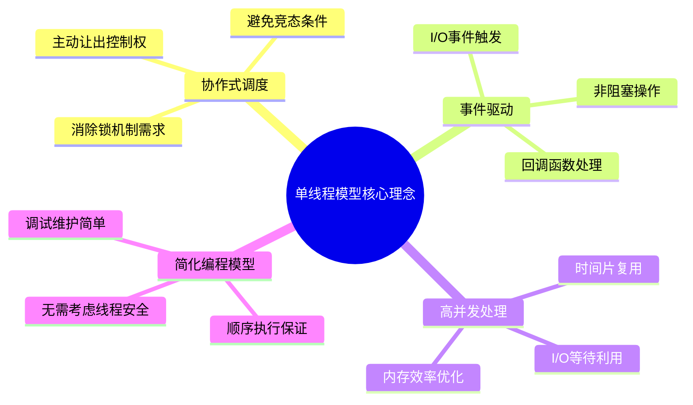
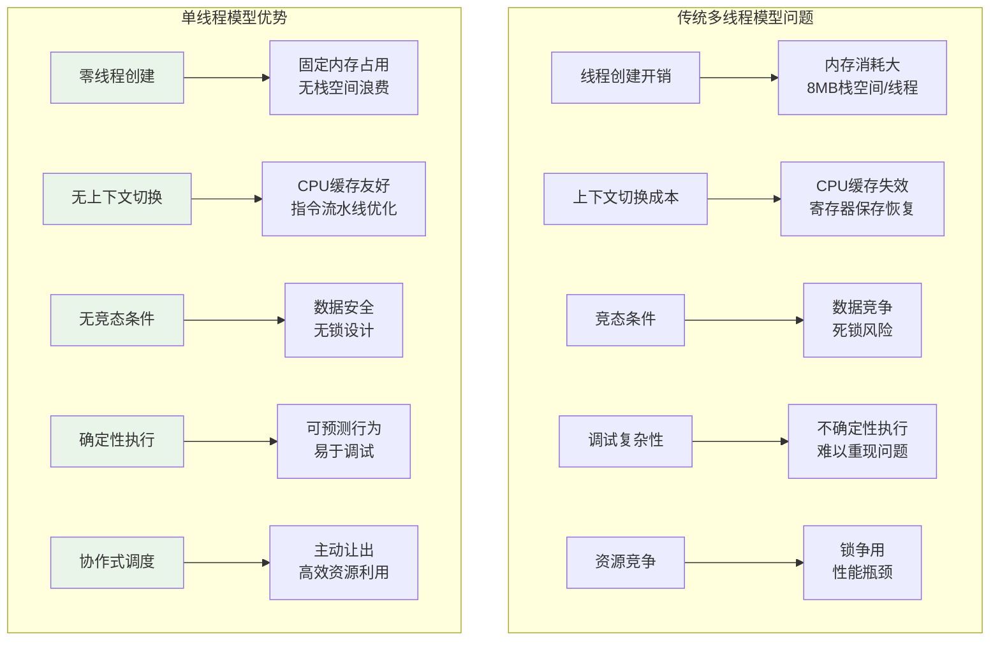

#### 目录介绍
- 01.概述与背景
  - 1.1 单线程模型理念
  - 1.2 多线程模型挑战
  - 1.3 要解决的问题

## 01.概述与背景

### 1.1 单线程模型理念

单线程模型是一种基于**协作式任务切换**的并发编程范式，它通过在单个线程内实现任务的协作式调度，替代了传统的抢占式多线程模型。这种设计思想的核心在于：**用协作代替竞争，用调度代替抢占**。

### 1.2 多线程模型挑战

### 1.3 要解决的问题

| 问题领域 | 传统方案 | 单线程模型方案 | 优势 |
|----------|----------|----------------|------|
| **并发处理** | 多线程+锁 | 协程+事件循环 | 无锁、高效 |
| **I/O密集型** | 线程池+阻塞I/O | 异步I/O+回调 | 资源利用率高 |
| **内存管理** | 每线程独立栈 | 共享堆+协程栈 | 内存效率优化 |
| **错误处理** | 异常跨线程传播 | 统一错误处理 | 简化异常管理 |
| **调试测试** | 不确定性执行 | 确定性执行 | 可重现性好 |

