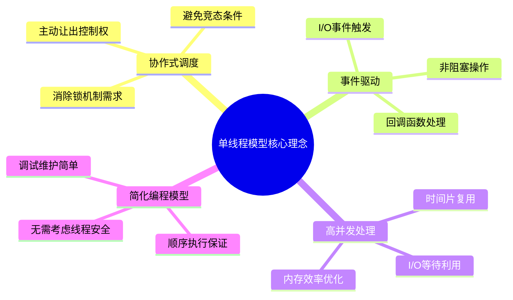

#### 目录介绍
- 01.概述与背景
  - 1.1 单线程模型理念

## 01.概述与背景

### 1.1 单线程模型理念

单线程模型是一种基于**协作式任务切换**的并发编程范式，它通过在单个线程内实现任务的协作式调度，替代了传统的抢占式多线程模型。这种设计思想的核心在于：**用协作代替竞争，用调度代替抢占**。

```mermaid
mindmap
  root((单线程模型核心理念))
    协作式调度
      主动让出控制权
      避免竞态条件
      消除锁机制需求
    事件驱动
      I/O事件触发
      回调函数处理
      非阻塞操作
    高并发处理
      时间片复用
      I/O等待利用
      内存效率优化
    简化编程模型
      无需考虑线程安全
      顺序执行保证
      调试维护简单
```

