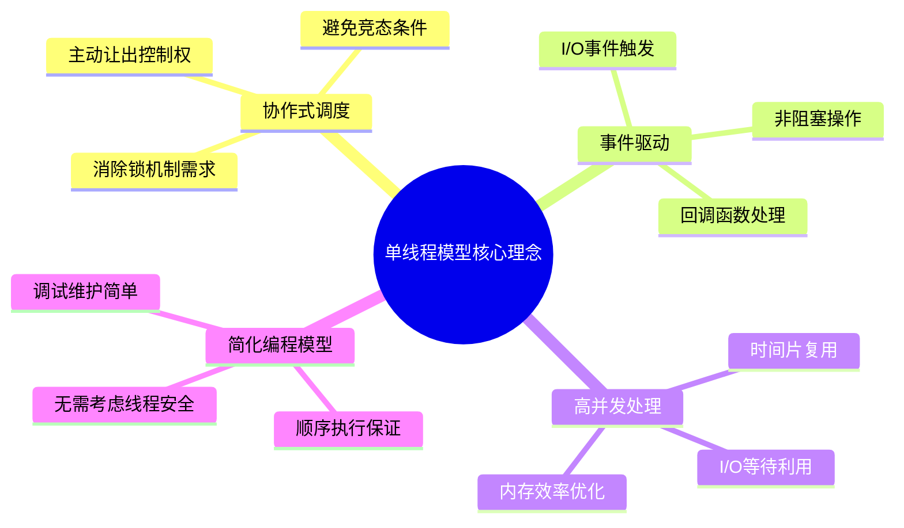
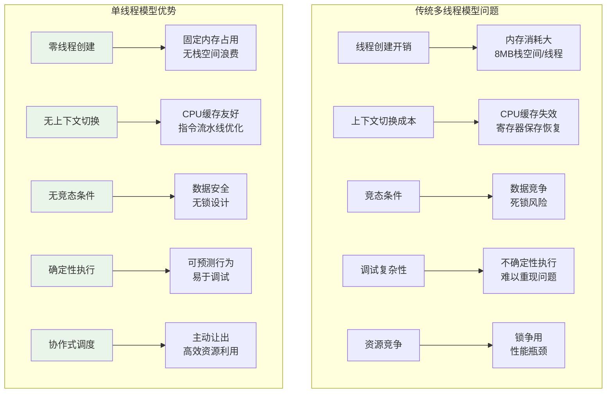
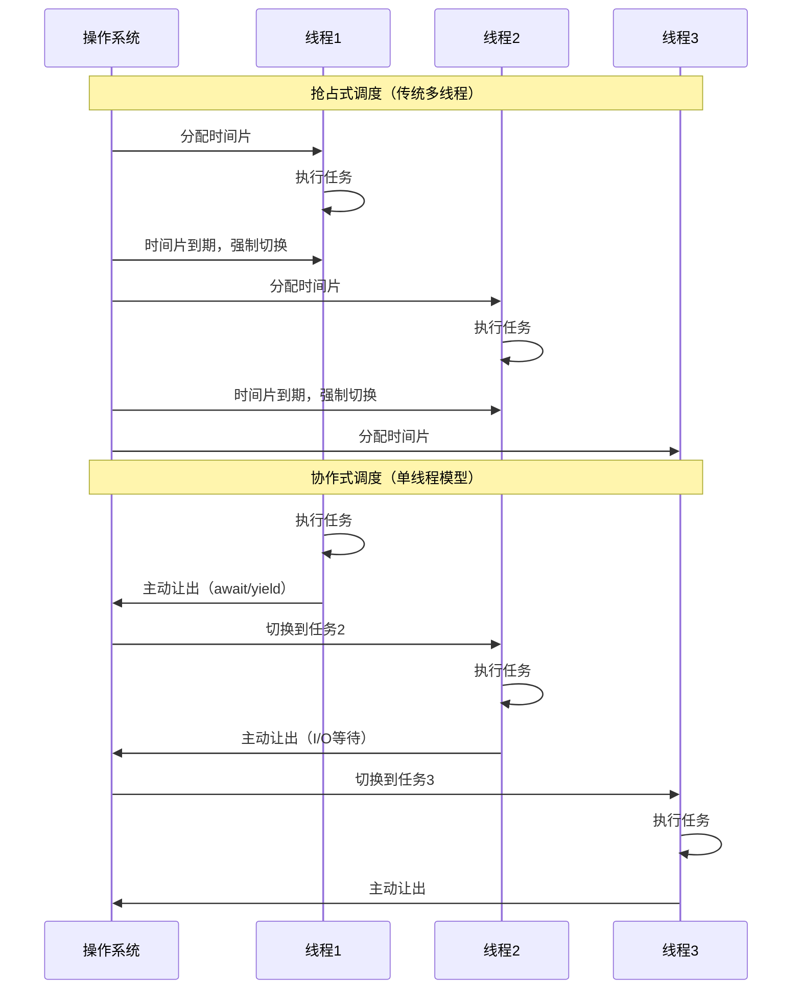
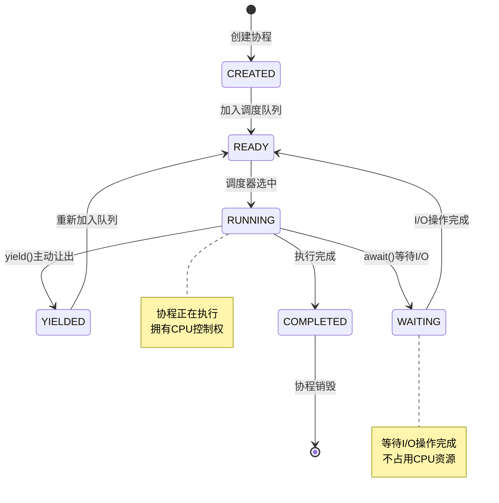

#### 目录介绍
- 01.概述与背景
  - 1.1 单线程模型理念
  - 1.2 多线程模型挑战
  - 1.3 要解决的问题
- 02.认识单线程模型
  - 2.1 餐厅厨房比喻
  - 2.2 单线程模型
- 03.核心设计思想
  - 3.1 协作式VS抢占式
  - 3.2 协作式调度思想


## 01.概述与背景

### 1.1 单线程模型理念

单线程模型是一种基于**协作式任务切换**的并发编程范式，它通过在单个线程内实现任务的协作式调度，替代了传统的抢占式多线程模型。这种设计思想的核心在于：**用协作代替竞争，用调度代替抢占**。



### 1.2 多线程模型挑战



### 1.3 要解决的问题


| 问题领域 | 传统方案 | 单线程模型方案 | 优势 |
|----------|----------|----------------|------|
| **并发处理** | 多线程+锁 | 协程+事件循环 | 无锁、高效 |
| **I/O密集型** | 线程池+阻塞I/O | 异步I/O+回调 | 资源利用率高 |
| **内存管理** | 每线程独立栈 | 共享堆+协程栈 | 内存效率优化 |
| **错误处理** | 异常跨线程传播 | 统一错误处理 | 简化异常管理 |
| **调试测试** | 不确定性执行 | 确定性执行 | 可重现性好 |


## 02.认识单线程模型

### 2.1 餐厅厨房比喻

想象一个餐厅厨房，有三种工作模式：

| 工作模式 | 工作方式 | 对应编程模型 | 缺点 |
| :--- | :--- | :--- | :--- |
| **多线程厨房** | 每个订单配一个厨师+一套厨具（线程）。10个订单需要10个厨师，成本高，厨师间容易碰撞（资源竞争）。 | **多线程** | 创建/切换线程开销大，易发生竞态条件，需要复杂的锁机制。 |
| **单线程阻塞厨房** | 只有一个厨师。接到订单后，厨师必须**一直守着**锅直到水烧开，期间不能做任何事。 | **同步阻塞** | 效率极低，CPU大部分时间在空闲等待。 |
| **单线程+事件循环厨房（协程）** | 一个高效厨师。烧水时**不等待**，而是去切菜；等水烧开的**等待时间**用来炒菜。 | **协程/异步** | 需要精心设计任务拆分，所有任务不能有长时间阻塞操作。 |

**第三种模式就是协程的核心思想：充分利用等待时间。**

### 2.2 单线程模型

单线程模型是指：**程序只有一个主执行线程**。代码一行接一行地顺序执行。

**关键挑战**：当遇到I/O操作（如读写文件、网络请求、数据库查询）时，这些操作可能需要等待几毫秒甚至几秒。在传统的同步阻塞模型中，线程会停下来傻等，导致CPU资源被白白浪费。

```javascript
// 传统同步阻塞模型（低效）
console.log('开始点餐');
let data = readFileSync('menu.txt'); // 线程在这里阻塞，直到文件读完
console.log('菜单是:', data);
cookFood(); // 直到上面完成后才执行
```

**解决方案**：**异步非阻塞 + 事件循环**。

## 03.核心设计思想

### 3.1 协作式VS抢占式



### 3.2 协作式调度思想


核心机制

```java
// 协作式调度的核心抽象
public abstract class Coroutine {
    private CoroutineState state = CoroutineState.CREATED;
    private Object yieldValue;
    
    // 协程的执行入口
    public abstract void run();
    
    // 主动让出控制权
    protected void yield() {
        this.state = CoroutineState.YIELDED;
        // 保存当前执行状态
        saveExecutionContext();
        // 切换到调度器
        Scheduler.getInstance().schedule();
    }
    
    // 等待异步操作完成
    protected void await(Future<?> future) {
        this.state = CoroutineState.WAITING;
        future.onComplete(() -> {
            this.state = CoroutineState.READY;
            Scheduler.getInstance().wakeup(this);
        });
        yield();
    }
    
    // 恢复执行
    public void resume() {
        this.state = CoroutineState.RUNNING;
        restoreExecutionContext();
        run();
    }
}
```

状态转换模型




