# 06.数据解析设计思想
#### 目录介绍
- [01.数据选取背景](#01数据选取背景)
  - [1.1 思考一个问题](#11-思考一个问题)
  - [1.2 数据序列化历程](#12-数据序列化历程)
  - [1.3 技术背景分析](#13-技术背景分析)
  - [1.4 选择驱动因素](#14-选择驱动因素)
- [02.核心设计架构](#02核心设计架构)
  - [2.1 整体架构对比](#21-整体架构对比)
  - [2.2 核心特性对比](#22-核心特性对比)
- [04.JSON数据设计](#04json数据设计)
  - [4.1 历史背景](#41-历史背景)
  - [4.2 JSON设计思想](#42-json设计思想)
  - [4.3 基本数据类型](#43-基本数据类型)
  - [4.4 JSON用例](#44-json用例)
  - [4.5 核心优势](#45-核心优势)
  - [4.6 数据传输流程](#46-数据传输流程)
  - [4.7 适用场景](#47-适用场景)
  - [4.8 序列化原理](#48-序列化原理)
- [05.ProtoBuf数据设计](#05protobuf数据设计)
  - [5.1 设计理念](#51-设计理念)
  - [5.2 Pb设计思想](#52-pb设计思想)
  - [5.3 架构设计](#53-架构设计)
  - [5.4 ProtoBuf用例](#54-protobuf用例)
  - [5.5 Pb编码原理](#55-pb编码原理)
  - [5.6 性能优势](#56-性能优势)
  - [5.7 传输效率对比](#57-传输效率对比)
- [06.XML数据设计](#06xml数据设计)
  - [6.1 XML设计原则](#61-xml设计原则)
  - [6.2 XML设计思想](#62-xml设计思想)
  - [6.3 XML语法示例](#63-xml语法示例)
  - [6.4 XML处理模型](#64-xml处理模型)
  - [6.5 技术优势](#65-技术优势)
- [07.性能深度对比](#07性能深度对比)
  - [7.1 序列化大小对比](#71-序列化大小对比)
  - [7.2 解析性能对比](#72-解析性能对比)
  - [7.3 序列化性能因素](#73-序列化性能因素)
  - [7.4 性能优化建议](#74-性能优化建议)
- [08.应用场景和建议](#08应用场景和建议)
  - [8.1 场景适用性矩阵](#81-场景适用性矩阵)
  - [8.2 详细场景建议](#82-详细场景建议)
  - [8.3 技术选型决策树](#83-技术选型决策树)
- [10.总结和建议](#10总结和建议)
  - [10.1 应用场景指南](#101-应用场景指南)
  - [10.2 现代最佳实践](#102-现代最佳实践)


## 01.数据选取背景

### 1.1 思考一个问题

JSON、Protocol Buffers (ProtoBuf) 和 XML 是三种最重要的数据序列化格式。在开发中，你一般用哪一种，它们使用背景是什么？

### 1.2 数据序列化历程

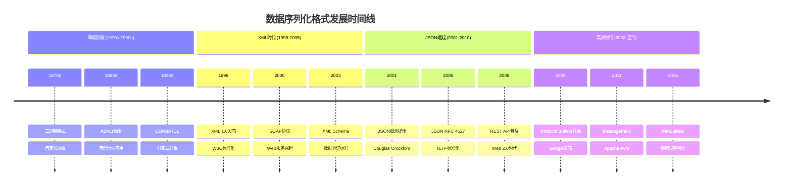
```mermaid
timeline
    title 数据序列化格式发展时间线
    
    section 早期阶段 (1970s-1990s)
        1970s : 二进制格式
              : 自定义协议
        1980s : ASN.1标准
              : 电信行业应用
        1990s : CORBA IDL
              : 分布式对象
    
    section XML时代 (1998-2005)
        1998 : XML 1.0发布
             : W3C标准化
        2000 : SOAP协议
             : Web服务兴起
        2003 : XML Schema
             : 数据验证标准
    
    section JSON崛起 (2001-2010)
        2001 : JSON概念提出
             : Douglas Crockford
        2006 : JSON RFC 4627
             : IETF标准化
        2008 : REST API普及
             : Web 2.0时代
    
    section 高效时代 (2008-至今)
        2008 : Protocol Buffers开源
             : Google发布
        2011 : MessagePack
             : Apache Avro
        2016 : FlatBuffers
             : 零拷贝序列化
```

### 1.3 技术背景分析

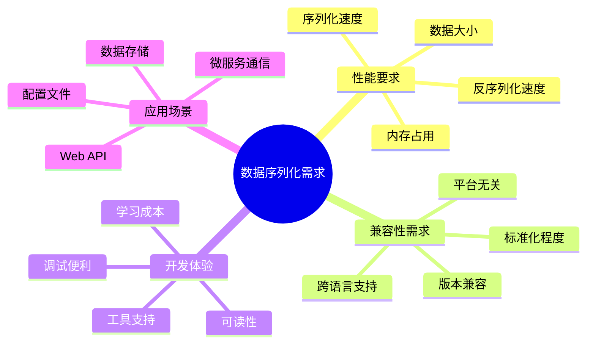
```mermaid
mindmap
  root((数据序列化需求))
    性能要求
      序列化速度
      反序列化速度
      数据大小
      内存占用
    兼容性需求
      跨语言支持
      版本兼容
      平台无关
      标准化程度
    开发体验
      可读性
      调试便利
      工具支持
      学习成本
    应用场景
      Web API
      微服务通信
      数据存储
      配置文件
```

### 1.4 选择驱动因素

| 驱动因素 | XML | JSON | ProtoBuf |
|---------|-----|------|----------|
| **标准化需求** | 强 | 中 | 弱 |
| **性能要求** | 低 | 中 | 高 |
| **可读性需求** | 高 | 高 | 低 |
| **跨语言支持** | 强 | 强 | 强 |
| **生态成熟度** | 高 | 高 | 中 |

## 02.核心设计架构

### 2.1 整体架构对比


```mermaid
graph TB
    subgraph "XML架构"
        XML1[文本格式]
        XML2[标签结构]
        XML3[Schema验证]
        XML4[命名空间]
        XML1 --> XML2 --> XML3 --> XML4
    end
    
    subgraph "JSON架构"
        JSON1[文本格式]
        JSON2[键值对结构]
        JSON3[原生数据类型]
        JSON4[简洁语法]
        JSON1 --> JSON2 --> JSON3 --> JSON4
    end
    
    subgraph "ProtoBuf架构"
        PB1[二进制格式]
        PB2[Schema定义]
        PB3[代码生成]
        PB4[向后兼容]
        PB1 --> PB2 --> PB3 --> PB4
    end
    
    style XML1 fill:#ffebee
    style JSON1 fill:#e8f5e8
    style PB1 fill:#e3f2fd
```

### 2.2 核心特性对比

| 特性 | JSON | Protocol Buffers (ProtoBuf) | XML |
|------|------|----------------------------|------|
| **设计哲学** | **简单、易读、JavaScript 友好** | **高效、小型、跨语言 RPC** | **强大、可扩展、文档标记** |
| **数据模型** | 简单（对象、数组、基本类型） | 强类型、结构化 Schema | 树形结构、标签、属性 |
| **可读性** | **优秀**（人类易读） | **差**（二进制格式） | **良好**（但冗长） |
| **序列化大小** | 中等 | **极小**（比 JSON 小 3-10 倍） | 大（最冗长） |
| **处理速度** | 快（解析/序列化） | **极快** | 慢（解析复杂） |
| **Schema 要求** | 无（动态类型） | **必需**（.proto 文件） | 可选（DTD, XSD） |
| **扩展性** | 好（灵活但无约束） | **优秀**（向前/向后兼容） | 优秀（但复杂） |


## 04.JSON数据设计

### 4.1 历史背景

JSON (JavaScript Object Notation) 由`Douglas Crockford`在2001年提出，最初是为了解决JavaScript中数据交换的问题。它基于JavaScript的对象字面量语法，但设计为语言无关的数据格式。

### 4.2 JSON设计思想

设计思想：Web 的通用语。**核心思想**：源于 JavaScript，旨在实现**简单、轻量、人类可读**的数据交换。

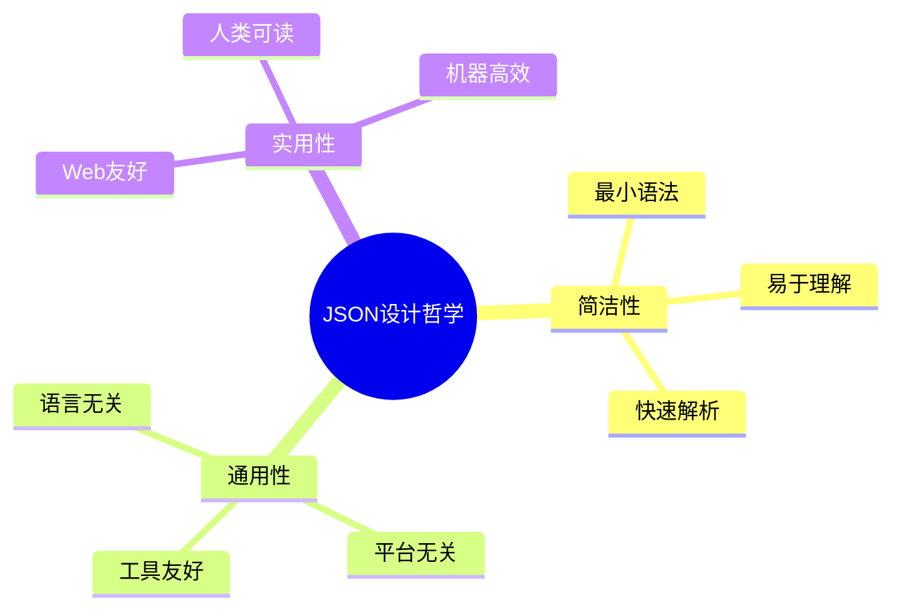
```mermaid
mindmap
  root((JSON设计哲学))
    简洁性
      最小语法
      易于理解
      快速解析
    通用性
      语言无关
      平台无关
      工具友好
    实用性
      Web友好
      人类可读
      机器高效
```

### 4.3 基本数据类型

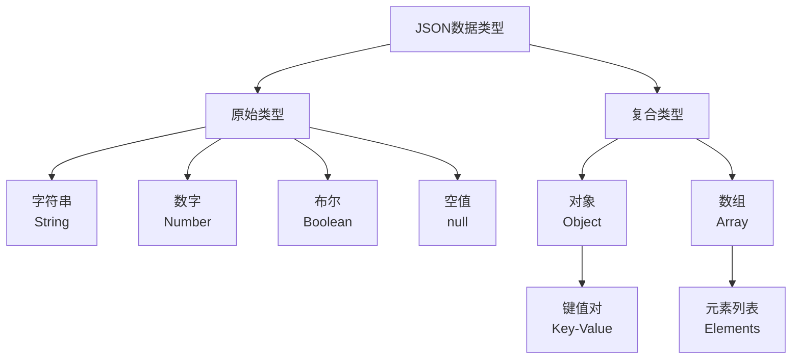
```mermaid
graph TB
    JSON[JSON数据类型] --> Primitive[原始类型]
    JSON --> Composite[复合类型]
    
    Primitive --> String[字符串<br/>String]
    Primitive --> Number[数字<br/>Number]
    Primitive --> Boolean[布尔<br/>Boolean]
    Primitive --> Null[空值<br/>null]
    
    Composite --> Object[对象<br/>Object]
    Composite --> Array[数组<br/>Array]
    
    Object --> KeyValue[键值对<br/>Key-Value]
    Array --> Elements[元素列表<br/>Elements]
```

### 4.4 JSON用例

语法示例

```json
{
  "user": {
    "id": 12345,
    "name": "Alice",
    "email": "alice@example.com",
    "isActive": true,
    "tags": ["developer", "javascript"],
    "profile": {
      "age": 28,
      "avatar": null
    }
  },
  "metadata": {
    "version": "1.0",
    "timestamp": "2023-11-28T10:30:00Z"
  }
}
```

### 4.5 核心优势

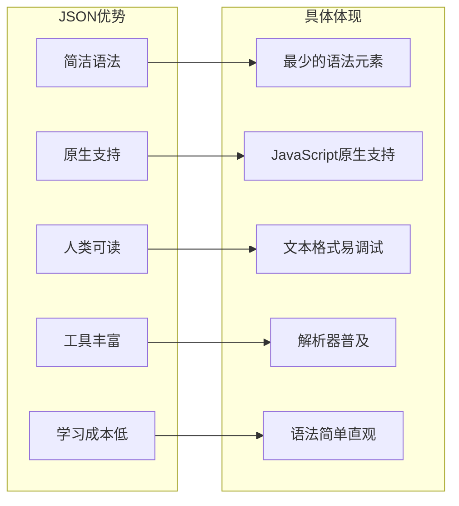
```mermaid
graph LR
    subgraph "JSON优势"
        A[简洁语法]
        B[原生支持]
        C[人类可读]
        D[工具丰富]
        E[学习成本低]
    end
    
    subgraph "具体体现"
        A1[最少的语法元素]
        B1[JavaScript原生支持]
        C1[文本格式易调试]
        D1[解析器普及]
        E1[语法简单直观]
    end
    
    A --> A1
    B --> B1
    C --> C1
    D --> D1
    E --> E1
```

### 4.6 数据传输流程

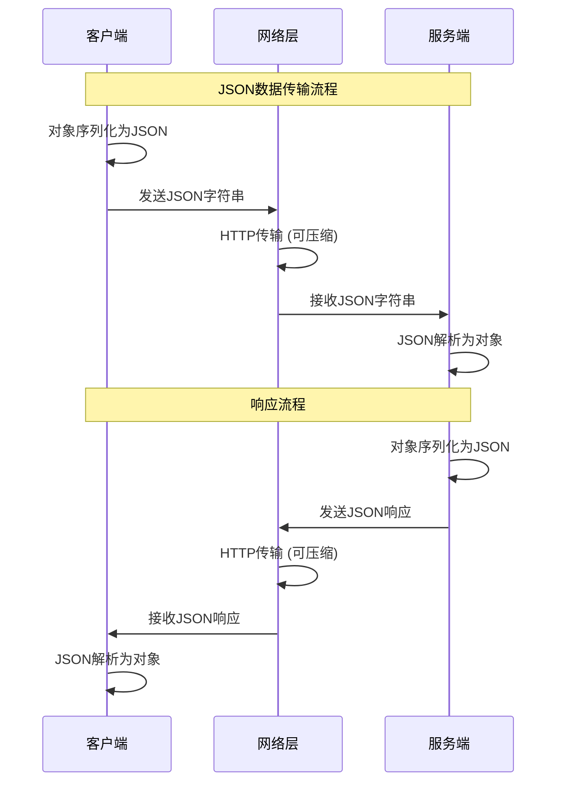
```mermaid
sequenceDiagram
    participant Client as 客户端
    participant Network as 网络层
    participant Server as 服务端
    
    Note over Client,Server: JSON数据传输流程
    
    Client->>Client: 对象序列化为JSON
    Client->>Network: 发送JSON字符串
    Network->>Network: HTTP传输 (可压缩)
    Network->>Server: 接收JSON字符串
    Server->>Server: JSON解析为对象
    
    Note over Client,Server: 响应流程
    
    Server->>Server: 对象序列化为JSON
    Server->>Network: 发送JSON响应
    Network->>Network: HTTP传输 (可压缩)
    Network->>Client: 接收JSON响应
    Client->>Client: JSON解析为对象
```

### 4.7 适用场景

适用场景

- **Web APIs** (RESTful APIs 的事实标准)
- **配置文件** (package.json, tsconfig.json)
- **前端-后端通信**
- **NoSQL 数据库** (MongoDB 的文档格式)

### 4.8 序列化原理

| 性能指标 | 特征 | 说明 |
|---------|------|------|
| **序列化速度** | 快 | 简单的字符串拼接 |
| **反序列化速度** | 中等 | 需要词法分析和语法解析 |
| **数据大小** | 中等 | 文本格式，有一定冗余 |
| **压缩效果** | 好 | 文本重复性高，压缩比好 |
| **内存占用** | 中等 | 需要完整解析到内存 |

## 05.ProtoBuf数据设计

### 5.1 设计理念

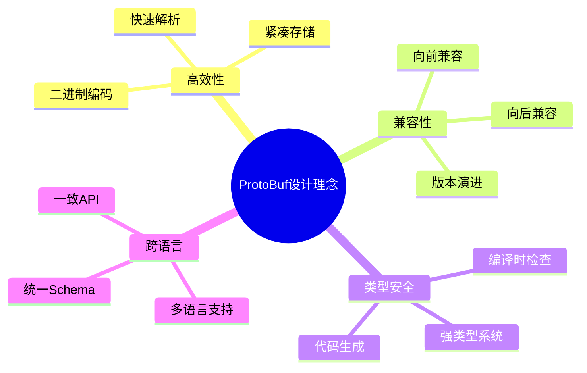
```mermaid
mindmap
  root((ProtoBuf设计理念))
    高效性
      二进制编码
      紧凑存储
      快速解析
    兼容性
      向前兼容
      向后兼容
      版本演进
    类型安全
      强类型系统
      编译时检查
      代码生成
    跨语言
      多语言支持
      统一Schema
      一致API
```

### 5.2 Pb设计思想

设计思想：高性能序列化

**核心**：Google 开发的**二进制协议**，专注于**效率、速度和跨语言兼容性**。

工作流程

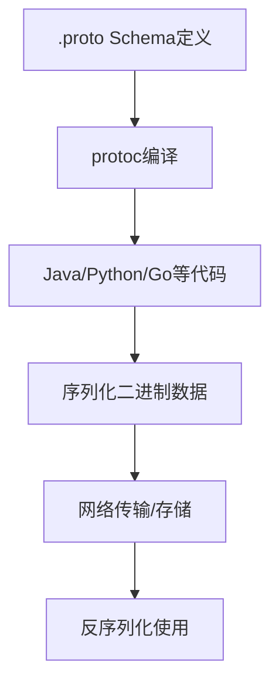
```mermaid
graph TD
    A[.proto Schema定义] --> B[protoc编译]
    B --> C[Java/Python/Go等代码]
    C --> D[序列化二进制数据]
    D --> E[网络传输/存储]
    E --> F[反序列化使用]
```

### 5.3 架构设计

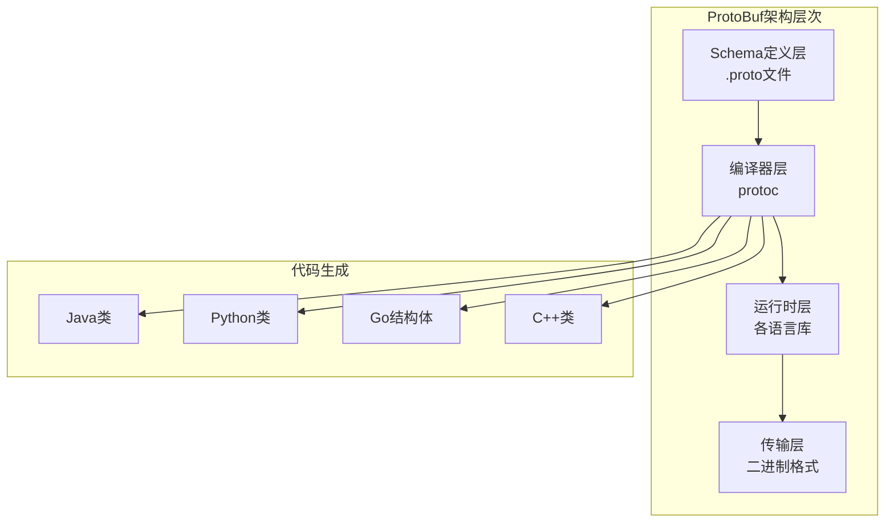
```mermaid
graph TB
    subgraph "ProtoBuf架构层次"
        Schema[Schema定义层<br/>.proto文件]
        Compiler[编译器层<br/>protoc]
        Runtime[运行时层<br/>各语言库]
        Wire[传输层<br/>二进制格式]
    end
    
    Schema --> Compiler
    Compiler --> Runtime
    Runtime --> Wire
    
    subgraph "代码生成"
        Java[Java类]
        Python[Python类]
        Go[Go结构体]
        Cpp[C++类]
    end
    
    Compiler --> Java
    Compiler --> Python
    Compiler --> Go
    Compiler --> Cpp
```

### 5.4 ProtoBuf用例

定义 Schema (`user.proto`)

```proto
syntax = "proto3";

message User {
    int32 id = 1;           // 字段编号 (关键!)
    string name = 2;
    string email = 3;
    bool is_active = 4;
    repeated string tags = 5;  // 重复字段（数组）
    
    message Profile {
        int32 age = 1;
        string avatar_url = 2;
    }
    
    Profile profile = 6;
    Role role = 7;          // 枚举类型
}

enum Role {
    UNKNOWN = 0;
    ADMIN = 1;
    USER = 2;
    GUEST = 3;
}

message UserResponse {
    repeated User users = 1;
    int32 total_count = 2;
}
```

字段编号规则

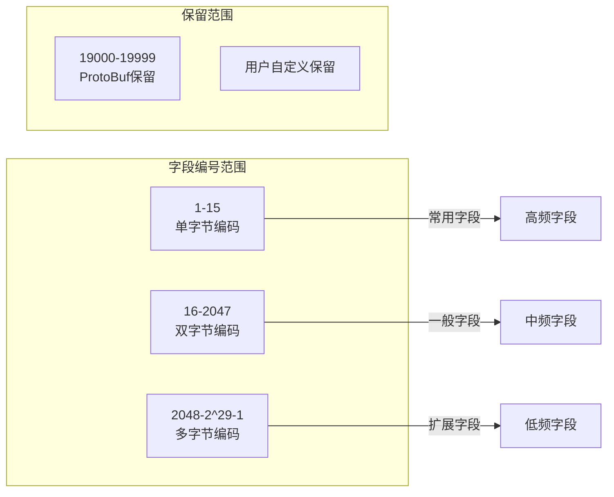
```mermaid
graph LR
    subgraph "字段编号范围"
        A[1-15<br/>单字节编码]
        B[16-2047<br/>双字节编码]
        C[2048-2^29-1<br/>多字节编码]
    end
    
    subgraph "保留范围"
        D[19000-19999<br/>ProtoBuf保留]
        E[用户自定义保留]
    end
    
    A --> |常用字段| High[高频字段]
    B --> |一般字段| Medium[中频字段]
    C --> |扩展字段| Low[低频字段]
```

2. 编译生成代码

```bash
# 生成 Java 代码
protoc --java_out=./src user.proto

# 生成 Python 代码  
protoc --python_out=./src user.proto

# 生成 Go 代码
protoc --go_out=./src user.proto
```

3. 使用示例 (Python)

```python
# 生成的代码示例
import user_pb2

# 创建对象
user = user_pb2.User()
user.id = 12345
user.name = "Alice"
user.email = "alice@example.com"
user.tags.extend(["developer", "javascript"])

# 序列化为二进制
binary_data = user.SerializeToString()
print("序列化大小:", len(binary_data))  # 可能只有 30-50 字节

# 从二进制反序列化
new_user = user_pb2.User()
new_user.ParseFromString(binary_data)

print(f"用户: {new_user.name}, ID: {new_user.id}")
```

### 5.5 Pb编码原理

#### Varint编码

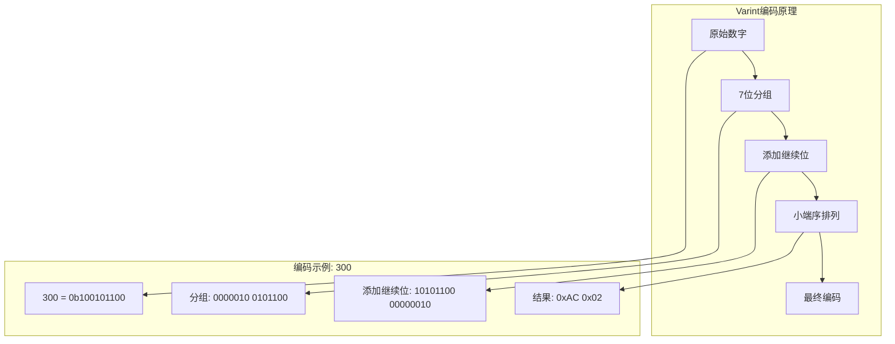
```mermaid
graph TB
    subgraph "Varint编码原理"
        A[原始数字] --> B[7位分组]
        B --> C[添加继续位]
        C --> D[小端序排列]
        D --> E[最终编码]
    end
    
    subgraph "编码示例: 300"
        F["300 = 0b100101100"]
        G["分组: 0000010 0101100"]
        H["添加继续位: 10101100 00000010"]
        I["结果: 0xAC 0x02"]
    end
    
    A --> F
    B --> G
    C --> H
    D --> I
```

#### Wire Format

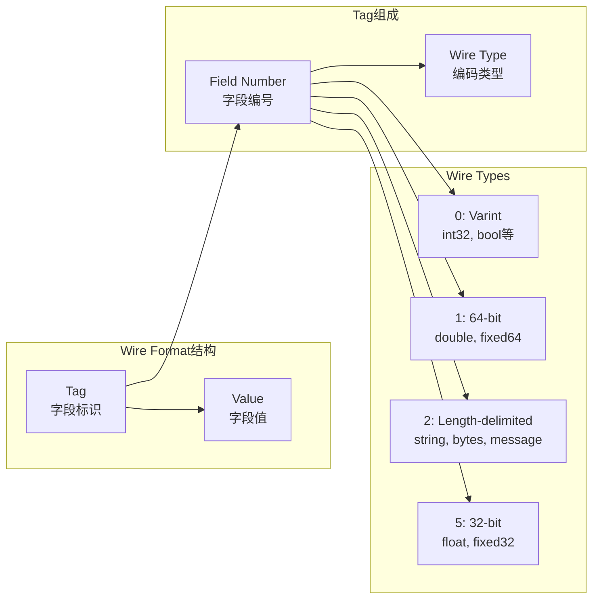
```mermaid
graph LR
    subgraph "Wire Format结构"
        Tag[Tag<br/>字段标识] --> Value[Value<br/>字段值]
    end
    
    subgraph "Tag组成"
        FieldNum[Field Number<br/>字段编号] --> WireType[Wire Type<br/>编码类型]
    end
    
    subgraph "Wire Types"
        T0[0: Varint<br/>int32, bool等]
        T1[1: 64-bit<br/>double, fixed64]
        T2[2: Length-delimited<br/>string, bytes, message]
        T5[5: 32-bit<br/>float, fixed32]
    end
    
    Tag --> FieldNum
    FieldNum --> T0
    FieldNum --> T1
    FieldNum --> T2
    FieldNum --> T5
```

### 5.6 性能优势

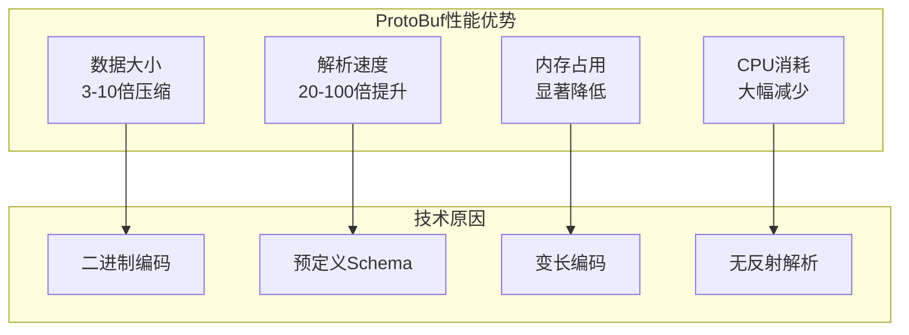
```mermaid
graph TB
    subgraph "ProtoBuf性能优势"
        Size[数据大小<br/>3-10倍压缩]
        Speed[解析速度<br/>20-100倍提升]
        Memory[内存占用<br/>显著降低]
        CPU[CPU消耗<br/>大幅减少]
    end
    
    subgraph "技术原因"
        Binary[二进制编码]
        Schema[预定义Schema]
        Varint[变长编码]
        NoReflection[无反射解析]
    end
    
    Size --> Binary
    Speed --> Schema
    Memory --> Varint
    CPU --> NoReflection
```

### 5.7 传输效率对比

| 数据项 | JSON | ProtoBuf | 压缩比 |
|-------|------|----------|--------|
| **简单对象** | 85 bytes | 33 bytes | 2.6x |
| **复杂对象** | 450 bytes | 156 bytes | 2.9x |
| **数组数据** | 1.2KB | 380 bytes | 3.2x |
| **嵌套结构** | 2.1KB | 654 bytes | 3.2x |

## 06.XML数据设计

### 6.1 XML设计原则

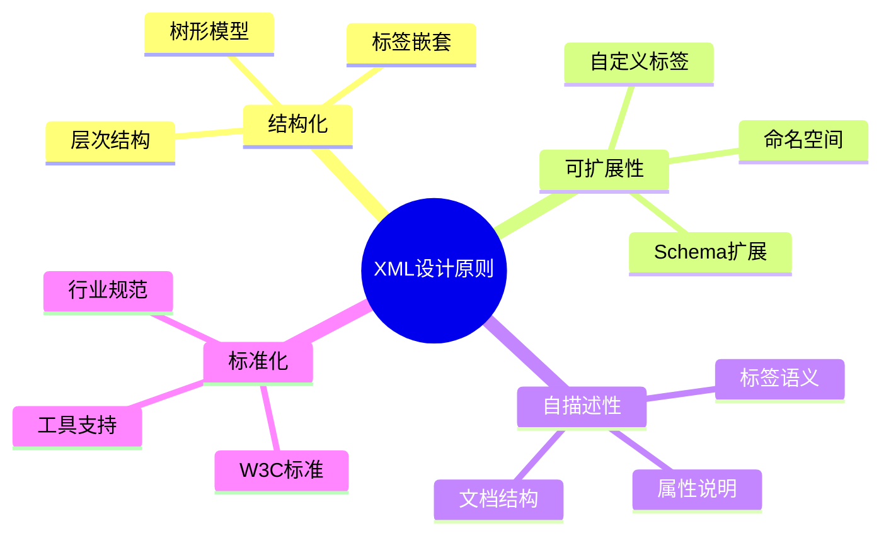
```mermaid
mindmap
  root((XML设计原则))
    结构化
      层次结构
      标签嵌套
      树形模型
    可扩展性
      自定义标签
      命名空间
      Schema扩展
    自描述性
      标签语义
      属性说明
      文档结构
    标准化
      W3C标准
      工具支持
      行业规范
```

### 6.2 XML设计思想

设计思想：文档与数据的统一

**核心**：**可扩展标记语言**，适合表示**复杂文档结构和元数据**。

### 6.3 XML语法示例

```xml
<?xml version="1.0" encoding="UTF-8"?>
<user id="12345" status="active">
    <name>Alice</name>
    <email>alice@example.com</email>
    <isActive>true</isActive>
    <tags>
        <tag>developer</tag>
        <tag>javascript</tag>
    </tags>
    <profile>
        <age>28</age>
        <avatar null="true"/>
    </profile>
    <metadata>
        <version>1.0</version>
        <timestamp>2023-11-28T10:30:00Z</timestamp>
    </metadata>
</user>
```

### 6.4 XML处理模型

DOM vs SAX

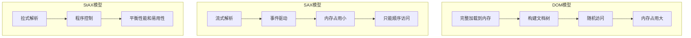
```mermaid
graph TB
    subgraph "DOM模型"
        DOM1[完整加载到内存]
        DOM2[构建文档树]
        DOM3[随机访问]
        DOM4[内存占用大]
        DOM1 --> DOM2 --> DOM3 --> DOM4
    end
    
    subgraph "SAX模型"
        SAX1[流式解析]
        SAX2[事件驱动]
        SAX3[内存占用小]
        SAX4[只能顺序访问]
        SAX1 --> SAX2 --> SAX3 --> SAX4
    end
    
    subgraph "StAX模型"
        STAX1[拉式解析]
        STAX2[程序控制]
        STAX3[平衡性能和易用性]
        STAX1 --> STAX2 --> STAX3
    end
```

XML解析流程

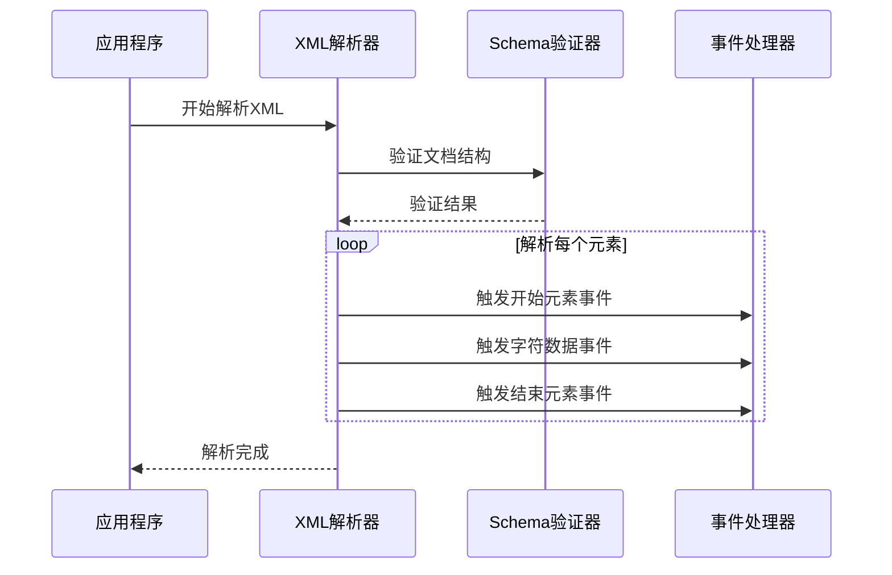
```mermaid
sequenceDiagram
    participant App as 应用程序
    participant Parser as XML解析器
    participant Validator as Schema验证器
    participant Handler as 事件处理器
    
    App->>Parser: 开始解析XML
    Parser->>Validator: 验证文档结构
    Validator-->>Parser: 验证结果
    
    loop 解析每个元素
        Parser->>Handler: 触发开始元素事件
        Parser->>Handler: 触发字符数据事件
        Parser->>Handler: 触发结束元素事件
    end
    
    Parser-->>App: 解析完成
```

### 6.5 技术优势

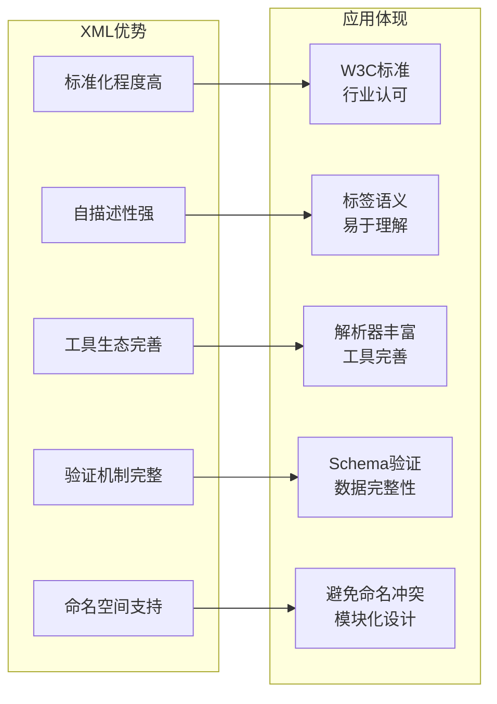
```mermaid
graph LR
    subgraph "XML优势"
        A[标准化程度高]
        B[自描述性强]
        C[工具生态完善]
        D[验证机制完整]
        E[命名空间支持]
    end
    
    subgraph "应用体现"
        A1[W3C标准<br/>行业认可]
        B1[标签语义<br/>易于理解]
        C1[解析器丰富<br/>工具完善]
        D1[Schema验证<br/>数据完整性]
        E1[避免命名冲突<br/>模块化设计]
    end
    
    A --> A1
    B --> B1
    C --> C1
    D --> D1
    E --> E1
```

## 07.性能深度对比

### 7.1 序列化大小对比

```python
# 模拟数据序列化大小比较
import json
import xml.etree.ElementTree as ET
from io import BytesIO

# 相同的数据
data = {
    "users": [
        {"id": 1, "name": "Alice", "email": "alice@example.com", "active": True},
        {"id": 2, "name": "Bob", "email": "bob@example.com", "active": False}
    ],
    "total": 2
}

# JSON
json_size = len(json.dumps(data, separators=(',', ':')))  # 紧凑格式

# XML
root = ET.Element("response")
users_elem = ET.SubElement(root, "users")
for user in data["users"]:
    user_elem = ET.SubElement(users_elem, "user", id=str(user["id"]))
    ET.SubElement(user_elem, "name").text = user["name"]
    ET.SubElement(user_elem, "email").text = user["email"]
    ET.SubElement(user_elem, "active").text = str(user["active"])
ET.SubElement(root, "total").text = str(data["total"])

xml_size = len(ET.tostring(root))

print(f"JSON 大小: {json_size} 字节")    # 约 150 字节
print(f"XML 大小:  {xml_size} 字节")     # 约 300 字节  
print(f"ProtoBuf 预估: ~{json_size//3} 字节")  # 约 50 字节
```

### 7.2 解析性能对比

```
解析速度排名：
1. Protocol Buffers (二进制，直接内存映射)
2. JSON (文本解析，语法简单)  
3. XML (文本解析，语法复杂，需要构建DOM树)

内存占用排名：
1. Protocol Buffers (最低)
2. JSON (中等)
3. XML (最高，DOM树开销大)
```

### 7.3 序列化性能因素

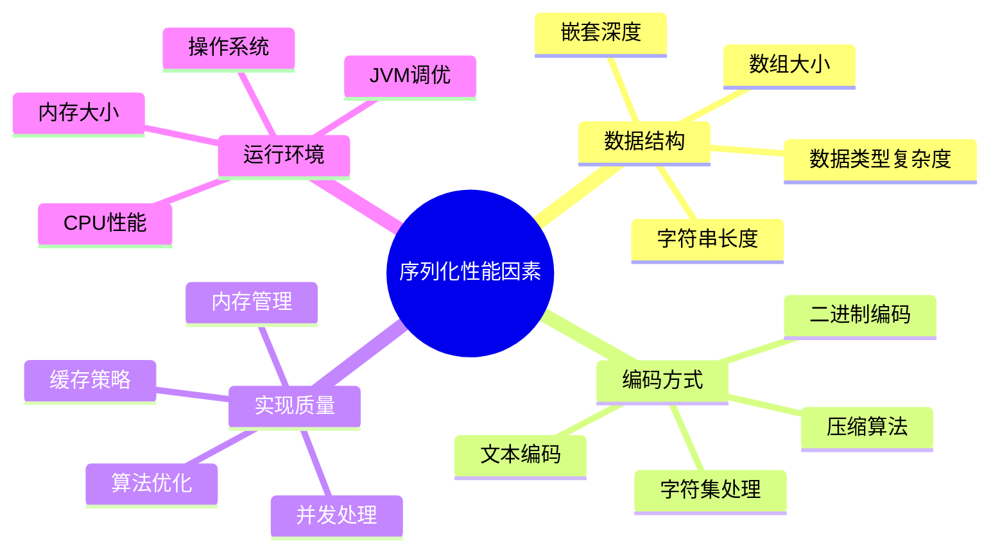
```mermaid
mindmap
  root((序列化性能因素))
    数据结构
      嵌套深度
      数组大小
      字符串长度
      数据类型复杂度
    编码方式
      文本编码
      二进制编码
      压缩算法
      字符集处理
    实现质量
      算法优化
      内存管理
      缓存策略
      并发处理
    运行环境
      CPU性能
      内存大小
      JVM调优
      操作系统
```

### 7.4 性能优化建议

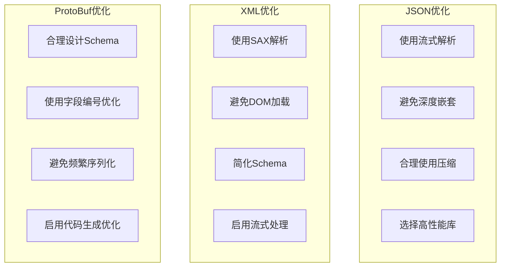
```mermaid
graph TB
    subgraph "JSON优化"
        J1[使用流式解析]
        J2[避免深度嵌套]
        J3[合理使用压缩]
        J4[选择高性能库]
    end
    
    subgraph "XML优化"
        X1[使用SAX解析]
        X2[避免DOM加载]
        X3[简化Schema]
        X4[启用流式处理]
    end
    
    subgraph "ProtoBuf优化"
        P1[合理设计Schema]
        P2[使用字段编号优化]
        P3[避免频繁序列化]
        P4[启用代码生成优化]
    end
```

## 08.应用场景和建议

### 8.1 场景适用性矩阵

```mermaid
graph TB
    subgraph "Web API"
        API1[REST API<br/>JSON推荐]
        API2[GraphQL<br/>JSON推荐]
        API3[配置文件<br/>JSON/XML]
    end
    
    subgraph "微服务通信"
        MS1[内部RPC<br/>ProtoBuf推荐]
        MS2[服务发现<br/>JSON推荐]
        MS3[配置中心<br/>JSON/XML]
    end
    
    subgraph "数据存储"
        DB1[文档数据库<br/>JSON推荐]
        DB2[配置存储<br/>XML/JSON]
        DB3[日志存储<br/>JSON推荐]
    end
    
    subgraph "移动应用"
        Mobile1[客户端通信<br/>ProtoBuf推荐]
        Mobile2[配置下发<br/>JSON推荐]
        Mobile3[离线存储<br/>ProtoBuf推荐]
    end
```

### 8.2 详细场景建议

| 应用场景 | 首选格式 | 原因 | 备选方案 |
|---------|---------|------|---------|
| **Web API** | JSON | 简洁、易调试、浏览器原生支持 | XML (企业级) |
| **微服务RPC** | ProtoBuf | 高性能、类型安全、版本兼容 | JSON (简单场景) |
| **配置文件** | JSON/XML | 人类可读、工具支持好 | YAML |
| **移动端通信** | ProtoBuf | 节省流量、电池友好 | JSON (开发阶段) |
| **日志存储** | JSON | 结构化、查询友好 | 文本格式 |
| **数据交换** | XML | 标准化、验证完整 | JSON |


### 8.3 技术选型决策树


```mermaid
flowchart TD
    Start([开始选型]) --> Q1{性能要求高?}
    Q1 -->|是| Q2{需要人类可读?}
    Q1 -->|否| Q3{需要标准化?}
    
    Q2 -->|是| JSON[选择JSON<br/>性能可接受且可读]
    Q2 -->|否| ProtoBuf[选择ProtoBuf<br/>最佳性能]
    
    Q3 -->|是| Q4{复杂验证需求?}
    Q3 -->|否| JSON
    
    Q4 -->|是| XML[选择XML<br/>完整标准化]
    Q4 -->|否| JSON
    
    JSON --> End([决策完成])
    ProtoBuf --> End
    XML --> End
```

## 10.总结和建议

### 10.1 应用场景指南

何时选择JSON？

```javascript
// ✅ 适合场景：
// 1. Web API 开发
app.get('/api/users', (req, res) => {
    res.json({ users: [], total: 0 }); // 天然支持
});

// 2. 前端开发
const config = {
    "apiEndpoint": "https://api.example.com",
    "timeout": 5000,
    "features": {"darkMode": true}
};
localStorage.setItem('config', JSON.stringify(config));

// 3. 简单数据存储
```

何时选择 Protocol Buffers？

```proto
// ✅ 适合场景：
// 1. 微服务架构 (gRPC)
service UserService {
    rpc GetUser (GetUserRequest) returns (UserResponse);
    rpc CreateUser (CreateUserRequest) returns (UserResponse);
}

// 2. 移动应用
message MobileResponse {
    repeated Product products = 1;
    bytes image_data = 2;  // 二进制图像数据
    int64 timestamp = 3;
}

// 3. 高性能存储
// 日志文件、缓存数据、实时流数据
```

何时选择 XML？

```xml
<!-- 1. 文档处理 -->
<document>
    <chapter id="1">
        <title>Introduction</title>
        <paragraph>This is <bold>important</bold> text.</paragraph>
    </chapter>
</document>

<!-- 2. 复杂配置 -->
<server>
    <connection pool="20" timeout="30s"/>
    <security>
        <ssl enabled="true"/>
        <authentication method="jwt"/>
    </security>
</server>
```

### 10.2 现代最佳实践

| 考量因素 | 推荐选择 |
|----------|----------|
| **开发速度** | JSON (无 Schema，直接使用) |
| **性能要求** | Protocol Buffers (速度最快，体积最小) |
| **人类可读** | JSON 或 XML (文本格式) |
| **类型安全** | Protocol Buffers (强类型 Schema) |
| **浏览器兼容** | JSON (原生支持) |
| **复杂数据结构** | XML (树形结构，属性支持) |
| **移动端应用** | Protocol Buffers (节省流量) |
| **企业集成** | XML (成熟标准，工具丰富) |

**现代最佳实践**：

- **前端 ↔ 后端**：使用 **JSON** (RESTful APIs)
- **后端微服务间**：使用 **Protocol Buffers** (gRPC)
- **文档/配置**：根据生态选择 **XML** 或 **JSON**
- **性能敏感场景**：优先考虑 **Protocol Buffers**


