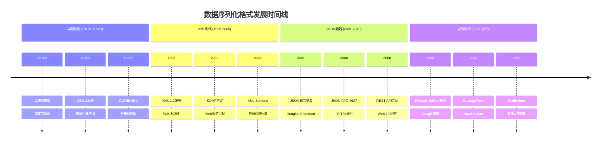
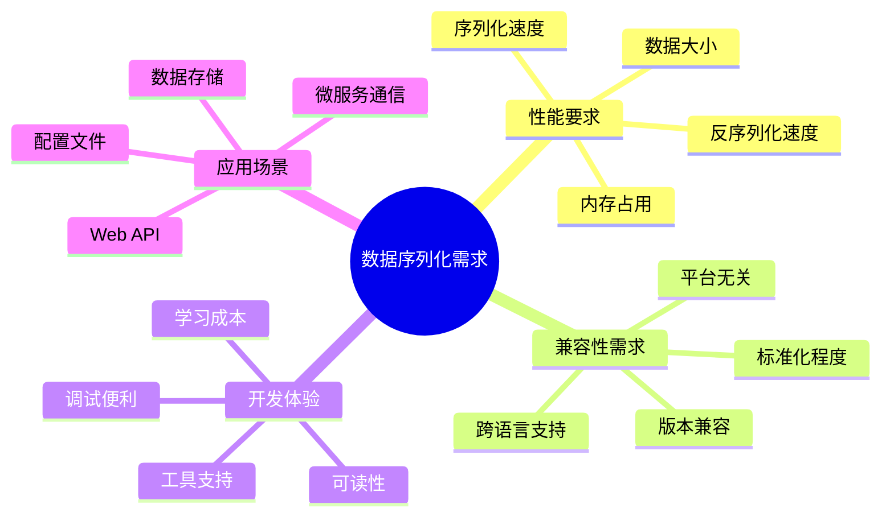
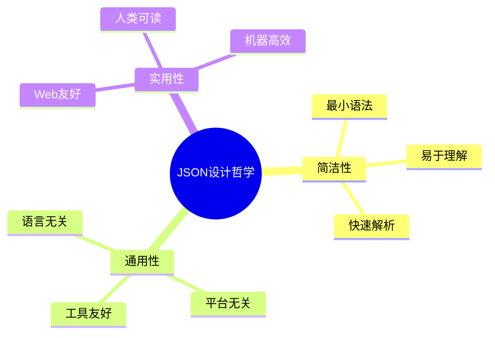
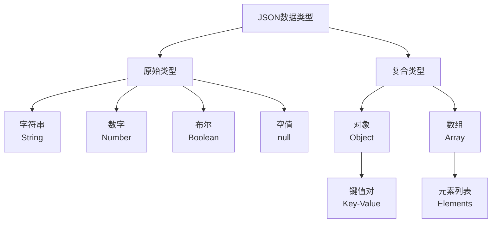
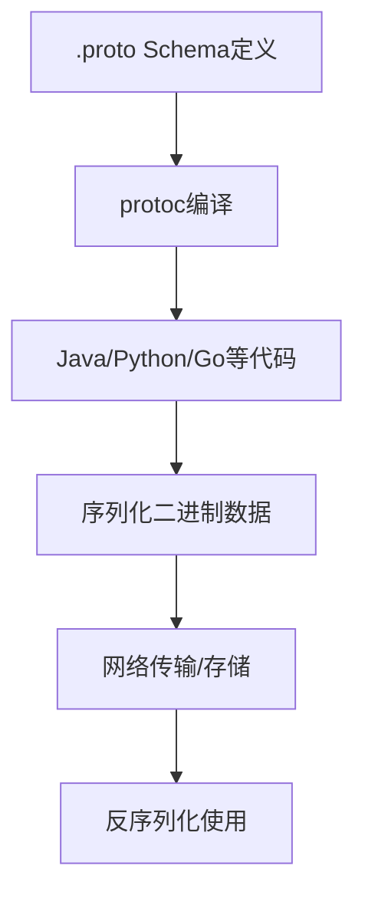

#### 目录介绍
- 01.数据选取背景
  - 1.1 思考一个问题
  - 1.2 数据序列化历程
  - 1.3 技术背景分析
  - 1.4 选择驱动因素
- 02.核心设计架构
  - 2.1 整体架构对比
  - 2.2 核心特性对比
- 04.JSON数据设计
  - 4.1 历史背景
  - 4.2 JSON设计思想
  - 4.3 基本数据类型
  - 4.2 JSON用例
  - 4.3 核心优势
  - 4.4 适用场景
- 05.ProtoBuf数据设计
  - 5.1 Pb设计思想
  - 5.2 ProtoBuf用例
  - 5.3 核心优势
- 06.XML数据设计
  - 6.1 XML设计思想
  - 6.2 XML语法示例
- 07.性能深度对比
  - 7.1 序列化大小对比
  - 7.2 解析性能对比
- 10.总结和建议
  - 10.1 应用场景指南
  - 10.2 现代最佳实践


## 01.数据选取背景

### 1.1 思考一个问题

JSON、Protocol Buffers (ProtoBuf) 和 XML 是三种最重要的数据序列化格式。在开发中，你一般用哪一种，它们使用背景是什么？

### 1.2 数据序列化历程



### 1.3 技术背景分析



### 1.4 选择驱动因素

| 驱动因素 | XML | JSON | ProtoBuf |
|---------|-----|------|----------|
| **标准化需求** | 强 | 中 | 弱 |
| **性能要求** | 低 | 中 | 高 |
| **可读性需求** | 高 | 高 | 低 |
| **跨语言支持** | 强 | 强 | 强 |
| **生态成熟度** | 高 | 高 | 中 |

## 02.核心设计架构

### 2.1 整体架构对比

```mermaid
graph TB
    subgraph "XML架构"
        XML1[文本格式]
        XML2[标签结构]
        XML3[Schema验证]
        XML4[命名空间]
        XML1 --> XML2 --> XML3 --> XML4
    end
    
    subgraph "JSON架构"
        JSON1[文本格式]
        JSON2[键值对结构]
        JSON3[原生数据类型]
        JSON4[简洁语法]
        JSON1 --> JSON2 --> JSON3 --> JSON4
    end
    
    subgraph "ProtoBuf架构"
        PB1[二进制格式]
        PB2[Schema定义]
        PB3[代码生成]
        PB4[向后兼容]
        PB1 --> PB2 --> PB3 --> PB4
    end
    
    style XML1 fill:#ffebee
    style JSON1 fill:#e8f5e8
    style PB1 fill:#e3f2fd
```



### 2.2 核心特性对比

| 特性 | JSON | Protocol Buffers (ProtoBuf) | XML |
|------|------|----------------------------|------|
| **设计哲学** | **简单、易读、JavaScript 友好** | **高效、小型、跨语言 RPC** | **强大、可扩展、文档标记** |
| **数据模型** | 简单（对象、数组、基本类型） | 强类型、结构化 Schema | 树形结构、标签、属性 |
| **可读性** | **优秀**（人类易读） | **差**（二进制格式） | **良好**（但冗长） |
| **序列化大小** | 中等 | **极小**（比 JSON 小 3-10 倍） | 大（最冗长） |
| **处理速度** | 快（解析/序列化） | **极快** | 慢（解析复杂） |
| **Schema 要求** | 无（动态类型） | **必需**（.proto 文件） | 可选（DTD, XSD） |
| **扩展性** | 好（灵活但无约束） | **优秀**（向前/向后兼容） | 优秀（但复杂） |


## 04.JSON数据设计

### 4.1 历史背景

JSON (JavaScript Object Notation) 由`Douglas Crockford`在2001年提出，最初是为了解决JavaScript中数据交换的问题。它基于JavaScript的对象字面量语法，但设计为语言无关的数据格式。

### 4.2 JSON设计思想

设计思想：Web 的通用语。**核心思想**：源于 JavaScript，旨在实现**简单、轻量、人类可读**的数据交换。



### 4.3 基本数据类型



### 4.2 JSON用例

语法示例

```json
{
  "user": {
    "id": 12345,
    "name": "Alice",
    "email": "alice@example.com",
    "isActive": true,
    "tags": ["developer", "javascript"],
    "profile": {
      "age": 28,
      "avatar": null
    }
  },
  "metadata": {
    "version": "1.0",
    "timestamp": "2023-11-28T10:30:00Z"
  }
}
```

### 4.4 适用场景

适用场景

- **Web APIs** (RESTful APIs 的事实标准)
- **配置文件** (package.json, tsconfig.json)
- **前端-后端通信**
- **NoSQL 数据库** (MongoDB 的文档格式)


## 05.ProtoBuf数据设计

### 5.1 Pb设计思想

设计思想：高性能序列化

**核心**：Google 开发的**二进制协议**，专注于**效率、速度和跨语言兼容性**。

工作流程



### 5.2 ProtoBuf用例


定义 Schema (`user.proto`)

```proto
syntax = "proto3";

message User {
    int32 id = 1;           // 字段编号 (关键!)
    string name = 2;
    string email = 3;
    bool is_active = 4;
    repeated string tags = 5;  // 重复字段（数组）
    
    message Profile {
        int32 age = 1;
        string avatar_url = 2;
    }
    
    Profile profile = 6;
    Role role = 7;          // 枚举类型
}

enum Role {
    UNKNOWN = 0;
    ADMIN = 1;
    USER = 2;
    GUEST = 3;
}

message UserResponse {
    repeated User users = 1;
    int32 total_count = 2;
}
```

2. 编译生成代码

```bash
# 生成 Java 代码
protoc --java_out=./src user.proto

# 生成 Python 代码  
protoc --python_out=./src user.proto

# 生成 Go 代码
protoc --go_out=./src user.proto
```


3. 使用示例 (Python)

```python
# 生成的代码示例
import user_pb2

# 创建对象
user = user_pb2.User()
user.id = 12345
user.name = "Alice"
user.email = "alice@example.com"
user.tags.extend(["developer", "javascript"])

# 序列化为二进制
binary_data = user.SerializeToString()
print("序列化大小:", len(binary_data))  # 可能只有 30-50 字节

# 从二进制反序列化
new_user = user_pb2.User()
new_user.ParseFromString(binary_data)

print(f"用户: {new_user.name}, ID: {new_user.id}")
```

### 5.3 核心优势

## 06.XML数据设计

### 6.1 XML设计思想

设计思想：文档与数据的统一

**核心**：**可扩展标记语言**，适合表示**复杂文档结构和元数据**。

### 6.2 XML语法示例

```xml
<?xml version="1.0" encoding="UTF-8"?>
<user id="12345" status="active">
    <name>Alice</name>
    <email>alice@example.com</email>
    <isActive>true</isActive>
    <tags>
        <tag>developer</tag>
        <tag>javascript</tag>
    </tags>
    <profile>
        <age>28</age>
        <avatar null="true"/>
    </profile>
    <metadata>
        <version>1.0</version>
        <timestamp>2023-11-28T10:30:00Z</timestamp>
    </metadata>
</user>
```

## 07.性能深度对比

### 7.1 序列化大小对比

```python
# 模拟数据序列化大小比较
import json
import xml.etree.ElementTree as ET
from io import BytesIO

# 相同的数据
data = {
    "users": [
        {"id": 1, "name": "Alice", "email": "alice@example.com", "active": True},
        {"id": 2, "name": "Bob", "email": "bob@example.com", "active": False}
    ],
    "total": 2
}

# JSON
json_size = len(json.dumps(data, separators=(',', ':')))  # 紧凑格式

# XML
root = ET.Element("response")
users_elem = ET.SubElement(root, "users")
for user in data["users"]:
    user_elem = ET.SubElement(users_elem, "user", id=str(user["id"]))
    ET.SubElement(user_elem, "name").text = user["name"]
    ET.SubElement(user_elem, "email").text = user["email"]
    ET.SubElement(user_elem, "active").text = str(user["active"])
ET.SubElement(root, "total").text = str(data["total"])

xml_size = len(ET.tostring(root))

print(f"JSON 大小: {json_size} 字节")    # 约 150 字节
print(f"XML 大小:  {xml_size} 字节")     # 约 300 字节  
print(f"ProtoBuf 预估: ~{json_size//3} 字节")  # 约 50 字节
```

### 7.2 解析性能对比

```
解析速度排名：
1. Protocol Buffers (二进制，直接内存映射)
2. JSON (文本解析，语法简单)  
3. XML (文本解析，语法复杂，需要构建DOM树)

内存占用排名：
1. Protocol Buffers (最低)
2. JSON (中等)
3. XML (最高，DOM树开销大)
```

## 10.总结和建议

### 10.1 应用场景指南

何时选择JSON？

```javascript
// ✅ 适合场景：
// 1. Web API 开发
app.get('/api/users', (req, res) => {
    res.json({ users: [], total: 0 }); // 天然支持
});

// 2. 前端开发
const config = {
    "apiEndpoint": "https://api.example.com",
    "timeout": 5000,
    "features": {"darkMode": true}
};
localStorage.setItem('config', JSON.stringify(config));

// 3. 简单数据存储
```

何时选择 Protocol Buffers？

```proto
// ✅ 适合场景：
// 1. 微服务架构 (gRPC)
service UserService {
    rpc GetUser (GetUserRequest) returns (UserResponse);
    rpc CreateUser (CreateUserRequest) returns (UserResponse);
}

// 2. 移动应用
message MobileResponse {
    repeated Product products = 1;
    bytes image_data = 2;  // 二进制图像数据
    int64 timestamp = 3;
}

// 3. 高性能存储
// 日志文件、缓存数据、实时流数据
```

何时选择 XML？

```xml
<!-- 1. 文档处理 -->
<document>
    <chapter id="1">
        <title>Introduction</title>
        <paragraph>This is <bold>important</bold> text.</paragraph>
    </chapter>
</document>

<!-- 2. 复杂配置 -->
<server>
    <connection pool="20" timeout="30s"/>
    <security>
        <ssl enabled="true"/>
        <authentication method="jwt"/>
    </security>
</server>
```

### 10.2 现代最佳实践

| 考量因素 | 推荐选择 |
|----------|----------|
| **开发速度** | JSON (无 Schema，直接使用) |
| **性能要求** | Protocol Buffers (速度最快，体积最小) |
| **人类可读** | JSON 或 XML (文本格式) |
| **类型安全** | Protocol Buffers (强类型 Schema) |
| **浏览器兼容** | JSON (原生支持) |
| **复杂数据结构** | XML (树形结构，属性支持) |
| **移动端应用** | Protocol Buffers (节省流量) |
| **企业集成** | XML (成熟标准，工具丰富) |

**现代最佳实践**：

- **前端 ↔ 后端**：使用 **JSON** (RESTful APIs)
- **后端微服务间**：使用 **Protocol Buffers** (gRPC)
- **文档/配置**：根据生态选择 **XML** 或 **JSON**
- **性能敏感场景**：优先考虑 **Protocol Buffers**


