#### 目录介绍
- 01.为何设计内存模型
  - 1.1 根本原因说明
  - 1.2 解决核心问题
  - 1.3 没有内存模型场景
- 02.内存模型概念
  - 2.1 内存模型架构
  - 2.2 线程私有和共享
  - 2.3 内存层次结构
- 03.线程私有内存
  - 3.1 程序计数器
  - 3.2 虚拟机栈
  - 3.3 本地方法栈
- 04.线程共享内存
  - 4.1 堆内存
  - 4.2 方法区
  - 4.3 运行时常量池
  - 4.4 直接内存


## 01.为何设计内存模型

### 1.1 根本原因说明

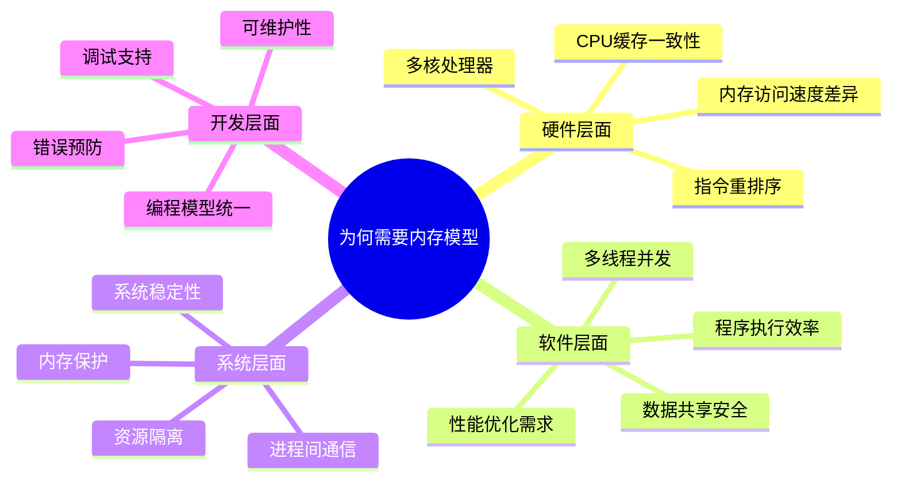

### 1.2 解决核心问题

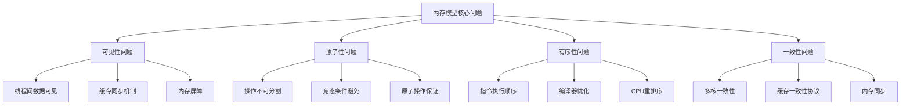

### 1.3 没有内存模型场景

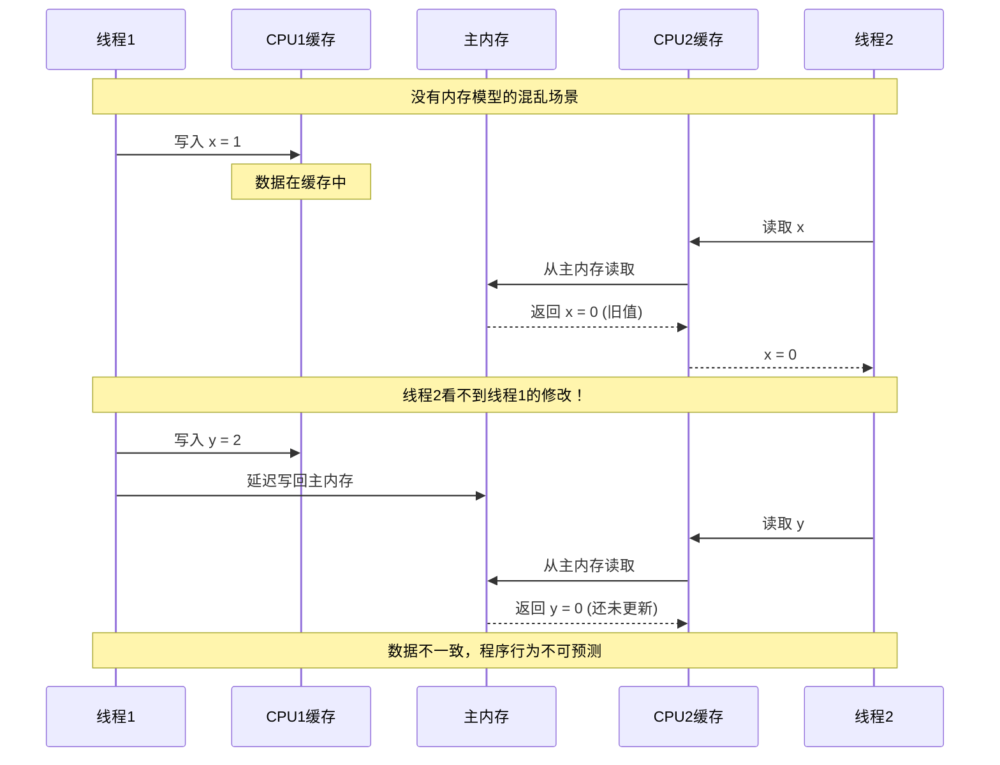

## 02.内存模型概念

### 2.1 内存模型架构

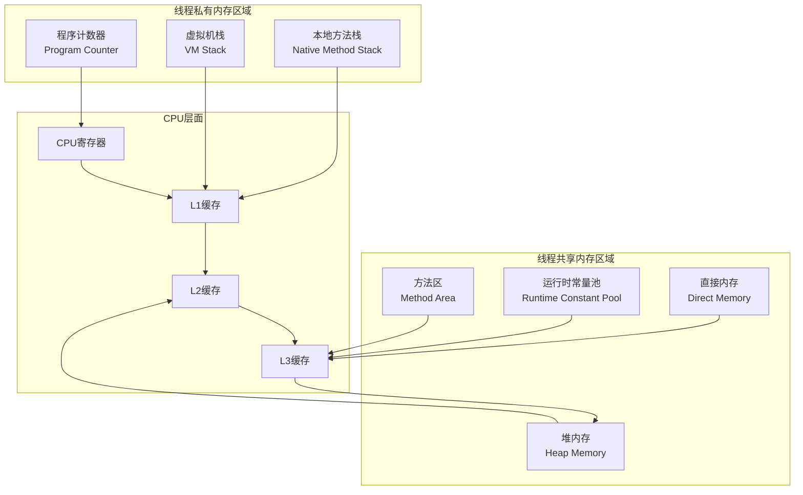

### 2.2 线程私有和共享

| 特性 | 线程私有内存 | 线程共享内存 |
|------|-------------|-------------|
| **访问权限** | 仅当前线程可访问 | 所有线程都可访问 |
| **生命周期** | 与线程同生共死 | 与进程同生共死 |
| **数据安全** | 天然线程安全 | 需要同步机制 |
| **性能** | 访问速度快 | 可能存在竞争 |
| **内存大小** | 相对较小 | 相对较大 |
| **典型用途** | 方法调用、局部变量 | 对象实例、类信息 |

### 2.3 内存层次结构

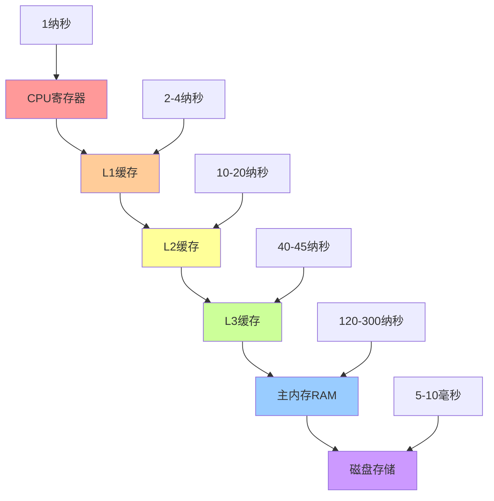

## 03.线程私有内存

### 3.1 程序计数器

#### 程序计数器设计原理

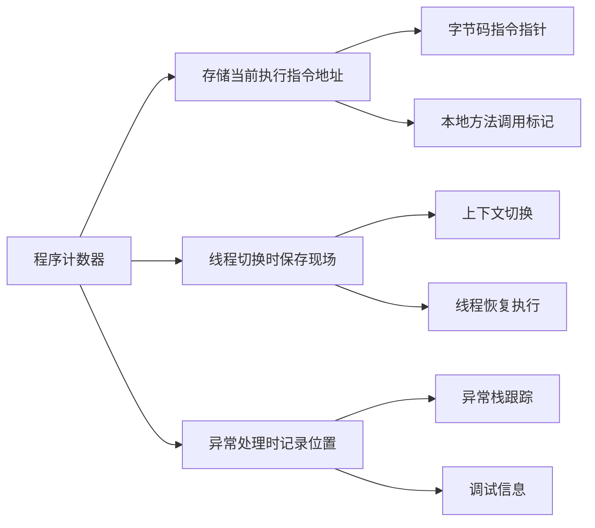

#### 实际场景案例

```java
// Java 示例：程序计数器的作用
public class PCExample {
    public static void main(String[] args) {
        int a = 1;           // PC指向这条指令
        int b = 2;           // PC移动到这条指令
        int c = add(a, b);   // PC指向方法调用指令
        System.out.println(c); // PC指向输出指令
    }
    
    public static int add(int x, int y) {
        return x + y;        // PC在方法内部移动
    }
}
```

#### 程序计数器实际场景案例时序图

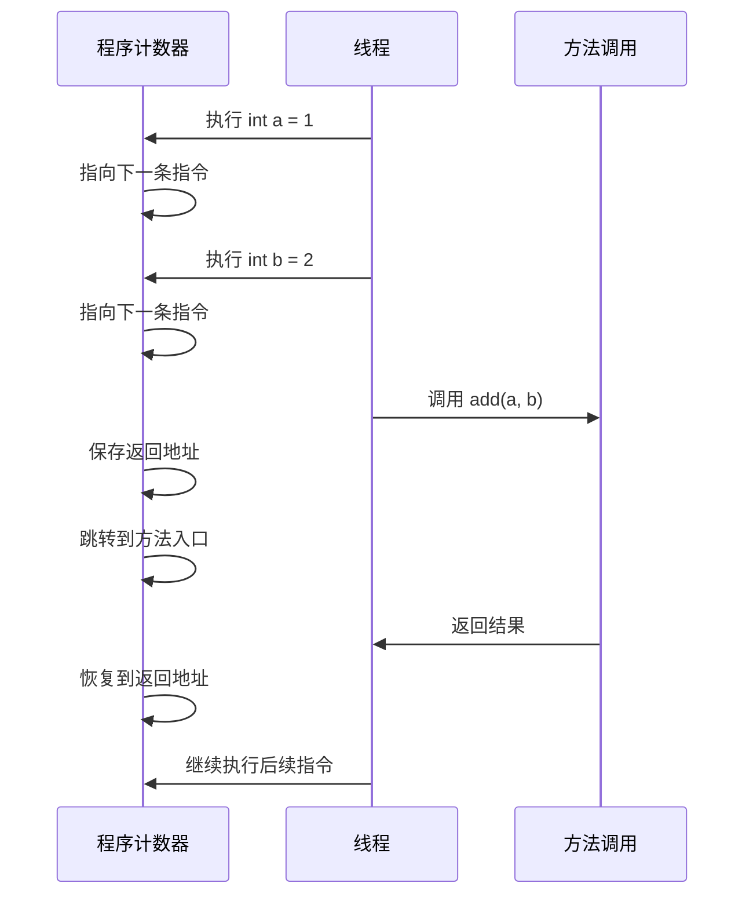

### 3.2 虚拟机栈

#### 栈帧结构

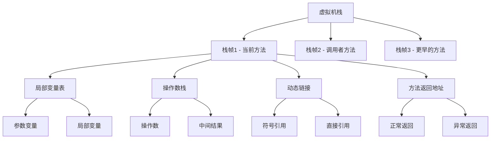

### 实际场景案例

```java
// 栈内存使用示例
public class StackExample {
    public void methodA() {
        int localVar = 10;    // 存储在栈帧的局部变量表
        String str = "Hello"; // 引用存储在栈，对象在堆
        methodB(localVar);    // 创建新栈帧
    } // 栈帧销毁，局部变量消失
    
    public void methodB(int param) {
        int[] array = new int[5]; // 引用在栈，数组对象在堆
        for (int i = 0; i < 5; i++) {
            array[i] = i * param; // 操作数栈参与计算
        }
    } // 栈帧销毁
}
```

#### 栈内存变化过程

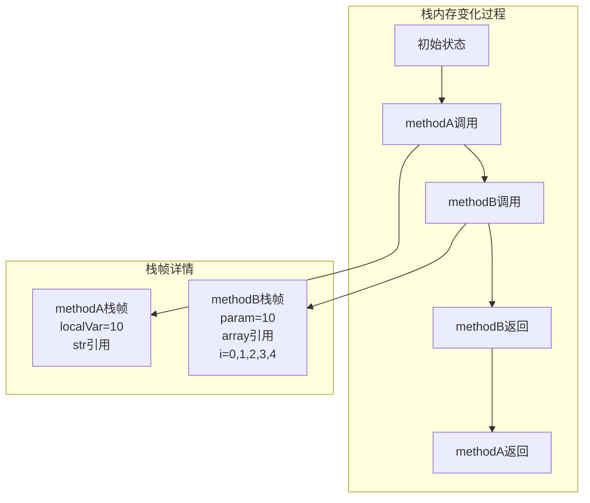

### 3.3 本地方法栈

#### 设计目的

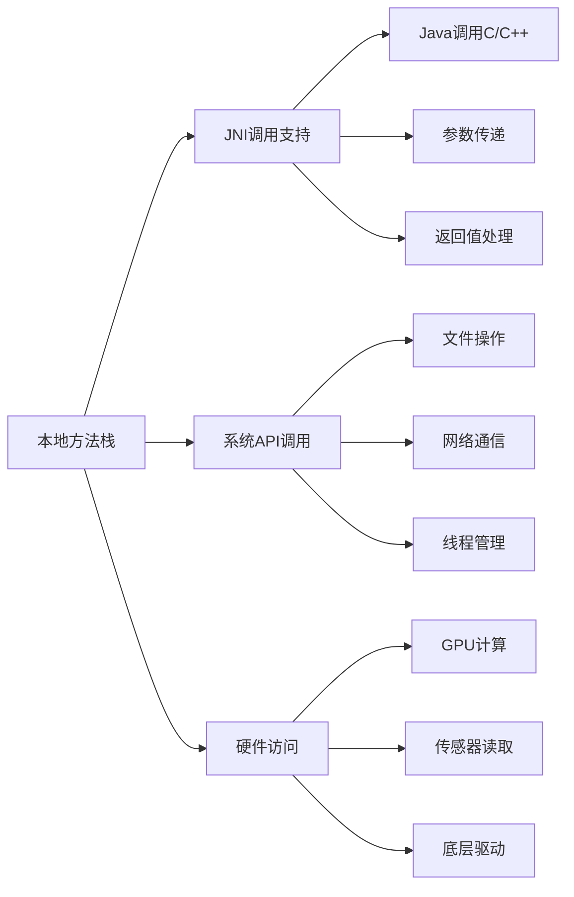

#### 实际场景案例

```java
// JNI本地方法调用示例
public class NativeExample {
    // 声明本地方法
    public native int calculateHash(String input);
    public native void processImage(byte[] imageData);
    
    static {
        // 加载本地库
        System.loadLibrary("nativelib");
    }
    
    public void useNativeMethod() {
        String data = "Hello World";
        // 调用本地方法，使用本地方法栈
        int hash = calculateHash(data);
        System.out.println("Hash: " + hash);
    }
}
```

然后通过GNI调用c代码

```c
// C语言实现的本地方法
#include <jni.h>
#include <string.h>

JNIEXPORT jint JNICALL 
Java_NativeExample_calculateHash(JNIEnv *env, jobject obj, jstring input) {
    // 本地方法栈中的局部变量
    const char *str = (*env)->GetStringUTFChars(env, input, 0);
    int hash = 0;
    
    // 在本地方法栈中执行计算
    for (int i = 0; i < strlen(str); i++) {
        hash = hash * 31 + str[i];
    }
    
    (*env)->ReleaseStringUTFChars(env, input, str);
    return hash;
}
```

#### 实际场景案例时序图

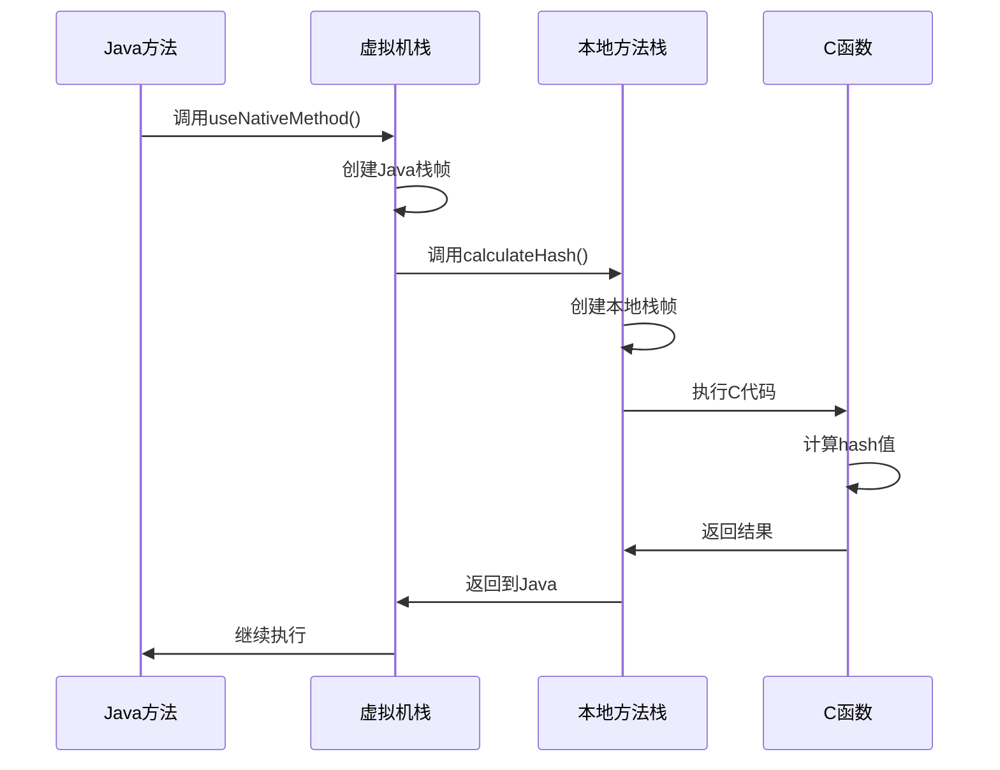

## 04.线程共享内存

### 4.1 堆内存


#### 堆内存分代结构

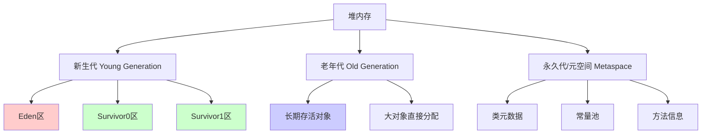

#### 实际场景案例

```java
// 堆内存使用示例
public class HeapExample {
    private static List<String> staticList = new ArrayList<>(); // 在堆中
    
    public void createObjects() {
        // 所有对象都在堆内存中创建
        String str = new String("Hello");     // 在堆中
        StringBuilder sb = new StringBuilder(); // 在堆中
        int[] array = new int[1000];          // 在堆中
        
        // 对象引用在栈中，对象实例在堆中
        Person person = new Person("张三", 25);
        
        // 集合对象在堆中，元素也在堆中
        List<Person> persons = new ArrayList<>();
        persons.add(person);
        
        // 大对象可能直接进入老年代
        byte[] bigArray = new byte[1024 * 1024]; // 1MB
    }
    
    static class Person {
        private String name;  // 引用在堆中，字符串对象也在堆中
        private int age;      // 基本类型值在堆中（作为对象的字段）
        
        public Person(String name, int age) {
            this.name = name;
            this.age = age;
        }
    }
}
```

#### 垃圾回收过程

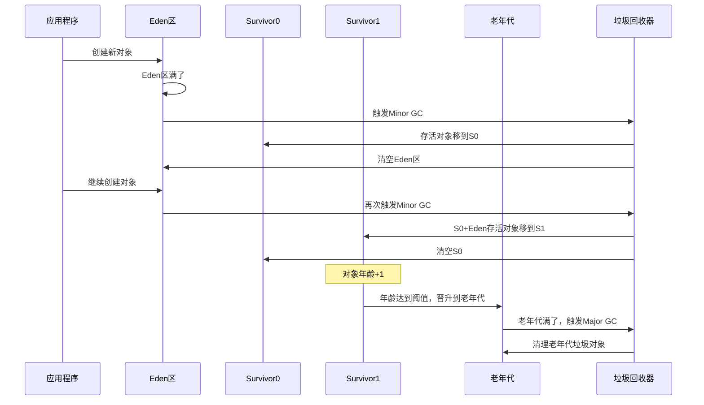

### 4.2 方法区

#### 方法区内容

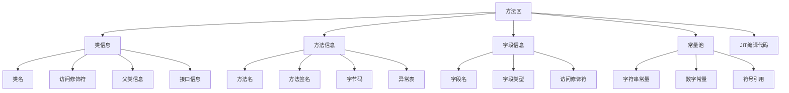

#### 实际场景案例

```java
// 方法区存储示例
public class MethodAreaExample {
    // 类信息存储在方法区
    private static final String CONSTANT = "常量"; // 常量池
    private static int staticVar = 100;            // 静态变量在堆中，引用在方法区
    
    private String instanceVar;                    // 字段信息在方法区
    
    // 方法信息存储在方法区
    public void instanceMethod() {
        String localStr = "局部字符串"; // 字符串字面量在常量池
        System.out.println(localStr);
    }
    
    public static void staticMethod() {
        // 静态方法信息在方法区
        Class<?> clazz = MethodAreaExample.class; // 类对象在堆中
        String className = clazz.getName();       // 反射获取类信息
    }
}

// 类加载过程
class ClassLoadingExample {
    static {
        System.out.println("类初始化"); // 类信息加载到方法区时执行
    }
    
    public static void triggerClassLoading() {
        // 首次使用类时，类信息加载到方法区
        ClassLoadingExample example = new ClassLoadingExample();
    }
}
```

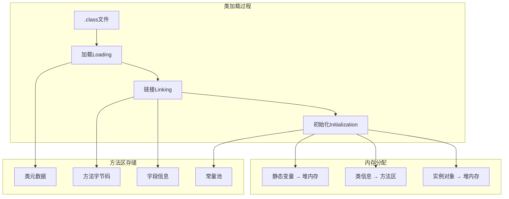

### 4.3 运行时常量池


### 4.4 直接内存


