# 内存模型技术设计
#### 目录介绍
- 01.内存模型由来
  - 1.1 内存模型根源
  - 1.2 演进历史
  - 1.3 解决核心问题
  - 1.4 无内存模型
- 02.内存模型概念
  - 2.1 内存模型架构
  - 2.2 各语言设计
  - 2.3 私有和共享
  - 2.4 内存模型结构
- 03.私有内存
  - 3.1 程序计数器
  - 3.2 虚拟机栈
  - 3.3 本地方法栈
- 04.共享内存
  - 4.1 堆内存
  - 4.2 方法区
  - 4.3 运行时常量池
  - 4.4 直接内存
- 05.通用案例教学
  - 5.1 完整内存案例
  - 5.2 案例内存分布
  - 5.3 内存链路
  - 5.4 内存生命周期
- 06.跨平台内存模型
  - 6.1 Java平台
  - 6.2 C++平台
  - 6.3 JavaScript
  - 6.4 Go平台
  - 6.5 Rust平台
  - 6.6 内存模型对比表


## 01.内存模型由来

### 1.1 内存模型根源

一切源于冯·诺依曼架构的核心思想：**程序和数据统一存储在内存中**。

```
┌─────────┐     ┌─────────┐     ┌─────────┐
│  CPU    │◄───►│  内存    │◄───►│  I/O    │
│(运算器) │     │(存储器)  │     │(输入输出)│
│(控制器) │     │         │     │         │
└─────────┘     └─────────┘     └─────────┘
```

但原始的"一块平坦内存"无法满足实际需求：

- **代码**需要存储在某个区域
- **函数调用**需要保存返回地址、局部变量
- **动态创建的对象**需要一个可伸缩的空间
- **多线程**需要隔离各自的执行上下文

于是操作系统和语言运行时将这块平坦内存**划分为功能不同的区域**，这就是运行时内存模型的起源。

**从操作系统进程内存布局到语言运行时**，操作系统层面（以 Linux 为例）：

```
高地址 ─────────────────────────
        │     内核空间          │  ← 用户态不可访问
        ├──────────────────────┤  0xC0000000 (32位)
        │     栈 (Stack)       │  ↓ 向低地址增长
        │        ↓             │
        │     ...空闲...        │
        │        ↑             │
        │     堆 (Heap)        │  ↑ 向高地址增长
        ├──────────────────────┤
        │     BSS段            │  ← 未初始化的全局/静态变量
        ├──────────────────────┤
        │     数据段 (Data)     │  ← 已初始化的全局/静态变量
        ├──────────────────────┤
        │     代码段 (Text)     │  ← 可执行指令（只读）
低地址 ─────────────────────────  0x00000000
```

**语言运行时在此基础上进一步细分**。每种语言根据自身特性（GC、类型系统、执行方式），在操作系统提供的进程地址空间上构建了更精细的内存区域划分。

### 1.2 演进历史

各语言内存模型的演进

```
时间线：
1972  C语言    → 栈 + 堆 + 数据段 + 代码段（贴近OS原生布局）
1983  C++     → 在C基础上增加虚函数表、RTTI区域
1995  Java    → JVM 完全抽象化：堆、方法区、虚拟机栈、PC等
1995  JS      → 单线程简化模型：调用栈 + 堆 + 任务队列
2010  Go      → 协程栈（动态增长）+ GC堆 + 逃逸分析
```

### 1.3 解决核心问题

核心：不同生命周期、不同访问模式的数据需要不同的存储策略

| 数据特征 | 需要的存储特性 | 对应的内存区域 |
|---------|-------------|-------------|
| 执行指令（代码） | 只读、共享、常驻 | 代码段 / 方法区 |
| 函数局部变量 | 随函数调用创建、返回销毁 | 栈 |
| 动态创建的对象 | 生命周期不确定、大小不固定 | 堆 |
| 类信息、常量 | 全局共享、生命周期长 | 方法区 / 常量池 |
| 线程执行位置 | 每线程独立、频繁更新 | 程序计数器 |
| Native 方法调用 | JNI / 系统调用的栈帧 | 本地方法栈 |
| 大块直接 I/O 缓冲 | 绕过GC、零拷贝 | 直接内存 |


**（1）生命周期管理**

```
栈：自动管理，函数返回即回收（O(1) 分配和释放）
堆：需要 GC 或手动 free（分配和回收都是复杂操作）

为什么不把所有数据都放栈上？
→ 栈大小固定（通常1-8MB），无法存储大对象
→ 栈帧随函数返回销毁，无法持有跨函数生命周期的对象
→ 栈不支持动态大小的数据结构
```

**（2）线程安全隔离**

```
私有区域（栈、PC、本地方法栈）：天然线程安全，无需同步
共享区域（堆、方法区）：需要同步机制保护

设计原则：尽可能让数据私有，减少共享
```

**（3）性能优化**

```
栈分配：移动栈指针即可，极快（1条指令）
堆分配：需要搜索空闲块、处理碎片、可能触发GC（数百条指令）
直接内存：绕过JVM堆，避免GC和数据拷贝
```

**（4）内存效率**

```
常量池：字符串去重，"hello" 只存一份
方法区：类信息只加载一次，所有实例共享
栈：固定大小，不存在碎片问题
```

**（5）安全边界**

```
代码段只读 → 防止代码被篡改
栈溢出检测 → StackOverflowError
堆上限控制 → OutOfMemoryError
权限隔离 → 不同类加载器的方法区隔离
```

### 1.4 无内存模型

如果没有内存模型会怎么样？思考一下

**场景一：所有数据都在一块平坦内存中**

```
地址0: [代码指令] [局部变量a] [对象X] [字符串常量] [局部变量b] [对象Y] ...

问题：
1. 函数返回后，局部变量散落在内存各处 → 无法高效回收
2. 多线程访问 → 局部变量也需要加锁（本不需要）
3. 代码和数据混在一起 → 安全漏洞（缓冲区溢出攻击可修改代码）
4. 无法区分哪些该GC、哪些不该GC
```

**场景二：假设没有栈的概念会怎么样**

```c
// 递归函数：每次调用需要保存自己的局部变量和返回地址
int factorial(int n) {
    if (n <= 1) return 1;
    return n * factorial(n - 1);
}

// 没有栈 → 局部变量存在哪？
// 方案1: 全局变量 → 递归调用覆盖上一层的n → 错误
// 方案2: 手动在堆上分配 → 每次调用都要malloc/free → 极慢
// 栈的设计：自动、嵌套、后进先出 → 完美匹配函数调用语义
```

场景三：假设没有堆的概念会怎么样

```c
// 创建一个链表节点，需要在函数返回后继续存活
Node* create_node(int val) {
    Node n;        // 栈上分配
    n.val = val;
    return &n;     // 函数返回后栈帧销毁 → 悬空指针！
}

// 没有堆 → 无法创建生命周期超出函数的对象
// 所有对象都得是全局的 → 数量受限，不灵活
```

场景四：假设没有方法区 / 常量池会怎么样

```java
// 10000个String对象都包含 "hello"
for (int i = 0; i < 10000; i++) {
    String s = "hello";  // 没有常量池 → 每次创建新的字符串对象
}

// 没有常量池：10000 份 "hello" 副本，浪费 ~50KB
// 有常量池：  1份 "hello"，10000个引用指向同一份，节约 99.99%
```

## 02.内存模型概念

### 2.1 内存模型架构

设计哲学：按生命周期和访问模式分治

```
                    ┌───────────────────────────────┐
                    │        运行时内存区域           │
                    └───────────┬───────────────────┘
                                │
              ┌─────────────────┼─────────────────┐
              ▼                 ▼                 ▼
        ┌───────────┐   ┌───────────┐    ┌──────────────┐
        │ 线程私有   │   │ 线程共享   │    │ JVM外部内存   │
        │           │   │           │    │              │
        │ - PC      │   │ - 堆      │    │ - 直接内存    │
        │ - 虚拟机栈 │   │ - 方法区  │    │ (NIO Buffer) │
        │ - 本地方法栈│   │ - 常量池  │    │              │
        └───────────┘   └───────────┘    └──────────────┘
        
        生命周期：      生命周期：        生命周期：
        随线程          随JVM进程         手动/Cleaner
        
        分配速度：      分配速度：        分配速度：
        极快(移栈指针)   较慢(GC管理)      中等(OS调用)
        
        线程安全：      线程安全：        线程安全：
        天然安全        需要同步          需要同步
```

### 2.2 各语言设计

内存模型的整体设计，各语言的设计对比

**C/C++（贴近OS原生）**

```
┌─────────────────────────────────┐
│          C/C++ 内存布局          │
├────────┬────────────────────────┤
│ 代码段  │ 编译后的机器指令（只读）  │
├────────┼────────────────────────┤
│ 数据段  │ 已初始化的全局/静态变量   │
├────────┼────────────────────────┤
│ BSS段  │ 未初始化的全局/静态变量   │
├────────┼────────────────────────┤
│ 堆     │ malloc/new 手动管理     │
├────────┼────────────────────────┤
│ 栈     │ 局部变量、函数调用帧     │
└────────┴────────────────────────┘

特点：
- 没有GC，程序员完全控制堆内存
- 没有方法区，虚函数表在数据段
- 没有常量池抽象，字符串字面量在只读数据段(.rodata)
- 栈大小编译期/链接期确定
```

**Java（JVM 全面抽象）**

```
┌─────────────────────────────────┐
│         JVM 内存区域             │
├────────┬────────────────────────┤
│ PC     │ 当前执行的字节码地址     │
├────────┼────────────────────────┤
│ 虚拟机栈│ 栈帧(局部变量表+操作数栈+│
│        │ 动态链接+返回地址)       │
├────────┼────────────────────────┤
│ 本地方法栈│ JNI 调用的 native 栈  │
├────────┼────────────────────────┤
│ 堆     │ 所有对象实例+数组(GC管理)│
├────────┼────────────────────────┤
│ 方法区  │ 类信息+常量池+静态变量   │
│(元空间) │ +JIT编译代码            │
├────────┼────────────────────────┤
│ 直接内存│ NIO DirectByteBuffer   │
└────────┴────────────────────────┘
```

**JavaScript（V8引擎）**

```
┌─────────────────────────────────┐
│         V8 内存布局              │
├────────┬────────────────────────┤
│ 调用栈  │ 执行上下文、基本类型值   │
├────────┼────────────────────────┤
│ 堆     │ 对象、闭包、函数        │
│ ├ 新生代│ 短生命周期对象(Scavenge)│
│ ├ 老生代│ 长生命周期对象(Mark-Sweep│
│ │      │ /Mark-Compact)         │
│ └ 大对象│ >kMaxRegularHeapObject │
├────────┼────────────────────────┤
│ 任务队列│ 宏任务+微任务(事件循环)  │
└────────┴────────────────────────┘

特点：
- 单线程，无线程私有/共享的区分（Worker除外）
- 闭包导致变量"逃逸"到堆上
- 隐藏类（Hidden Class）类似方法区的类信息
```

### 2.3 私有和共享

线程私有和共享有什么区别，如下所示：

| 特性 | 线程私有内存 | 线程共享内存 |
|------|-------------|-------------|
| **访问权限** | 仅当前线程可访问 | 所有线程都可访问 |
| **生命周期** | 与线程同生共死 | 与进程同生共死 |
| **数据安全** | 天然线程安全 | 需要同步机制 |
| **性能** | 访问速度快 | 可能存在竞争 |
| **内存大小** | 相对较小 | 相对较大 |
| **典型用途** | 方法调用、局部变量 | 对象实例、类信息 |

### 2.4 内存模型结构

内存模型结构（以 JVM 为核心深入），JVM 运行时数据区全景

```
┌─────────────────────────────────────────────────────────────┐
│                        JVM 进程                              │
│                                                              │
│  ┌─── 线程私有 ──────────────────────────────────────────┐   │
│  │                                                       │   │
│  │  Thread-1          Thread-2          Thread-N         │   │
│  │  ┌──────────┐      ┌──────────┐      ┌──────────┐   │   │
│  │  │ PC: 0x3A │      │ PC: 0x7F │      │ PC: 0x12 │   │   │
│  │  ├──────────┤      ├──────────┤      ├──────────┤   │   │
│  │  │ VM Stack │      │ VM Stack │      │ VM Stack │   │   │
│  │  │ ┌──────┐ │      │ ┌──────┐ │      │ ┌──────┐ │   │   │
│  │  │ │Frame3│ │      │ │Frame1│ │      │ │Frame2│ │   │   │
│  │  │ │Frame2│ │      │ │      │ │      │ │Frame1│ │   │   │
│  │  │ │Frame1│ │      │ └──────┘ │      │ └──────┘ │   │   │
│  │  │ └──────┘ │      │          │      │          │   │   │
│  │  ├──────────┤      ├──────────┤      ├──────────┤   │   │
│  │  │Native Stk│      │Native Stk│      │Native Stk│   │   │
│  │  └──────────┘      └──────────┘      └──────────┘   │   │
│  │                                                       │   │
│  └───────────────────────────────────────────────────────┘   │
│                                                              │
│  ┌─── 线程共享 ──────────────────────────────────────────┐   │
│  │                                                       │   │
│  │  ┌─────────────────────────────────────────────────┐ │   │
│  │  │                    堆 (Heap)                     │ │   │
│  │  │                                                  │ │   │
│  │  │  ┌──────────────┐  ┌───────────────────────────┐│ │   │
│  │  │  │   年轻代      │  │         老年代             ││ │   │
│  │  │  │ ┌────┬───┬───┐│  │                           ││ │   │
│  │  │  │ │Eden│S0 │S1 ││  │  长生命周期对象/大对象     ││ │   │
│  │  │  │ └────┴───┴───┘│  │                           ││ │   │
│  │  │  └──────────────┘  └───────────────────────────┘│ │   │
│  │  └─────────────────────────────────────────────────┘ │   │
│  │                                                       │   │
│  │  ┌─────────────────────────────────────────────────┐ │   │
│  │  │              方法区 / 元空间 (Metaspace)          │ │   │
│  │  │  类信息 | 运行时常量池 | 静态变量 | JIT代码缓存    │ │   │
│  │  └─────────────────────────────────────────────────┘ │   │
│  │                                                       │   │
│  └───────────────────────────────────────────────────────┘   │
│                                                              │
│  ┌─── JVM 外部 ──────────────────────────────────────────┐   │
│  │  直接内存 (Direct Memory)                              │   │
│  │  由 OS 管理，NIO 零拷贝，不受 GC 直接管理               │   │
│  └───────────────────────────────────────────────────────┘   │
│                                                              │
└──────────────────────────────────────────────────────────────┘
```

每个区域的容量与溢出

| 区域 | 默认大小 | JVM参数 | 溢出异常 |
|------|---------|---------|---------|
| 虚拟机栈 | 512K-1M | `-Xss` | StackOverflowError |
| 堆 | 物理内存1/4 | `-Xms` `-Xmx` | OutOfMemoryError: Java heap space |
| 方法区 | 无上限(本地内存) | `-XX:MaxMetaspaceSize` | OutOfMemoryError: Metaspace |
| 直接内存 | 与-Xmx相同 | `-XX:MaxDirectMemorySize` | OutOfMemoryError: Direct buffer memory |
| PC | 很小(字长) | 不可配 | 不会溢出 |


## 03.私有内存

### 3.1 程序计数器

**程序计数器 本质**：当前线程所执行的字节码指令的地址。

**为何设计私有**：虚拟机的多线程就是通过线程轮流切换并分配处理器时间来实现的，为了线程切换后能恢复到正确的位置，每条线程都需要一个独立的程序计数器，互不影响，该区域为“线程私有”。

**生命周期**：随着线程的创建而创建，随着线程的结束而销毁。

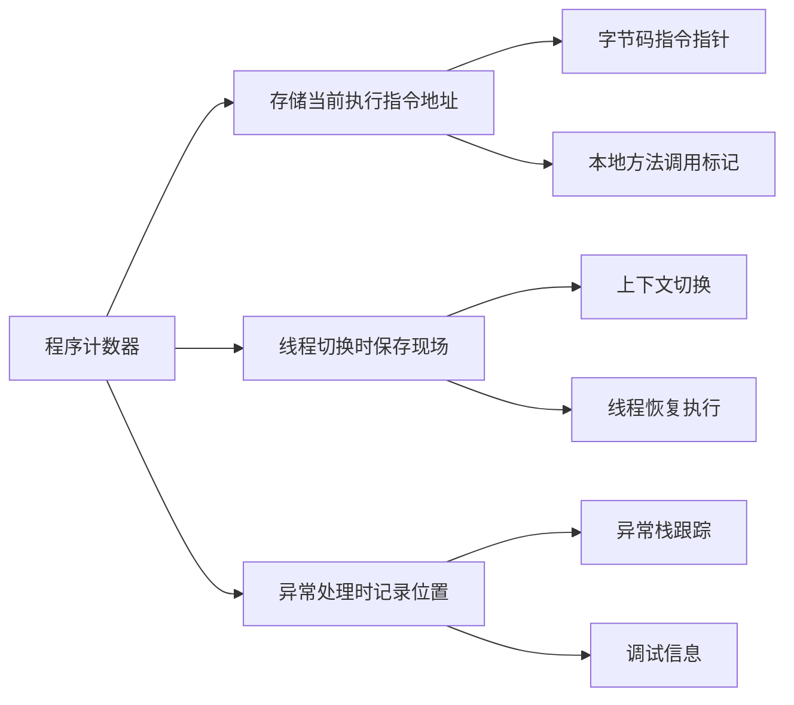

程序计数器是一块较小的内存空间。可以看作是当前线程所执行的字节码的行号指示器。**字节码解释器工作时通过改变这个计数器的值来选取下一条需要执行的字节码指令，分支、循环、跳转、异常处理、线程恢复等功能都需要依赖这个计数器来完。**

为什么每个线程需要独立的程序计数器？

```
CPU时间片轮转：
时刻T1: Thread-1 执行到 method_a 第15条指令 → PC=15
时刻T2: 切换到 Thread-2 执行 method_b 第3条指令  → PC=3
时刻T3: 切回 Thread-1 → 从哪里继续？→ 从 PC=15 继续

如果PC是共享的：
时刻T3: PC=3（被Thread-2覆盖了）→ Thread-1 从错误位置执行 → 崩溃
```

底层实现：

```
// HotSpot VM 中的实现（简化）
class JavaThread {
    address _anchor_pc;           // 当前字节码地址
    // 执行Java方法时：指向字节码偏移量
    // 执行native方法时：为 undefined（不可用）
};

// 为什么native方法时PC无意义？
// 因为native方法由本地CPU直接执行，用的是硬件PC寄存器
// JVM的逻辑PC只追踪字节码执行位置
```

程序计数器实际场景案例

```java
// Java 示例：程序计数器的作用
public class PCExample {
    public static void main(String[] args) {
        int a = 1;           // PC指向这条指令
        int b = 2;           // PC移动到这条指令
        int c = add(a, b);   // PC指向方法调用指令
        System.out.println(c); // PC指向输出指令
    }
    
    public static int add(int x, int y) {
        return x + y;        // PC在方法内部移动
    }
}
```

然后看一下时序图如下所示：

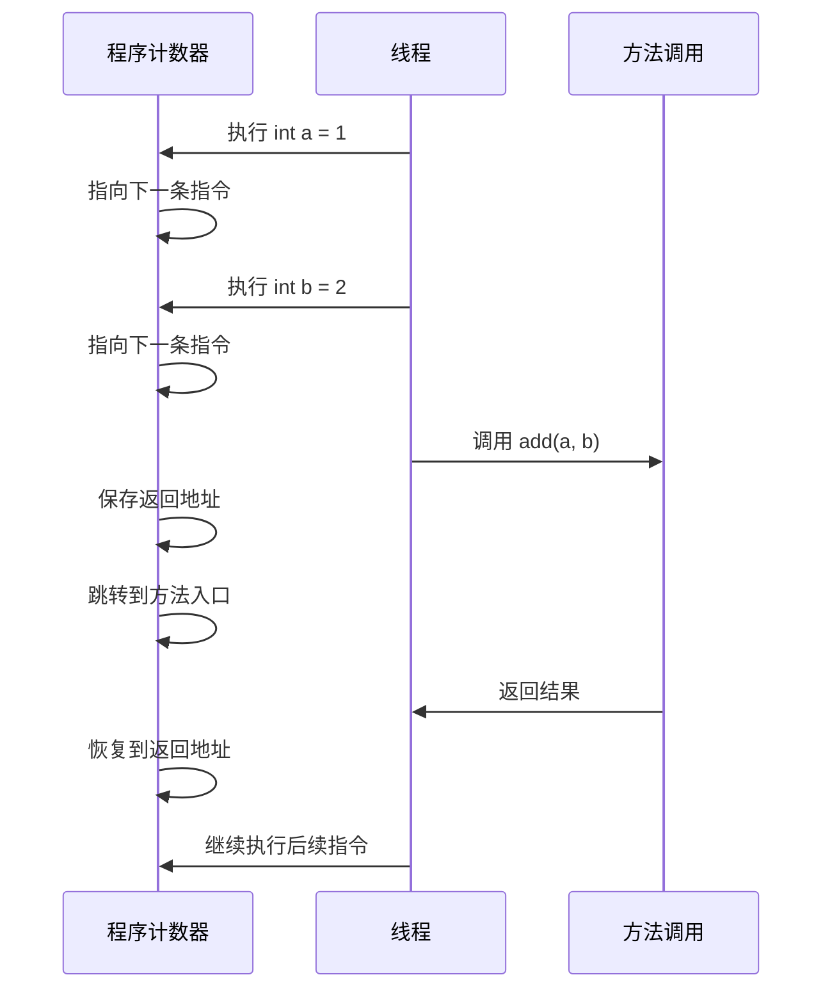

程序计数器主要有两个作用：

- 1.字节码解释器通过改变程序计数器来依次读取指令，从而实现代码的流程控制。如：顺序执行、选择、循环、异常处理。
- 2.在多线程的情况下，程序计数器用于记录当前线程执行的位置，从而当线程被切换回来的时候能够知道该线程上次运行到哪儿。

程序计数器会OOM吗。**注意：程序计数器是唯一一个不会出现OutOfMemoryError的内存区域，它的生命周期随着线程的创建而创建，随着线程的结束而死亡。**

### 3.2 虚拟机栈

**本质**：方法调用的执行模型。每个方法调用创建一个栈帧，用于存放该方法运行过程中的一些信息。

**虚拟机栈是由一个个栈帧组成**，而每个栈帧中都拥有：局部变量表、操作数栈、动态链接、方法出口信息。

**局部变量表**：放着基本数据类型(8种基本类型)，还有对象的引用（reference类型，它不同于对象本身，可能是一个指向对象起始地址的引用指针，也可能是指向一个代表对象的句柄或其他与此对象相关的位置）。

```
栈帧（Stack Frame）的内部结构：

┌─────────────────────────────────────┐  ← 栈顶（当前方法）
│            栈帧 Frame               │
│  ┌────────────────────────────────┐ │
│  │   局部变量表                    │ │
│  │   (Local Variable Table)       │ │
│  │   ┌────┬────┬────┬────┬────┐  │ │
│  │   │ 0  │ 1  │ 2  │ 3  │ 4 │  │ │
│  │   │this│arg1│arg2│var1│var2│  │ │
│  │   └────┴────┴────┴────┴────┘  │ │
│  │   Slot大小：32位(int/float/ref)│ │
│  │   long/double 占2个Slot        │ │
│  └────────────────────────────────┘ │
│  ┌────────────────────────────────┐ │
│  │   操作数栈                      │ │
│  │   (Operand Stack)              │ │
│  │   ┌────┐                       │ │
│  │   │ 42 │ ← 栈顶               │ │
│  │   ├────┤                       │ │
│  │   │ 10 │                       │ │
│  │   └────┘                       │ │
│  │   用于算术运算、方法传参          │ │
│  └────────────────────────────────┘ │
│  ┌────────────────────────────────┐ │
│  │   动态链接                      │ │
│  │   指向方法区中该方法的符号引用    │ │
│  │   运行时解析为直接引用           │ │
│  └────────────────────────────────┘ │
│  ┌────────────────────────────────┐ │
│  │   返回地址                      │ │
│  │   方法正常返回 → 调用者的PC值    │ │
│  │   异常退出 → 由异常表决定        │ │
│  └────────────────────────────────┘ │
└─────────────────────────────────────┘
```

栈帧结构如下所示：

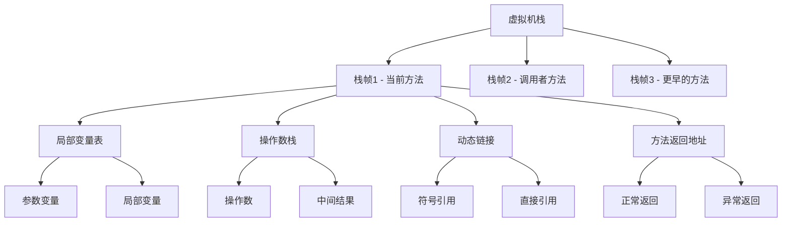

实际场景案例

```java
// 栈内存使用示例
public class StackExample {
    public void methodA() {
        int localVar = 10;    // 存储在栈帧的局部变量表
        String str = "Hello"; // 引用存储在栈，对象在堆
        methodB(localVar);    // 创建新栈帧
    } // 栈帧销毁，局部变量消失
    
    public void methodB(int param) {
        int[] array = new int[5]; // 引用在栈，数组对象在堆
        for (int i = 0; i < 5; i++) {
            array[i] = i * param; // 操作数栈参与计算
        }
    } // 栈帧销毁
}
```

栈内存变化过程

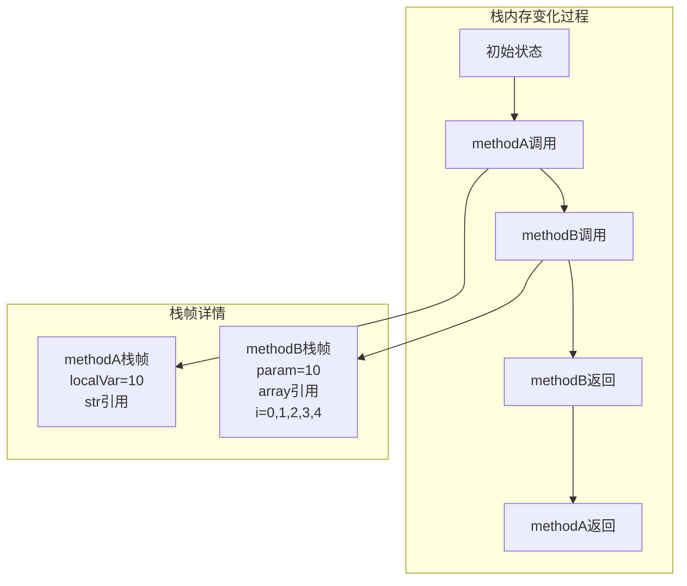

**栈帧的生命周期**：

```
调用链: main() → methodA() → methodB()

            ┌───────────┐
            │ methodB() │ ← 栈顶（当前执行）
            ├───────────┤
            │ methodA() │
            ├───────────┤
            │  main()   │ ← 栈底
            └───────────┘

methodB() 返回后：
            ┌───────────┐
            │ methodA() │ ← 栈顶（恢复执行）
            ├───────────┤
            │  main()   │
            └───────────┘

栈帧的创建和销毁就是移动栈指针，O(1) 操作，极快。
```

**Java 虚拟机栈会出现两种异常：StackOverFlowError 和 OutOfMemoryError。**

**StackOverFlowError：** 若Java虚拟机栈的内存大小不允许动态扩展，那么当线程请求栈的深度超过当前Java虚拟机栈的最大深度的时候，就抛出StackOverFlowError异常。

**OutOfMemoryError：** 若Java虚拟机栈的内存大小允许动态扩展，且当线程请求栈时内存用完了，无法再动态扩展了，此时抛出OutOfMemoryError异常。

**StackOverflowError 的触发**：

```
// 无限递归
void infinite() { infinite(); }

栈空间 (1MB):
┌──────────┐
│ frame N  │  ← 栈满，再压入一帧 → StackOverflowError
│ frame ..│
│ frame 2  │
│ frame 1  │
└──────────┘

每个栈帧大小取决于局部变量表和操作数栈的深度
通常一帧几十到几百字节
1MB栈空间大约可容纳数千到上万层调用
```

### 3.3 本地方法栈

Java代码 → JNI调用 → C/C++函数

```
虚拟机栈:                本地方法栈:
┌──────────────┐        ┌──────────────┐
│ Java method  │  ──→   │ native func  │
│ (字节码栈帧)  │   JNI  │ (C栈帧)      │
└──────────────┘        └──────────────┘

// 例: System.arraycopy() 是native方法
// Java栈帧 → JNI → C函数 jni_arraycopy → memcpy
// C函数的局部变量和调用链在本地方法栈中

HotSpot 实现中，虚拟机栈和本地方法栈合并为一个栈。
```

实际场景案例

```java
// JNI本地方法调用示例
public class NativeExample {
    // 声明本地方法
    public native int calculateHash(String input);
    public native void processImage(byte[] imageData);
    
    static {
        // 加载本地库
        System.loadLibrary("nativelib");
    }
    
    public void useNativeMethod() {
        String data = "Hello World";
        // 调用本地方法，使用本地方法栈
        int hash = calculateHash(data);
        System.out.println("Hash: " + hash);
    }
}
```

然后通过GNI调用c代码

```c
// C语言实现的本地方法
#include <jni.h>
#include <string.h>

JNIEXPORT jint JNICALL 
Java_NativeExample_calculateHash(JNIEnv *env, jobject obj, jstring input) {
    // 本地方法栈中的局部变量
    const char *str = (*env)->GetStringUTFChars(env, input, 0);
    int hash = 0;
    
    // 在本地方法栈中执行计算
    for (int i = 0; i < strlen(str); i++) {
        hash = hash * 31 + str[i];
    }
    
    (*env)->ReleaseStringUTFChars(env, input, str);
    return hash;
}
```

实际场景案例时序图

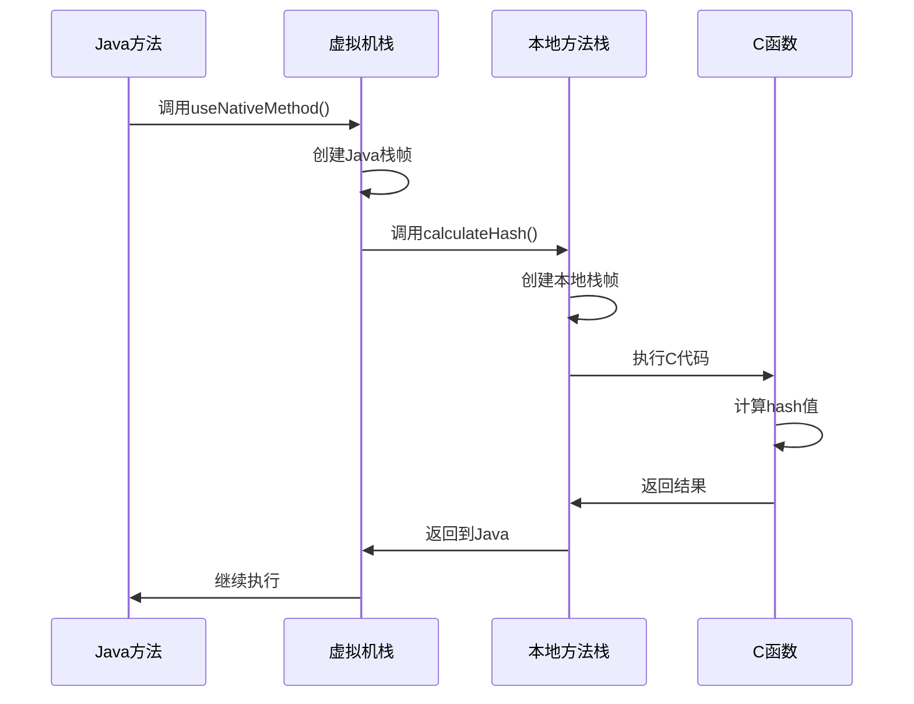

## 04.线程共享内存

### 4.1 堆内存

**本质**：所有对象实例和数组的唯一分配地（逃逸分析优化除外）。

**分代设计的底层原理**：

```
弱分代假说(Weak Generational Hypothesis)：
"绝大多数对象都是朝生暮死的"

统计数据表明：
- 约 95% 的对象在第一次 GC 时就已死亡
- 只有约 5% 的对象能存活到老年代

基于此假说的分代设计：

堆空间 (-Xmx)
┌──────────────────────────────────────────────────┐
│                                                    │
│  年轻代 (Young Generation) — 通常占堆的 1/3         │
│  ┌────────────────────┬──────────┬──────────┐      │
│  │       Eden         │    S0    │    S1    │      │
│  │    (伊甸园区)       │(Survivor)│(Survivor)│      │
│  │                    │          │          │      │
│  │  新对象在此分配      │  交替使用，存放年轻代  │      │
│  │  (TLAB快速分配)     │  GC幸存者              │      │
│  │                    │          │          │      │
│  │    比例 8          │    1     │    1     │      │
│  └────────────────────┴──────────┴──────────┘      │
│                                                    │
│  老年代 (Old Generation) — 通常占堆的 2/3            │
│  ┌──────────────────────────────────────────┐      │
│  │                                          │      │
│  │  长期存活的对象（经过多次Minor GC）         │      │
│  │  大对象直接分配                            │      │
│  │                                          │      │
│  └──────────────────────────────────────────┘      │
│                                                    │
└──────────────────────────────────────────────────────┘
```

**TLAB（Thread Local Allocation Buffer）**：

```
堆是共享的，但对象分配是高频操作。如果每次分配都加锁 → 性能灾难。

解决方案：TLAB — 堆中预先划给每个线程的一小块私有缓冲区

Eden 区:
┌──────────────────────────────────────┐
│  ┌──────┐ ┌──────┐ ┌──────┐         │
│  │TLAB-1│ │TLAB-2│ │TLAB-3│ 空闲... │
│  │(T1)  │ │(T2)  │ │(T3)  │         │
│  └──────┘ └──────┘ └──────┘         │
└──────────────────────────────────────┘

Thread-1 分配对象：
  在 TLAB-1 内移动指针即可 → 无锁、O(1)
  TLAB 用完 → 申请新的 TLAB（需要CAS同步）
  对象太大 → 直接在共享Eden区分配（需要CAS同步）

默认 TLAB 大小 ≈ Eden 的 1%
```

**对象在堆中的内存布局**：

```
┌─────────────────────────────────────────┐
│              对象头 (Object Header)       │
│  ┌───────────────────────────────────┐  │
│  │  Mark Word (8字节/64位JVM)         │  │
│  │  ┌─────────────────────────────┐  │  │
│  │  │ 哈希码 | 年龄 | 偏向锁 | 锁标志│  │  │
│  │  │ 25bit  | 4bit | 1bit | 2bit│  │  │
│  │  └─────────────────────────────┘  │  │
│  ├───────────────────────────────────┤  │
│  │  Klass Pointer (4/8字节)          │  │
│  │  → 指向方法区中的类元信息           │  │
│  ├───────────────────────────────────┤  │
│  │  数组长度 (4字节，仅数组对象)       │  │
│  └───────────────────────────────────┘  │
├─────────────────────────────────────────┤
│              实例数据 (Instance Data)     │
│  按字段声明顺序和对齐规则排列             │
│  父类字段在前，子类字段在后               │
├─────────────────────────────────────────┤
│              对齐填充 (Padding)           │
│  确保对象大小是 8 字节的整数倍            │
└─────────────────────────────────────────┘
```

实际场景案例

```java
// 堆内存使用示例
public class HeapExample {
    private static List<String> staticList = new ArrayList<>(); // 在堆中
    
    public void createObjects() {
        // 所有对象都在堆内存中创建
        String str = new String("Hello");     // 在堆中
        StringBuilder sb = new StringBuilder(); // 在堆中
        int[] array = new int[1000];          // 在堆中
        
        // 对象引用在栈中，对象实例在堆中
        Person person = new Person("张三", 25);
        
        // 集合对象在堆中，元素也在堆中
        List<Person> persons = new ArrayList<>();
        persons.add(person);
        
        // 大对象可能直接进入老年代
        byte[] bigArray = new byte[1024 * 1024]; // 1MB
    }
    
    static class Person {
        private String name;  // 引用在堆中，字符串对象也在堆中
        private int age;      // 基本类型值在堆中（作为对象的字段）
        
        public Person(String name, int age) {
            this.name = name;
            this.age = age;
        }
    }
}
```

垃圾回收过程

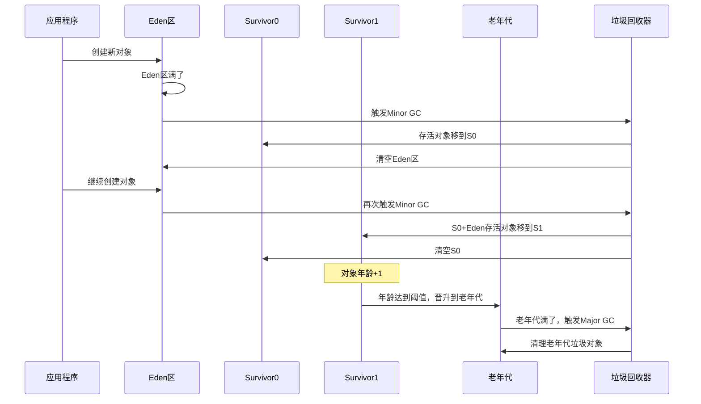

### 4.2 方法区


**本质**：存储已被JVM加载的类的结构信息。

```
Java 8 之前：方法区在 JVM 堆内（永久代 PermGen）
Java 8 之后：方法区移到本地内存（元空间 Metaspace）

原因：
- PermGen 大小固定，容易溢出（PermGen space OOM）
- 类卸载条件苛刻，PermGen 碎片严重
- Metaspace 使用本地内存，可以动态扩展
```

方法区存储内容：

```
┌─────────────────────────────────────────────┐
│              方法区 (Metaspace)               │
│                                              │
│  ┌──────────────────────────────────┐       │
│  │  类信息 (Class Metadata)          │       │
│  │  - 类名、修饰符、父类、接口列表     │       │
│  │  - 字段描述符列表                  │       │
│  │  - 方法描述符列表 + 字节码          │       │
│  │  - 虚方法表 (vtable)              │       │
│  └──────────────────────────────────┘       │
│                                              │
│  ┌──────────────────────────────────┐       │
│  │  运行时常量池                      │       │
│  │  (Runtime Constant Pool)         │       │
│  │  - 字面量：数值、字符串引用         │       │
│  │  - 符号引用 → 运行时解析为直接引用  │       │
│  │  - 方法句柄、调用点限定符           │       │
│  └──────────────────────────────────┘       │
│                                              │
│  ┌──────────────────────────────────┐       │
│  │  静态变量 (Java 7+ 移到堆中)       │       │
│  │  JIT 编译后的本地代码              │       │
│  └──────────────────────────────────┘       │
│                                              │
└──────────────────────────────────────────────┘
```


实际场景案例

```java
// 方法区存储示例
public class MethodAreaExample {
    // 类信息存储在方法区
    private static final String CONSTANT = "常量"; // 常量池
    private static int staticVar = 100;            // 静态变量在堆中，引用在方法区
    
    private String instanceVar;                    // 字段信息在方法区
    
    // 方法信息存储在方法区
    public void instanceMethod() {
        String localStr = "局部字符串"; // 字符串字面量在常量池
        System.out.println(localStr);
    }
    
    public static void staticMethod() {
        // 静态方法信息在方法区
        Class<?> clazz = MethodAreaExample.class; // 类对象在堆中
        String className = clazz.getName();       // 反射获取类信息
    }
}

// 类加载过程
class ClassLoadingExample {
    static {
        System.out.println("类初始化"); // 类信息加载到方法区时执行
    }
    
    public static void triggerClassLoading() {
        // 首次使用类时，类信息加载到方法区
        ClassLoadingExample example = new ClassLoadingExample();
    }
}
```

然后看一下方法区的流程图

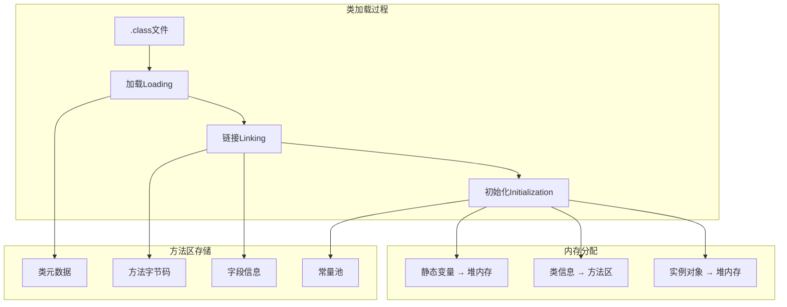

### 4.3 运行时常量池

常量池类型

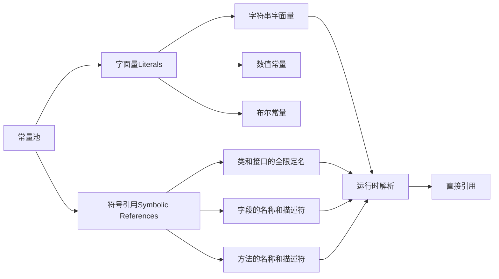

实际场景案例

```java
// 常量池使用示例
public class ConstantPoolExample {
    public static void stringPoolExample() {
        // 字符串字面量存储在字符串常量池
        String str1 = "Hello";           // 常量池中
        String str2 = "Hello";           // 复用常量池中的对象
        String str3 = new String("Hello"); // 堆中新建对象
        
        System.out.println(str1 == str2);    // true，同一个对象
        System.out.println(str1 == str3);    // false，不同对象
        System.out.println(str1.equals(str3)); // true，内容相同
        
        // intern()方法的使用
        String str4 = str3.intern();     // 返回常量池中的对象
        System.out.println(str1 == str4);    // true
    }
    
    public static void numericConstantExample() {
        // 数值常量在常量池中
        int a = 100;    // 小整数缓存
        int b = 100;    // 复用缓存
        
        Integer i1 = 100;  // 自动装箱，使用缓存
        Integer i2 = 100;  // 复用缓存
        Integer i3 = 200;  // 超出缓存范围，新建对象
        Integer i4 = 200;  // 新建对象
        
        System.out.println(i1 == i2);  // true，缓存对象
        System.out.println(i3 == i4);  // false，不同对象
    }
}
```

字符串常量池

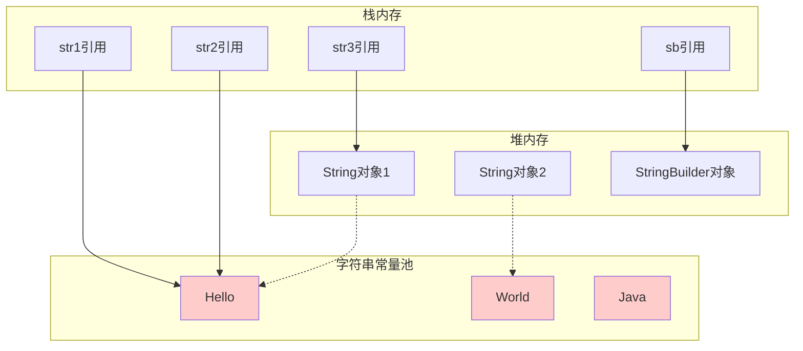

### 4.4 直接内存

```
传统 I/O 路径：
磁盘 → 内核缓冲区 → JVM堆缓冲区(byte[]) → 应用代码
                     ↑ 一次额外拷贝

NIO 直接内存路径：
磁盘 → 内核缓冲区 → 直接内存(DirectByteBuffer) → 应用代码
                     ↑ 零拷贝（映射同一块物理内存）

// 直接内存的分配
ByteBuffer buf = ByteBuffer.allocateDirect(1024);
// 底层调用 OS 的 malloc / mmap
// 不受 GC 管理，但有 Cleaner 机制回收

优点：减少一次内存拷贝，I/O密集场景性能显著提升
缺点：分配/释放比堆内存慢，不受GC直接管理
```

直接内存特点

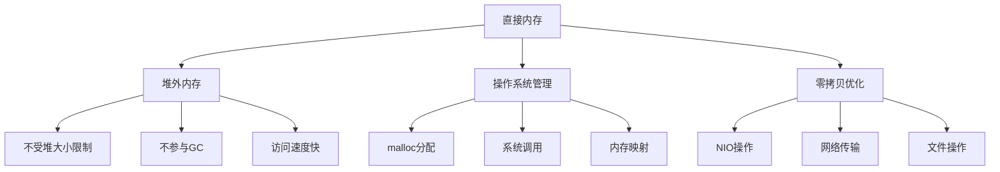

实际场景案例

```java
// 直接内存使用示例
import java.nio.ByteBuffer;
import java.nio.channels.FileChannel;
import java.io.RandomAccessFile;

public class DirectMemoryExample {
    
    public void directBufferExample() {
        // 分配直接内存
        ByteBuffer directBuffer = ByteBuffer.allocateDirect(1024 * 1024); // 1MB
        ByteBuffer heapBuffer = ByteBuffer.allocate(1024 * 1024);         // 堆内存
        
        // 直接内存的优势：零拷贝
        byte[] data = "Hello Direct Memory".getBytes();
        directBuffer.put(data);
        directBuffer.flip();
        
        // 读取数据
        byte[] result = new byte[data.length];
        directBuffer.get(result);
        
        System.out.println(new String(result));
    }
    
    public void fileChannelExample() throws Exception {
        RandomAccessFile file = new RandomAccessFile("test.txt", "rw");
        FileChannel channel = file.getChannel();
        
        // 使用直接内存进行文件操作
        ByteBuffer buffer = ByteBuffer.allocateDirect(1024);
        
        // 零拷贝读取文件
        int bytesRead = channel.read(buffer);
        buffer.flip();
        
        // 零拷贝写入文件
        channel.write(buffer);
        
        channel.close();
        file.close();
    }
    
    // 内存映射文件示例
    public void memoryMappedFileExample() throws Exception {
        RandomAccessFile file = new RandomAccessFile("large_file.dat", "rw");
        FileChannel channel = file.getChannel();
        
        // 内存映射，使用直接内存
        long fileSize = 1024 * 1024 * 100; // 100MB
        var mappedBuffer = channel.map(
            FileChannel.MapMode.READ_WRITE, 0, fileSize
        );
        
        // 直接操作内存映射区域
        mappedBuffer.put(0, (byte) 'A');
        byte value = mappedBuffer.get(0);
        
        channel.close();
        file.close();
    }
}
```

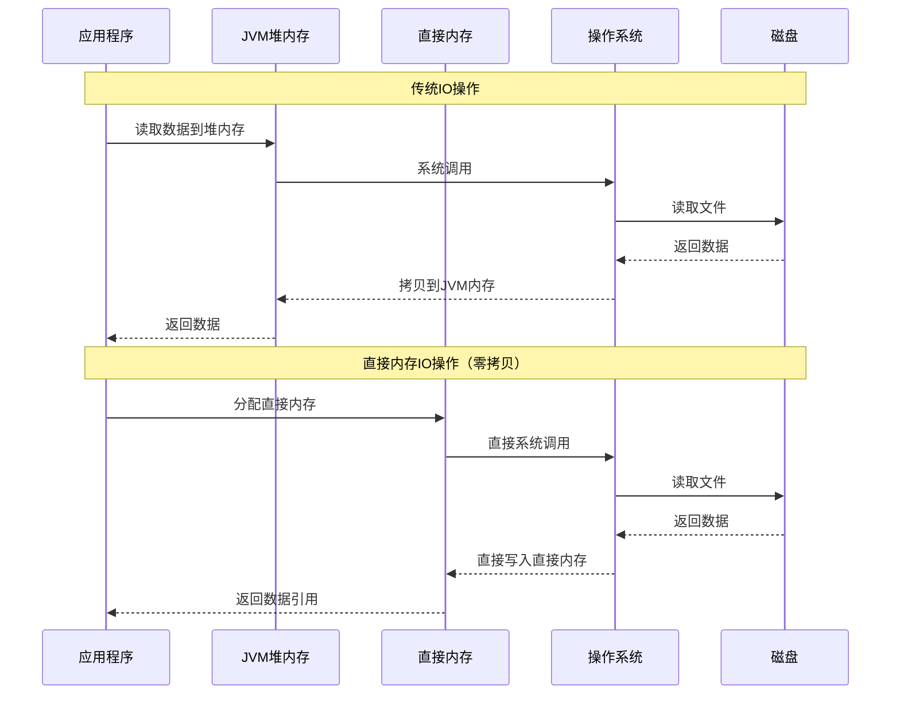


## 05.通用案例教学

### 5.1 完整内存案例

完整案例：一段 Java 代码在内存中的全景

```java
public class MemoryLayoutDemo {
    
    // ① 静态变量 → 堆（Java 7+）/ 方法区（Java 6）
    private static int instanceCount = 0;
    
    // ② 常量 → 方法区的运行时常量池
    private static final String PREFIX = "User-";
    
    // ③ 实例字段 → 随对象分配在堆上
    private String name;
    private int age;
    
    public MemoryLayoutDemo(String name, int age) {
        this.name = name;
        this.age = age;
        instanceCount++;
    }
    
    public String getInfo() {
        // ④ 局部变量 → 虚拟机栈的栈帧中
        String info = PREFIX + name + ":" + age;
        return info;
    }
    
    public static void main(String[] args) {
        // ⑤ 局部变量 user → 栈帧，指向的对象 → 堆
        MemoryLayoutDemo user = new MemoryLayoutDemo("Alice", 30);
        String result = user.getInfo();
        System.out.println(result);
    }
}
```

### 5.2 案例内存分布

```
┌──────────────────────────────────────────────────────────────────┐
│                                                                  │
│  ┌─── 程序计数器 ──────────────────────────────────────────────┐ │
│  │  main线程 PC: → 指向当前正在执行的字节码指令地址              │ │
│  └────────────────────────────────────────────────────────────┘ │
│                                                                  │
│  ┌─── 虚拟机栈 (main线程) ─────────────────────────────────────┐ │
│  │                                                             │ │
│  │  当调用 user.getInfo() 时，栈的状态：                        │ │
│  │                                                             │ │
│  │  ┌──────────────────────────────────┐ ← 栈顶               │ │
│  │  │  getInfo() 栈帧                   │                      │ │
│  │  │  局部变量表:                       │                      │ │
│  │  │    slot 0: this → [堆中user对象]   │                      │ │
│  │  │    slot 1: info → [堆中String对象] │ ← ④                 │ │
│  │  │  操作数栈:                         │                      │ │
│  │  │    用于字符串拼接的中间值            │                      │ │
│  │  │  返回地址: → main()帧的某条指令     │                      │ │
│  │  ├──────────────────────────────────┤                      │ │
│  │  │  main() 栈帧                      │                      │ │
│  │  │  局部变量表:                       │                      │ │
│  │  │    slot 0: args → [堆中String[]]   │                      │ │
│  │  │    slot 1: user → [堆中Demo对象]   │ ← ⑤ 引用在栈上      │ │
│  │  │    slot 2: result → [堆中String]   │                      │ │
│  │  └──────────────────────────────────┘                      │ │
│  │                                                             │ │
│  └─────────────────────────────────────────────────────────────┘ │
│                                                                  │
│  ┌─── 堆 (Heap) ───────────────────────────────────────────────┐ │
│  │                                                             │ │
│  │  Eden区 (新创建的对象):                                      │ │
│  │                                                             │ │
│  │  ┌─────────────────────────────────┐                       │ │
│  │  │ MemoryLayoutDemo 实例 (user)     │ ← ③ new出来的对象     │ │
│  │  │ ┌───────────────────────────┐   │                       │ │
│  │  │ │ 对象头                     │   │                       │ │
│  │  │ │  Mark Word: hashcode|age=0│   │                       │ │
│  │  │ │  Klass Ptr → [方法区类信息]│   │                       │ │
│  │  │ ├───────────────────────────┤   │                       │ │
│  │  │ │ name: ref ──→ String"Alice"│   │                       │ │
│  │  │ │ age: 30                   │   │                       │ │
│  │  │ └───────────────────────────┘   │                       │ │
│  │  └─────────────────────────────────┘                       │ │
│  │                                                             │ │
│  │  ┌──────────────────────┐   ┌──────────────────────┐       │ │
│  │  │ String "Alice"       │   │ String "User-Alice:30"│       │ │
│  │  │ char[] → ['A','l'...]│   │ (getInfo()的返回值)   │       │ │
│  │  └──────────────────────┘   └──────────────────────┘       │ │
│  │                                                             │ │
│  │  字符串常量池 (堆内):                                        │ │
│  │  ┌────────────────────────────────┐                        │ │
│  │  │  "User-" → String对象          │ ← ② 编译期常量         │ │
│  │  │  ":"     → String对象          │                        │ │
│  │  └────────────────────────────────┘                        │ │
│  │                                                             │ │
│  │  静态变量 (堆内, Java 7+):                                  │ │
│  │  ┌────────────────────────────────┐                        │ │
│  │  │  instanceCount: 1              │ ← ①                   │ │
│  │  │  PREFIX: ref → 常量池"User-"   │ ← ②                   │ │
│  │  └────────────────────────────────┘                        │ │
│  │                                                             │ │
│  └─────────────────────────────────────────────────────────────┘ │
│                                                                  │
│  ┌─── 方法区 / 元空间 (Metaspace) ─────────────────────────────┐ │
│  │                                                             │ │
│  │  ┌───────────────────────────────────────┐                 │ │
│  │  │  Class: MemoryLayoutDemo               │                 │ │
│  │  │  ├─ 父类: Object                       │                 │ │
│  │  │  ├─ 字段: name(Ljava/lang/String;)     │                 │ │
│  │  │  │         age(I)                      │                 │ │
│  │  │  ├─ 方法: <init>(字节码)               │                 │ │
│  │  │  │         getInfo(字节码)              │                 │ │
│  │  │  │         main(字节码)                 │                 │ │
│  │  │  ├─ 虚方法表: [toString, hashCode, ...] │                 │ │
│  │  │  └─ 运行时常量池:                       │                 │ │
│  │  │       #1 = Utf8 "MemoryLayoutDemo"     │                 │ │
│  │  │       #2 = Utf8 "User-"                │                 │ │
│  │  │       #3 = Methodref Object.<init>     │                 │ │
│  │  │       ...                              │                 │ │
│  │  └───────────────────────────────────────┘                 │ │
│  │                                                             │ │
│  │  ┌───────────────────────────────────────┐                 │ │
│  │  │  Class: java.lang.String (已加载)      │                 │ │
│  │  │  Class: java.lang.Object (已加载)      │                 │ │
│  │  │  ...                                   │                 │ │
│  │  └───────────────────────────────────────┘                 │ │
│  │                                                             │ │
│  └─────────────────────────────────────────────────────────────┘ │
│                                                                  │
└──────────────────────────────────────────────────────────────────┘
```

### 5.3 内存链路

一条语句的完整内存操作链路。以 `MemoryLayoutDemo user = new MemoryLayoutDemo("Alice", 30);` 为例：

```
步骤1: new 指令
  → 在方法区查找 MemoryLayoutDemo 类信息
  → 如果未加载，触发类加载（加载→链接→初始化）
  → 计算对象大小（对象头 + 实例数据 + 对齐）

步骤2: 内存分配
  → 检查 TLAB 是否有足够空间
  → 有 → 在 TLAB 内移动指针（无锁）
  → 无 → CAS 在 Eden 区分配 / 申请新 TLAB

步骤3: 零值初始化
  → name = null, age = 0
  → 对象头写入：Mark Word + Klass Pointer

步骤4: 执行构造函数 <init>
  → 创建新栈帧压入虚拟机栈
  → this.name = name → 将引用写入堆中对象的字段
  → this.age = 30 → 将 int 写入堆中对象的字段
  → instanceCount++ → 读写堆中的静态变量
  → 栈帧弹出

步骤5: 引用赋值
  → 堆中对象的地址写入 main() 栈帧局部变量表的 slot 1
  → user 变量（栈上）指向堆中的对象
```

### 5.4 内存生命周期

对象的生命周期：

- 全局对象在程序启动时分配，结束时销毁。
- 局部对象在进入程序块时创建，离开块时销毁。
- 局部`static`对象在第一次使用前分配，在程序结束时销毁。
- 动态分配对象(C++特有)：只能显式地被释放。

属性的生命周期：

- 类变量在对象创建时分配，对象销毁时销毁。
- 类`static`变量在第一次加载类时分配，在程序结束时销毁。

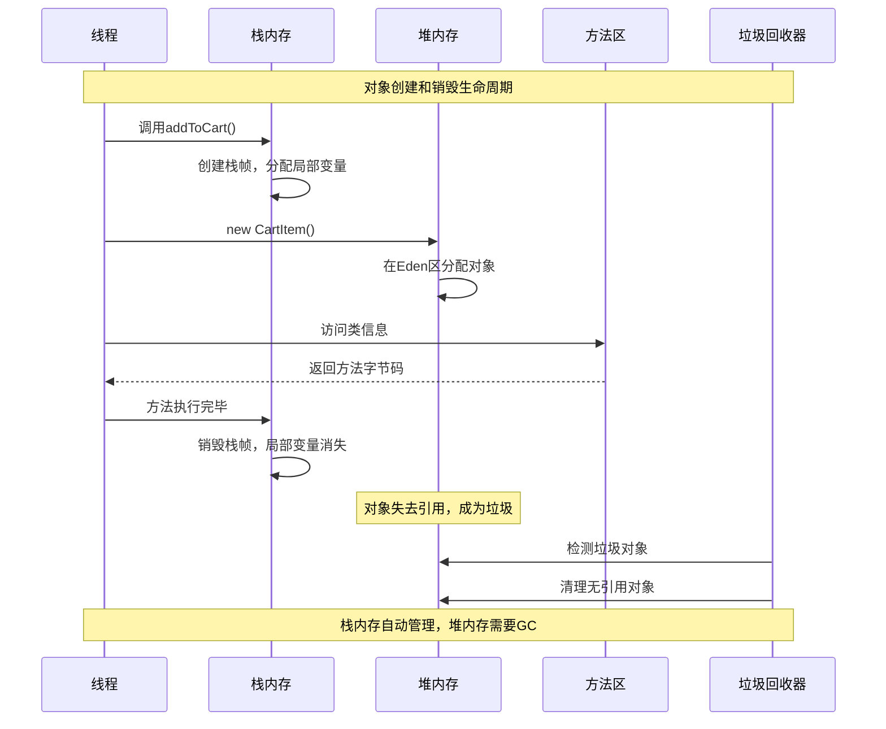

## 06.跨平台内存模型

### 6.1 Java平台

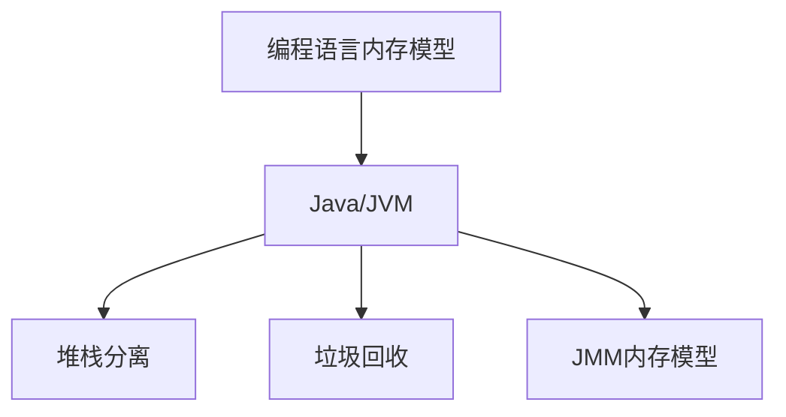

### 6.2 C++平台

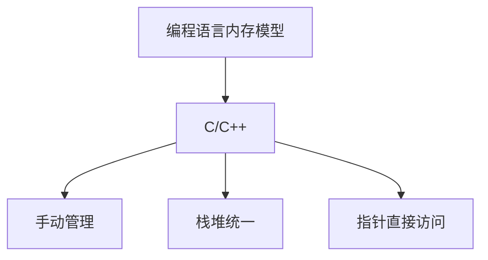

C++程序在执行时，将内存大方向划分为**4个区域**

- 代码区：存放函数体的二进制代码，由操作系统进行管理的
- 全局区：存放全局变量和静态变量以及常量
- 栈区：由编译器自动分配释放, 存放函数的参数值,局部变量等
- 堆区：由程序员分配和释放,若程序员不释放,程序结束时由操作系统回收

> 理解代码区

作用： 存储程序的二进制代码（即编译后的机器指令）。

特点： 1.只读，程序运行时不可修改。 2.由操作系统管理，程序结束时释放。

```cpp
void func() {
// 函数代码存储在代码区
}
```

> 理解全局区

全局/静态区（Global/Static Segment）作用：

1. 存储全局变量、静态变量（包括静态局部变量和静态成员变量）。
2. 分为两个子区域： 已初始化区：存储已初始化的全局变量和静态变量。 未初始化区（BSS 段）：存储未初始化的全局变量和静态变量。

特点：1.在程序启动时分配，程序结束时释放。 2.未初始化的变量会被自动初始化为 0。

```cpp
int globalVar = 10; // 已初始化全局变量，存储在全局区
static int staticVar; // 未初始化静态变量，存储在 BSS 段
void func() {
    static int localStaticVar = 20; // 静态局部变量，存储在全局区
}
```

> 理解栈区

栈区（Stack Segment） 作用：存储局部变量、函数参数、函数返回地址等。

特点：

1. 由编译器自动管理，函数调用时分配，函数返回时释放。
2. 内存分配和释放速度快，但空间有限。
3. 栈的大小通常较小（默认几 MB），如果栈溢出会导致程序崩溃。

```cpp
void func() {
    int localVar = 30; // 局部变量，存储在栈区
}
```

> 理解堆区

堆区（Heap Segment） 作用： 存储动态分配的内存（如 new 和 malloc 分配的内存）。

特点：

1. 由程序员手动管理，需要显式释放（如 delete 或 free）。
2. 内存分配和释放速度较慢，但空间较大。
3. 如果未正确释放内存，会导致内存泄漏。

```cpp
void func() {
    int* ptr = new int(40); // 动态分配内存，存储在堆区
    delete ptr; // 手动释放内存
}
```


> 常量存储区

- 用于存储常量（如字符串常量）。
- 通常是只读的。

示例：
```cpp
const char *str = "Hello, World!"; // 字符串常量存储在常量存储区
```

> 内存模型用例

内存分区模型的特点

1. 代码区：只读，存储程序指令。
2. 全局/静态区：存储全局和静态变量，生命周期与程序相同。
3. 栈区：存储局部变量和函数调用信息，自动管理，空间有限。
4. 堆区：存储动态分配的内存，手动管理，空间较大。

```cpp
#include <iostream>

int globalVar = 10; // 全局变量，存储在全局区
static int staticVar; // 静态变量，存储在 BSS 段

void func() {
    int localVar = 30; // 局部变量，存储在栈区
    static int localStaticVar = 20; // 静态局部变量，存储在全局区
    int* ptr = new int(40); // 动态分配内存，存储在堆区
    std::cout << "Local Variable: " << localVar << std::endl;
    std::cout << "Dynamic Memory: " << *ptr << std::endl;
    delete ptr; // 释放堆区内存
}

int main() {
    func();
    return 0;
}
```

### 6.3 JavaScript

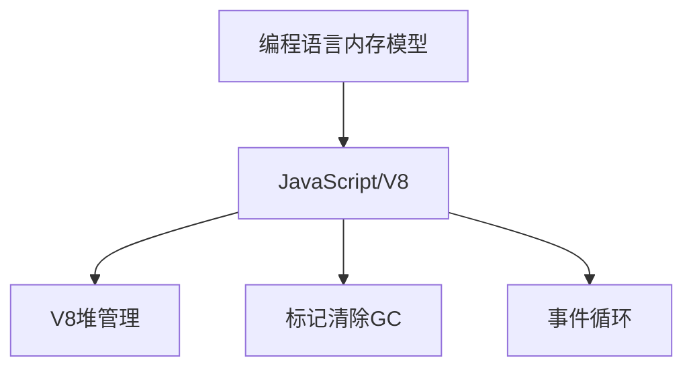

JavaScript内存模型示例

```javascript
class JavaScriptMemoryExample {
    constructor() {
        // 对象属性存储在堆中
        this.instanceVar = "实例变量";
        this.numbers = [1, 2, 3, 4, 5]; // 数组在堆中
    }
    
    demonstrateMemoryUsage() {
        // 基本类型在栈中（V8优化）
        let localNum = 42;
        let localStr = "局部字符串";
        
        // 对象在堆中
        let obj = {
            name: "张三",
            age: 25,
            hobbies: ["读书", "游泳"] // 嵌套数组也在堆中
        };
        
        // 闭包会捕获外部变量
        function createClosure() {
            let capturedVar = "被捕获的变量"; // 可能被提升到堆中
            
            return function() {
                console.log(capturedVar); // 闭包访问
            };
        }
        
        let closure = createClosure();
        
        // 异步操作
        setTimeout(() => {
            // 回调函数可能引用外部变量
            console.log(obj.name);
        }, 1000);
    }
    
    // 内存泄漏示例
    memoryLeakExample() {
        let bigArray = new Array(1000000).fill("大数据");
        
        // 全局变量引用，不会被GC
        window.globalLeak = bigArray;
        
        // 事件监听器未移除
        document.addEventListener('click', function() {
            console.log(bigArray.length); // 引用大数组
        });
        
        // 定时器未清除
        setInterval(() => {
            console.log(bigArray[0]);
        }, 1000);
    }
}
```

### 6.4 Go平台

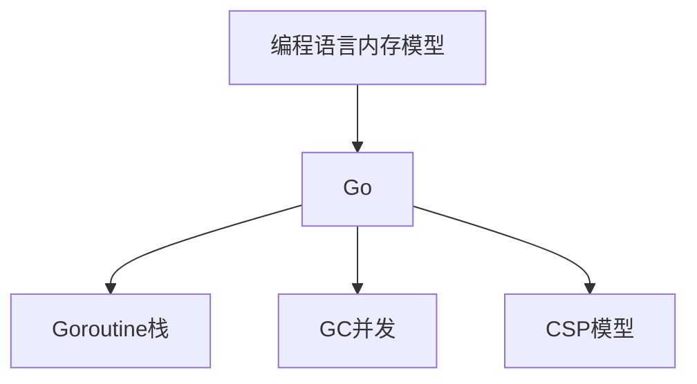

Go语言内存模型示例

```go
package main

import (
    "fmt"
    "runtime"
    "sync"
    "time"
)

type GoMemoryExample struct {
    instanceVar string
    numbers     []int
}

func (g *GoMemoryExample) demonstrateMemoryUsage() {
    // 栈变量
    localNum := 42
    localStr := "局部字符串"
    
    // 切片在堆中分配
    slice := make([]int, 1000)
    
    // map在堆中分配
    m := make(map[string]int)
    m["key"] = 100
    
    // 结构体可能在栈或堆中，取决于逃逸分析
    type Person struct {
        Name string
        Age  int
    }
    
    person := Person{Name: "张三", Age: 25} // 可能在栈中
    personPtr := &Person{Name: "李四", Age: 30} // 在堆中
    
    fmt.Printf("栈变量: %d, %s\n", localNum, localStr)
    fmt.Printf("切片长度: %d\n", len(slice))
    fmt.Printf("Map值: %d\n", m["key"])
    fmt.Printf("结构体: %+v, %+v\n", person, personPtr)
}

// Goroutine栈管理
func demonstrateGoroutineStack() {
    var wg sync.WaitGroup
    
    for i := 0; i < 10; i++ {
        wg.Add(1)
        go func(id int) {
            defer wg.Done()
            
            // 每个goroutine有自己的栈
            var localArray [1000]int
            localArray[0] = id
            
            // 递归调用会增长栈
            recursiveFunction(10, id)
            
            fmt.Printf("Goroutine %d 完成\n", id)
        }(i)
    }
    
    wg.Wait()
}

func recursiveFunction(depth, id int) {
    if depth <= 0 {
        return
    }
    
    // 栈帧增长
    var localVar [100]int
    localVar[0] = depth
    
    recursiveFunction(depth-1, id)
}

// 内存统计
func printMemoryStats() {
    var m runtime.MemStats
    runtime.ReadMemStats(&m)
    
    fmt.Printf("分配的堆内存: %d KB\n", m.Alloc/1024)
    fmt.Printf("总分配内存: %d KB\n", m.TotalAlloc/1024)
    fmt.Printf("系统内存: %d KB\n", m.Sys/1024)
    fmt.Printf("GC次数: %d\n", m.NumGC)
}

func main() {
    example := &GoMemoryExample{
        instanceVar: "实例变量",
        numbers:     []int{1, 2, 3, 4, 5},
    }
    
    example.demonstrateMemoryUsage()
    
    fmt.Println("开始Goroutine测试...")
    demonstrateGoroutineStack()
    
    fmt.Println("内存统计:")
    printMemoryStats()
    
    // 强制GC
    runtime.GC()
    time.Sleep(100 * time.Millisecond)
    
    fmt.Println("GC后内存统计:")
    printMemoryStats()
}
```

### 6.5 Rust平台

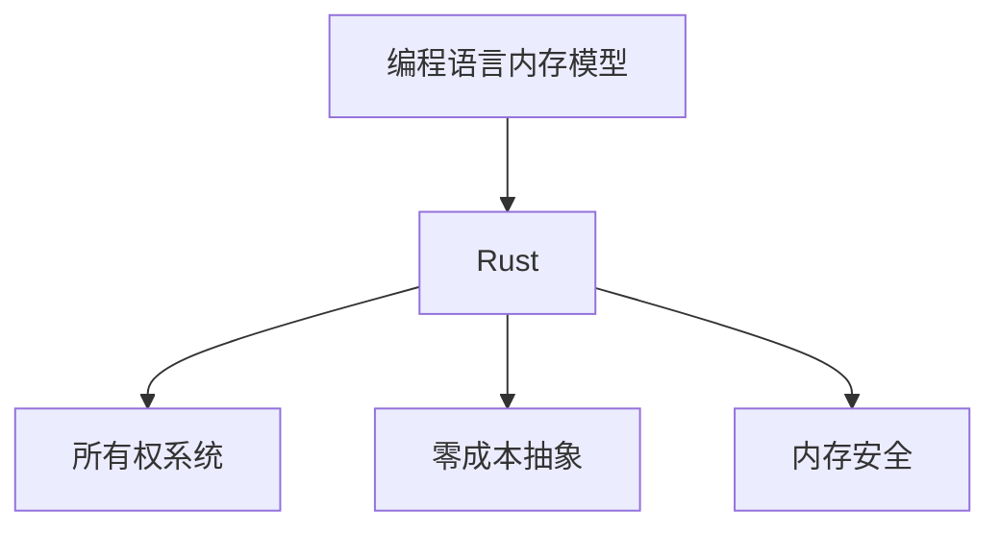

### 6.6 内存模型对比表

| 特性 | Java | JavaScript | Go | Rust | C++ |
|------|------|------------|----|----- |-----|
| **内存管理** | 自动GC | 自动GC | 自动GC | 编译时检查 | 手动管理 |
| **栈堆分离** | 明确分离 | V8优化 | 逃逸分析 | 明确分离 | 程序员控制 |
| **线程安全** | synchronized | 单线程+Worker | channel/mutex | 所有权系统 | 程序员保证 |
| **内存泄漏** | 可能发生 | 可能发生 | 较少发生 | 编译时防止 | 容易发生 |
| **性能开销** | GC暂停 | GC暂停 | 低延迟GC | 零成本抽象 | 最优性能 |
| **学习难度** | 中等 | 简单 | 中等 | 较难 | 困难 |


