#### 目录介绍
- 01.内存模型由来
  - 1.1 根本原因说明
  - 1.2 解决核心问题
  - 1.3 没有内存模型场景
- 02.内存模型概念
  - 2.1 内存模型架构
  - 2.2 线程私有和共享
  - 2.3 内存层次结构
- 03.线程私有内存
  - 3.1 程序计数器
  - 3.2 虚拟机栈
  - 3.3 本地方法栈
- 04.线程共享内存
  - 4.1 堆内存
  - 4.2 方法区
  - 4.3 运行时常量池
  - 4.4 直接内存
- 05.通用案例教学
  - 5.1 完整内存案例
  - 5.2 内存使用分析图
  - 5.3 内存生命周期
- 06.跨平台内存模型
  - 6.1 Java平台
  - 6.2 C++平台
  - 6.3 JavaScript
  - 6.4 Go平台
  - 6.5 Rust平台
  - 6.6 内存模型对比表


## 01.内存模型由来

### 1.1 根本原因说明

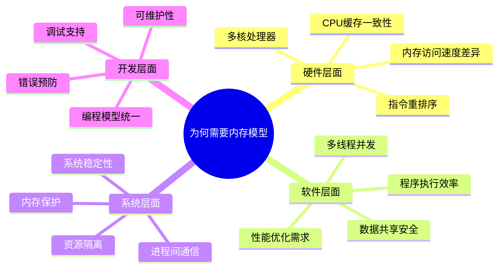
```mermaid
mindmap
  root((为何需要内存模型))
    硬件层面
      CPU缓存一致性
      多核处理器
      内存访问速度差异
      指令重排序
    
    软件层面
      多线程并发
      数据共享安全
      性能优化需求
      程序执行效率
    
    系统层面
      资源隔离
      内存保护
      进程间通信
      系统稳定性
    
    开发层面
      编程模型统一
      错误预防
      调试支持
      可维护性
```

### 1.2 解决核心问题

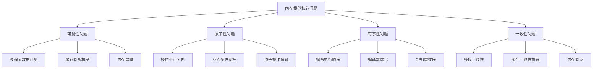
```mermaid
graph TD
    A[内存模型核心问题] --> B[可见性问题]
    A --> C[原子性问题]
    A --> D[有序性问题]
    A --> E[一致性问题]
    
    B --> B1[线程间数据可见]
    B --> B2[缓存同步机制]
    B --> B3[内存屏障]
    
    C --> C1[操作不可分割]
    C --> C2[竞态条件避免]
    C --> C3[原子操作保证]
    
    D --> D1[指令执行顺序]
    D --> D2[编译器优化]
    D --> D3[CPU重排序]
    
    E --> E1[多核一致性]
    E --> E2[缓存一致性协议]
    E --> E3[内存同步]
```

### 1.3 没有内存模型场景

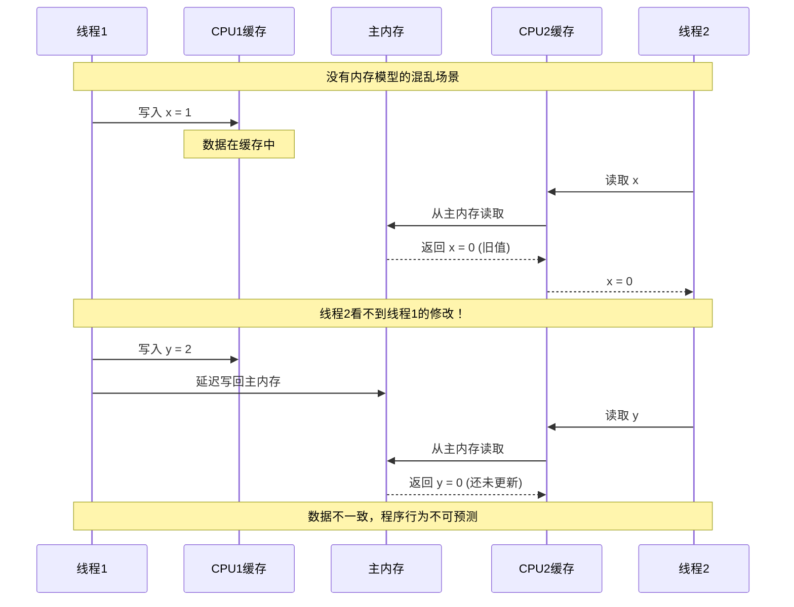
```mermaid
sequenceDiagram
    participant T1 as 线程1
    participant Cache1 as CPU1缓存
    participant Memory as 主内存
    participant Cache2 as CPU2缓存
    participant T2 as 线程2
    
    Note over T1,T2: 没有内存模型的混乱场景
    
    T1->>Cache1: 写入 x = 1
    Note over Cache1: 数据在缓存中
    
    T2->>Cache2: 读取 x
    Cache2->>Memory: 从主内存读取
    Memory-->>Cache2: 返回 x = 0 (旧值)
    Cache2-->>T2: x = 0
    
    Note over T1,T2: 线程2看不到线程1的修改！
    
    T1->>Cache1: 写入 y = 2
    T1->>Memory: 延迟写回主内存
    
    T2->>Cache2: 读取 y
    Cache2->>Memory: 从主内存读取
    Memory-->>Cache2: 返回 y = 0 (还未更新)
    
    Note over T1,T2: 数据不一致，程序行为不可预测
```

## 02.内存模型概念

### 2.1 内存模型架构

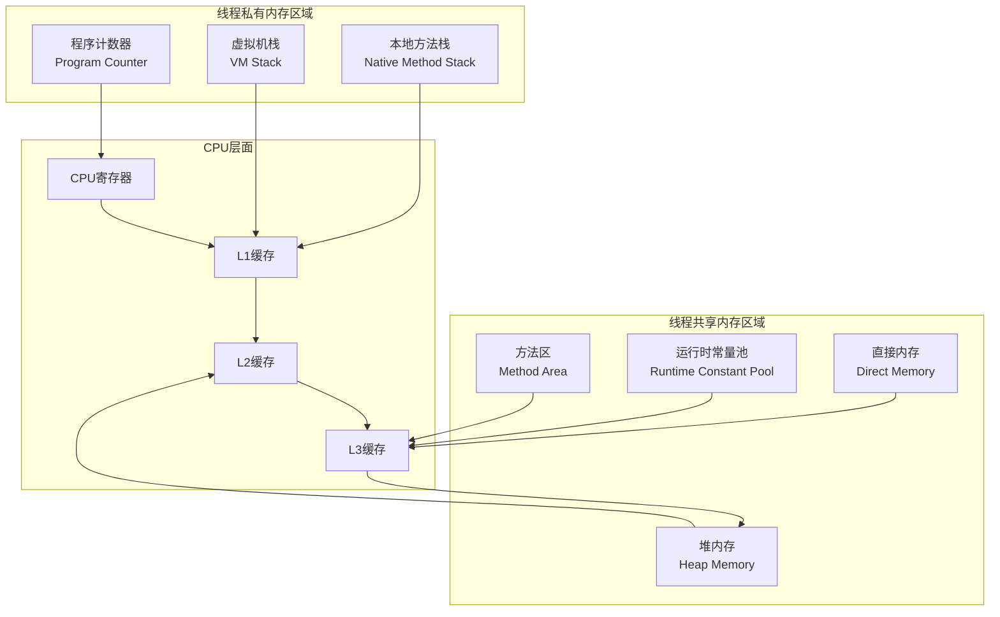
```mermaid
graph TB
    subgraph "线程私有内存区域"
        A1[程序计数器<br/>Program Counter]
        A2[虚拟机栈<br/>VM Stack]
        A3[本地方法栈<br/>Native Method Stack]
    end
    
    subgraph "线程共享内存区域"
        B1[堆内存<br/>Heap Memory]
        B2[方法区<br/>Method Area]
        B3[运行时常量池<br/>Runtime Constant Pool]
        B4[直接内存<br/>Direct Memory]
    end
    
    subgraph "CPU层面"
        C1[CPU寄存器]
        C2[L1缓存]
        C3[L2缓存]
        C4[L3缓存]
    end
    
    A1 --> C1
    A2 --> C2
    A3 --> C2
    
    B1 --> C3
    B2 --> C4
    B3 --> C4
    B4 --> C4
    
    C1 --> C2
    C2 --> C3
    C3 --> C4
    C4 --> B1
```

### 2.2 线程私有和共享

| 特性 | 线程私有内存 | 线程共享内存 |
|------|-------------|-------------|
| **访问权限** | 仅当前线程可访问 | 所有线程都可访问 |
| **生命周期** | 与线程同生共死 | 与进程同生共死 |
| **数据安全** | 天然线程安全 | 需要同步机制 |
| **性能** | 访问速度快 | 可能存在竞争 |
| **内存大小** | 相对较小 | 相对较大 |
| **典型用途** | 方法调用、局部变量 | 对象实例、类信息 |

### 2.3 内存层次结构

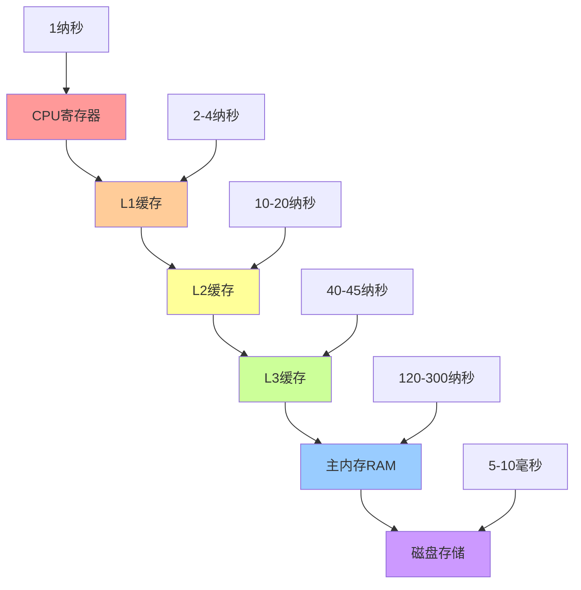
```mermaid
graph TD
    A[CPU寄存器] --> B[L1缓存]
    B --> C[L2缓存]
    C --> D[L3缓存]
    D --> E[主内存RAM]
    E --> F[磁盘存储]
    
    A1[1纳秒] --> A
    B1[2-4纳秒] --> B
    C1[10-20纳秒] --> C
    D1[40-45纳秒] --> D
    E1[120-300纳秒] --> E
    F1[5-10毫秒] --> F
    
    style A fill:#ff9999
    style B fill:#ffcc99
    style C fill:#ffff99
    style D fill:#ccff99
    style E fill:#99ccff
    style F fill:#cc99ff
```

## 03.线程私有内存

### 3.1 程序计数器

#### 3.1.1 程序计数器是什么

程序计数器，是一个数据结构，用于保存当前正常执行的程序的内存地址。

Java虚拟机的多线程就是通过线程轮流切换并分配处理器时间来实现的，为了线程切换后能恢复到正确的位置，每条线程都需要一个独立的程序计数器，互不影响，该区域为“线程私有”。

生命周期：随着线程的创建而创建，随着线程的结束而销毁。

#### 3.1.2 程序计数器设计原理

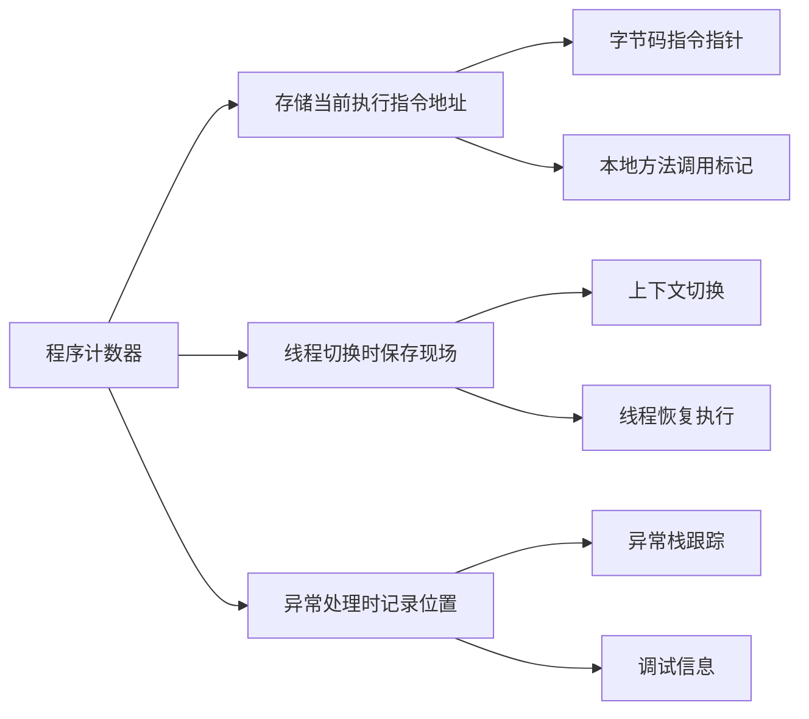
```mermaid
graph LR
    A[程序计数器] --> B[存储当前执行指令地址]
    A --> C[线程切换时保存现场]
    A --> D[异常处理时记录位置]
    
    B --> B1[字节码指令指针]
    B --> B2[本地方法调用标记]
    
    C --> C1[上下文切换]
    C --> C2[线程恢复执行]
    
    D --> D1[异常栈跟踪]
    D --> D2[调试信息]
```

程序计数器是一块较小的内存空间。可以看作是当前线程所执行的字节码的行号指示器。**字节码解释器工作时通过改变这个计数器的值来选取下一条需要执行的字节码指令，分支、循环、跳转、异常处理、线程恢复等功能都需要依赖这个计数器来完。**

#### 3.1.3 实际场景案例

```java
// Java 示例：程序计数器的作用
public class PCExample {
    public static void main(String[] args) {
        int a = 1;           // PC指向这条指令
        int b = 2;           // PC移动到这条指令
        int c = add(a, b);   // PC指向方法调用指令
        System.out.println(c); // PC指向输出指令
    }
    
    public static int add(int x, int y) {
        return x + y;        // PC在方法内部移动
    }
}
```

#### 3.1.4 程序计数器实际场景案例时序图

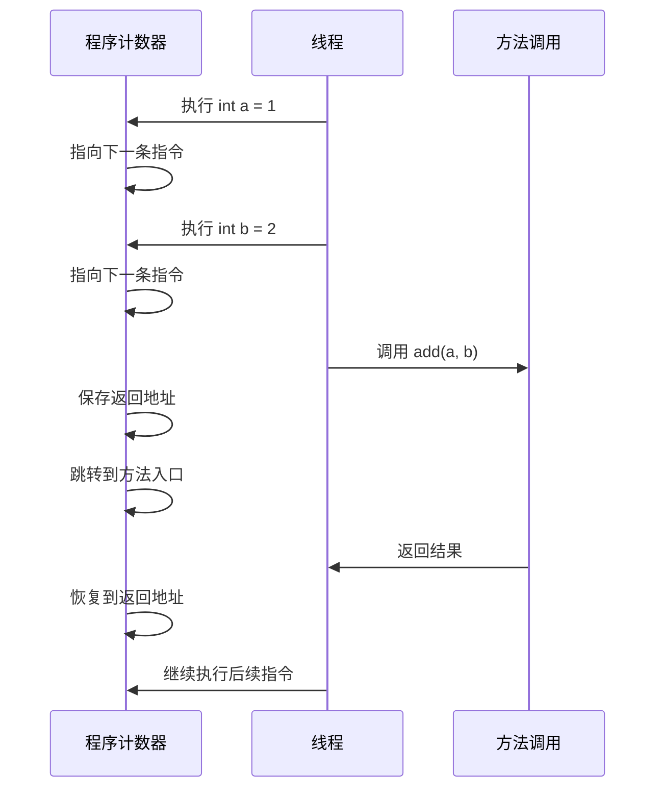
```mermaid
sequenceDiagram
    participant PC as 程序计数器
    participant Thread as 线程
    participant Method as 方法调用
    
    Thread->>PC: 执行 int a = 1
    PC->>PC: 指向下一条指令
    
    Thread->>PC: 执行 int b = 2
    PC->>PC: 指向下一条指令
    
    Thread->>Method: 调用 add(a, b)
    PC->>PC: 保存返回地址
    PC->>PC: 跳转到方法入口
    
    Method->>Thread: 返回结果
    PC->>PC: 恢复到返回地址
    
    Thread->>PC: 继续执行后续指令
```

#### 3.1.5 程序计数器作用

程序计数器主要有两个作用：

- 1.字节码解释器通过改变程序计数器来依次读取指令，从而实现代码的流程控制。如：顺序执行、选择、循环、异常处理。
- 2.在多线程的情况下，程序计数器用于记录当前线程执行的位置，从而当线程被切换回来的时候能够知道该线程上次运行到哪儿。

程序计数器会OOM吗。**注意：程序计数器是唯一一个不会出现OutOfMemoryError的内存区域，它的生命周期随着线程的创建而创建，随着线程的结束而死亡。**

### 3.2 虚拟机栈

#### 3.2.1 虚拟机栈的定义

Java 虚拟机栈是描述 Java 方法运行过程的内存模型。线程私有的。

Java 虚拟机栈会为每一个即将运行的 Java 方法创建一块叫做“栈帧”的区域，用于存放该方法运行过程中的一些信息。

#### 3.2.2 虚拟机栈存放什么

Java虚拟机栈是由一个个栈帧组成，而每个栈帧中都拥有：局部变量表、操作数栈、动态链接、方法出口信息。

局部变量表：放着基本数据类型(8种基本类型)，还有对象的引用（reference类型，它不同于对象本身，可能是一个指向对象起始地址的引用指针，也可能是指向一个代表对象的句柄或其他与此对象相关的位置）。


#### 3.2.3 栈帧结构

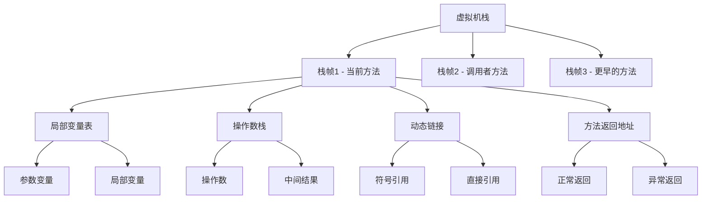
```mermaid
graph TD
    A[虚拟机栈] --> B[栈帧1 - 当前方法]
    A --> C[栈帧2 - 调用者方法]
    A --> D[栈帧3 - 更早的方法]
    
    B --> B1[局部变量表]
    B --> B2[操作数栈]
    B --> B3[动态链接]
    B --> B4[方法返回地址]
    
    B1 --> B11[参数变量]
    B1 --> B12[局部变量]
    
    B2 --> B21[操作数]
    B2 --> B22[中间结果]
    
    B3 --> B31[符号引用]
    B3 --> B32[直接引用]
    
    B4 --> B41[正常返回]
    B4 --> B42[异常返回]
```

### 3.2.4 实际场景案例

```java
// 栈内存使用示例
public class StackExample {
    public void methodA() {
        int localVar = 10;    // 存储在栈帧的局部变量表
        String str = "Hello"; // 引用存储在栈，对象在堆
        methodB(localVar);    // 创建新栈帧
    } // 栈帧销毁，局部变量消失
    
    public void methodB(int param) {
        int[] array = new int[5]; // 引用在栈，数组对象在堆
        for (int i = 0; i < 5; i++) {
            array[i] = i * param; // 操作数栈参与计算
        }
    } // 栈帧销毁
}
```

#### 3.2.5 栈内存变化过程

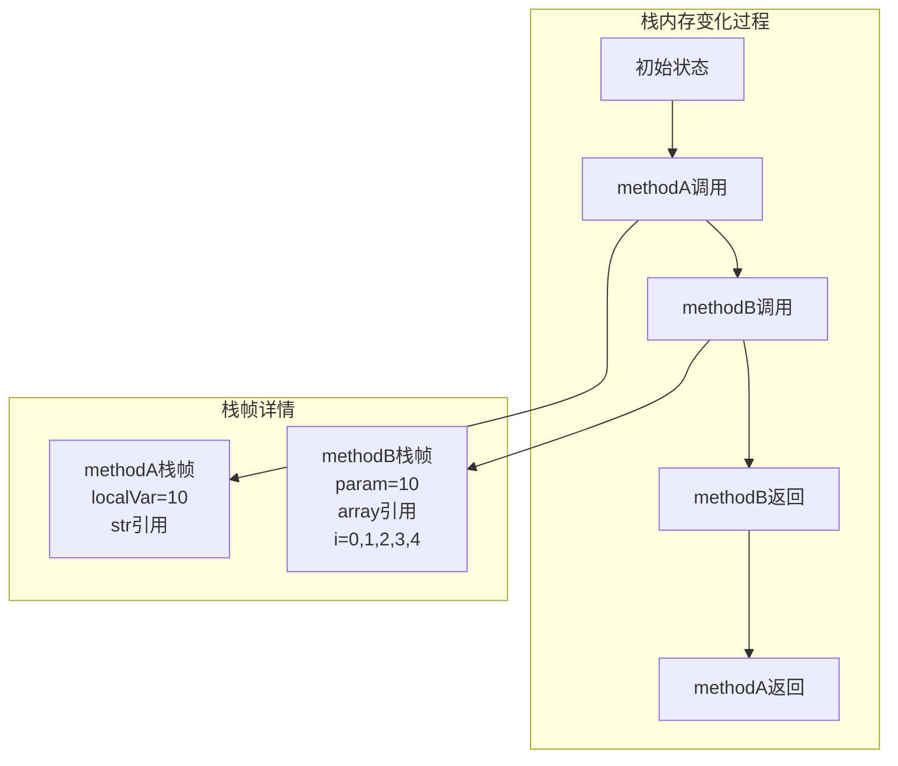
```mermaid
graph TD
    subgraph "栈内存变化过程"
        A[初始状态] --> B[methodA调用]
        B --> C[methodB调用]
        C --> D[methodB返回]
        D --> E[methodA返回]
    end
    
    subgraph "栈帧详情"
        F[methodB栈帧<br/>param=10<br/>array引用<br/>i=0,1,2,3,4]
        G[methodA栈帧<br/>localVar=10<br/>str引用]
    end
    
    C --> F
    B --> G
```

#### 3.2.6 生命周期

每个线程都有各自的Java虚拟机栈，而且随着线程的创建而创建，随着线程的死亡而死亡。

#### 3.2.7 异常情况说明

**Java 虚拟机栈会出现两种异常：StackOverFlowError 和 OutOfMemoryError。**

- **StackOverFlowError：** 若Java虚拟机栈的内存大小不允许动态扩展，那么当线程请求栈的深度超过当前Java虚拟机栈的最大深度的时候，就抛出StackOverFlowError异常。
- **OutOfMemoryError：** 若Java虚拟机栈的内存大小允许动态扩展，且当线程请求栈时内存用完了，无法再动态扩展了，此时抛出OutOfMemoryError异常。

### 3.3 本地方法栈

#### 设计目的

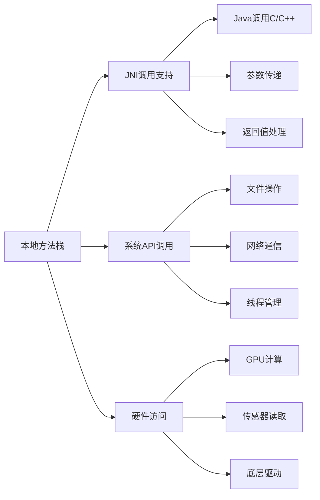
```mermaid
graph LR
    A[本地方法栈] --> B[JNI调用支持]
    A --> C[系统API调用]
    A --> D[硬件访问]
    
    B --> B1[Java调用C/C++]
    B --> B2[参数传递]
    B --> B3[返回值处理]
    
    C --> C1[文件操作]
    C --> C2[网络通信]
    C --> C3[线程管理]
    
    D --> D1[GPU计算]
    D --> D2[传感器读取]
    D --> D3[底层驱动]
```

#### 实际场景案例

```java
// JNI本地方法调用示例
public class NativeExample {
    // 声明本地方法
    public native int calculateHash(String input);
    public native void processImage(byte[] imageData);
    
    static {
        // 加载本地库
        System.loadLibrary("nativelib");
    }
    
    public void useNativeMethod() {
        String data = "Hello World";
        // 调用本地方法，使用本地方法栈
        int hash = calculateHash(data);
        System.out.println("Hash: " + hash);
    }
}
```

然后通过GNI调用c代码

```c
// C语言实现的本地方法
#include <jni.h>
#include <string.h>

JNIEXPORT jint JNICALL 
Java_NativeExample_calculateHash(JNIEnv *env, jobject obj, jstring input) {
    // 本地方法栈中的局部变量
    const char *str = (*env)->GetStringUTFChars(env, input, 0);
    int hash = 0;
    
    // 在本地方法栈中执行计算
    for (int i = 0; i < strlen(str); i++) {
        hash = hash * 31 + str[i];
    }
    
    (*env)->ReleaseStringUTFChars(env, input, str);
    return hash;
}
```

#### 实际场景案例时序图

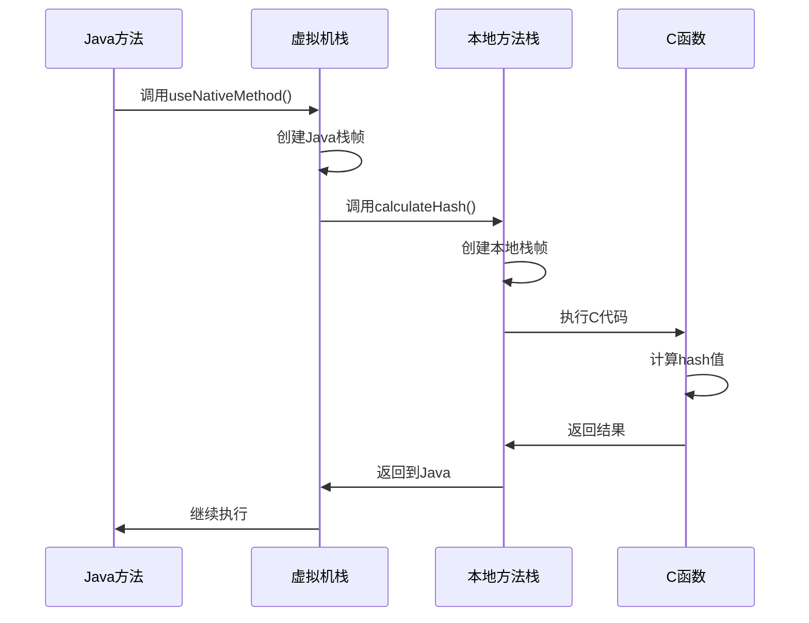
```mermaid
sequenceDiagram
    participant Java as Java方法
    participant JVM as 虚拟机栈
    participant Native as 本地方法栈
    participant C as C函数
    
    Java->>JVM: 调用useNativeMethod()
    JVM->>JVM: 创建Java栈帧
    
    JVM->>Native: 调用calculateHash()
    Native->>Native: 创建本地栈帧
    Native->>C: 执行C代码
    
    C->>C: 计算hash值
    C->>Native: 返回结果
    Native->>JVM: 返回到Java
    JVM->>Java: 继续执行
```

## 04.线程共享内存

### 4.1 堆内存


#### 堆内存分代结构

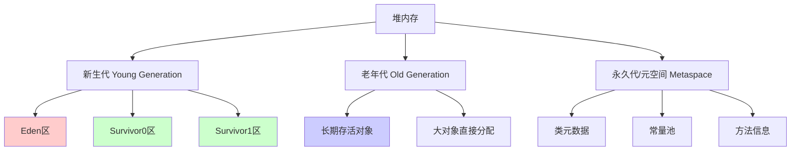
```mermaid
graph TD
    A[堆内存] --> B[新生代 Young Generation]
    A --> C[老年代 Old Generation]
    A --> D[永久代/元空间 Metaspace]
    
    B --> B1[Eden区]
    B --> B2[Survivor0区]
    B --> B3[Survivor1区]
    
    C --> C1[长期存活对象]
    C --> C2[大对象直接分配]
    
    D --> D1[类元数据]
    D --> D2[常量池]
    D --> D3[方法信息]
    
    style B1 fill:#ffcccc
    style B2 fill:#ccffcc
    style B3 fill:#ccffcc
    style C1 fill:#ccccff
```

#### 实际场景案例

```java
// 堆内存使用示例
public class HeapExample {
    private static List<String> staticList = new ArrayList<>(); // 在堆中
    
    public void createObjects() {
        // 所有对象都在堆内存中创建
        String str = new String("Hello");     // 在堆中
        StringBuilder sb = new StringBuilder(); // 在堆中
        int[] array = new int[1000];          // 在堆中
        
        // 对象引用在栈中，对象实例在堆中
        Person person = new Person("张三", 25);
        
        // 集合对象在堆中，元素也在堆中
        List<Person> persons = new ArrayList<>();
        persons.add(person);
        
        // 大对象可能直接进入老年代
        byte[] bigArray = new byte[1024 * 1024]; // 1MB
    }
    
    static class Person {
        private String name;  // 引用在堆中，字符串对象也在堆中
        private int age;      // 基本类型值在堆中（作为对象的字段）
        
        public Person(String name, int age) {
            this.name = name;
            this.age = age;
        }
    }
}
```

#### 垃圾回收过程

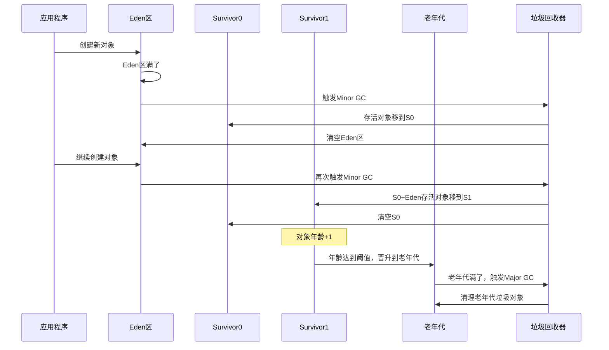
```mermaid
sequenceDiagram
    participant App as 应用程序
    participant Eden as Eden区
    participant S0 as Survivor0
    participant S1 as Survivor1
    participant Old as 老年代
    participant GC as 垃圾回收器
    
    App->>Eden: 创建新对象
    Eden->>Eden: Eden区满了
    
    Eden->>GC: 触发Minor GC
    GC->>S0: 存活对象移到S0
    GC->>Eden: 清空Eden区
    
    App->>Eden: 继续创建对象
    Eden->>GC: 再次触发Minor GC
    GC->>S1: S0+Eden存活对象移到S1
    GC->>S0: 清空S0
    
    Note over S1: 对象年龄+1
    
    S1->>Old: 年龄达到阈值，晋升到老年代
    
    Old->>GC: 老年代满了，触发Major GC
    GC->>Old: 清理老年代垃圾对象
```

### 4.2 方法区

#### 方法区内容

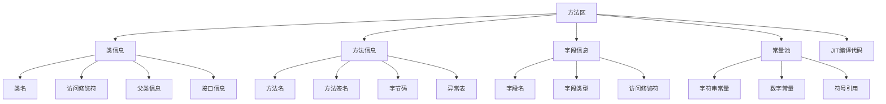
```mermaid
graph TD
    A[方法区] --> B[类信息]
    A --> C[方法信息]
    A --> D[字段信息]
    A --> E[常量池]
    A --> F[JIT编译代码]
    
    B --> B1[类名]
    B --> B2[访问修饰符]
    B --> B3[父类信息]
    B --> B4[接口信息]
    
    C --> C1[方法名]
    C --> C2[方法签名]
    C --> C3[字节码]
    C --> C4[异常表]
    
    D --> D1[字段名]
    D --> D2[字段类型]
    D --> D3[访问修饰符]
    
    E --> E1[字符串常量]
    E --> E2[数字常量]
    E --> E3[符号引用]
```

#### 实际场景案例

```java
// 方法区存储示例
public class MethodAreaExample {
    // 类信息存储在方法区
    private static final String CONSTANT = "常量"; // 常量池
    private static int staticVar = 100;            // 静态变量在堆中，引用在方法区
    
    private String instanceVar;                    // 字段信息在方法区
    
    // 方法信息存储在方法区
    public void instanceMethod() {
        String localStr = "局部字符串"; // 字符串字面量在常量池
        System.out.println(localStr);
    }
    
    public static void staticMethod() {
        // 静态方法信息在方法区
        Class<?> clazz = MethodAreaExample.class; // 类对象在堆中
        String className = clazz.getName();       // 反射获取类信息
    }
}

// 类加载过程
class ClassLoadingExample {
    static {
        System.out.println("类初始化"); // 类信息加载到方法区时执行
    }
    
    public static void triggerClassLoading() {
        // 首次使用类时，类信息加载到方法区
        ClassLoadingExample example = new ClassLoadingExample();
    }
}
```

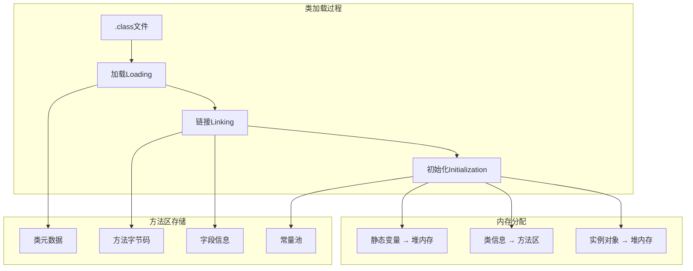
```mermaid
graph TD
    subgraph "类加载过程"
        A[.class文件] --> B[加载Loading]
        B --> C[链接Linking]
        C --> D[初始化Initialization]
    end
    
    subgraph "方法区存储"
        E[类元数据]
        F[方法字节码]
        G[字段信息]
        H[常量池]
    end
    
    B --> E
    C --> F
    C --> G
    D --> H
    
    subgraph "内存分配"
        I[静态变量 → 堆内存]
        J[类信息 → 方法区]
        K[实例对象 → 堆内存]
    end
    
    D --> I
    D --> J
    D --> K
```

### 4.3 运行时常量池

#### 常量池类型

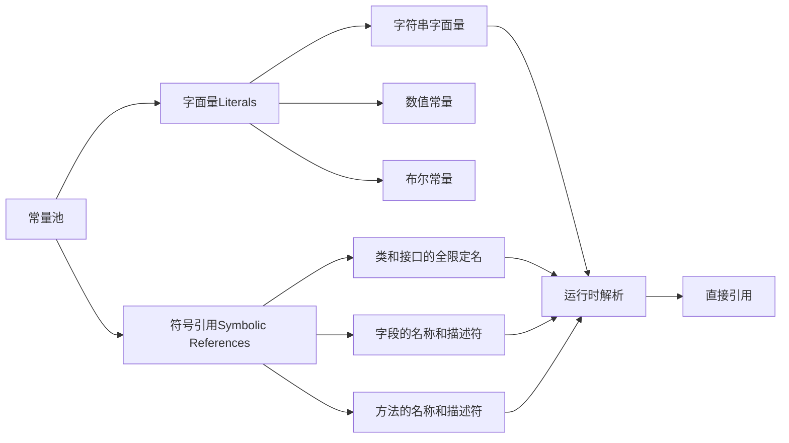
```mermaid
graph LR
    A[常量池] --> B[字面量Literals]
    A --> C[符号引用Symbolic References]
    
    B --> B1[字符串字面量]
    B --> B2[数值常量]
    B --> B3[布尔常量]
    
    C --> C1[类和接口的全限定名]
    C --> C2[字段的名称和描述符]
    C --> C3[方法的名称和描述符]
    
    B1 --> D[运行时解析]
    C1 --> D
    C2 --> D
    C3 --> D
    
    D --> E[直接引用]
```

#### 实际场景案例

```java
// 常量池使用示例
public class ConstantPoolExample {
    public static void stringPoolExample() {
        // 字符串字面量存储在字符串常量池
        String str1 = "Hello";           // 常量池中
        String str2 = "Hello";           // 复用常量池中的对象
        String str3 = new String("Hello"); // 堆中新建对象
        
        System.out.println(str1 == str2);    // true，同一个对象
        System.out.println(str1 == str3);    // false，不同对象
        System.out.println(str1.equals(str3)); // true，内容相同
        
        // intern()方法的使用
        String str4 = str3.intern();     // 返回常量池中的对象
        System.out.println(str1 == str4);    // true
    }
    
    public static void numericConstantExample() {
        // 数值常量在常量池中
        int a = 100;    // 小整数缓存
        int b = 100;    // 复用缓存
        
        Integer i1 = 100;  // 自动装箱，使用缓存
        Integer i2 = 100;  // 复用缓存
        Integer i3 = 200;  // 超出缓存范围，新建对象
        Integer i4 = 200;  // 新建对象
        
        System.out.println(i1 == i2);  // true，缓存对象
        System.out.println(i3 == i4);  // false，不同对象
    }
}
```

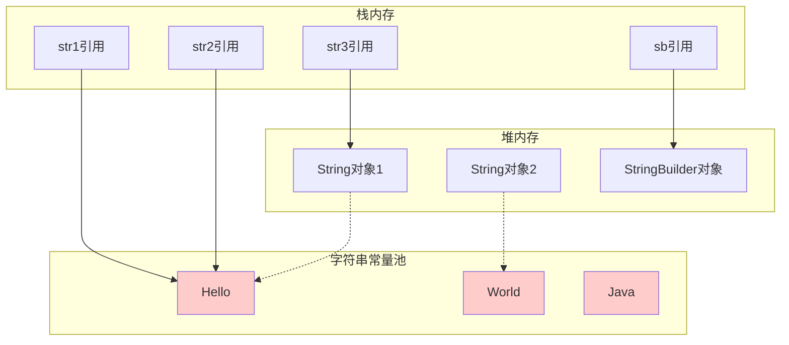
```mermaid
graph TD
    subgraph "字符串常量池"
        A["Hello"]
        B["World"]
        C["Java"]
    end
    
    subgraph "堆内存"
        D[String对象1]
        E[String对象2]
        F[StringBuilder对象]
    end
    
    subgraph "栈内存"
        G[str1引用] --> A
        H[str2引用] --> A
        I[str3引用] --> D
        J[sb引用] --> F
    end
    
    D -.-> A
    E -.-> B
    
    style A fill:#ffcccc
    style B fill:#ffcccc
    style C fill:#ffcccc
```

### 4.4 直接内存


#### 直接内存特点

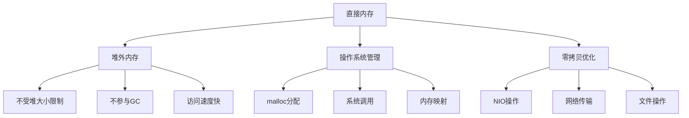
```mermaid
graph TD
    A[直接内存] --> B[堆外内存]
    A --> C[操作系统管理]
    A --> D[零拷贝优化]
    
    B --> B1[不受堆大小限制]
    B --> B2[不参与GC]
    B --> B3[访问速度快]
    
    C --> C1[malloc分配]
    C --> C2[系统调用]
    C --> C3[内存映射]
    
    D --> D1[NIO操作]
    D --> D2[网络传输]
    D --> D3[文件操作]
```

#### 实际场景案例

```java
// 直接内存使用示例
import java.nio.ByteBuffer;
import java.nio.channels.FileChannel;
import java.io.RandomAccessFile;

public class DirectMemoryExample {
    
    public void directBufferExample() {
        // 分配直接内存
        ByteBuffer directBuffer = ByteBuffer.allocateDirect(1024 * 1024); // 1MB
        ByteBuffer heapBuffer = ByteBuffer.allocate(1024 * 1024);         // 堆内存
        
        // 直接内存的优势：零拷贝
        byte[] data = "Hello Direct Memory".getBytes();
        directBuffer.put(data);
        directBuffer.flip();
        
        // 读取数据
        byte[] result = new byte[data.length];
        directBuffer.get(result);
        
        System.out.println(new String(result));
    }
    
    public void fileChannelExample() throws Exception {
        RandomAccessFile file = new RandomAccessFile("test.txt", "rw");
        FileChannel channel = file.getChannel();
        
        // 使用直接内存进行文件操作
        ByteBuffer buffer = ByteBuffer.allocateDirect(1024);
        
        // 零拷贝读取文件
        int bytesRead = channel.read(buffer);
        buffer.flip();
        
        // 零拷贝写入文件
        channel.write(buffer);
        
        channel.close();
        file.close();
    }
    
    // 内存映射文件示例
    public void memoryMappedFileExample() throws Exception {
        RandomAccessFile file = new RandomAccessFile("large_file.dat", "rw");
        FileChannel channel = file.getChannel();
        
        // 内存映射，使用直接内存
        long fileSize = 1024 * 1024 * 100; // 100MB
        var mappedBuffer = channel.map(
            FileChannel.MapMode.READ_WRITE, 0, fileSize
        );
        
        // 直接操作内存映射区域
        mappedBuffer.put(0, (byte) 'A');
        byte value = mappedBuffer.get(0);
        
        channel.close();
        file.close();
    }
}
```

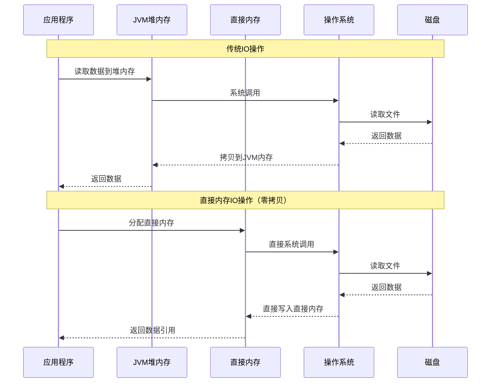
```mermaid
sequenceDiagram
    participant App as 应用程序
    participant JVM as JVM堆内存
    participant Direct as 直接内存
    participant OS as 操作系统
    participant Disk as 磁盘
    
    Note over App,Disk: 传统IO操作
    App->>JVM: 读取数据到堆内存
    JVM->>OS: 系统调用
    OS->>Disk: 读取文件
    Disk-->>OS: 返回数据
    OS-->>JVM: 拷贝到JVM内存
    JVM-->>App: 返回数据
    
    Note over App,Disk: 直接内存IO操作（零拷贝）
    App->>Direct: 分配直接内存
    Direct->>OS: 直接系统调用
    OS->>Disk: 读取文件
    Disk-->>OS: 返回数据
    OS-->>Direct: 直接写入直接内存
    Direct-->>App: 返回数据引用
```


## 05.通用案例教学

### 5.1 完整内存案例

```java
/**
 * 综合内存模型案例：在线购物系统
 * 演示各种内存区域的使用
 */
public class OnlineShoppingSystem {
    
    // 静态变量：引用在方法区，对象在堆中
    private static final String SYSTEM_NAME = "购物系统"; // 字符串常量池
    private static Map<String, Product> productCache = new ConcurrentHashMap<>(); // 堆中
    
    // 实例变量：存储在堆中（作为对象的一部分）
    private String userId;
    private List<CartItem> shoppingCart;
    
    public OnlineShoppingSystem(String userId) {
        this.userId = userId;                    // 字符串在堆中
        this.shoppingCart = new ArrayList<>();   // 集合对象在堆中
    }
    
    /**
     * 添加商品到购物车
     * 演示栈内存、堆内存、方法区的协作
     */
    public void addToCart(String productId, int quantity) {
        // 局部变量在栈中
        long startTime = System.currentTimeMillis(); // 栈中
        
        try {
            // 从缓存获取商品（堆内存访问）
            Product product = getProductFromCache(productId);
            
            if (product == null) {
                // 从数据库加载（可能使用直接内存进行IO）
                product = loadProductFromDatabase(productId);
                
                if (product != null) {
                    // 加入缓存（堆内存操作）
                    productCache.put(productId, product);
                }
            }
            
            if (product != null && product.getStock() >= quantity) {
                // 创建购物车项（堆内存分配）
                CartItem item = new CartItem(product, quantity);
                
                // 添加到购物车（堆内存中的集合操作）
                shoppingCart.add(item);
                
                // 更新库存（堆内存中对象状态修改）
                product.reduceStock(quantity);
                
                // 记录日志（可能使用直接内存进行文件IO）
                logOperation("添加商品", productId, quantity);
            }
            
        } catch (Exception e) {
            // 异常对象在堆中创建
            handleException(e);
        } finally {
            // 计算耗时（栈中局部变量）
            long duration = System.currentTimeMillis() - startTime;
            System.out.println("操作耗时: " + duration + "ms");
        }
    }
    
    /**
     * 使用本地方法进行性能优化
     */
    public native double calculateOptimalPrice(double basePrice, int quantity);
    
    /**
     * 异步处理订单（演示线程私有内存）
     */
    public CompletableFuture<Order> processOrderAsync() {
        return CompletableFuture.supplyAsync(() -> {
            // 新线程有自己的栈内存
            String threadName = Thread.currentThread().getName(); // 栈中
            long threadId = Thread.currentThread().getId();       // 栈中
            
            try {
                // 创建订单对象（堆内存）
                Order order = new Order(userId, new ArrayList<>(shoppingCart));
                
                // 计算总价（栈中临时变量）
                double totalPrice = 0.0;
                for (CartItem item : shoppingCart) {
                    double itemPrice = item.getProduct().getPrice() * item.getQuantity();
                    
                    // 使用本地方法优化价格计算（本地方法栈）
                    itemPrice = calculateOptimalPrice(itemPrice, item.getQuantity());
                    
                    totalPrice += itemPrice;
                }
                
                order.setTotalPrice(totalPrice);
                
                // 保存订单（可能使用直接内存进行数据库IO）
                saveOrderToDatabase(order);
                
                return order;
                
            } catch (Exception e) {
                throw new RuntimeException("订单处理失败", e);
            }
        });
    }
    
    // 辅助方法
    private Product getProductFromCache(String productId) {
        return productCache.get(productId); // 访问堆中的缓存
    }
    
    private Product loadProductFromDatabase(String productId) {
        // 模拟数据库查询，可能使用直接内存进行IO
        // 实际实现会使用JDBC等
        return new Product(productId, "商品名称", 99.99, 100);
    }
    
    private void logOperation(String operation, String productId, int quantity) {
        // 日志记录，可能使用直接内存写入文件
        String logMessage = String.format("[%s] %s: 商品=%s, 数量=%d", 
            new Date(), operation, productId, quantity);
        System.out.println(logMessage);
    }
    
    private void handleException(Exception e) {
        // 异常处理逻辑
        e.printStackTrace();
    }
    
    private void saveOrderToDatabase(Order order) {
        // 模拟数据库保存操作
        System.out.println("订单已保存: " + order.getOrderId());
    }
}

// 辅助类定义
class Product {
    private String id;
    private String name;
    private double price;
    private int stock;
    
    public Product(String id, String name, double price, int stock) {
        this.id = id;
        this.name = name;
        this.price = price;
        this.stock = stock;
    }
    
    public synchronized void reduceStock(int quantity) {
        if (stock >= quantity) {
            stock -= quantity;
        }
    }
    
    // getter方法
    public double getPrice() { return price; }
    public int getStock() { return stock; }
}

class CartItem {
    private Product product;
    private int quantity;
    
    public CartItem(Product product, int quantity) {
        this.product = product;
        this.quantity = quantity;
    }
    
    // getter方法
    public Product getProduct() { return product; }
    public int getQuantity() { return quantity; }
}

class Order {
    private String orderId;
    private String userId;
    private List<CartItem> items;
    private double totalPrice;
    private Date createTime;
    
    public Order(String userId, List<CartItem> items) {
        this.orderId = UUID.randomUUID().toString();
        this.userId = userId;
        this.items = items;
        this.createTime = new Date();
    }
    
    // getter和setter方法
    public String getOrderId() { return orderId; }
    public void setTotalPrice(double totalPrice) { this.totalPrice = totalPrice; }
}
```


### 5.2 内存使用分析图

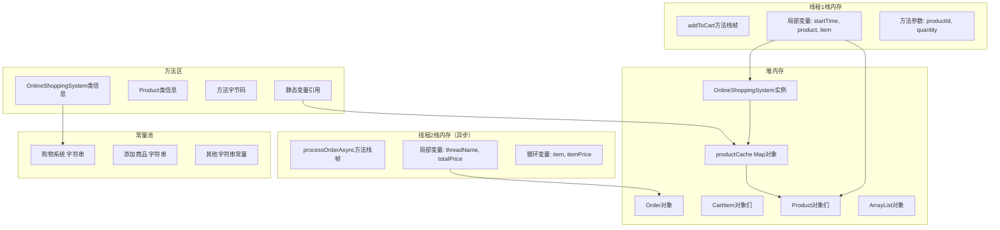
```mermaid
graph TD
    subgraph "线程1栈内存"
        A1[addToCart方法栈帧]
        A2[局部变量: startTime, product, item]
        A3[方法参数: productId, quantity]
    end
    
    subgraph "线程2栈内存（异步）"
        B1[processOrderAsync方法栈帧]
        B2[局部变量: threadName, totalPrice]
        B3[循环变量: item, itemPrice]
    end
    
    subgraph "堆内存"
        C1[OnlineShoppingSystem实例]
        C2[productCache Map对象]
        C3[Product对象们]
        C4[CartItem对象们]
        C5[Order对象]
        C6[ArrayList对象]
    end
    
    subgraph "方法区"
        D1[OnlineShoppingSystem类信息]
        D2[Product类信息]
        D3[方法字节码]
        D4[静态变量引用]
    end
    
    subgraph "常量池"
        E1["购物系统" 字符串]
        E2["添加商品" 字符串]
        E3[其他字符串常量]
    end
    
    A2 --> C1
    A2 --> C3
    B2 --> C5
    C1 --> C2
    C2 --> C3
    D4 --> C2
    D1 --> E1
```

### 5.3 内存生命周期

对象的生命周期：

- 全局对象在程序启动时分配，结束时销毁。
- 局部对象在进入程序块时创建，离开块时销毁。
- 局部`static`对象在第一次使用前分配，在程序结束时销毁。
- 动态分配对象(C++特有)：只能显式地被释放。

属性的生命周期：

- 类变量在对象创建时分配，对象销毁时销毁。
- 类`static`变量在第一次加载类时分配，在程序结束时销毁。

```mermaid
sequenceDiagram
    participant Thread as 线程
    participant Stack as 栈内存
    participant Heap as 堆内存
    participant Method as 方法区
    participant GC as 垃圾回收器
    
    Note over Thread,GC: 对象创建和销毁生命周期
    
    Thread->>Stack: 调用addToCart()
    Stack->>Stack: 创建栈帧，分配局部变量
    
    Thread->>Heap: new CartItem()
    Heap->>Heap: 在Eden区分配对象
    
    Thread->>Method: 访问类信息
    Method-->>Thread: 返回方法字节码
    
    Thread->>Stack: 方法执行完毕
    Stack->>Stack: 销毁栈帧，局部变量消失
    
    Note over Heap: 对象失去引用，成为垃圾
    
    GC->>Heap: 检测垃圾对象
    GC->>Heap: 清理无引用对象
    
    Note over Thread,GC: 栈内存自动管理，堆内存需要GC
```

## 06.跨平台内存模型

### 6.1 Java平台

```mermaid
graph TD
    A[编程语言内存模型] --> B[Java/JVM]
    
    B --> B1[堆栈分离]
    B --> B2[垃圾回收]
    B --> B3[JMM内存模型]
```

### 6.2 C++平台

```mermaid
graph TD
    A[编程语言内存模型] --> C[C/C++]

    C --> C1[手动管理]
    C --> C2[栈堆统一]
    C --> C3[指针直接访问]
```

C++程序在执行时，将内存大方向划分为**4个区域**

- 代码区：存放函数体的二进制代码，由操作系统进行管理的
- 全局区：存放全局变量和静态变量以及常量
- 栈区：由编译器自动分配释放, 存放函数的参数值,局部变量等
- 堆区：由程序员分配和释放,若程序员不释放,程序结束时由操作系统回收

#### 理解代码区

作用： 存储程序的二进制代码（即编译后的机器指令）。

特点： 1.只读，程序运行时不可修改。 2.由操作系统管理，程序结束时释放。

```cpp
void func() {
// 函数代码存储在代码区
}
```

#### 理解全局区

全局/静态区（Global/Static Segment）作用：

1. 存储全局变量、静态变量（包括静态局部变量和静态成员变量）。
2. 分为两个子区域： 已初始化区：存储已初始化的全局变量和静态变量。 未初始化区（BSS 段）：存储未初始化的全局变量和静态变量。

特点：1.在程序启动时分配，程序结束时释放。 2.未初始化的变量会被自动初始化为 0。

```cpp
int globalVar = 10; // 已初始化全局变量，存储在全局区
static int staticVar; // 未初始化静态变量，存储在 BSS 段
void func() {
    static int localStaticVar = 20; // 静态局部变量，存储在全局区
}
```

#### 理解栈区

栈区（Stack Segment） 作用：存储局部变量、函数参数、函数返回地址等。

特点：

1. 由编译器自动管理，函数调用时分配，函数返回时释放。
2. 内存分配和释放速度快，但空间有限。
3. 栈的大小通常较小（默认几 MB），如果栈溢出会导致程序崩溃。

```cpp
void func() {
    int localVar = 30; // 局部变量，存储在栈区
}
```

#### 理解堆区

堆区（Heap Segment） 作用： 存储动态分配的内存（如 new 和 malloc 分配的内存）。

特点：

1. 由程序员手动管理，需要显式释放（如 delete 或 free）。
2. 内存分配和释放速度较慢，但空间较大。
3. 如果未正确释放内存，会导致内存泄漏。

```cpp
void func() {
    int* ptr = new int(40); // 动态分配内存，存储在堆区
    delete ptr; // 手动释放内存
}
```


#### 常量存储区

- 用于存储常量（如字符串常量）。
- 通常是只读的。

示例：
```cpp
const char *str = "Hello, World!"; // 字符串常量存储在常量存储区
```


#### 内存模型用例

内存分区模型的特点

1. 代码区：只读，存储程序指令。
2. 全局/静态区：存储全局和静态变量，生命周期与程序相同。
3. 栈区：存储局部变量和函数调用信息，自动管理，空间有限。
4. 堆区：存储动态分配的内存，手动管理，空间较大。

```cpp
#include <iostream>

int globalVar = 10; // 全局变量，存储在全局区
static int staticVar; // 静态变量，存储在 BSS 段

void func() {
    int localVar = 30; // 局部变量，存储在栈区
    static int localStaticVar = 20; // 静态局部变量，存储在全局区
    int* ptr = new int(40); // 动态分配内存，存储在堆区
    std::cout << "Local Variable: " << localVar << std::endl;
    std::cout << "Dynamic Memory: " << *ptr << std::endl;
    delete ptr; // 释放堆区内存
}

int main() {
    func();
    return 0;
}
```


### 6.3 JavaScript

```mermaid
graph TD
    A[编程语言内存模型] --> D[JavaScript/V8]

    D --> D1[V8堆管理]
    D --> D2[标记清除GC]
    D --> D3[事件循环]
```

JavaScript内存模型示例

```javascript
class JavaScriptMemoryExample {
    constructor() {
        // 对象属性存储在堆中
        this.instanceVar = "实例变量";
        this.numbers = [1, 2, 3, 4, 5]; // 数组在堆中
    }
    
    demonstrateMemoryUsage() {
        // 基本类型在栈中（V8优化）
        let localNum = 42;
        let localStr = "局部字符串";
        
        // 对象在堆中
        let obj = {
            name: "张三",
            age: 25,
            hobbies: ["读书", "游泳"] // 嵌套数组也在堆中
        };
        
        // 闭包会捕获外部变量
        function createClosure() {
            let capturedVar = "被捕获的变量"; // 可能被提升到堆中
            
            return function() {
                console.log(capturedVar); // 闭包访问
            };
        }
        
        let closure = createClosure();
        
        // 异步操作
        setTimeout(() => {
            // 回调函数可能引用外部变量
            console.log(obj.name);
        }, 1000);
    }
    
    // 内存泄漏示例
    memoryLeakExample() {
        let bigArray = new Array(1000000).fill("大数据");
        
        // 全局变量引用，不会被GC
        window.globalLeak = bigArray;
        
        // 事件监听器未移除
        document.addEventListener('click', function() {
            console.log(bigArray.length); // 引用大数组
        });
        
        // 定时器未清除
        setInterval(() => {
            console.log(bigArray[0]);
        }, 1000);
    }
}
```

### 6.4 Go平台

```mermaid
graph TD
    A[编程语言内存模型] --> E[Go]

    E --> E1[Goroutine栈]
    E --> E2[GC并发]
    E --> E3[CSP模型]
```

Go语言内存模型示例

```go
package main

import (
    "fmt"
    "runtime"
    "sync"
    "time"
)

type GoMemoryExample struct {
    instanceVar string
    numbers     []int
}

func (g *GoMemoryExample) demonstrateMemoryUsage() {
    // 栈变量
    localNum := 42
    localStr := "局部字符串"
    
    // 切片在堆中分配
    slice := make([]int, 1000)
    
    // map在堆中分配
    m := make(map[string]int)
    m["key"] = 100
    
    // 结构体可能在栈或堆中，取决于逃逸分析
    type Person struct {
        Name string
        Age  int
    }
    
    person := Person{Name: "张三", Age: 25} // 可能在栈中
    personPtr := &Person{Name: "李四", Age: 30} // 在堆中
    
    fmt.Printf("栈变量: %d, %s\n", localNum, localStr)
    fmt.Printf("切片长度: %d\n", len(slice))
    fmt.Printf("Map值: %d\n", m["key"])
    fmt.Printf("结构体: %+v, %+v\n", person, personPtr)
}

// Goroutine栈管理
func demonstrateGoroutineStack() {
    var wg sync.WaitGroup
    
    for i := 0; i < 10; i++ {
        wg.Add(1)
        go func(id int) {
            defer wg.Done()
            
            // 每个goroutine有自己的栈
            var localArray [1000]int
            localArray[0] = id
            
            // 递归调用会增长栈
            recursiveFunction(10, id)
            
            fmt.Printf("Goroutine %d 完成\n", id)
        }(i)
    }
    
    wg.Wait()
}

func recursiveFunction(depth, id int) {
    if depth <= 0 {
        return
    }
    
    // 栈帧增长
    var localVar [100]int
    localVar[0] = depth
    
    recursiveFunction(depth-1, id)
}

// 内存统计
func printMemoryStats() {
    var m runtime.MemStats
    runtime.ReadMemStats(&m)
    
    fmt.Printf("分配的堆内存: %d KB\n", m.Alloc/1024)
    fmt.Printf("总分配内存: %d KB\n", m.TotalAlloc/1024)
    fmt.Printf("系统内存: %d KB\n", m.Sys/1024)
    fmt.Printf("GC次数: %d\n", m.NumGC)
}

func main() {
    example := &GoMemoryExample{
        instanceVar: "实例变量",
        numbers:     []int{1, 2, 3, 4, 5},
    }
    
    example.demonstrateMemoryUsage()
    
    fmt.Println("开始Goroutine测试...")
    demonstrateGoroutineStack()
    
    fmt.Println("内存统计:")
    printMemoryStats()
    
    // 强制GC
    runtime.GC()
    time.Sleep(100 * time.Millisecond)
    
    fmt.Println("GC后内存统计:")
    printMemoryStats()
}
```

### 6.5 Rust平台

```mermaid
graph TD
    A[编程语言内存模型] --> F[Rust]
    
    F --> F1[所有权系统]
    F --> F2[零成本抽象]
    F --> F3[内存安全]
```

### 6.6 内存模型对比表

| 特性 | Java | JavaScript | Go | Rust | C++ |
|------|------|------------|----|----- |-----|
| **内存管理** | 自动GC | 自动GC | 自动GC | 编译时检查 | 手动管理 |
| **栈堆分离** | 明确分离 | V8优化 | 逃逸分析 | 明确分离 | 程序员控制 |
| **线程安全** | synchronized | 单线程+Worker | channel/mutex | 所有权系统 | 程序员保证 |
| **内存泄漏** | 可能发生 | 可能发生 | 较少发生 | 编译时防止 | 容易发生 |
| **性能开销** | GC暂停 | GC暂停 | 低延迟GC | 零成本抽象 | 最优性能 |
| **学习难度** | 中等 | 简单 | 中等 | 较难 | 困难 |


