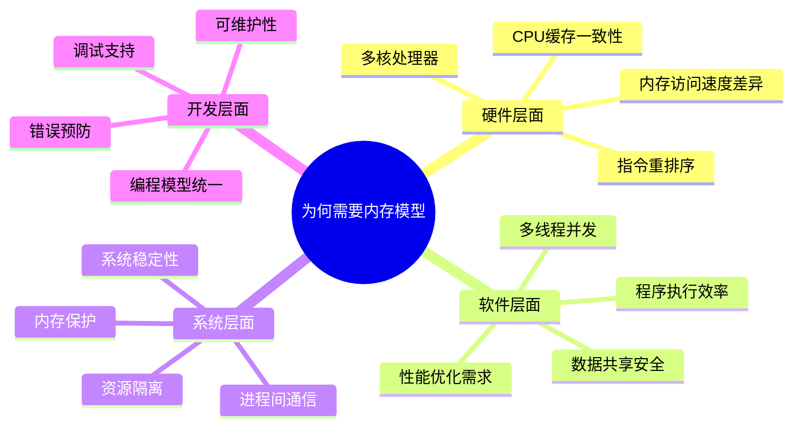
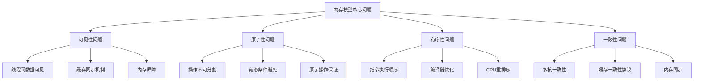
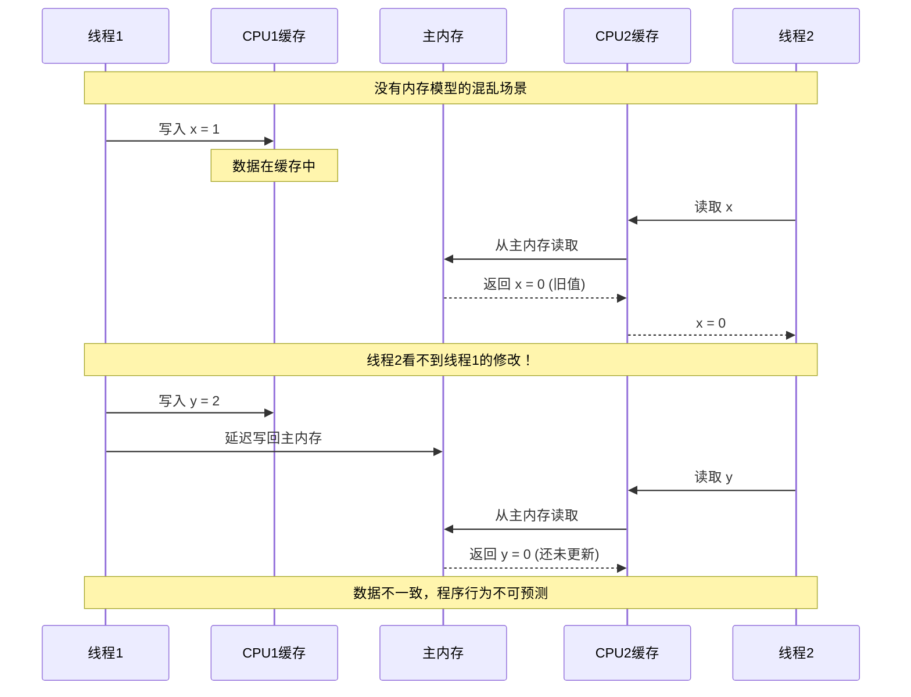

#### 目录介绍
- 01.为何设计内存模型
  - 1.1 根本原因说明
  - 1.2 解决核心问题
  - 1.3 没有内存模型场景

## 01.为何设计内存模型

### 1.1 根本原因说明

```mermaid
mindmap
  root((为何需要内存模型))
    硬件层面
      CPU缓存一致性
      多核处理器
      内存访问速度差异
      指令重排序
    
    软件层面
      多线程并发
      数据共享安全
      性能优化需求
      程序执行效率
    
    系统层面
      资源隔离
      内存保护
      进程间通信
      系统稳定性
    
    开发层面
      编程模型统一
      错误预防
      调试支持
      可维护性
```

### 1.2 解决核心问题

```mermaid
graph TD
    A[内存模型核心问题] --> B[可见性问题]
    A --> C[原子性问题]
    A --> D[有序性问题]
    A --> E[一致性问题]
    
    B --> B1[线程间数据可见]
    B --> B2[缓存同步机制]
    B --> B3[内存屏障]
    
    C --> C1[操作不可分割]
    C --> C2[竞态条件避免]
    C --> C3[原子操作保证]
    
    D --> D1[指令执行顺序]
    D --> D2[编译器优化]
    D --> D3[CPU重排序]
    
    E --> E1[多核一致性]
    E --> E2[缓存一致性协议]
    E --> E3[内存同步]
```

### 1.3 没有内存模型场景

```mermaid
sequenceDiagram
    participant T1 as 线程1
    participant Cache1 as CPU1缓存
    participant Memory as 主内存
    participant Cache2 as CPU2缓存
    participant T2 as 线程2
    
    Note over T1,T2: 没有内存模型的混乱场景
    
    T1->>Cache1: 写入 x = 1
    Note over Cache1: 数据在缓存中
    
    T2->>Cache2: 读取 x
    Cache2->>Memory: 从主内存读取
    Memory-->>Cache2: 返回 x = 0 (旧值)
    Cache2-->>T2: x = 0
    
    Note over T1,T2: 线程2看不到线程1的修改！
    
    T1->>Cache1: 写入 y = 2
    T1->>Memory: 延迟写回主内存
    
    T2->>Cache2: 读取 y
    Cache2->>Memory: 从主内存读取
    Memory-->>Cache2: 返回 y = 0 (还未更新)
    
    Note over T1,T2: 数据不一致，程序行为不可预测
```

