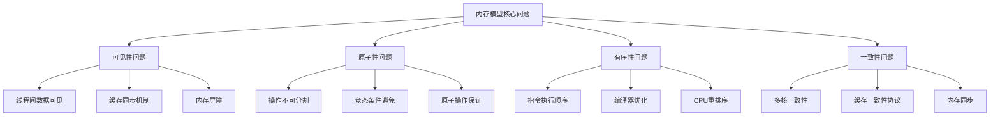

#### 目录介绍
- 01.为何设计内存模型
  - 1.1 根本原因说明
  - 1.2 解决核心问题

## 01.为何设计内存模型

### 1.1 根本原因说明

```mermaid
mindmap
  root((为何需要内存模型))
    硬件层面
      CPU缓存一致性
      多核处理器
      内存访问速度差异
      指令重排序
    
    软件层面
      多线程并发
      数据共享安全
      性能优化需求
      程序执行效率
    
    系统层面
      资源隔离
      内存保护
      进程间通信
      系统稳定性
    
    开发层面
      编程模型统一
      错误预防
      调试支持
      可维护性
```

### 1.2 解决核心问题

```mermaid
graph TD
    A[内存模型核心问题] --> B[可见性问题]
    A --> C[原子性问题]
    A --> D[有序性问题]
    A --> E[一致性问题]
    
    B --> B1[线程间数据可见]
    B --> B2[缓存同步机制]
    B --> B3[内存屏障]
    
    C --> C1[操作不可分割]
    C --> C2[竞态条件避免]
    C --> C3[原子操作保证]
    
    D --> D1[指令执行顺序]
    D --> D2[编译器优化]
    D --> D3[CPU重排序]
    
    E --> E1[多核一致性]
    E --> E2[缓存一致性协议]
    E --> E3[内存同步]
```

