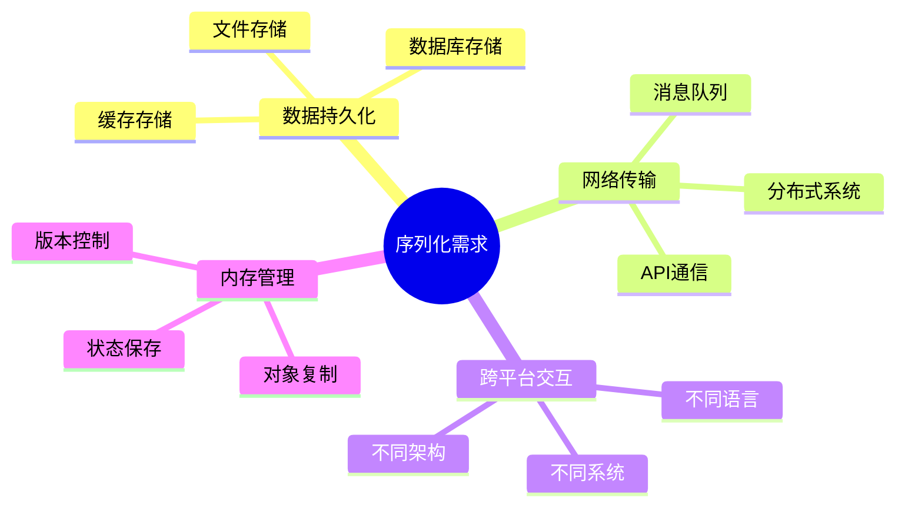
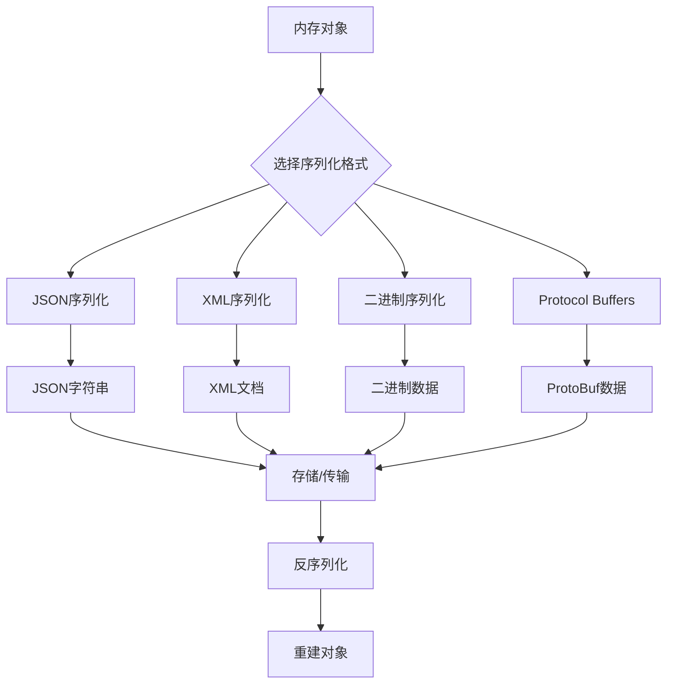

#### 目录介绍
- 01.为什么要序列化
  - 1.1 序列化定义
  - 1.2 核心需求
  - 1.3 应用场景
- 02.序列化怎么做
  - 2.1 序列化流程
  - 2.2 关键步骤
  - 2.3 核心设计原则

## 01.为什么要序列化

### 1.1 序列化定义

序列化（Serialization）是将内存中的对象状态转换为可存储或传输格式的过程。反序列化（Deserialization）则是将序列化后的数据重新转换为内存对象的过程。

### 1.2 核心需求

### 1.3 应用场景

| 场景 | 描述 | 示例 |
|------|------|------|
| **网络通信** | 在网络中传输复杂对象 | REST API、RPC调用 |
| **数据持久化** | 将对象保存到存储介质 | 数据库、文件系统 |
| **缓存机制** | 临时存储对象状态 | Redis、Memcached |
| **分布式系统** | 跨服务传输数据 | 微服务、消息队列 |
| **深拷贝** | 完整复制对象 | 对象克隆、状态备份 |

## 02.序列化怎么做

### 2.1 序列化流程

### 2.2 关键步骤

### 2.3 核心设计原则

