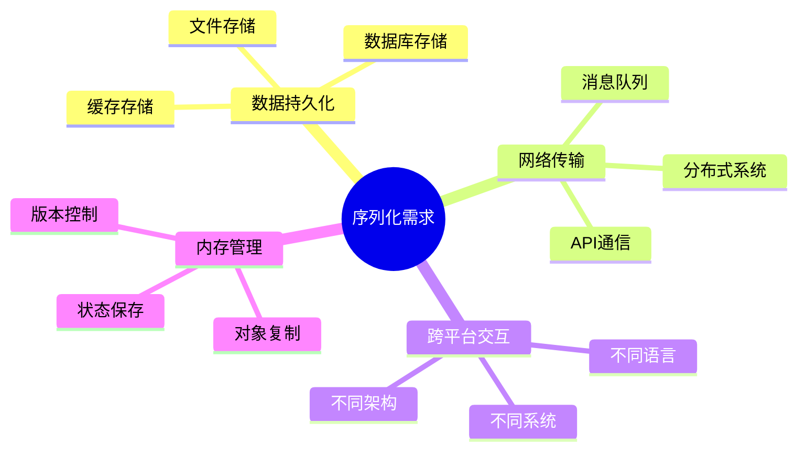
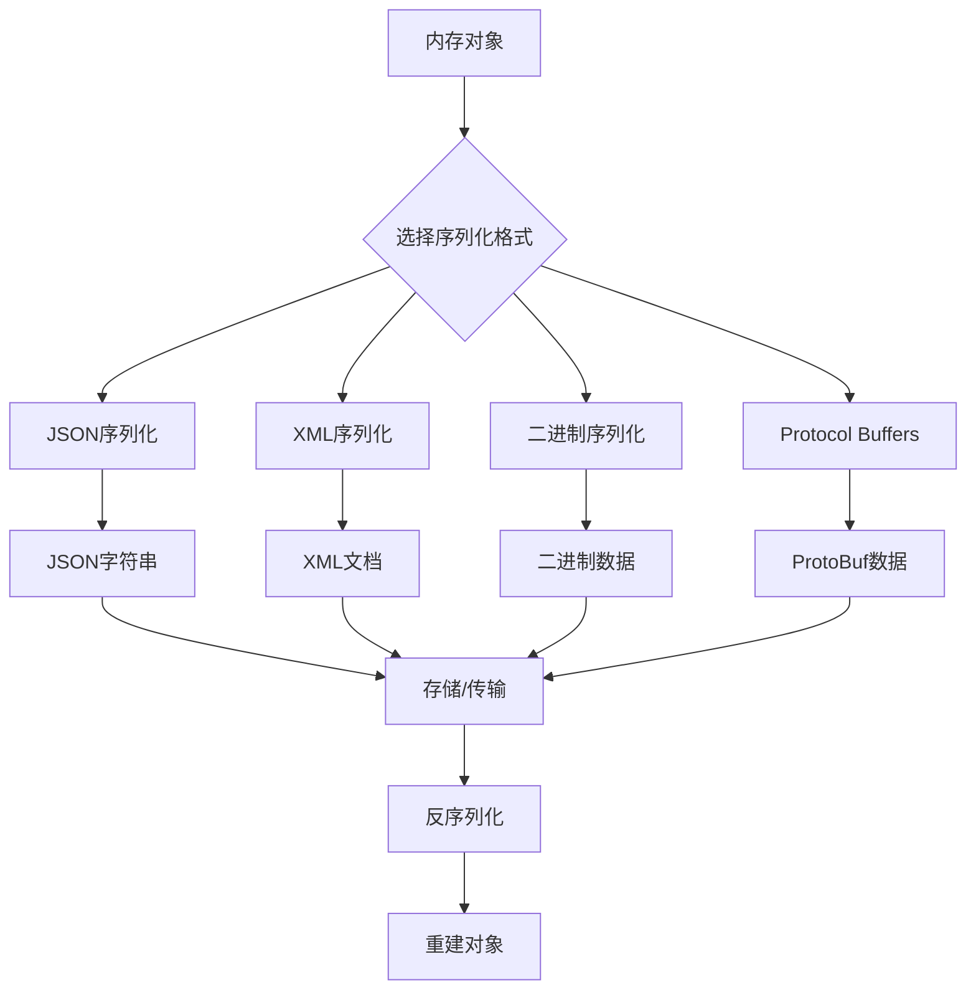
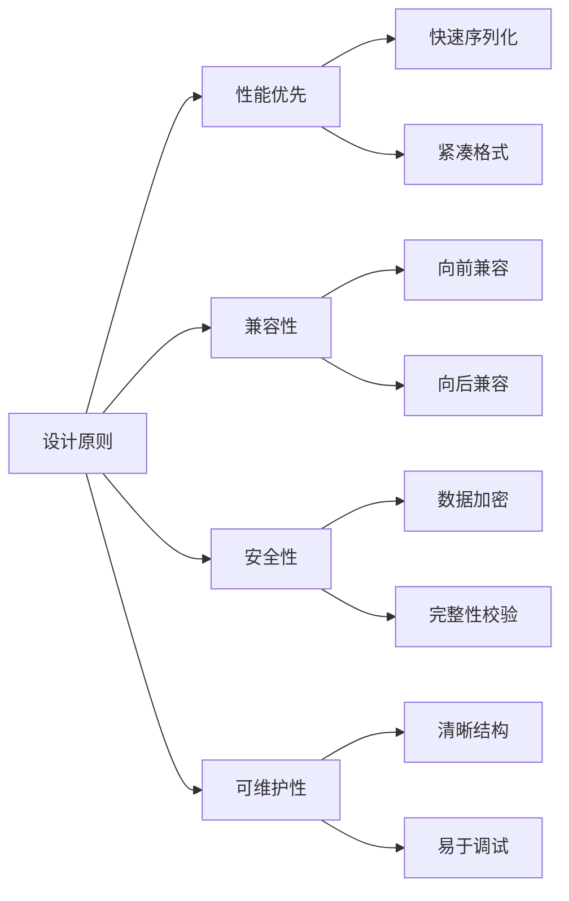
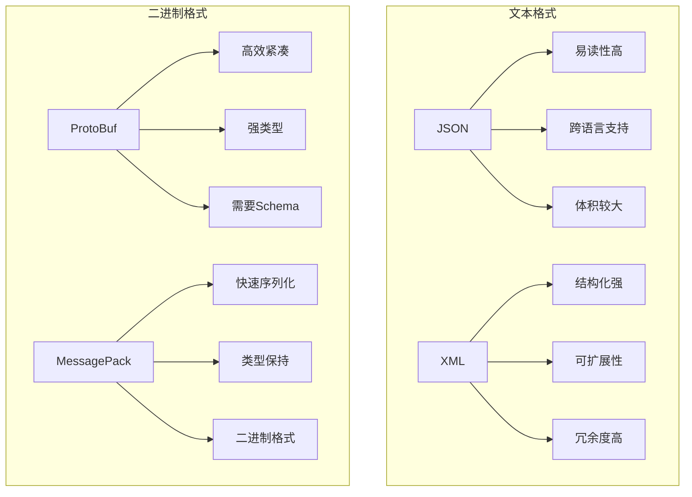
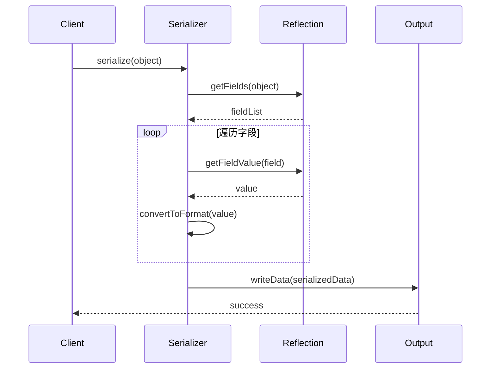
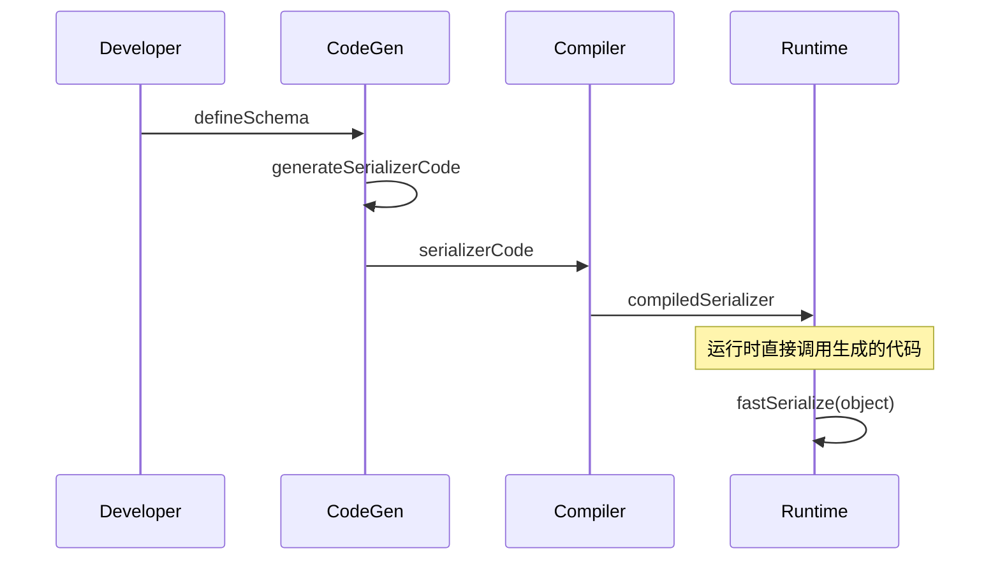
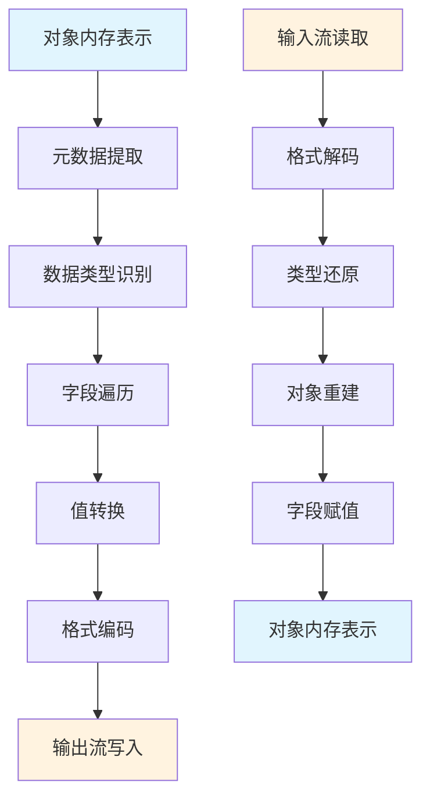
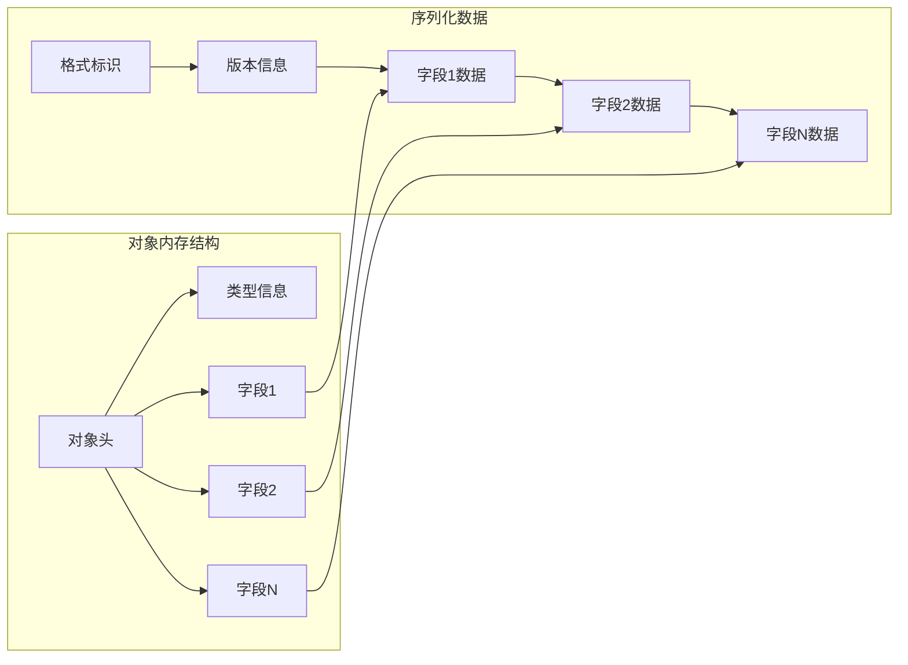

#### 目录介绍
- 01.为什么要序列化
  - 1.1 序列化定义
  - 1.2 核心需求
  - 1.3 应用场景
- 02.序列化怎么做
  - 2.1 序列化流程
  - 2.2 关键步骤
  - 2.3 核心设计原则
- 03.设计方案对比
  - 3.1 多种方案对比
  - 3.2 技术架构对比
  - 3.3 基于反射序列化
  - 3.4 基于代码生成序列化
- 04.序列化原理
  - 4.1 核心实现原理
  - 4.2 内存布局分析
  - 4.3 类型系统映射

## 01.为什么要序列化

### 1.1 序列化定义

序列化（Serialization）是将内存中的对象状态转换为可存储或传输格式的过程。反序列化（Deserialization）则是将序列化后的数据重新转换为内存对象的过程。

### 1.2 核心需求

### 1.3 应用场景

| 场景 | 描述 | 示例 |
|------|------|------|
| **网络通信** | 在网络中传输复杂对象 | REST API、RPC调用 |
| **数据持久化** | 将对象保存到存储介质 | 数据库、文件系统 |
| **缓存机制** | 临时存储对象状态 | Redis、Memcached |
| **分布式系统** | 跨服务传输数据 | 微服务、消息队列 |
| **深拷贝** | 完整复制对象 | 对象克隆、状态备份 |

## 02.序列化怎么做

### 2.1 序列化流程

### 2.2 关键步骤

1. **对象分析**：识别对象结构和属性
2. **格式选择**：根据需求选择序列化格式
3. **数据转换**：将对象转换为目标格式
4. **数据验证**：确保序列化数据完整性
5. **存储/传输**：保存或发送序列化数据

### 2.3 核心设计原则

## 03.设计方案对比

### 3.1 多种方案对比

| 方案 | 优点 | 缺点 | 适用场景 |
|------|------|------|----------|
| **JSON** | 人类可读、跨语言、简单 | 体积大、类型信息丢失 | Web API、配置文件 |
| **XML** | 结构化、可扩展、标准化 | 冗余大、解析复杂 | 企业系统、配置管理 |
| **Protocol Buffers** | 高效、强类型、版本兼容 | 需要定义文件、二进制 | 微服务、高性能系统 |
| **MessagePack** | 紧凑、快速、类型保持 | 二进制格式、调试困难 | 游戏、实时系统 |
| **Avro** | Schema演进、压缩率高 | 复杂性高、学习成本 | 大数据、流处理 |

### 3.2 技术架构对比

### 3.3 基于反射序列化

### 3.4 基于代码生成序列化

## 04.序列化原理

### 4.1 核心实现原理

### 4.2 内存布局分析

### 4.3 类型系统映射

| 源类型 | JSON | XML | ProtoBuf | MessagePack |
|--------|------|-----|----------|-------------|
| **整数** | number | text | varint | int |
| **浮点数** | number | text | fixed64 | float |
| **字符串** | string | text | string | str |
| **布尔值** | boolean | text | bool | bool |
| **数组** | array | elements | repeated | array |
| **对象** | object | element | message | map |
| **null** | null | empty | optional | nil |

