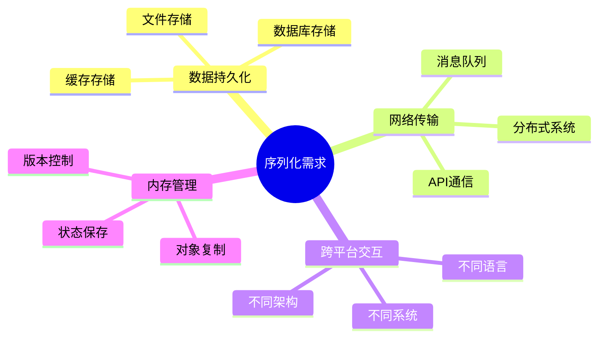

#### 目录介绍
- 01.为什么要序列化
  - 1.1 序列化定义
  - 1.2 核心需求

## 01.为什么要序列化

### 1.1 序列化定义

序列化（Serialization）是将内存中的对象状态转换为可存储或传输格式的过程。反序列化（Deserialization）则是将序列化后的数据重新转换为内存对象的过程。

### 1.2 核心需求

```mermaid
mindmap
  root((序列化需求))
    数据持久化
      文件存储
      数据库存储
      缓存存储
    网络传输
      API通信
      消息队列
      分布式系统
    跨平台交互
      不同语言
      不同系统
      不同架构
    内存管理
      对象复制
      状态保存
      版本控制
```

