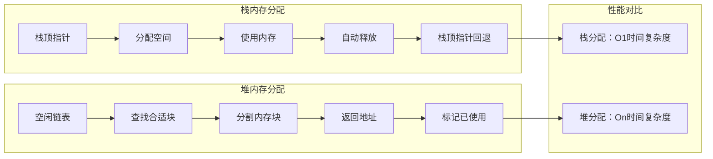
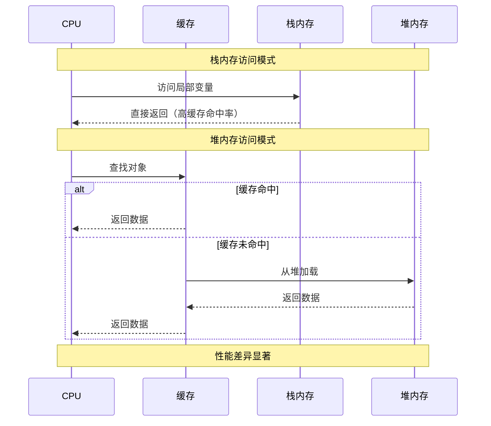
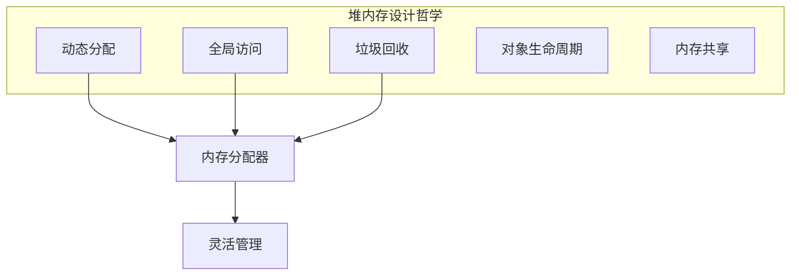
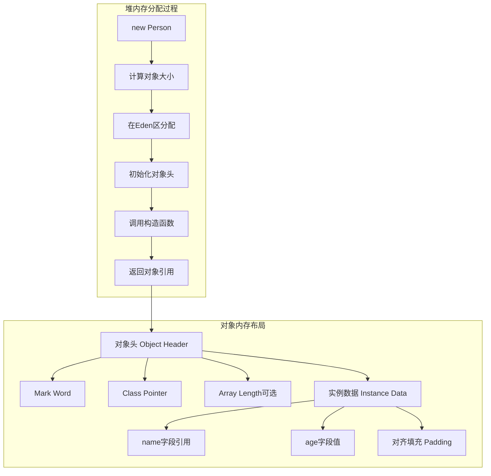
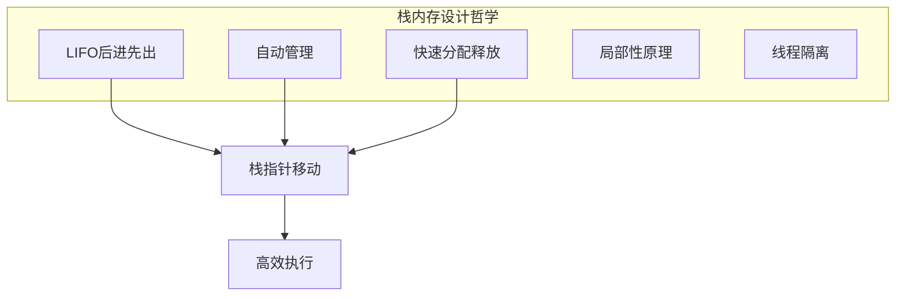
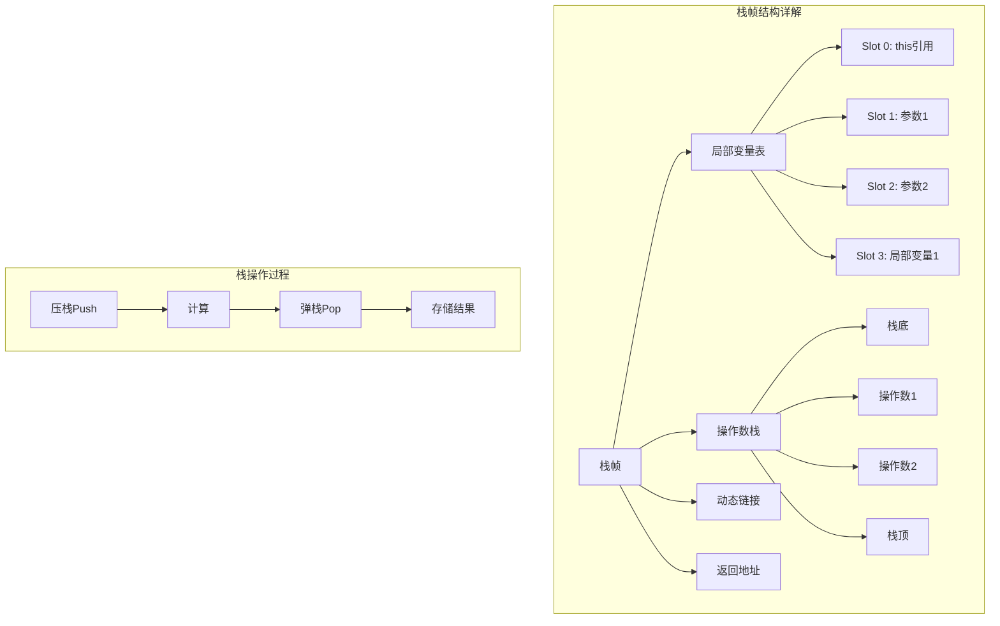

#### 目录介绍
- 01.核心设计思想
  - 1.1 为何分堆和栈
  - 1.2 栈设计思想
  - 1.3 堆设计思想
- 03.堆内存设计原理
  - 3.1 堆内存设计哲学
  - 3.2 堆内存的示例
  - 3.3 堆内存分配过程
- 04.栈内存设计原理
  - 4.1 栈内存设计哲学
  - 4.2 栈内存的示例
  - 4.3 栈帧结构详解


## 01.核心设计思想

### 1.1 为何分堆和栈

计算机内存只是一个巨大的字节数组，本身不区分"堆"和"栈"。分区是**软件层面的设计决策**，源于两类截然不同的内存需求：

| 需求特征 | 典型场景 | 生命周期 | 大小 |
|---------|---------|---------|------|
| 确定的、短暂的、有层级的 | 函数局部变量、返回地址 | 函数进入→函数返回 | 编译时已知 |
| 不确定的、跨越函数的 | 动态创建的对象、用户输入的数据 | 程序员/GC 决定 | 运行时才知 |

**如果只有一种内存区域**会怎样？

- 所有变量都用动态分配 → 每个局部变量都要 `malloc/free`，函数调用开销爆炸
- 所有变量都用栈 → 函数返回后数据消失，无法跨函数传递动态数据

**栈为"确定性"而生，堆为"灵活性"而生。**

更深一层：这个分裂源于**冯·诺依曼架构下函数调用的本质**——函数是嵌套的、后进先出的（A 调 B，B 调 C，C 先返回）。这种 LIFO 特性天然匹配栈结构。而程序创建的数据对象不遵循 LIFO，需要自由分配/释放，这就是堆。

### 1.2 栈设计思想

栈的设计思想：用约束换极致性能

```
核心约束：后进先出（LIFO），大小编译时确定

换来的好处：
  分配 = 移动一个指针          O(1)，1 条指令
  释放 = 反向移动同一个指针     O(1)，1 条指令
  无碎片                       连续分配，连续释放
  无需元数据                   不需要记录"哪块空闲"
  缓存友好                     时间局部性+空间局部性极佳
```

栈是一种**被故意限制了能力的内存管理方式**。正因为限制了使用方式（只能从顶部操作），才能做到极致简单和极致快。


### 1.2 内存分配策略



### 1.3 内存访问对比




## 03.堆内存设计原理

### 3.1 堆内存设计哲学



### 3.2 堆内存的示例

```java
// 堆内存工作原理示例
public class HeapPrincipleExample {
    
    public void demonstrateHeapOperation() {
        // 对象创建过程
        Person person = new Person("张三", 25);
        
        // 数组创建
        int[] numbers = new int[100];
        
        // 集合创建
        List<String> list = new ArrayList<>();
        list.add("Hello");
        list.add("World");
        
        // 大对象创建
        byte[] bigData = new byte[1024 * 1024]; // 1MB，可能直接进入老年代
        
        // 对象引用传递
        processPerson(person);
        
        // 方法结束，栈中的引用消失，但堆中的对象可能仍然存在
    }
    
    private void processPerson(Person p) {
        // p是对堆中Person对象的另一个引用
        p.setAge(26); // 修改堆中的对象
        
        // 创建新对象
        Person newPerson = new Person("李四", 30);
        // newPerson引用在方法结束时消失，但对象在堆中等待GC
    }
    
    static class Person {
        private String name;  // 引用类型字段
        private int age;      // 基本类型字段
        
        public Person(String name, int age) {
            this.name = name; // 字符串对象也在堆中
            this.age = age;
        }
        
        // getter和setter方法
        public void setAge(int age) { this.age = age; }
    }
}
```

### 3.3 堆内存分配过程



## 04.栈内存设计原理

### 4.1 栈内存设计哲学



### 4.2 栈内存的示例

```java
// 栈内存工作原理示例
public class StackPrincipleExample {
    
    public void demonstrateStackOperation() {
        // 栈帧1开始
        int a = 10;        // 局部变量表slot 0
        double b = 3.14;   // 局部变量表slot 1-2 (double占2个slot)
        
        String str = processData(a, b); // 方法调用，创建新栈帧
        
        System.out.println(str);
        // 栈帧1结束，所有局部变量自动销毁
    }
    
    private String processData(int num, double decimal) {
        // 栈帧2开始
        // 参数：num在slot 0, decimal在slot 1-2
        StringBuilder sb = new StringBuilder(); // 局部变量slot 3
        
        // 操作数栈操作
        sb.append("Number: ");  // sb引用压入操作数栈
        sb.append(num);         // num值压入操作数栈，调用append
        sb.append(", Decimal: ");
        sb.append(decimal);     // decimal值压入操作数栈
        
        String result = sb.toString(); // 调用toString，结果压入操作数栈
        return result;          // 返回值通过操作数栈传递
        // 栈帧2结束，局部变量自动销毁
    }
}
```

### 4.3 栈帧结构详解




