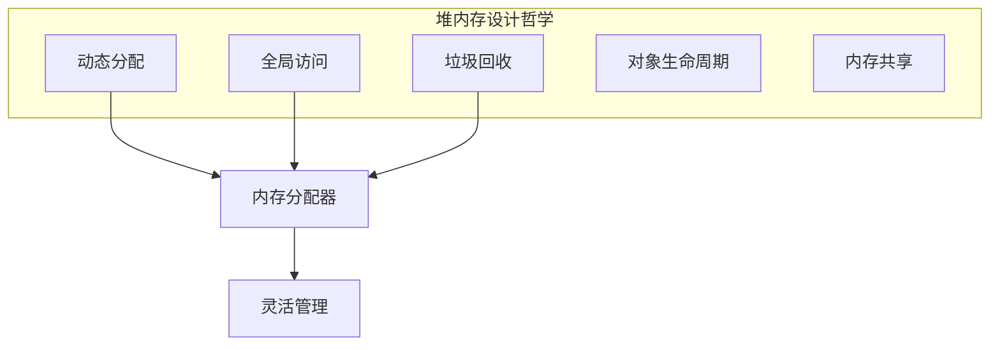
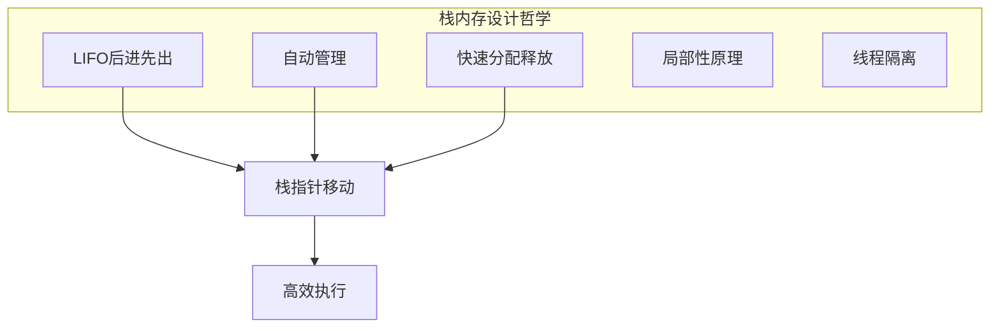

#### 目录介绍
- 1.核心设计思想
  - 1.1 为何分堆和栈
  - 1.2 栈设计思想
  - 1.3 堆设计思想
- 2.设计哲学探索
  - 2.1 堆设计哲学
  - 2.2 栈设计哲学
  - 2.3 栈和堆原理
- 3.栈的完整机制
  - 3.1 硬件支持
  - 3.2 栈帧结构
  - 3.3 栈内存案例
- 4.堆的完整机制
  - 4.1 堆分层架构
  - 4.2 malloc设计
  - 4.3 堆内存案例
- 5.多线程场景
  - 5.1 栈是线程安全
  - 5.2 堆需处理并发
- 6.堆和栈性能
  - 6.1 性能指标
  - 6.2 量化案例
  - 6.3 结果分析
  - 6.4 深层原因
  - 6.5 核心结论


## 01.核心设计思想

### 1.1 为何分堆和栈

计算机内存只是一个巨大的字节数组，本身不区分"堆"和"栈"。分区是**软件层面的设计决策**，源于两类截然不同的内存需求：

| 需求特征 | 典型场景 | 生命周期 | 大小 |
|---------|---------|---------|------|
| 确定的、短暂的、有层级的 | 函数局部变量、返回地址 | 函数进入→函数返回 | 编译时已知 |
| 不确定的、跨越函数的 | 动态创建的对象、用户输入的数据 | 程序员/GC 决定 | 运行时才知 |

**如果只有一种内存区域**会怎样？

- 所有变量都用动态分配 → 每个局部变量都要 `malloc/free`，函数调用开销爆炸
- 所有变量都用栈 → 函数返回后数据消失，无法跨函数传递动态数据

**栈为"确定性"而生，堆为"灵活性"而生。**

更深一层：这个分裂源于**冯·诺依曼架构下函数调用的本质**——函数是嵌套的、后进先出的（A 调 B，B 调 C，C 先返回）。这种 LIFO 特性天然匹配栈结构。而程序创建的数据对象不遵循 LIFO，需要自由分配/释放，这就是堆。

### 1.2 栈设计思想

栈的设计思想：用约束换极致性能

```
核心约束：后进先出（LIFO），大小编译时确定

换来的好处：
  分配 = 移动一个指针          O(1)，1 条指令
  释放 = 反向移动同一个指针     O(1)，1 条指令
  无碎片                       连续分配，连续释放
  无需元数据                   不需要记录"哪块空闲"
  缓存友好                     时间局部性+空间局部性极佳
```

栈是一种**被故意限制了能力的内存管理方式**。正因为限制了使用方式（只能从顶部操作），才能做到极致简单和极致快。

### 1.3 堆设计思想

堆的设计思想：用性能换自由度

```
核心自由：任意时刻分配任意大小，任意时刻释放任意块

付出的代价：
  分配 = 搜索空闲块 + 分割      O(1)~O(n)
  释放 = 合并相邻空闲块          O(1)~O(log n)
  碎片                          内部碎片 + 外部碎片
  元数据开销                     每块需要记录大小、状态等
  缓存不友好                     分配顺序 ≠ 访问顺序
```

## 2.设计哲学探索

### 2.1 堆设计哲学

堆内存设计哲学



### 2.2 栈设计哲学




### 2.3 栈和堆原理

```
          栈                                堆
  ────────────────────          ────────────────────
  约束：LIFO                    自由：任意顺序分配释放
  ↓                             ↓
  分配 = 移指针                  分配 = 搜索+切割
  释放 = 移回指针                释放 = 归还+合并
  ↓                             ↓
  O(1) 确定性延迟               O(1)~O(n) 不确定延迟
  零碎片                         有碎片
  零元数据                       16 字节/块元数据
  缓存命中率极高                  缓存命中率不确定
  ↓                             ↓
  CPU 提供硬件支持               无专用硬件
  (RSP, PUSH, POP, CALL, RET)   (纯软件管理)
  ↓                             ↓
  每线程独立，天然线程安全         共享，需要锁/分区
  ↓                             ↓
  大小固定（默认8MB）             可增长到虚拟地址空间上限
  生命周期绑定函数调用             生命周期由程序员/GC 控制
```

**设计哲学的本质**：

栈和堆体现了系统设计中最经典的取舍——**约束 vs 自由**。

栈选择了最严格的约束（LIFO、编译时确定大小、绑定函数生命周期），换来了最极致的性能（一条指令分配、零碎片、硬件支持）。

堆选择了最大的自由度（任意时刻、任意大小、任意生命周期），付出了复杂性的代价（搜索算法、碎片管理、并发控制、GC）。

**二者不可互相替代**——栈处理不了动态大小和跨函数生命周期，堆达不到栈的性能。这就是为什么六十年来，每一种编程语言、每一个操作系统，都保留了堆和栈的二元设计。

## 3.栈的完整机制

### 3.1 硬件支持

CPU 专门为栈设计了寄存器和指令：

```
x86:
  RSP (Stack Pointer)   — 永远指向栈顶
  RBP (Base Pointer)    — 指向当前栈帧的底部（可选）
  PUSH reg              — RSP -= 8; [RSP] = reg   （一条指令完成）
  POP  reg              — reg = [RSP]; RSP += 8
  CALL addr             — PUSH RIP; JMP addr       （保存返回地址+跳转）
  RET                   — POP RIP                   （恢复返回地址+跳回）

ARM:
  SP  (Stack Pointer)
  LR  (Link Register)   — 存返回地址，不需要压栈（一级调用时）
  STP/LDP               — 成对压入/弹出寄存器
```

**栈是唯一有 CPU 硬件直接支持的内存区域。** 堆没有专门的硬件指令。


### 3.2 栈帧结构

每次函数调用在栈上创建一个**栈帧（Stack Frame）**：

```
高地址
┌──────────────────────┐
│  调用者的栈帧          │
├──────────────────────┤ ← 调用前的 RSP
│  返回地址 (8 bytes)    │ ← CALL 指令自动压入
├──────────────────────┤
│  保存的 RBP           │ ← 可选，用于栈回溯
├──────────────────────┤ ← RBP 指向这里
│  局部变量 a (4 bytes)  │ ← RBP - 4
│  局部变量 b (4 bytes)  │ ← RBP - 8
│  局部变量 buf[32]      │ ← RBP - 40
├──────────────────────┤ ← RSP 指向这里
│  （下一次调用的空间）    │
低地址
```

### 3.3 栈内存案例


```cpp
int add(int x, int y) {
  int result = x + y;
  return result;
}

int main() {
  int a = 10;
  int b = 20;
  int c = add(a, b);
  return 0;
}
```

**x86-64 Linux（System V ABI）** 下的执行过程：

```
Step 1: main() 开始执行
  RSP = 0x7FFF_0100

  栈状态:
  0x7FFF_0100 │              │ ← RSP

Step 2: int a = 10; int b = 20;
  编译器将 a, b 分配在栈上（或直接用寄存器）
  实际上 x86-64 前6个整数参数用寄存器传递
  a → 栈上 [RSP-4]
  b → 栈上 [RSP-8]
  RSP -= 16 (对齐)

  0x7FFF_00F0 │ b = 20       │ ← RSP
  0x7FFF_00F4 │ a = 10       │
  0x7FFF_0100 │ ...          │

Step 3: 调用 add(a, b)
  // 参数通过寄存器传递（x86-64 ABI）
  MOV  EDI, 10        // 第一个参数 → EDI
  MOV  ESI, 20        // 第二个参数 → ESI
  CALL add            // RSP -= 8, 压入返回地址, 跳转到 add

  0x7FFF_00E8 │ 返回地址      │ ← RSP (CALL 自动压入)
  0x7FFF_00F0 │ b = 20       │
  0x7FFF_00F4 │ a = 10       │

Step 4: add() 函数体
  // 序言(prologue)
  PUSH RBP            // 保存调用者的 RBP
  MOV  RBP, RSP       // 建立新栈帧

  // int result = x + y
  LEA  EAX, [EDI+ESI] // result = x + y（直接在寄存器算）

  // 尾声(epilogue)
  POP  RBP            // 恢复调用者的 RBP
  RET                 // POP RIP, 跳回 main

Step 5: 返回 main()
  RET 执行后:
  - RSP 恢复到 0x7FFF_00F0
  - 返回值在 EAX 中 (= 30)
  - add 的栈帧瞬间"消失"（RSP 移回去，数据还在但逻辑上已无效）
```

**关键洞察**：

1. **分配 = RSP 减一个常数**（一条 `SUB RSP, N` 指令），不需要搜索空闲块
2. **释放 = RSP 加回去**（一条 `ADD RSP, N`），不需要合并、不需要标记
3. **栈上的"旧数据"不会被清零**——只是 RSP 移过去了，下次调用会覆盖。这就是为什么未初始化的局部变量是"垃圾值"
4. **函数返回后访问局部变量的地址是未定义行为**——数据可能还在，但随时会被下一次函数调用覆盖

## 4.堆的完整机制

### 4.1 堆分层架构

```
应用程序
  │  malloc(32)
  ▼
┌──────────────────────────────────────────────┐
│ 用户态分配器 (glibc malloc / tcmalloc / jemalloc) │
│                                              │
│  维护空闲链表/空闲树，从已有的大块中切小块      │
│  大多数分配在这一层就完成了，不需要系统调用       │
└──────────────┬───────────────────────────────┘
               │ 空间不够时
               ▼
┌──────────────────────────────────────────────┐
│ 系统调用                                      │
│  brk/sbrk  → 扩展进程数据段（连续）            │
│  mmap      → 映射新的虚拟内存区域（不连续）      │
└──────────────┬───────────────────────────────┘
               │
               ▼
┌──────────────────────────────────────────────┐
│ 内核虚拟内存管理                               │
│  分配虚拟页，加入进程的 VMA 链表                │
│  此时还没有分配物理内存！                        │
└──────────────┬───────────────────────────────┘
               │ 首次访问时触发 Page Fault
               ▼
┌──────────────────────────────────────────────┐
│ 物理页帧分配 (Buddy System + Slab)            │
│  从物理内存中分配 4KB 页帧                     │
│  建立页表映射：虚拟地址 → 物理地址              │
└──────────────────────────────────────────────┘
```

### 4.2 malloc设计


glibc malloc 的核心设计

**核心数据结构：Chunk**

```
每个 malloc 返回的块实际上长这样：

  ┌──────────────────────────┐
  │ prev_size (8 bytes)       │ ← 前一个 chunk 的大小（仅当前一个空闲时有效）
  ├──────────────────────────┤
  │ size (8 bytes)            │ ← 本 chunk 大小 + 3个标志位
  │ [P: prev_in_use]         │ ← 最低位：前一个 chunk 是否在使用
  │ [M: is_mmapped]          │ ← 第2位：是否由 mmap 分配
  │ [A: non_main_arena]      │ ← 第3位：是否属于非主 arena
  ├──────────────────────────┤ ← malloc 返回的指针指向这里
  │                          │
  │   用户数据 (N bytes)      │
  │                          │
  ├──────────────────────────┤
  │ (下一个 chunk 的 header)  │
  └──────────────────────────┘

最小 chunk = 32 bytes (64位系统)
  16 bytes header + 16 bytes 最小数据（对齐）
```

**你 malloc(1) 实际占用 32 字节**。16 字节 header + 16 字节最小对齐。这就是**内部碎片**。

**分配策略：按大小分级**

```
glibc malloc 把块分为几类，用不同策略管理：

┌─────────────────────────────────────────────┐
│ Fast Bins (16~160 bytes, 10 个 bin)          │
│   单链表，LIFO                               │
│   不合并相邻空闲块（牺牲碎片换速度）            │
│   分配释放最快：O(1)                          │
├─────────────────────────────────────────────┤
│ Small Bins (< 1024 bytes, 62 个 bin)         │
│   双向链表，FIFO                              │
│   每个 bin 中所有 chunk 大小相同              │
│   精确匹配，O(1)                              │
├─────────────────────────────────────────────┤
│ Large Bins (≥ 1024 bytes, 63 个 bin)         │
│   双向链表，按大小排序                         │
│   最佳适配搜索，O(log n)                      │
├─────────────────────────────────────────────┤
│ Unsorted Bin (1 个)                          │
│   刚释放的 chunk 先放这里                     │
│   下次分配时顺便整理到对应 bin                 │
├─────────────────────────────────────────────┤
│ mmap 直接分配 (≥ 128KB 默认阈值)              │
│   直接向内核要整页                             │
│   释放时直接还给内核                           │
└─────────────────────────────────────────────┘
```

### 4.3 堆内存案例


堆内存案例：malloc(48) 的完整过程

```cpp
void example() {
  char* p = (char*)malloc(48);
  strcpy(p, "hello");
  free(p);
}
```

**Step 1: malloc(48) 进入 glibc**

```
请求 48 字节 → 加上 16 字节 header → 实际需要 64 字节
64 字节对齐后仍是 64 字节
→ 属于 Fast Bin 范围（≤ 160 字节）
```

**Step 2: 查找 Fast Bin**

```
fast_bin[index(64)] → 链表头
  │
  有空闲 chunk？
  ├── 有 → 取出链表头（一次 CAS），返回 chunk + 16 的地址
  │        时间：~10ns
  │
  └── 没有 → 查找 Small Bin
```

**Step 3: 查找 Small Bin（如果 Fast Bin 为空）**

```
small_bin[index(64)] → 双向链表
  │
  有空闲 chunk？
  ├── 有 → 取出链表尾（FIFO），返回
  │
  └── 没有 → 查找 Unsorted Bin
```

**Step 4: 查找 Unsorted Bin（如果 Small Bin 为空）**

```
遍历 Unsorted Bin：
  对每个 chunk：
    如果大小恰好匹配 → 取出返回
    否则 → 放入对应的 Small/Large Bin（顺便整理）
  
  遍历完仍没找到 → 从 Top Chunk 切割
```

**Step 5: Top Chunk 切割（如果所有 Bin 都没有）**

```
Top Chunk = 堆顶的一大块连续空闲内存

  ┌────────────────────────────┐
  │        Top Chunk           │
  │    (假设还有 4MB)           │
  └────────────────────────────┘
  
  切出 64 字节：
  ┌─────────┬─────────────────┐
  │ 64B     │  剩余 Top Chunk  │
  │(返回给用户)│                │
  └─────────┴─────────────────┘
```

**Step 6: Top Chunk 也不够（极端情况）**

```
调用 sbrk() 或 mmap() 向内核申请新的内存页
内核分配虚拟页 → 首次访问时 Page Fault → 分配物理页
```

**Step 7: free(p)**

```
free(p)：
  1. 指针 - 16 得到 chunk header
  2. 读取 size = 64 → 属于 Fast Bin
  3. 将 chunk 挂到 fast_bin[index(64)] 链表头
  4. 不清零数据，不合并相邻块（Fast Bin 特性）
  
  时间：~5ns（一次链表头插入）
```

**注意：free 后数据还在内存中**，只是标记为空闲。这就是为什么 use-after-free 漏洞可以读到"旧数据"。


```java
// 堆内存工作原理示例
public class HeapPrincipleExample {
    
    public void demonstrateHeapOperation() {
        // 对象创建过程
        Person person = new Person("张三", 25);
        
        // 数组创建
        int[] numbers = new int[100];
        
        // 集合创建
        List<String> list = new ArrayList<>();
        list.add("Hello");
        list.add("World");
        
        // 大对象创建
        byte[] bigData = new byte[1024 * 1024]; // 1MB，可能直接进入老年代
        
        // 对象引用传递
        processPerson(person);
        
        // 方法结束，栈中的引用消失，但堆中的对象可能仍然存在
    }
    
    private void processPerson(Person p) {
        // p是对堆中Person对象的另一个引用
        p.setAge(26); // 修改堆中的对象
        
        // 创建新对象
        Person newPerson = new Person("李四", 30);
        // newPerson引用在方法结束时消失，但对象在堆中等待GC
    }
    
    static class Person {
        private String name;  // 引用类型字段
        private int age;      // 基本类型字段
        
        public Person(String name, int age) {
            this.name = name; // 字符串对象也在堆中
            this.age = age;
        }
        
        // getter和setter方法
        public void setAge(int age) { this.age = age; }
    }
}
```

## 5.多线程场景

### 5.1 栈是线程安全


```
每个线程有自己独立的栈：

线程1 的栈:  0x7FFF_0000 ~ 0x7FFE_0000 (默认 8MB)
线程2 的栈:  0x7FFD_0000 ~ 0x7FFC_0000
线程3 的栈:  0x7FFB_0000 ~ 0x7FFA_0000

互不干扰，零竞争，不需要锁
```

### 5.2 堆需处理并发

```
glibc: Arena 机制
  主线程 → main_arena（只有一个，用 brk 扩展）
  其他线程 → thread_arena（用 mmap 创建，数量 = min(8*核数, 线程数)）
  
  多个线程可能共享 arena → arena 内部有 mutex
  但 arena 数量较多，竞争被分散

tcmalloc / jemalloc: Thread-Local Cache
  每个线程有自己的小块缓存（类似 per-CPU 思想）
  小块分配/释放完全在本线程缓存中完成 → 零锁
  只有缓存用完/太满时才与全局堆交互 → 偶尔加锁

  ┌──────────────┐  ┌──────────────┐
  │ Thread 1     │  │ Thread 2     │
  │ ┌──────────┐ │  │ ┌──────────┐ │
  │ │Local Cache│ │  │ │Local Cache│ │
  │ │ 16B: ●●●  │ │  │ │ 16B: ●●   │ │
  │ │ 32B: ●●   │ │  │ │ 32B: ●●●● │ │
  │ │ 64B: ●    │ │  │ │ 64B: ●●   │ │
  │ └──────────┘ │  │ └──────────┘ │
  └──────┬───────┘  └──────┬───────┘
         │                  │
         ▼ 缓存不够时       ▼
  ┌─────────────────────────────────┐
  │       Central Free List          │
  │       (需要锁/CAS)               │
  └─────────────────────────────────┘
```

## 6.堆和栈性能

### 6.1 性能指标

| 指标 | 栈 | 堆 | 差距倍数 |
|------|-----|-----|---------|
| 分配耗时 | ~1ns（1条指令 `sub rsp, N`） | ~50-200ns（malloc路径） | **50-200x** |
| 释放耗时 | ~1ns（1条指令 `add rsp, N`） | ~30-100ns（free路径） | **30-100x** |
| L1缓存命中率 | ~95-99% | ~50-70% | **1.4-2x** |
| 内存碎片 | 0%（连续增长/收缩） | 10-30%（碎片化） | ∞ |
| 线程安全开销 | 0（每线程独立栈） | 有锁/arena开销 | ∞ |
| 地址连续性 | 严格连续 | 随机分散 | - |

### 6.2 量化案例

量化案例：10万次对象创建/销毁

场景设计：分配一个64字节结构体，循环100,000次，对比栈分配 vs 堆分配的全链路开销。

```cpp
struct Packet {  // 64 bytes, 恰好一个缓存行
  uint32_t seq;
  uint32_t type;
  uint64_t timestamp;
  char payload[44];
  uint32_t checksum;
};
```

> 1.栈分配路径的CPU指令级分析

```cpp
void ProcessOnStack() {
  for (int i = 0; i < 100000; ++i) {
    Packet pkt;           // sub rsp, 64
    pkt.seq = i;          // mov [rsp+0], eax
    pkt.checksum = i ^ 1; // mov [rsp+60], eax
    DoSomething(&pkt);
  }                       // add rsp, 64 (隐含在函数epilogue)
}
```

**CPU执行过程（每次迭代）：**

```
指令                  周期数    说明
─────────────────────────────────────────────
sub rsp, 64          1 cycle   RSP下移，分配完成
mov [rsp+0], eax     1 cycle   L1命中，栈顶始终在缓存
mov [rsp+60], eax    1 cycle   同一缓存行，命中
call DoSomething     ~         业务逻辑
add rsp, 64          1 cycle   RSP上移，释放完成
─────────────────────────────────────────────
分配+释放总计：       ~2 cycles ≈ 0.7ns @3GHz
```

**为什么L1几乎100%命中？**

- 栈顶地址在一个极小范围内反复使用（同一个64B区域）
- CPU的L1 Cache是32-64KB，栈的活跃区域远小于此
- 循环中每次 `pkt` 都在同一地址（RSP没变化），物理上是同一缓存行的覆写

> 2.堆分配路径的CPU指令级分析

```cpp
void ProcessOnHeap() {
  for (int i = 0; i < 100000; ++i) {
    auto* pkt = new Packet();  // malloc(64) → 复杂路径
    pkt->seq = i;
    pkt->checksum = i ^ 1;
    DoSomething(pkt);
    delete pkt;                // free(ptr) → 复杂路径
  }
}
```

**`malloc(64)` 内部执行路径（glibc，最优情况走Fast Bin）：**

```
步骤                         周期数      说明
────────────────────────────────────────────────────────────────
1. 计算实际大小               2 cycles    64 + 16(header) = 80 → 对齐到80
2. 确定bin索引                3 cycles    80/16 = 5, 查fast_bin[5]
3. 读取fast_bin[5]头指针       ~4 cycles   该指针可能在L1/L2
4. CAS摘取链表头节点           ~10 cycles  原子操作 lock cmpxchg
5. 如fast bin为空→进small bin  +20 cycles  更复杂的链表操作
6. 返回用户指针(跳过header)    1 cycle
────────────────────────────────────────────────────────────────
malloc最优路径：              ~20 cycles ≈ 7ns @3GHz
malloc典型路径（含竞争）：     ~60 cycles ≈ 20ns
```

**`free(ptr)` 内部执行路径：**

```
步骤                         周期数      说明
────────────────────────────────────────────────────────────────
1. 回退指针找chunk header      2 cycles    ptr - 16
2. 读取chunk size              4 cycles    可能L2命中
3. 确定归属bin                 2 cycles
4. CAS插入链表头               ~10 cycles  原子操作
5. 检查相邻chunk是否可合并     ~8 cycles   读前后chunk的header
────────────────────────────────────────────────────────────────
free最优路径：                ~26 cycles ≈ 9ns @3GHz
```

### 6.3 结果分析

量化汇总（100,000次迭代）

```
┌─────────────────────┬──────────────┬──────────────┬────────────┐
│ 开销项               │  栈分配       │  堆分配       │  倍数差     │
├─────────────────────┼──────────────┼──────────────┼────────────┤
│ 单次分配             │  ~0.3ns      │  ~7-20ns     │  23-67x    │
│ 单次释放             │  ~0.3ns      │  ~9-26ns     │  30-87x    │
│ 单次分配+释放        │  ~0.7ns      │  ~16-46ns    │  23-66x    │
├─────────────────────┼──────────────┼──────────────┼────────────┤
│ 10万次分配+释放      │  ~70μs       │  ~1.6-4.6ms  │  23-66x    │
│ L1 miss次数(估)      │  ~0           │  ~10,000+    │  ∞         │
│ 原子操作次数         │  0            │  200,000     │  ∞         │
├─────────────────────┼──────────────┼──────────────┼────────────┤
│ 额外内存开销/次      │  0 byte      │  16 byte     │  ∞         │
│ 10万次内存浪费       │  0            │  1.6MB       │  ∞         │
└─────────────────────┴──────────────┴──────────────┴────────────┘
```

### 6.4 深层原因

> 1.指令数量差异

```
栈分配：1条指令 (sub rsp, N)
堆分配：~15-30条指令 (计算size → 查bin → CAS → 返回指针)

1条 vs 30条 = 30x 基础差距
```

> 2.缓存行为差异

**栈的访问模式——极致时间局部性：**
```
迭代1: pkt地址 = 0x7FFF_1000  → L1 miss(首次), 加载到L1
迭代2: pkt地址 = 0x7FFF_1000  → L1 hit (同一地址复用!)
迭代3: pkt地址 = 0x7FFF_1000  → L1 hit
...
10万次迭代：仅第1次miss，后续99,999次全部hit
```

**堆的访问模式——碎片化空间局部性：**
```
迭代1: pkt地址 = 0x5555_A000  → L1 miss, 加载
迭代1: free后该地址的缓存行可能被后续逻辑驱逐
迭代2: pkt地址 = 0x5555_A000  → 可能L1 hit(fast bin快速复用同一块)
                                 也可能L1 miss(被驱逐了)
```

即使fast bin快速复用同一块内存，`malloc/free`本身要访问的元数据（bin头指针、chunk header）散布在不同缓存行，引入额外的cache miss。

**cache miss的代价：**
```
L1 hit:   ~1ns    (4 cycles @4GHz)
L2 hit:   ~3-5ns  (12-20 cycles)
L3 hit:   ~10-15ns (40-60 cycles)
DRAM:     ~60-100ns (240-400 cycles)

一次L3 miss = 一次栈分配+释放的 ~140倍时间
```

> 3.原子操作开销

堆分配器（glibc malloc）在多线程环境下需要保护共享数据结构：

```
lock cmpxchg (无竞争): ~10 cycles
  → 需要锁缓存行，通知MESI协议

lock cmpxchg (有竞争): ~50-200 cycles  
  → 缓存行弹跳(cache-line bouncing)
  → 核间通信延迟 ~40-80ns

栈：完全不需要任何同步原语（每线程独立栈）
```

> 4.分支预测与流水线

```
栈分配：无分支，CPU流水线无stall
堆分配：多个分支判断
  if (size < FAST_BIN_MAX)    → 分支1
  if (fast_bin[idx] != NULL)  → 分支2  
  if (CAS成功)               → 分支3
  else → small_bin路径        → 分支4+
  
每次分支预测失败 = ~15-20 cycles penalty
```

### 6.5 核心结论

```
性能差距的本质 = 指令数(30x) × 缓存效率(2-5x) × 同步开销(1-10x)

栈：约束（LIFO）→ 极简指令 → 极致缓存 → 零同步 → 极致性能
堆：自由（任意序）→ 复杂管理 → 缓存不友好 → 需要同步 → 性能代价

这不是实现好坏的问题，而是"自由度"的物理代价。
```

**设计启示：**

- 小对象、生命周期确定 → 栈分配（如函数内的临时buffer）
- 大对象、生命周期跨作用域 → 堆分配（不可避免，但可用对象池/arena分配器优化）
- 高频分配场景 → 用 `tcmalloc/jemalloc` 的thread-local cache把堆分配降到接近 ~10ns，缩小差距到10-15x


