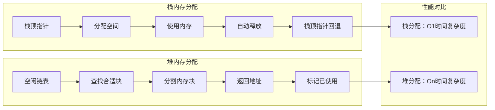
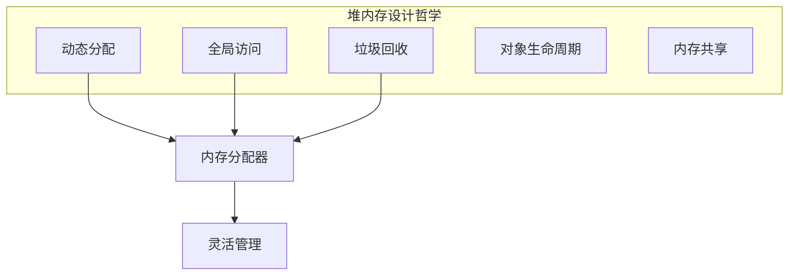
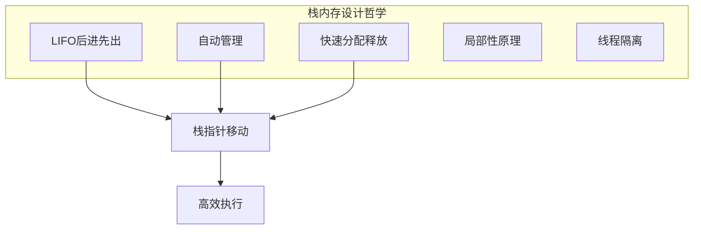
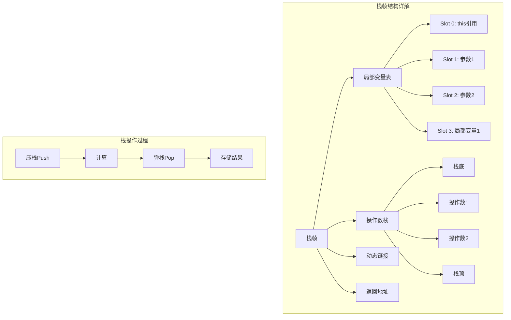

#### 目录介绍
- 01.核心设计思想
  - 1.1 设计的缘由
  - 1.2 内存分配策略
- 03.堆内存设计原理
  - 3.1 堆内存设计哲学
  - 3.2 堆内存的示例
- 04.栈内存设计原理
  - 4.1 栈内存设计哲学
  - 4.2 栈内存的示例
  - 4.3 栈帧结构详解


## 01.核心设计思想

### 1.1 设计的缘由


### 1.2 内存分配策略



## 03.堆内存设计原理

### 3.1 堆内存设计哲学



### 3.2 堆内存的示例

```java
// 堆内存工作原理示例
public class HeapPrincipleExample {
    
    public void demonstrateHeapOperation() {
        // 对象创建过程
        Person person = new Person("张三", 25);
        
        // 数组创建
        int[] numbers = new int[100];
        
        // 集合创建
        List<String> list = new ArrayList<>();
        list.add("Hello");
        list.add("World");
        
        // 大对象创建
        byte[] bigData = new byte[1024 * 1024]; // 1MB，可能直接进入老年代
        
        // 对象引用传递
        processPerson(person);
        
        // 方法结束，栈中的引用消失，但堆中的对象可能仍然存在
    }
    
    private void processPerson(Person p) {
        // p是对堆中Person对象的另一个引用
        p.setAge(26); // 修改堆中的对象
        
        // 创建新对象
        Person newPerson = new Person("李四", 30);
        // newPerson引用在方法结束时消失，但对象在堆中等待GC
    }
    
    static class Person {
        private String name;  // 引用类型字段
        private int age;      // 基本类型字段
        
        public Person(String name, int age) {
            this.name = name; // 字符串对象也在堆中
            this.age = age;
        }
        
        // getter和setter方法
        public void setAge(int age) { this.age = age; }
    }
}
```

## 04.栈内存设计原理

### 4.1 栈内存设计哲学



### 4.2 栈内存的示例

```java
// 栈内存工作原理示例
public class StackPrincipleExample {
    
    public void demonstrateStackOperation() {
        // 栈帧1开始
        int a = 10;        // 局部变量表slot 0
        double b = 3.14;   // 局部变量表slot 1-2 (double占2个slot)
        
        String str = processData(a, b); // 方法调用，创建新栈帧
        
        System.out.println(str);
        // 栈帧1结束，所有局部变量自动销毁
    }
    
    private String processData(int num, double decimal) {
        // 栈帧2开始
        // 参数：num在slot 0, decimal在slot 1-2
        StringBuilder sb = new StringBuilder(); // 局部变量slot 3
        
        // 操作数栈操作
        sb.append("Number: ");  // sb引用压入操作数栈
        sb.append(num);         // num值压入操作数栈，调用append
        sb.append(", Decimal: ");
        sb.append(decimal);     // decimal值压入操作数栈
        
        String result = sb.toString(); // 调用toString，结果压入操作数栈
        return result;          // 返回值通过操作数栈传递
        // 栈帧2结束，局部变量自动销毁
    }
}
```

### 4.3 栈帧结构详解




