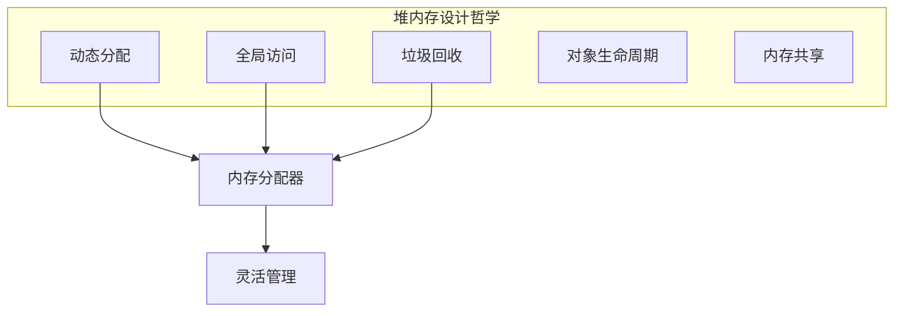
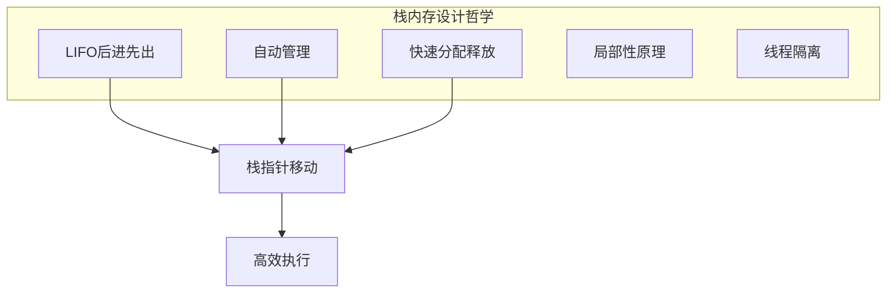

#### 目录介绍
- 01.核心设计思想
- 03.堆内存设计原理
  - 3.1 堆内存设计哲学
- 04.栈内存设计原理
  - 4.1 栈内存设计哲学

## 03.堆内存设计原理

### 3.1 堆内存设计哲学

```mermaid
graph TD
    subgraph "堆内存设计哲学"
        B1[动态分配]
        B2[全局访问]
        B3[垃圾回收]
        B4[对象生命周期]
        B5[内存共享]
    end
    
    B1 --> D[内存分配器]
    B2 --> D
    B3 --> D
    
    D --> F[灵活管理]
```

## 04.栈内存设计原理

### 4.1 栈内存设计哲学

```mermaid
graph TD
    subgraph "栈内存设计哲学"
        A1[LIFO后进先出]
        A2[自动管理]
        A3[快速分配释放]
        A4[局部性原理]
        A5[线程隔离]
    end

    A1 --> C[栈指针移动]
    A2 --> C
    A3 --> C

    C --> E[高效执行]
```

