#### 目录介绍
- 01.先思考几个问题
  - 1.1 必须了解内存
  - 1.2 先思考三个问题
  - 1.3 理解栈与堆
- 02.什么是垃圾回收
  - 2.1 定义与概念
  - 2.2 核心价值说明
  - 2.3 垃圾回收历程
- 03.主要回收什么
  - 3.1 回收对象分类
  - 3.2 堆内存回收
  - 3.3 回收优先级矩阵
- 04.回收核心思想
  - 4.1 内存模型架构
  - 4.2 分代假说理论
  - 4.3 内存分配策略
  - 4.4 GC触发时机与策略
- 05.如何识别垃圾
  - 5.1 垃圾识别算法对比
  - 5.2 引用计数法
  - 5.3 可达性分析
  - 5.4 三色标记法
  - 5.5 引用类型层次
- 06.内存回收方式
  - 6.1 垃圾回收算法
  - 6.2 标记-清除算法
  - 6.3 标记-复制算法
  - 6.4 标记-整理算法
  - 6.5 现代垃圾回收器
- 07.垃圾回收触发机制
  - 7.1 GC触发条件
  - 7.2 GC性能监控指标
- 08.多语言内存回收
  - 8.1 主流语言GC
  - 8.2 核心设计原则
  - 8.3 通用架构模式
  - 8.4 Java GC特点
  - 8.5 JavaScript GC
  - 8.6 Go GC特点
  - 8.7 设计权衡与选择
- 09.总结和思考
  - 9.1 核心要点
  - 9.2 最佳实践建议

## 01.先思考几个问题

### 1.1 必须了解内存

在了解回收机制之前，必须要了解内存

程序计数器、虚拟机栈、本地方法栈随线程而生，也随线程而灭；栈帧随着方法的开始而入栈，随着方法的结束而出栈。这几个区域的内存分配和回收都具有确定性，在这几个区域内不需要过多考虑回收的问题，因为方法结束或者线程结束时，内存自然就跟随着回收。

对于 Java 堆和方法区，我们只有在程序运行期间才能知道会创建哪些对象，这部分内存的分配和回收都是动态的，垃圾收集器所关注的正是这部分内存。

### 1.2 先思考三个问题

先思考三个问题：

* JVM是怎么分配内存的
* 识别哪些内存是垃圾需要回收
* 最后才是用什么方式回收

### 1.3 理解栈与堆

栈的内存管理是顺序分配的，而且定长，不存在内存回收问题；

堆，则是为java对象的实例随机分配内存，不定长度，所以存在内存分配和回收的问题

## 02.什么是垃圾回收

### 2.1 定义与概念

垃圾回收（Garbage Collection，GC）是一种自动内存管理机制，用于自动识别和回收程序中不再使用的内存空间，防止内存泄漏并优化内存使用效率。

### 2.2 核心价值说明

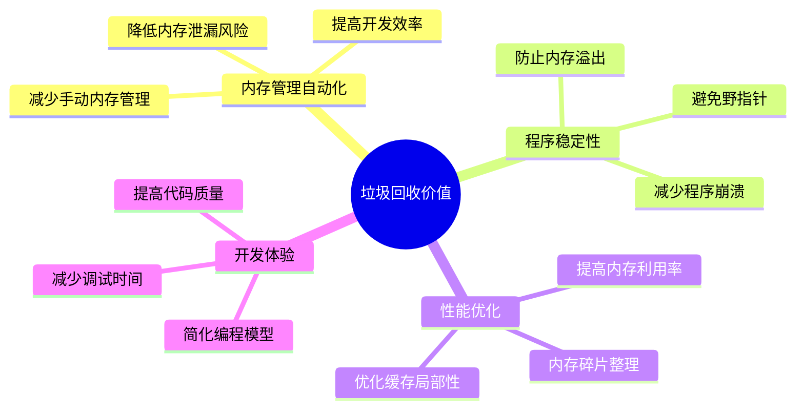

### 2.3 垃圾回收历程

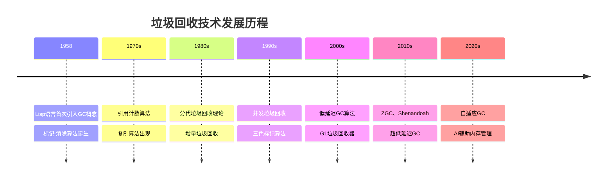

## 03.主要回收什么

### 3.1 回收对象分类

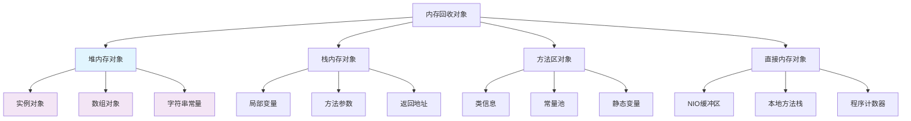

### 3.2 堆内存回收

- **新生代**：Eden区、Survivor区的短生命周期对象
- **老年代**：长生命周期对象、大对象
- **永久代/元空间**：类元数据、常量池

### 3.3 回收优先级矩阵

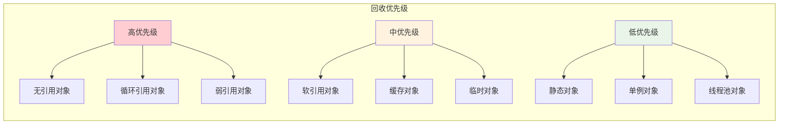

## 04.回收核心思想

### 4.1 内存模型架构

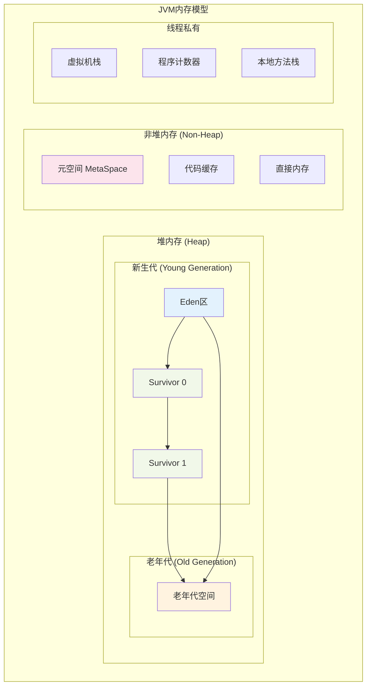

### 4.2 分代假说理论

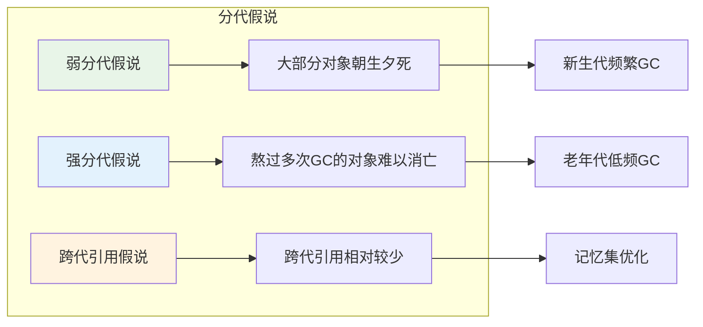

### 4.3 内存分配策略

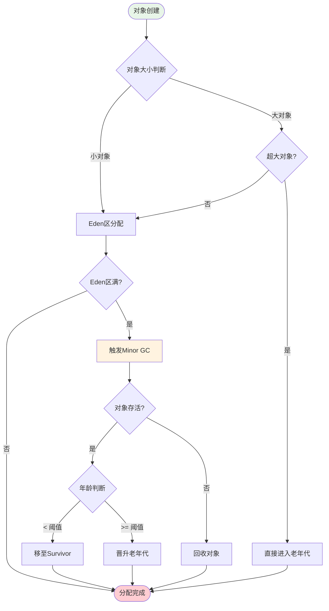

### 4.4 GC触发时机与策略

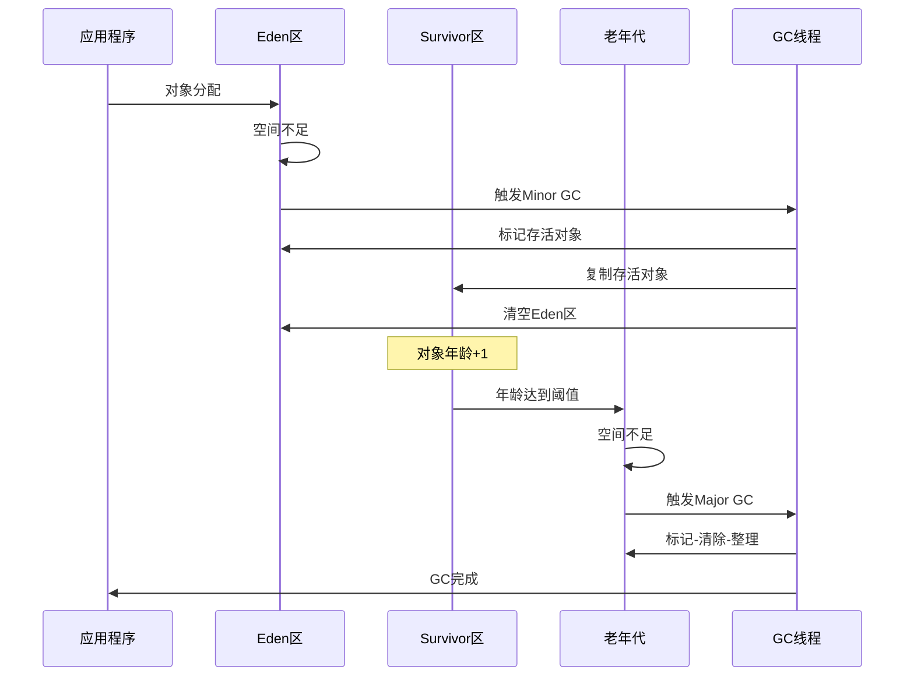

## 05.如何识别垃圾

### 5.1 垃圾识别算法对比

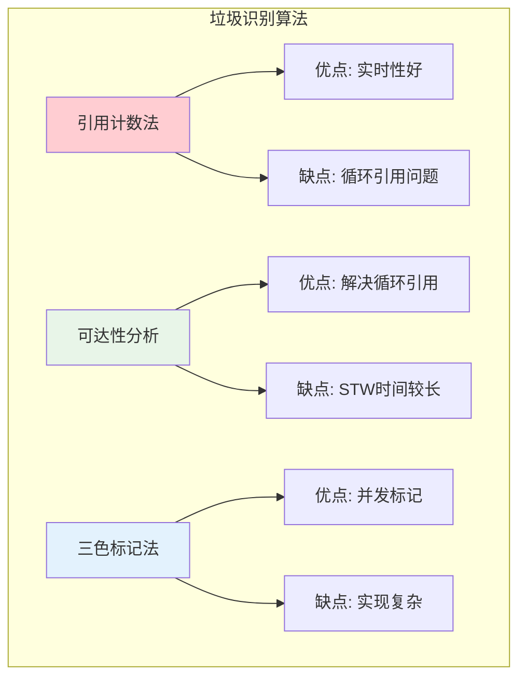

### 5.2 引用计数法

### 5.3 可达性分析

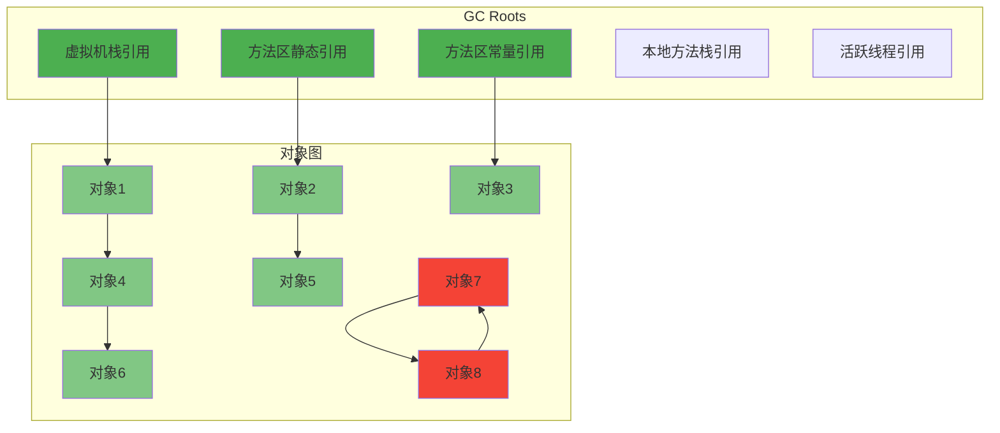

### 5.4 三色标记法

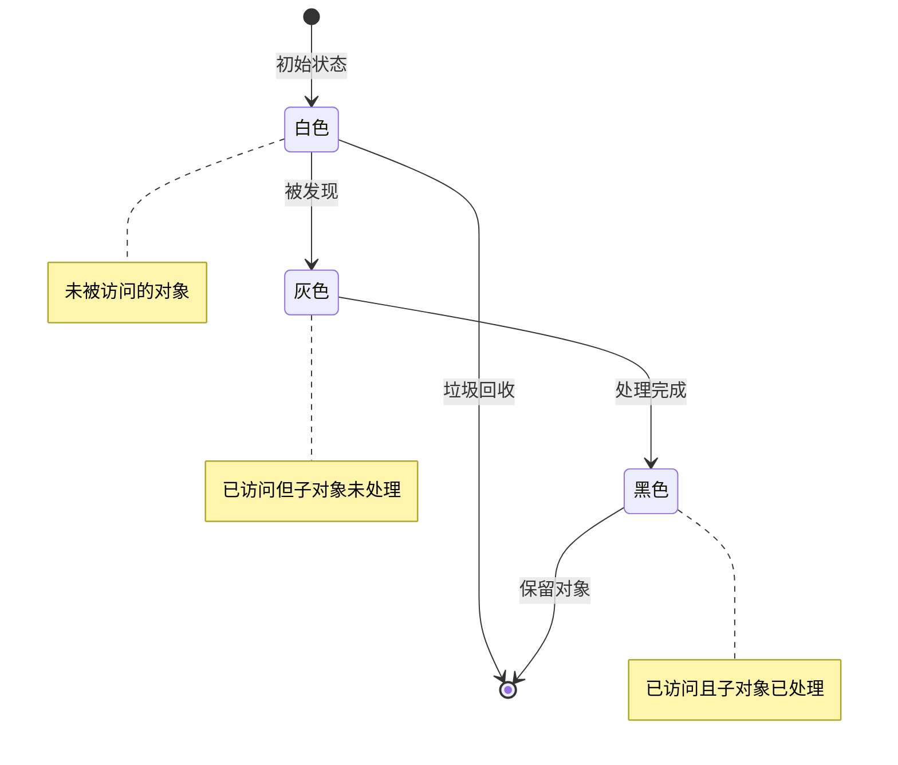

### 5.5 引用类型层次

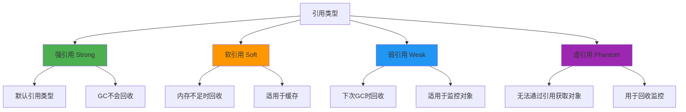

## 06.内存回收方式

### 6.1 垃圾回收算法

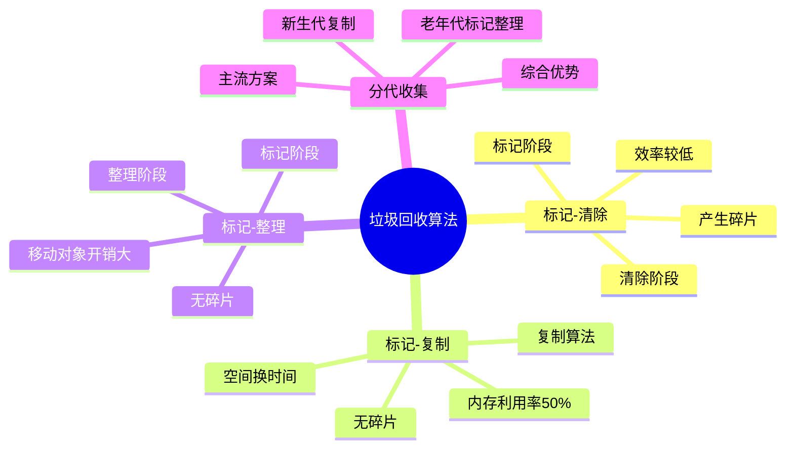

### 6.2 标记-清除算法

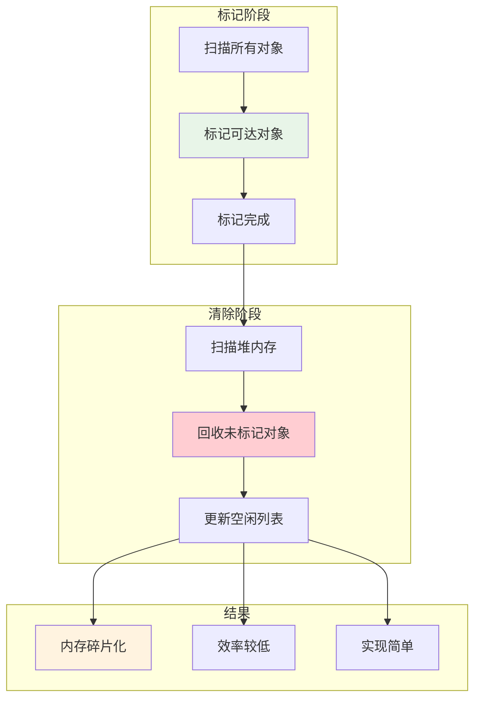

### 6.3 标记-复制算法

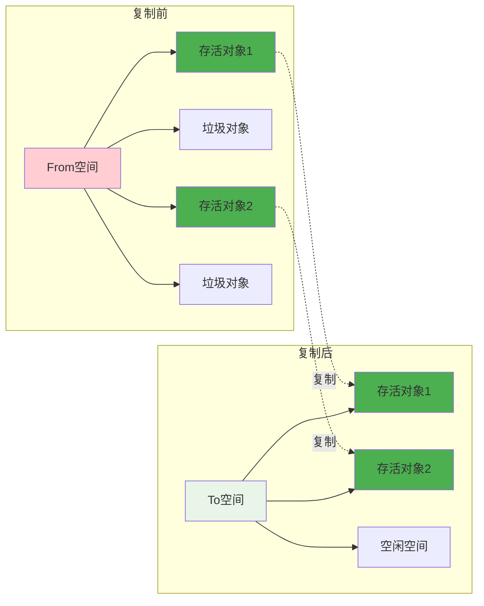

### 6.4 标记-整理算法

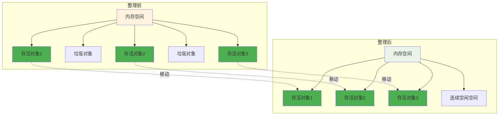

### 6.5 现代垃圾回收器

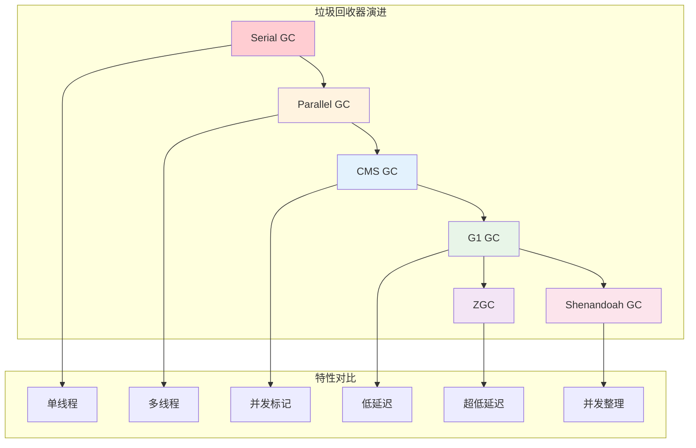

## 07.垃圾回收触发机制

### 7.1 GC触发条件

### 7.2 GC性能监控指标

## 08.多语言内存回收

### 8.1 主流语言GC

### 8.2 核心设计原则

### 8.3 通用架构模式

### 8.4 Java GC特点

### 8.5 JavaScript GC

### 8.6 Go GC特点

### 8.7 设计权衡与选择

## 09.总结和思考

### 9.1 核心要点

### 9.2 最佳实践建议

