#### 目录介绍
- 01.先思考几个问题
  - 1.1 必须了解内存
  - 1.2 先思考三个问题
  - 1.3 理解栈与堆
  - 1.4 垃圾回收思考
  - 1.5 理解内存申请
- 02.什么是垃圾回收
  - 2.1 定义与概念
  - 2.2 核心价值说明
  - 2.3 垃圾回收历程
- 03.主要回收什么
  - 3.1 回收对象分类
  - 3.2 堆内存回收
  - 3.3 回收优先级矩阵
  - 3.4 什么方式回收
- 04.回收核心思想
  - 4.1 内存模型架构
  - 4.2 分代假说理论
  - 4.3 内存分配策略
  - 4.4 GC触发时机与策略
- 05.如何识别垃圾
  - 5.1 垃圾识别算法对比
  - 5.2 引用计数法
  - 5.3 可达性分析
  - 5.4 三色标记法
  - 5.5 引用类型层次
- 06.内存回收方式
  - 6.1 垃圾回收算法
  - 6.2 标记-清除算法
  - 6.3 标记-复制算法
  - 6.4 标记-整理算法
  - 6.5 现代垃圾回收器
- 07.垃圾回收触发机制
  - 7.1 GC触发条件
  - 7.2 GC性能监控指标
- 08.多语言内存回收
  - 8.1 主流语言GC
  - 8.2 核心设计原则
  - 8.3 通用架构模式
  - 8.4 Java GC特点
  - 8.5 JavaScript GC
  - 8.6 Go GC特点
  - 8.7 设计权衡与选择
- 09.总结和思考
  - 9.1 核心要点
  - 9.2 最佳实践建议


## 01.先思考几个问题

### 1.1 必须了解内存

在了解回收机制之前，必须要了解内存

程序计数器、虚拟机栈、本地方法栈随线程而生，也随线程而灭；栈帧随着方法的开始而入栈，随着方法的结束而出栈。这几个区域的内存分配和回收都具有确定性，在这几个区域内不需要过多考虑回收的问题，因为方法结束或者线程结束时，内存自然就跟随着回收。

对于 Java 堆和方法区，我们只有在程序运行期间才能知道会创建哪些对象，这部分内存的分配和回收都是动态的，垃圾收集器所关注的正是这部分内存。

### 1.2 先思考三个问题

先思考三个问题：

* JVM是怎么分配内存的
* 识别哪些内存是垃圾需要回收
* 最后才是用什么方式回收

### 1.3 理解栈与堆

栈的内存管理是顺序分配的，而且定长，不存在内存回收问题；

堆，则是为java对象的实例随机分配内存，不定长度，所以存在内存分配和回收的问题。自动内存管理最核心的功能是 **堆** 内存中对象的分配与回收。

### 1.4 垃圾回收思考

- 引用：如果Reference类型的数据中存储的数值代表的是另外一块内存的起始地址，就称这块内存代表着一个引用。（引用都有哪些？对垃圾回收又有什么影响？）
- 垃圾：无任何对象引用的对象（怎么通过算法找到这些对象呢？）。 
- 回收：清理“垃圾”占用的内存空间而非对象本身（怎么通过算法实现回收呢？）。 
- 发生地点：一般发生在堆内存中，因为大部分的对象都储存在堆内存中（堆内存为了配合垃圾回收有什么不同区域划分，各区域有什么不同？）。
- 发生时间：程序空闲时间不定时回收（回收的执行机制是什么？是否可以通过显示调用函数的方式来确定的进行回收过程？）

### 1.5 理解内存申请

虚拟机是先一次性分配一块较大的空间，然后每次new时都在该空间上进行分配和释放，减少了系统调用的次数，节省了一定的开销，这有点类似于内存池的概念；二是有了这块空间过后，如何进行分配和回收就跟GC机制有关了。

一般内存申请有两种：静态内存和动态内存。

- 很容易理解，编译时就能够确定的内存就是静态内存，即内存是固定的，系统一次性分配，比如int类型变量；
- 动态内存分配就是在程序执行时才知道要分配的存储空间大小，比如对象的内存空间。

## 02.什么是垃圾回收

垃圾回收(Garbage Collection)是Java虚拟机(JVM)垃圾回收器提供的一种用于在空闲时间不定时回收无任何对象引用的对象占据的内存空间的一种机制。

### 2.1 定义与概念

垃圾回收（Garbage Collection，GC）是一种自动内存管理机制，用于自动识别和回收程序中不再使用的内存空间，防止内存泄漏并优化内存使用效率。

### 2.2 核心价值说明

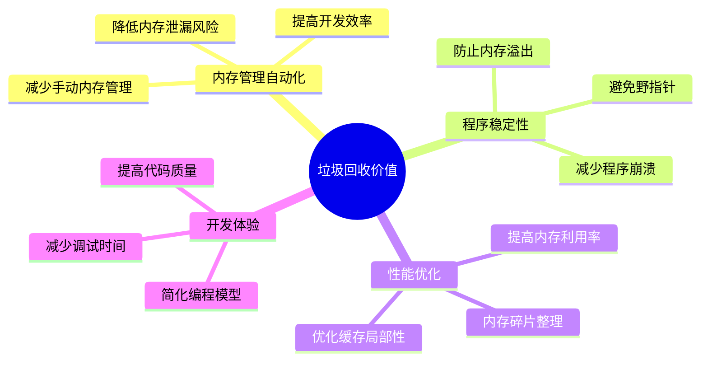

### 2.3 垃圾回收历程

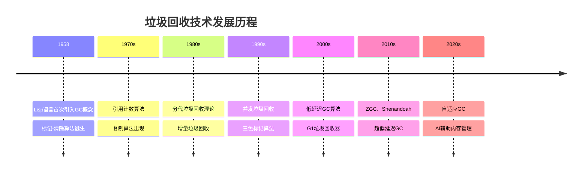

## 03.主要回收什么

### 3.1 回收对象分类

注意：垃圾回收回收的是无任何引用的对象占据的内存空间而不是对象本身。换言之，垃圾回收只会负责释放那些对象占有的内存。

对象是个抽象的词，包括引用和其占据的内存空间。当对象没有任何引用时其占据的内存空间随即被收回备用，此时对象也就被销毁。但不能说是回收对象，可以理解为一种文字游戏。

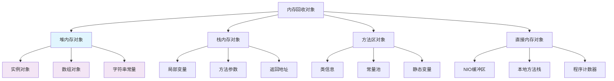

> 堆内存回收

回收那些对象：无任何引用的对象

主要是针对堆中对象，创建一个对象，会在堆内存中分配内存空间。那么回收对象，则会清理掉对象所占的内存空间。

> 方法区内存回收

方法区中存放生命周期较长的类信息、常量、静态变量，每次垃圾收集只有少量的垃圾被清除。方法区中主要清除两种垃圾：1.废弃常量；2.无用的类。

> 局部变量会回收吗

实验代码，代码如下所示

```java
public class GcTest {
    private static final int SIZE = 6 * 1024 * 1024;
    public static void localVarGc1() {
        byte[] b = new byte[SIZE];
        System.gc();
    }
    public static void localVarGc2() {
        byte[] b = new byte[SIZE];
        b = null;
        System.gc();
    }
    public static void localVarGc3() {
        {
            byte[] b = new byte[SIZE];
        }
        System.gc();
    }
    public static void localVarGc4() {
        {
            byte[] b = new byte[SIZE];
        }
        int c = 0;
        System.gc();
    }
    public static void localVarGc5() {
        localVarGc1();
        System.gc();
    }
    public static void main(String[] args) {
//        localVarGc1();   // 没有GC
//        localVarGc2();   // GC
//        localVarGc3();   // 没有GC
//        localVarGc4();   // GC
//        localVarGc5();   // GC
    }
}
```

在main中分别执行localVarGc【1-5】方法，得到如下5次gc日志：
```
[GC (Allocation Failure)  512K->374K(130560K), 0.0006220 secs]
[GC (Allocation Failure)  886K->600K(130560K), 0.0011130 secs]
[GC (Allocation Failure)  1112K->752K(130560K), 0.0006960 secs]
[GC (Allocation Failure)  1264K->950K(131072K), 0.0015540 secs]
[GC (System.gc())  7944K->7363K(131072K), 0.0008640 secs]
[Full GC (System.gc())  7363K->7116K(131072K), 0.0085270 secs]
[GC (Allocation Failure)  512K->390K(130560K), 0.0008690 secs]
[GC (Allocation Failure)  902K->592K(130560K), 0.0008500 secs]
[GC (Allocation Failure)  1104K->718K(130560K), 0.0007220 secs]
[GC (Allocation Failure)  1230K->924K(131072K), 0.0012260 secs]
[GC (System.gc())  7919K->7309K(131072K), 0.0018500 secs]
[Full GC (System.gc())  7309K->975K(131072K), 0.0059300 secs]
[GC (Allocation Failure)  512K->374K(130560K), 0.0007940 secs]
[GC (Allocation Failure)  886K->598K(130560K), 0.0007240 secs]
[GC (Allocation Failure)  1110K->718K(130560K), 0.0007680 secs]
[GC (Allocation Failure)  1230K->916K(131072K), 0.0009900 secs]
[GC (System.gc())  7887K->7340K(131072K), 0.0008910 secs]
[Full GC (System.gc())  7340K->7116K(131072K), 0.0091600 secs]
[GC (Allocation Failure)  512K->416K(130560K), 0.0007990 secs]
[GC (Allocation Failure)  928K->584K(130560K), 0.0008580 secs]
[GC (Allocation Failure)  1096K->728K(130560K), 0.0007360 secs]
[GC (Allocation Failure)  1240K->910K(131072K), 0.0010150 secs]
[GC (System.gc())  7883K->7339K(131072K), 0.0011770 secs]
[Full GC (System.gc())  7339K->971K(131072K), 0.0069840 secs]
[GC (Allocation Failure)  512K->406K(130560K), 0.0005700 secs]
[GC (Allocation Failure)  918K->622K(130560K), 0.0011430 secs]
[GC (Allocation Failure)  1134K->710K(130560K), 0.0015010 secs]
[GC (Allocation Failure)  1222K->948K(131072K), 0.0020340 secs]
[GC (System.gc())  7921K->7304K(131072K), 0.0013160 secs]
[Full GC (System.gc())  7304K->7110K(131072K), 0.0091750 secs]
[GC (System.gc())  7121K->7142K(131072K), 0.0002990 secs]
[Full GC (System.gc())  7142K->966K(131072K), 0.0050000 secs]
```
- gc日志中（加粗部分为System.gc触发的）可以得到如下结论：
  - 申请了一个6M大小的空间，赋值给b引用，然后调用gc函数，因为此时这个6M的空间还被b引用着，所以不能顺利gc；
  - 申请了一个6M大小的空间，赋值给b引用，然后将b重新赋值为null，此时这个6M的空间不再被b引用，所以可以顺利gc；
  - 申请了一个6M大小的空间，赋值给b引用，过了b的作用返回之后调用gc函数，但是因为此时b并没有被销毁，还存在于栈帧中，这个空间也还被b引用，所以不能顺利gc；
  - 申请了一个6M大小的空间，赋值给b引用，过了b的作用返回之后重新创建一个变量c，此时这个新的变量会复用已经失效的b变量的槽位，所以b被迫销毁了，所以6M的空间没有被任何变量引用，于是能够顺利gc；
  - 首先调用localVarGc1()，很显然不能顺利gc，函数调用结束之后再调用gc函数，此时因为localVarGc1这个函数的栈帧已经随着函数调用的结束而被销毁，b也就被销毁了，所以6M大小的空间不被任何对象引用，于是能够顺利gc。
- 总结一下
  - 局部变量表中的变量是很重要的垃圾回收根节点，被局部变量表中变量直接或者间接引用的对象都不会被回收。
- 局部变量为啥不会被回收
  - 局部变量表位于方法栈帧中，方法结束时栈帧被回收，其中的所有内容包括局部变量表不再有效。
  - 既然是局部变量产生对象，离开这个方法后，这个变量就不存在了，那么他所产生的对象也应该被回收。


### 3.2 堆内存回收

- **新生代**：Eden区、Survivor区的短生命周期对象
- **老年代**：长生命周期对象、大对象
- **永久代/元空间**：类元数据、常量池

### 3.3 回收优先级矩阵

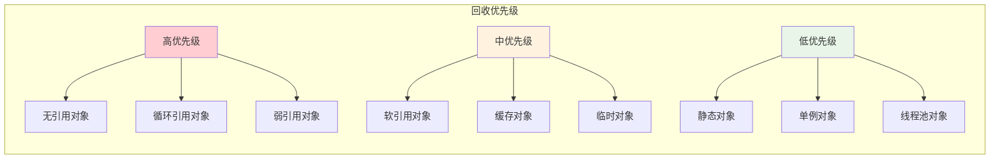

### 3.4 什么方式回收

> 第一种：设置对象null

如果对象的引用被置为null，垃圾收集器是否会立即释放对象占用的内存？

不会，在下一个垃圾回收周期中，这个对象将是可被回收的。也就是说当一个对象的引用变为null时，并不会被垃圾收集器立刻回收，而是在下一次垃圾回收时才会释放其占用的内存。


> 第二种：包一个软引用

> 第三种：触发GC方法


## 04.回收核心思想

### 4.1 内存模型架构

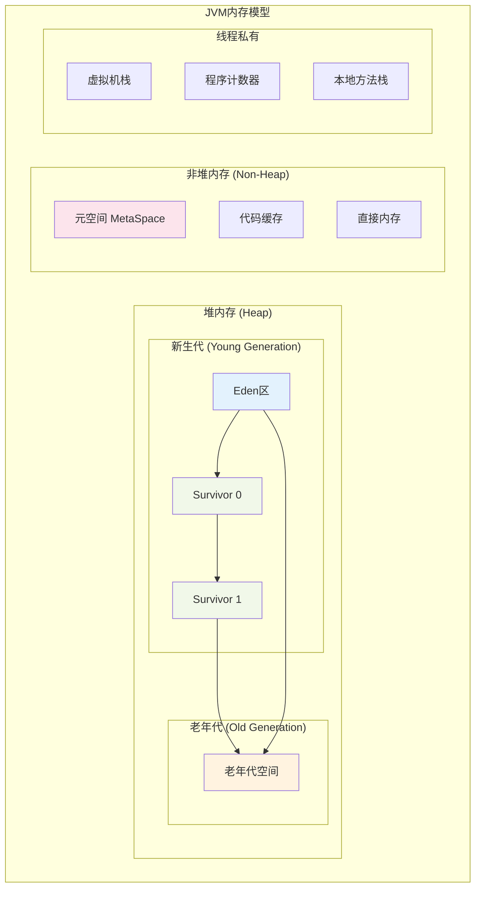

### 4.2 分代假说理论

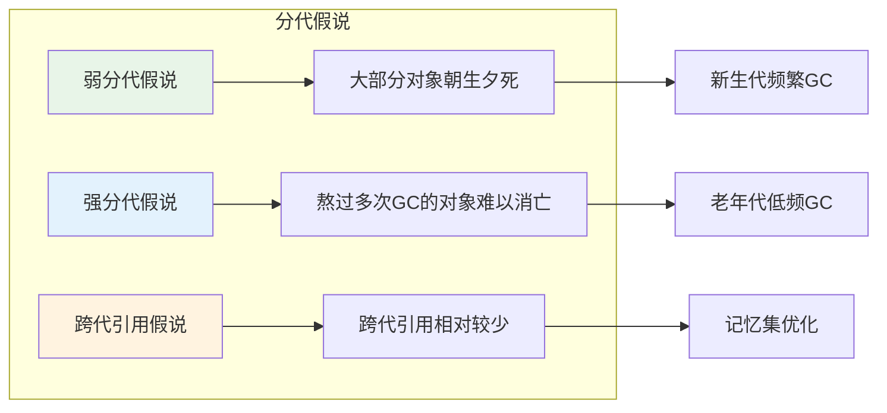

### 4.3 内存分配策略


### 4.4 GC触发时机与策略

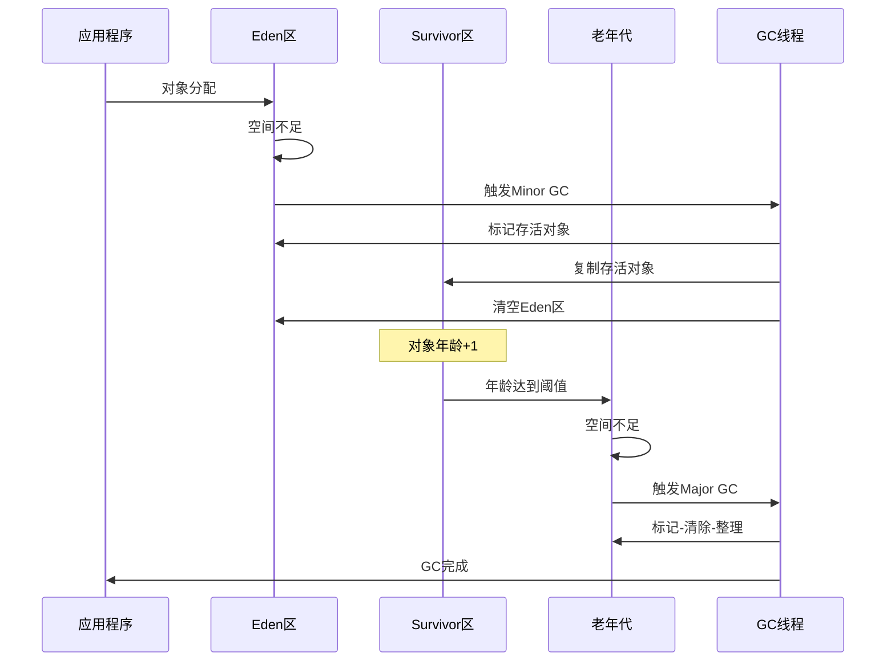

## 05.如何识别垃圾

### 5.1 垃圾识别算法对比

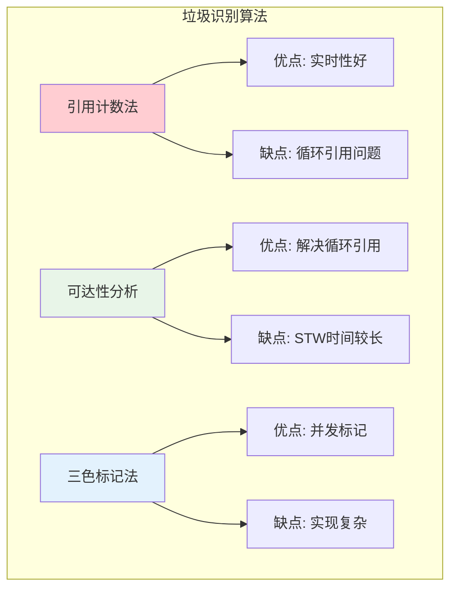

### 5.2 引用计数法


### 5.3 可达性分析

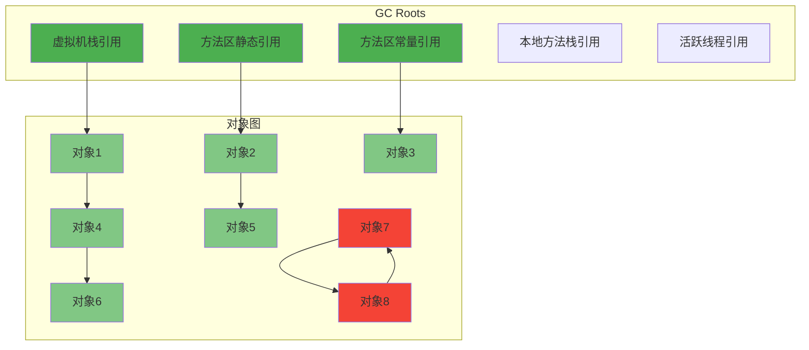

### 5.4 三色标记法

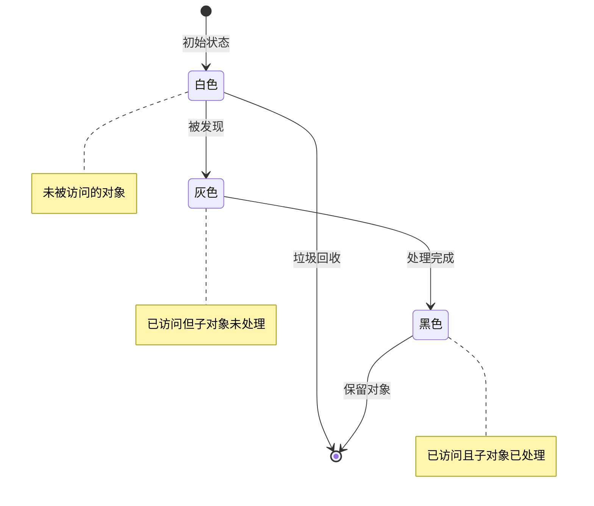

### 5.5 引用类型层次

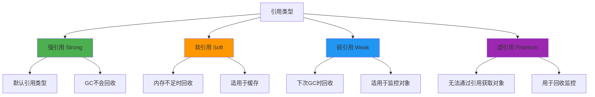

## 06.内存回收方式

### 6.1 垃圾回收算法

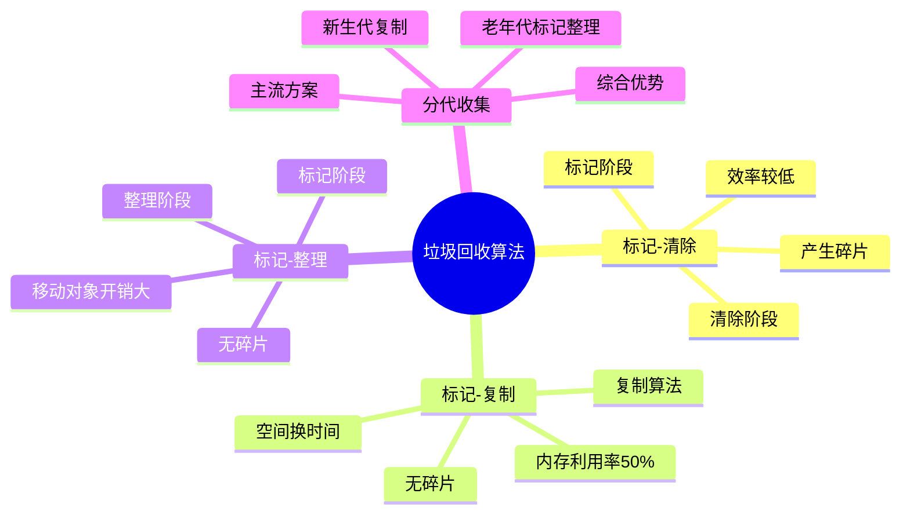

### 6.2 标记-清除算法

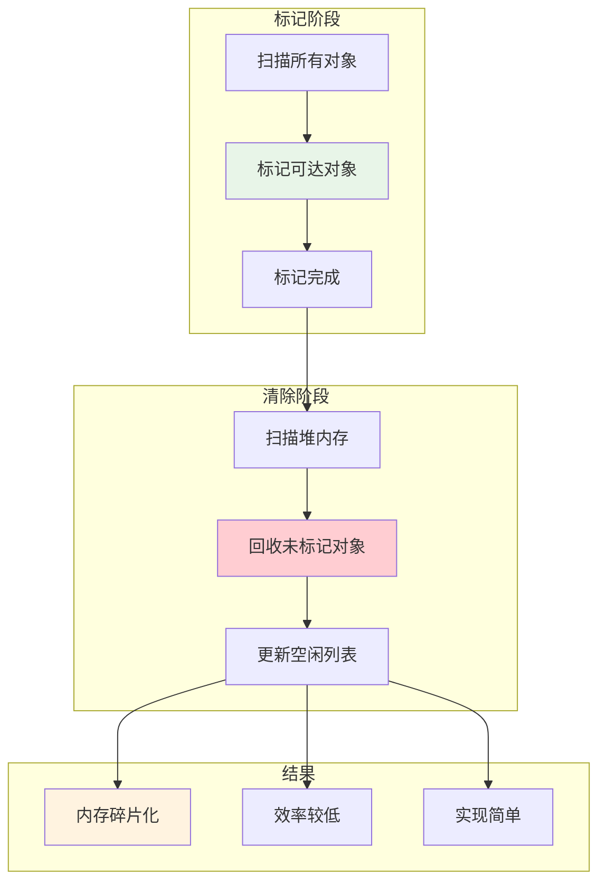

### 6.3 标记-复制算法

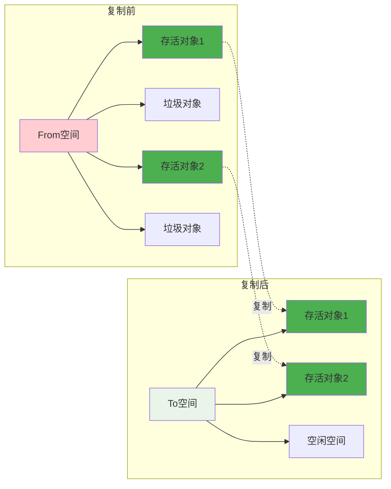

### 6.4 标记-整理算法

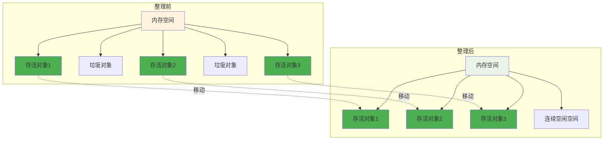

### 6.5 现代垃圾回收器

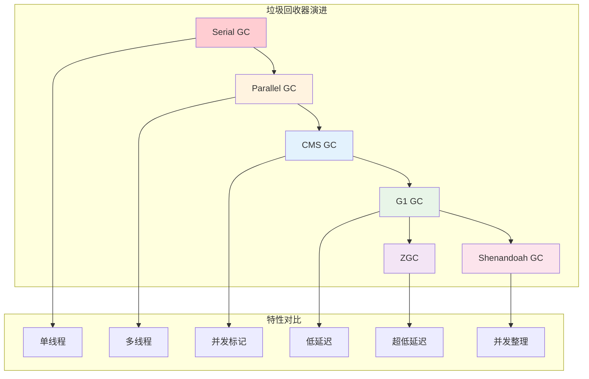

## 07.垃圾回收触发机制

### 7.1 GC触发条件

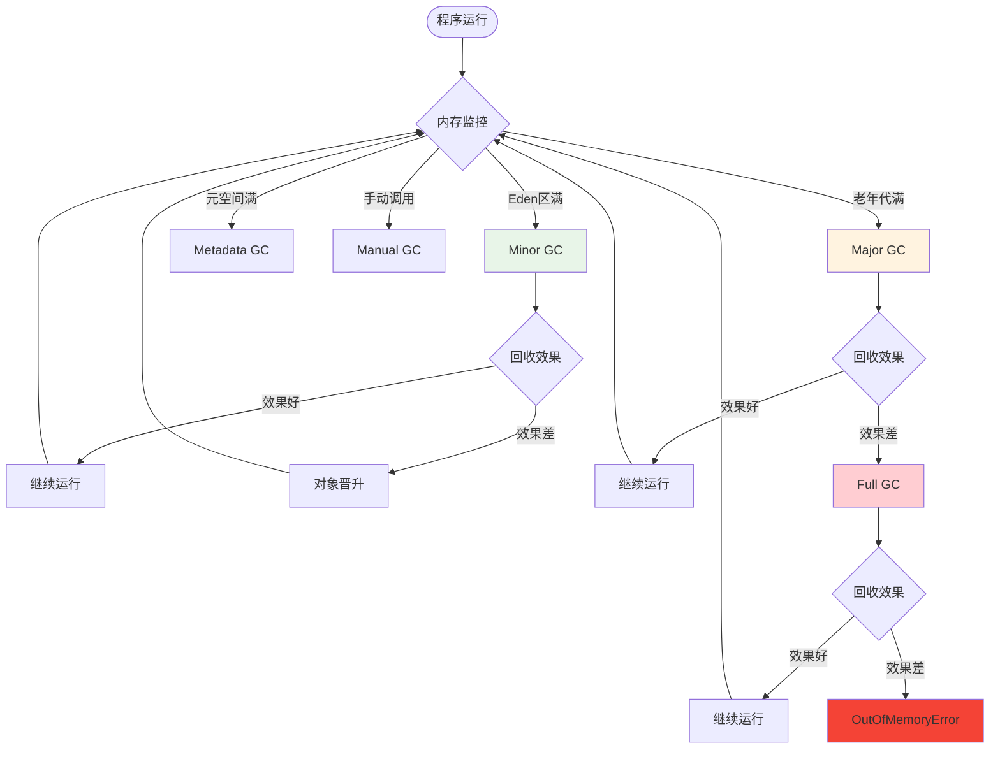

### 7.2 GC性能监控指标

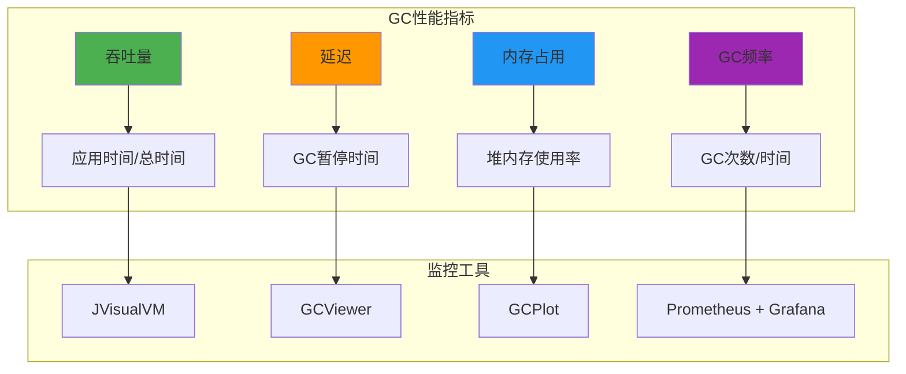

## 08.多语言内存回收

### 8.1 主流语言GC

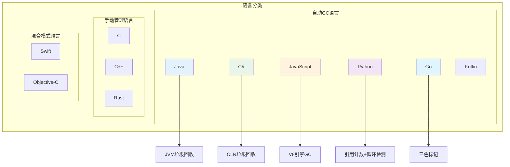

### 8.2 核心设计原则

```mermaid
mindmap
  root((GC设计原则))
    自动化管理
      减少程序员负担
      避免内存泄漏
      提高开发效率
    性能优化
      最小化STW时间
      提高吞吐量
      优化内存利用率
    可预测性
      稳定的GC行为
      可调优参数
      监控和诊断
    适应性
      不同应用场景
      动态调整策略
      负载感知
```

### 8.3 通用架构模式

```mermaid
graph TD
    subgraph "通用GC架构"
        A[内存分配器] --> B[对象追踪]
        B --> C[垃圾识别]
        C --> D[内存回收]
        D --> E[内存整理]
        E --> A
        
        F[GC触发器] --> C
        G[性能监控] --> H[策略调整]
        H --> F
    end
    
    subgraph "优化策略"
        I[分代假说]
        J[并发回收]
        K[增量回收]
        L[自适应调优]
    end
    
    C --> I
    D --> J
    E --> K
    H --> L
    
    style A fill:#e3f2fd
    style C fill:#e8f5e8
    style D fill:#fff3e0
    style E fill:#f3e5f5
```

### 8.4 Java GC特点

```mermaid
graph LR
    subgraph "Java GC"
        A[分代收集] --> A1[新生代: 复制算法]
        A --> A2[老年代: 标记-整理]
        
        B[多种收集器] --> B1[Serial/Parallel]
        B --> B2[CMS/G1]
        B --> B3[ZGC/Shenandoah]
        
        C[JVM调优] --> C1[堆大小设置]
        C --> C2[GC参数调优]
        C --> C3[监控工具丰富]
    end
    
    style A fill:#4caf50
    style B fill:#2196f3
    style C fill:#ff9800
```

### 8.5 JavaScript GC

```mermaid
graph TD
    subgraph "V8 GC机制"
        A[新生代] --> A1[Scavenge算法]
        A1 --> A2[From/To空间]
        
        B[老生代] --> B1[Mark-Sweep]
        B1 --> B2[Mark-Compact]
        
        C[增量标记] --> C1[减少STW]
        C --> C2[并发清理]
        
        D[写屏障] --> D1[跨代引用处理]
    end
    
    style A fill:#e3f2fd
    style B fill:#e8f5e8
    style C fill:#fff3e0
    style D fill:#f3e5f5
```

### 8.6 Go GC特点

```mermaid
graph LR
    subgraph "Go GC"
        A[三色标记] --> A1[并发标记]
        A --> A2[写屏障]
        
        B[低延迟] --> B1[目标<10ms]
        B --> B2[软实时]
        
        C[简化设计] --> C1[无分代]
        C --> C2[统一堆]
        
        D[自适应] --> D1[动态调整]
        D --> D2[GOGC参数]
    end
    
    style A fill:#4caf50
    style B fill:#ff9800
    style C fill:#2196f3
    style D fill:#9c27b0
```

### 8.7 设计权衡与选择

```mermaid
graph TD
    subgraph "GC设计权衡"
        A[吞吐量 vs 延迟] --> A1[高吞吐量: Parallel GC]
        A --> A2[低延迟: ZGC/Shenandoah]
        
        B[内存使用 vs 性能] --> B1[节省内存: 压缩算法]
        B --> B2[高性能: 复制算法]
        
        C[简单性 vs 效率] --> C1[简单: 引用计数]
        C --> C2[高效: 可达性分析]
        
        D[确定性 vs 自动化] --> D1[确定性: 手动管理]
        D --> D2[自动化: GC管理]
    end
    
    style A1 fill:#4caf50
    style A2 fill:#ff9800
    style B1 fill:#2196f3
    style B2 fill:#9c27b0
    style C1 fill:#e8f5e8
    style C2 fill:#fff3e0
    style D1 fill:#ffcdd2
    style D2 fill:#e1f5fe
```

## 09.总结和思考

### 9.1 核心要点

1. **垃圾回收本质**：自动内存管理，解放程序员，提高程序稳定性
2. **回收对象**：主要回收堆内存中的无用对象，包括实例、数组、字符串等
3. **JVM设计思想**：分代假说、分区管理、并发优化
4. **垃圾识别**：可达性分析为主，三色标记算法优化
5. **回收方式**：标记-清除、复制、整理算法的组合应用
6. **触发机制**：自动触发为主，手动触发为辅
7. **通用原则**：自动化、性能优化、可预测性、适应性

### 9.2 最佳实践建议

```mermaid
graph LR
    subgraph "GC优化建议"
        A[合理设置堆大小] --> A1[避免频繁GC]
        B[选择合适的GC器] --> B1[根据应用特点]
        C[监控GC指标] --> C1[及时发现问题]
        D[优化对象生命周期] --> D1[减少GC压力]
        E[避免内存泄漏] --> E1[正确管理引用]
    end
    
    style A fill:#4caf50
    style B fill:#2196f3
    style C fill:#ff9800
    style D fill:#9c27b0
    style E fill:#e8f5e8
```