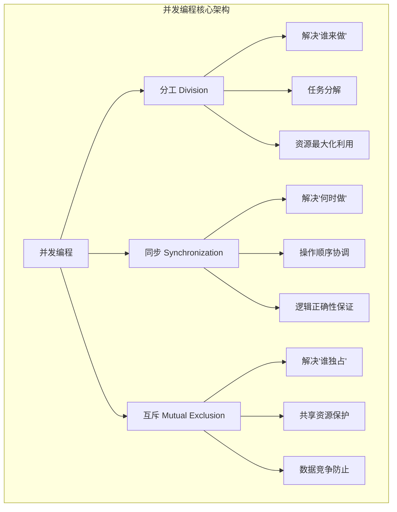

#### 目录介绍
- 01.并发编程概述
  - 1.1 概述介绍
  - 1.2 并发编程架构

## 01.并发编程概述

### 1.1 概述介绍

并发编程是现代软件系统的核心技术，它通过同时执行多个任务来提高系统性能、响应性和资源利用率。无论是Java、C++还是Objective-C，并发编程都可以归纳为三个核心思想问题的解决：

- **分工（Division of Labor）**：解决"谁来做"的问题
- **同步（Synchronization）**：解决"何时做"的问题
- **互斥（Mutual Exclusion）**：解决"谁独占"的问题

### 1.2 并发编程架构

