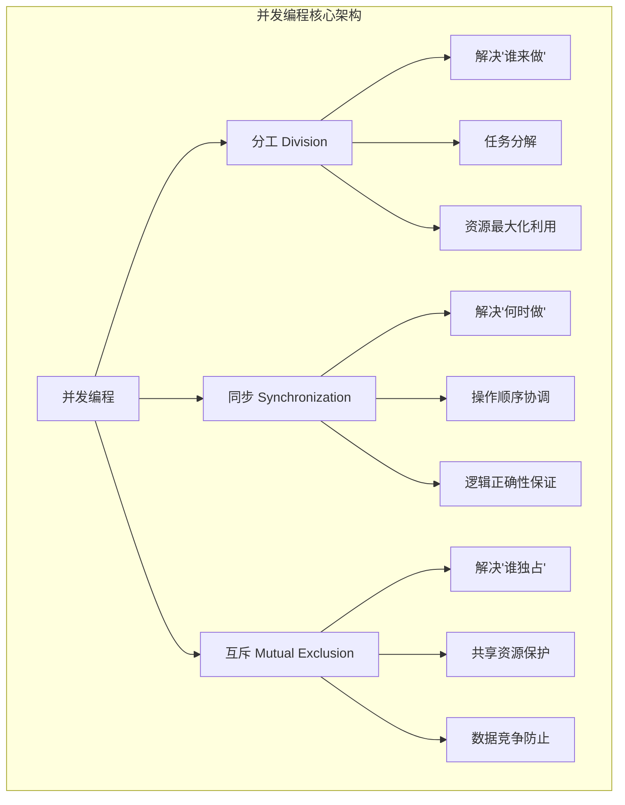
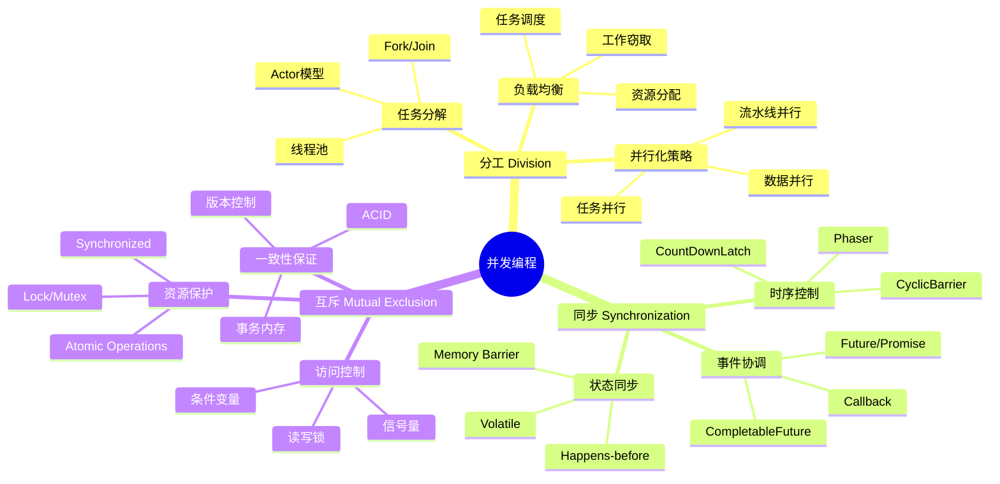
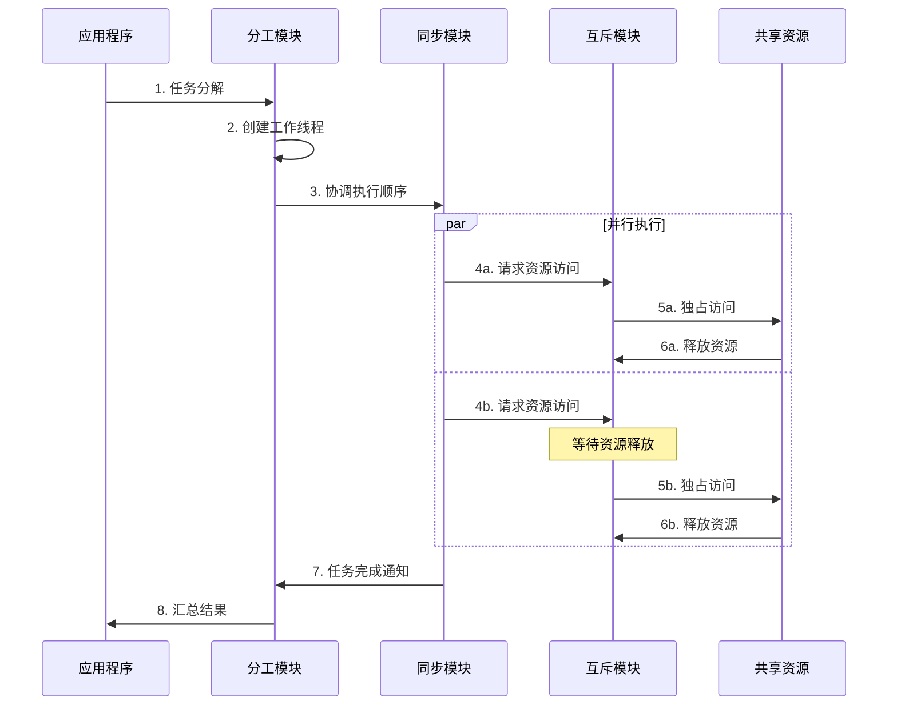
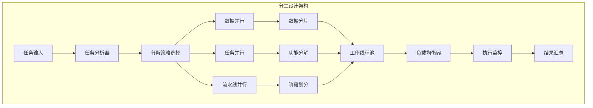
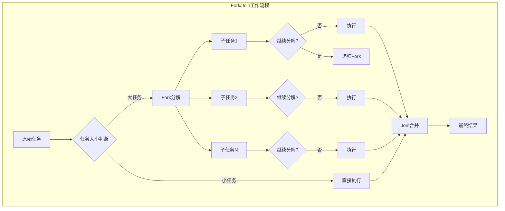
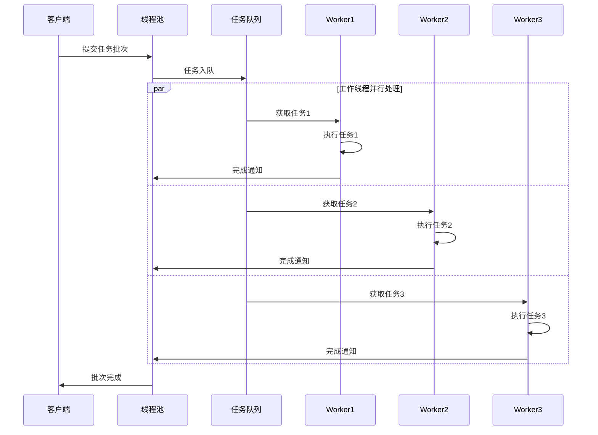
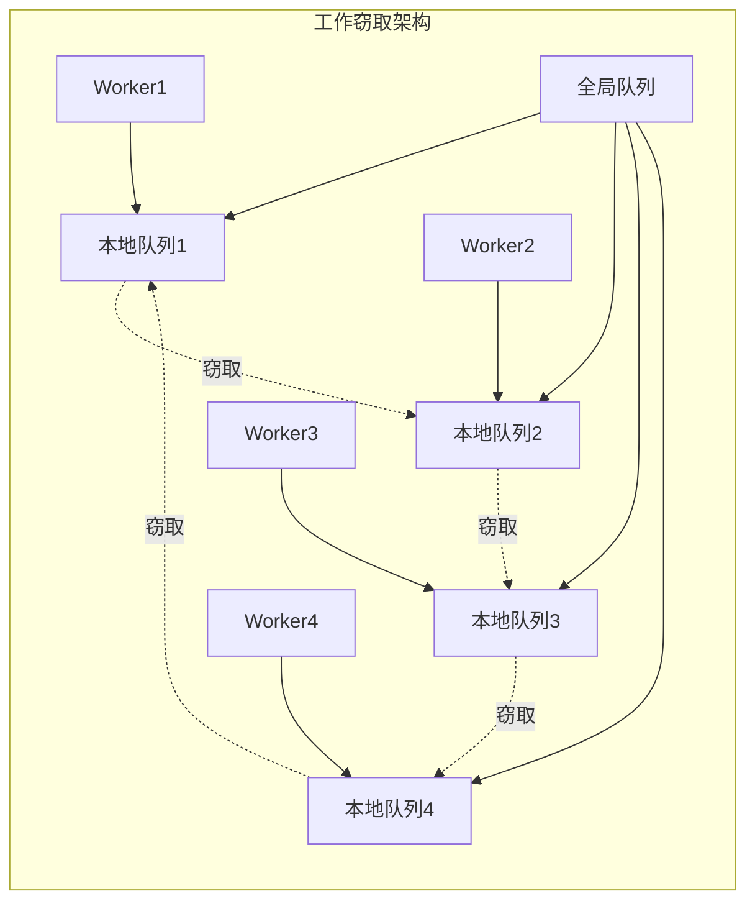
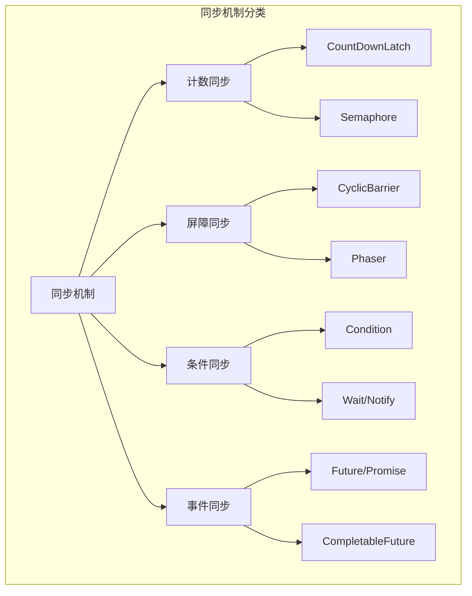
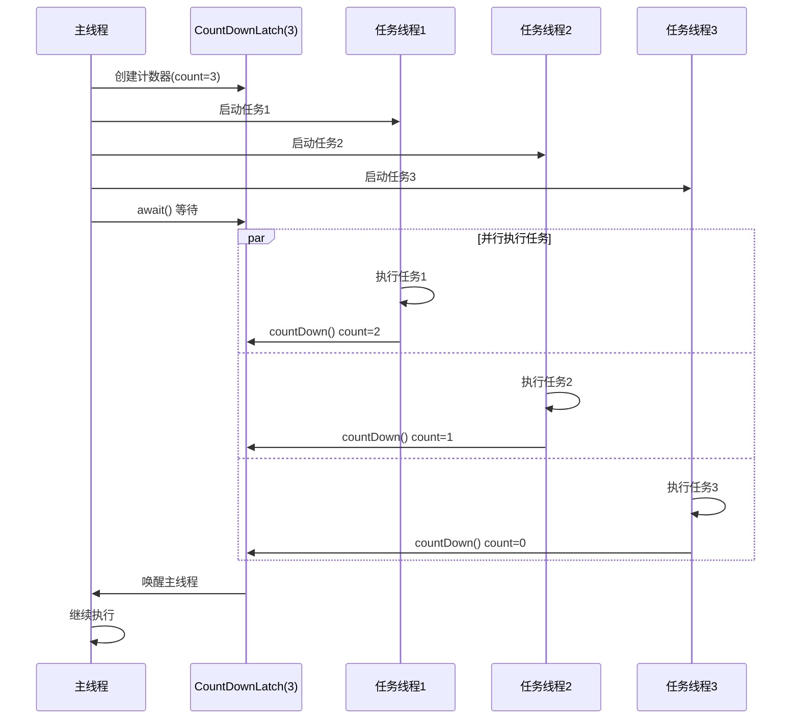

#### 目录介绍
- 01.并发编程概述
  - 1.1 概述介绍
- 02.并发设计架构
  - 2.1 并发编程架构
  - 2.2 三大核心思想
  - 2.3 协作关系设计
- 03.分工设计思想
  - 3.1 分工设计架构
  - 3.2 分工模式详解
  - 3.3 线程池分工模式
  - 3.4 工作窃取算法
- 04.同步设计思想
  - 4.1 同步机制分类
  - 4.2 计数同步思想
  - 4.3 屏障同步思想
  - 4.4 条件同步思想
  - 4.5 事件同步思想
- 05.互斥设计思想
  - 5.1 


## 01.并发编程概述

### 1.1 概述介绍

并发编程是现代软件系统的核心技术，它通过同时执行多个任务来提高系统性能、响应性和资源利用率。无论是Java、C++还是Objective-C，并发编程都可以归纳为三个核心思想问题的解决：

- **分工（Division of Labor）**：解决"谁来做"的问题
- **同步（Synchronization）**：解决"何时做"的问题
- **互斥（Mutual Exclusion）**：解决"谁独占"的问题

## 02.并发设计架构

### 2.1 并发编程架构



### 2.2 三大核心思想



### 2.3 协作关系设计



## 03.分工设计思想

分工设计 - 解决"谁来做"。分工是并发编程的第一步，核心目标是将大型任务分解为可并行执行的子任务，最大化利用计算资源。

### 3.1 分工设计架构



### 3.2 分工模式详解

Fork/Join模式



Java Fork/Join实现，大概思路如下：

```java
import java.util.concurrent.RecursiveTask;
import java.util.concurrent.ForkJoinPool;

public class ParallelSum extends RecursiveTask<Long> {
    private static final int THRESHOLD = 1000;
    private final int[] array;
    private final int start;
    private final int end;
    
    public ParallelSum(int[] array, int start, int end) {
        this.array = array;
        this.start = start;
        this.end = end;
    }
    
    @Override
    protected Long compute() {
        if (end - start <= THRESHOLD) {
            // 小任务直接计算
            long sum = 0;
            for (int i = start; i < end; i++) {
                sum += array[i];
            }
            return sum;
        } else {
            // 大任务分解
            int mid = (start + end) / 2;
            ParallelSum leftTask = new ParallelSum(array, start, mid);
            ParallelSum rightTask = new ParallelSum(array, mid, end);
            
            // Fork分解
            leftTask.fork();
            rightTask.fork();
            
            // Join合并
            return leftTask.join() + rightTask.join();
        }
    }
    
    public static void main(String[] args) {
        int[] array = new int[10000];
        // 初始化数组...
        
        ForkJoinPool pool = new ForkJoinPool();
        ParallelSum task = new ParallelSum(array, 0, array.length);
        Long result = pool.invoke(task);
        
        System.out.println("并行计算结果: " + result);
    }
}
```

### 3.3 线程池分工模式



### 3.4 工作窃取算法



## 04.同步设计思想

同步设计 - 解决"何时做"。同步解决多个执行单元的操作顺序协调问题，确保程序逻辑的正确性。

### 4.1 同步机制分类



### 4.2 计数同步思想



### 4.3 屏障同步思想


### 4.4 条件同步思想


### 4.5 事件同步思想


