#### 目录介绍
- 01.并发编程概述
  - 1.1 概述介绍
- 02.并发设计架构
  - 2.1 并发编程架构
  - 2.2 三大核心思想
  - 2.3 协作关系设计
- 03.分工设计思想
  - 3.1 分工设计架构
  - 3.2 分工模式详解
  - 3.3 线程池分工模式
  - 3.4 工作窃取算法
- 04.同步设计思想
  - 4.1 同步机制分类
  - 4.2 计数同步思想
  - 4.3 屏障同步思想
  - 4.4 条件同步思想
  - 4.5 事件同步思想
- 05.互斥设计思想
  - 5.1 互斥机制架构
  - 5.2 锁机制设计
  - 5.3 原子变量设计
  - 5.4 无锁编程设计
- 06.跨语言对比
  - 6.1 语言特性对比表
  - 6.2 性能特性对比
- 07.并发编程架构模式
  - 7.1 Actor模型
  - 7.2 生产者-消费者模式
  - 7.3 Master-Worker模式
- 08.优化与最佳实践
  - 8.1 性能优化策略
  - 8.2 分工最佳实践
  - 8.3 同步最佳实践
  - 8.4 互斥最佳实践


## 01.并发编程概述

### 1.1 概述介绍

并发编程是现代软件系统的核心技术，它通过同时执行多个任务来提高系统性能、响应性和资源利用率。无论是Java、C++还是Objective-C，并发编程都可以归纳为三个核心思想问题的解决：

- **分工（Division of Labor）**：解决"谁来做"的问题
- **同步（Synchronization）**：解决"何时做"的问题
- **互斥（Mutual Exclusion）**：解决"谁独占"的问题

## 02.并发设计架构

### 2.1 并发编程架构

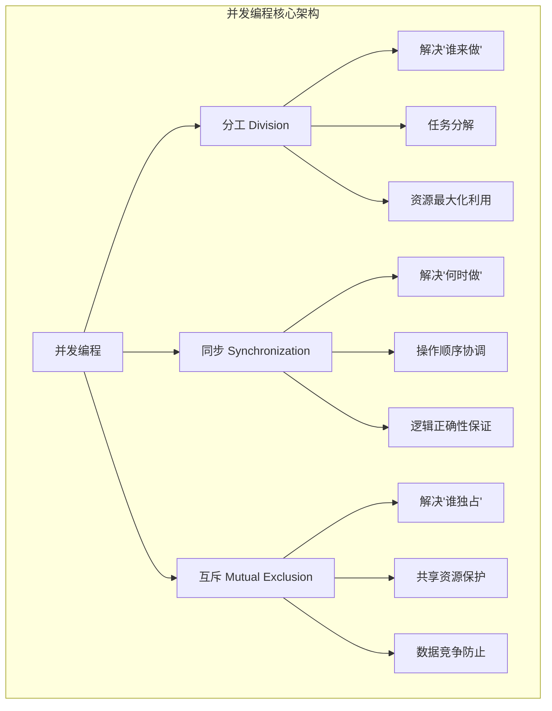
```mermaid
graph TB
    subgraph "并发编程核心架构"
        A[并发编程] --> B[分工 Division]
        A --> C[同步 Synchronization]
        A --> D[互斥 Mutual Exclusion]
        
        B --> B1["解决'谁来做'"]
        B --> B2[任务分解]
        B --> B3[资源最大化利用]
        
        C --> C1["解决'何时做'"]
        C --> C2[操作顺序协调]
        C --> C3[逻辑正确性保证]
        
        D --> D1["解决'谁独占'"]
        D --> D2[共享资源保护]
        D --> D3[数据竞争防止]
    end
```

分工、同步、互斥架构图

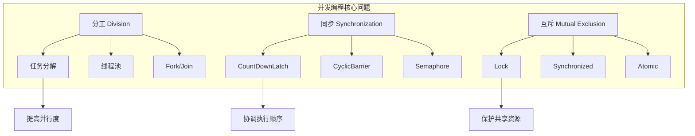
```mermaid
graph TB
    subgraph "并发编程核心问题"
        A[分工 Division] --> A1[任务分解]
        A --> A2[线程池]
        A --> A3[Fork/Join]
        
        B[同步 Synchronization] --> B1[CountDownLatch]
        B --> B2[CyclicBarrier]
        B --> B3[Semaphore]
        
        C[互斥 Mutual Exclusion] --> C1[Lock]
        C --> C2[Synchronized]
        C --> C3[Atomic]
    end
    
    A1 --> D[提高并行度]
    B1 --> E[协调执行顺序]
    C1 --> F[保护共享资源]
```

### 2.2 三大核心思想

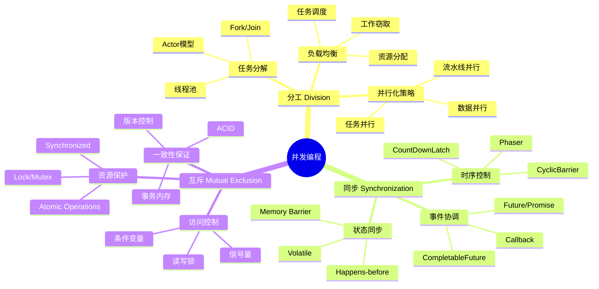
```mermaid
mindmap
  root((并发编程))
    分工 Division
      任务分解
        Fork/Join
        线程池
        Actor模型
      负载均衡
        工作窃取
        任务调度
        资源分配
      并行化策略
        数据并行
        任务并行
        流水线并行
    同步 Synchronization
      时序控制
        CountDownLatch
        CyclicBarrier
        Phaser
      事件协调
        Future/Promise
        CompletableFuture
        Callback
      状态同步
        Volatile
        Memory Barrier
        Happens-before
    互斥 Mutual Exclusion
      资源保护
        Lock/Mutex
        Synchronized
        Atomic Operations
      访问控制
        读写锁
        信号量
        条件变量
      一致性保证
        ACID
        事务内存
        版本控制
```

### 2.3 协作关系设计

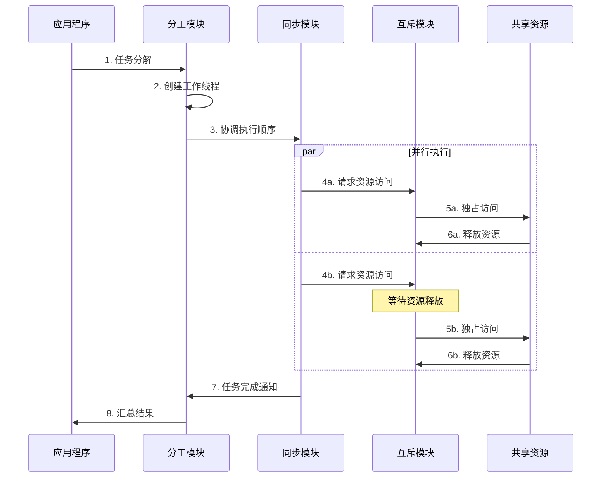
```mermaid
sequenceDiagram
    participant App as 应用程序
    participant Division as 分工模块
    participant Sync as 同步模块
    participant Mutex as 互斥模块
    participant Resource as 共享资源
    
    App->>Division: 1. 任务分解
    Division->>Division: 2. 创建工作线程
    Division->>Sync: 3. 协调执行顺序
    
    par 并行执行
        Sync->>Mutex: 4a. 请求资源访问
        Mutex->>Resource: 5a. 独占访问
        Resource->>Mutex: 6a. 释放资源
    and
        Sync->>Mutex: 4b. 请求资源访问
        Note over Mutex: 等待资源释放
        Mutex->>Resource: 5b. 独占访问
        Resource->>Mutex: 6b. 释放资源
    end
    
    Sync->>Division: 7. 任务完成通知
    Division->>App: 8. 汇总结果
```

## 03.分工设计思想

分工设计 - 解决"谁来做"。分工是并发编程的第一步，核心目标是将大型任务分解为可并行执行的子任务，最大化利用计算资源。

### 3.1 分工设计架构

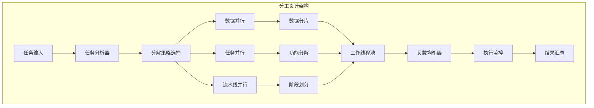
```mermaid
graph TB
    subgraph "分工设计架构"
        A[任务输入] --> B[任务分析器]
        B --> C[分解策略选择]
        
        C --> D[数据并行]
        C --> E[任务并行]
        C --> F[流水线并行]
        
        D --> G[数据分片]
        E --> H[功能分解]
        F --> I[阶段划分]
        
        G --> J[工作线程池]
        H --> J
        I --> J
        
        J --> K[负载均衡器]
        K --> L[执行监控]
        L --> M[结果汇总]
    end
```

### 3.2 分工模式详解

Fork/Join模式

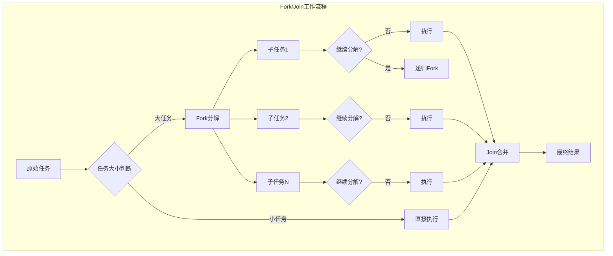
```mermaid
graph TD
    subgraph "Fork/Join工作流程"
        A[原始任务] --> B{任务大小判断}
        B -->|大任务| C[Fork分解]
        B -->|小任务| D[直接执行]
        
        C --> E[子任务1]
        C --> F[子任务2]
        C --> G[子任务N]
        
        E --> H{继续分解?}
        F --> I{继续分解?}
        G --> J{继续分解?}
        
        H -->|是| K[递归Fork]
        H -->|否| L[执行]
        I -->|否| M[执行]
        J -->|否| N[执行]
        
        L --> O[Join合并]
        M --> O
        N --> O
        D --> O
        
        O --> P[最终结果]
    end
```

Java Fork/Join实现，大概思路如下：

```java
import java.util.concurrent.RecursiveTask;
import java.util.concurrent.ForkJoinPool;

public class ParallelSum extends RecursiveTask<Long> {
    private static final int THRESHOLD = 1000;
    private final int[] array;
    private final int start;
    private final int end;
    
    public ParallelSum(int[] array, int start, int end) {
        this.array = array;
        this.start = start;
        this.end = end;
    }
    
    @Override
    protected Long compute() {
        if (end - start <= THRESHOLD) {
            // 小任务直接计算
            long sum = 0;
            for (int i = start; i < end; i++) {
                sum += array[i];
            }
            return sum;
        } else {
            // 大任务分解
            int mid = (start + end) / 2;
            ParallelSum leftTask = new ParallelSum(array, start, mid);
            ParallelSum rightTask = new ParallelSum(array, mid, end);
            
            // Fork分解
            leftTask.fork();
            rightTask.fork();
            
            // Join合并
            return leftTask.join() + rightTask.join();
        }
    }
    
    public static void main(String[] args) {
        int[] array = new int[10000];
        // 初始化数组...
        
        ForkJoinPool pool = new ForkJoinPool();
        ParallelSum task = new ParallelSum(array, 0, array.length);
        Long result = pool.invoke(task);
        
        System.out.println("并行计算结果: " + result);
    }
}
```

### 3.3 线程池分工模式

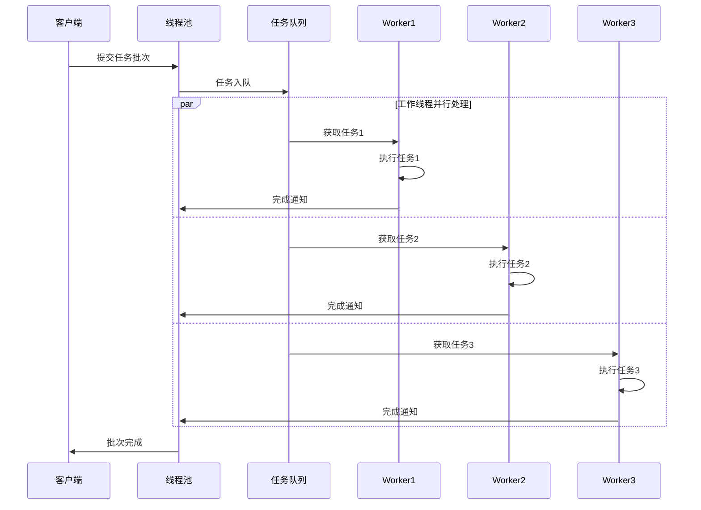
```mermaid
sequenceDiagram
    participant Client as 客户端
    participant Pool as 线程池
    participant Queue as 任务队列
    participant W1 as Worker1
    participant W2 as Worker2
    participant W3 as Worker3
    
    Client->>Pool: 提交任务批次
    Pool->>Queue: 任务入队
    
    par 工作线程并行处理
        Queue->>W1: 获取任务1
        W1->>W1: 执行任务1
        W1->>Pool: 完成通知
    and
        Queue->>W2: 获取任务2
        W2->>W2: 执行任务2
        W2->>Pool: 完成通知
    and
        Queue->>W3: 获取任务3
        W3->>W3: 执行任务3
        W3->>Pool: 完成通知
    end
    
    Pool->>Client: 批次完成
```

### 3.4 工作窃取算法

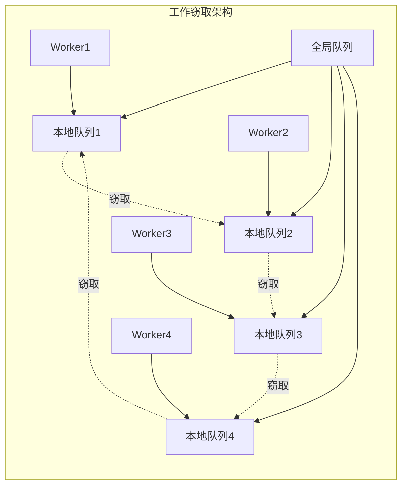
```mermaid
graph LR
    subgraph "工作窃取架构"
        W1[Worker1] --> Q1[本地队列1]
        W2[Worker2] --> Q2[本地队列2]
        W3[Worker3] --> Q3[本地队列3]
        W4[Worker4] --> Q4[本地队列4]
        
        Q1 -.->|窃取| Q2
        Q2 -.->|窃取| Q3
        Q3 -.->|窃取| Q4
        Q4 -.->|窃取| Q1
        
        GQ[全局队列] --> Q1
        GQ --> Q2
        GQ --> Q3
        GQ --> Q4
    end
```

## 04.同步设计思想

同步设计 - 解决"何时做"。同步解决多个执行单元的操作顺序协调问题，确保程序逻辑的正确性。

### 4.1 同步机制分类

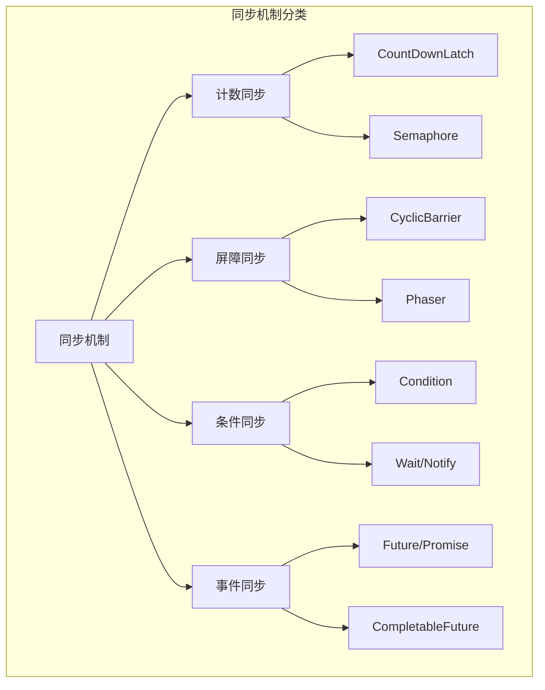
```mermaid
graph TB
    subgraph "同步机制分类"
        A[同步机制] --> B[计数同步]
        A --> C[屏障同步]
        A --> D[条件同步]
        A --> E[事件同步]
        
        B --> B1[CountDownLatch]
        B --> B2[Semaphore]
        
        C --> C1[CyclicBarrier]
        C --> C2[Phaser]
        
        D --> D1[Condition]
        D --> D2[Wait/Notify]
        
        E --> E1[Future/Promise]
        E --> E2[CompletableFuture]
    end
```

### 4.2 计数同步思想

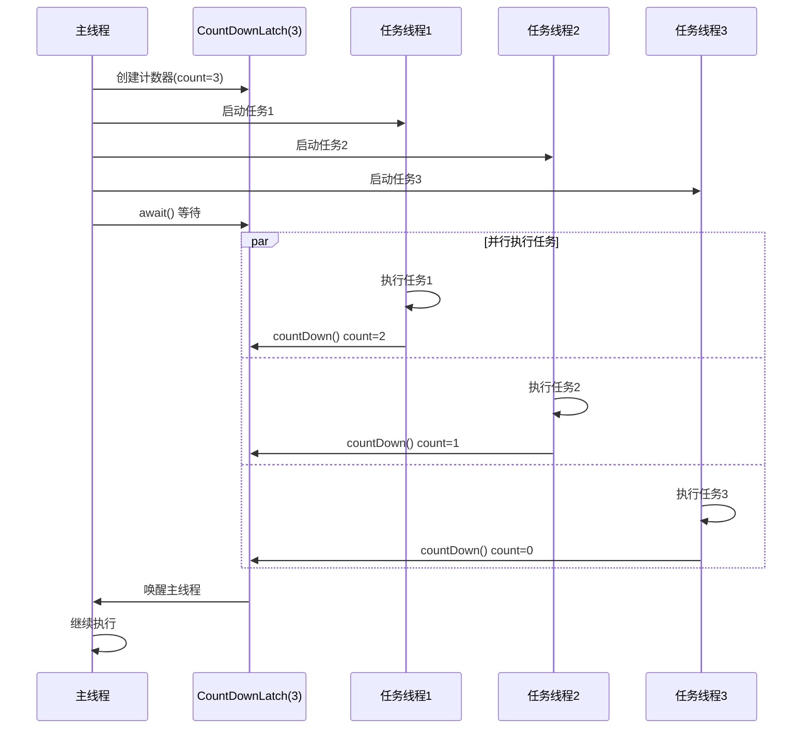
```mermaid
sequenceDiagram
    participant Main as 主线程
    participant CDL as CountDownLatch(3)
    participant T1 as 任务线程1
    participant T2 as 任务线程2
    participant T3 as 任务线程3
    
    Main->>CDL: 创建计数器(count=3)
    Main->>T1: 启动任务1
    Main->>T2: 启动任务2
    Main->>T3: 启动任务3
    Main->>CDL: await() 等待
    
    par 并行执行任务
        T1->>T1: 执行任务1
        T1->>CDL: countDown() count=2
    and
        T2->>T2: 执行任务2
        T2->>CDL: countDown() count=1
    and
        T3->>T3: 执行任务3
        T3->>CDL: countDown() count=0
    end
    
    CDL->>Main: 唤醒主线程
    Main->>Main: 继续执行
```

### 4.3 屏障同步思想

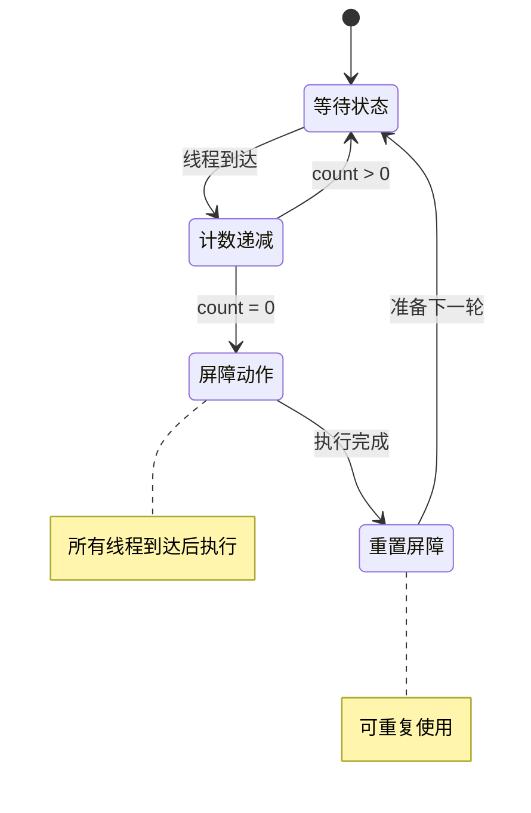
```mermaid
stateDiagram-v2
    [*] --> 等待状态
    等待状态 --> 计数递减 : 线程到达
    计数递减 --> 等待状态 : count > 0
    计数递减 --> 屏障动作 : count = 0
    屏障动作 --> 重置屏障 : 执行完成
    重置屏障 --> 等待状态 : 准备下一轮
    
    note right of 屏障动作 : 所有线程到达后执行
    note right of 重置屏障 : 可重复使用
```

### 4.4 条件同步思想


### 4.5 事件同步思想

## 05.互斥设计思想

互斥设计 - 解决"谁独占"。互斥确保对共享资源的独占访问，防止数据竞争和不一致状态。

### 5.1 互斥机制架构

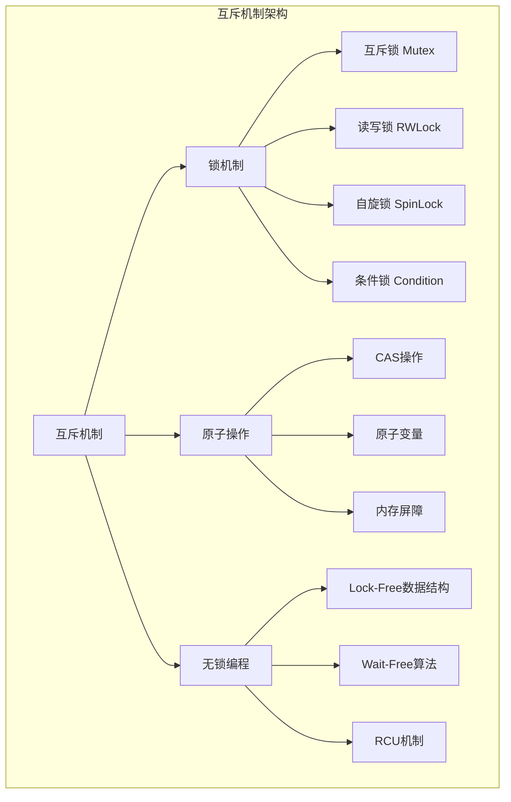
```mermaid
graph TB
    subgraph "互斥机制架构"
        A[互斥机制] --> B[锁机制]
        A --> C[原子操作]
        A --> D[无锁编程]
        
        B --> B1[互斥锁 Mutex]
        B --> B2[读写锁 RWLock]
        B --> B3[自旋锁 SpinLock]
        B --> B4[条件锁 Condition]
        
        C --> C1[CAS操作]
        C --> C2[原子变量]
        C --> C3[内存屏障]
        
        D --> D1[Lock-Free数据结构]
        D --> D2[Wait-Free算法]
        D --> D3[RCU机制]
    end
```

### 5.2 锁机制设计


锁的层次结构

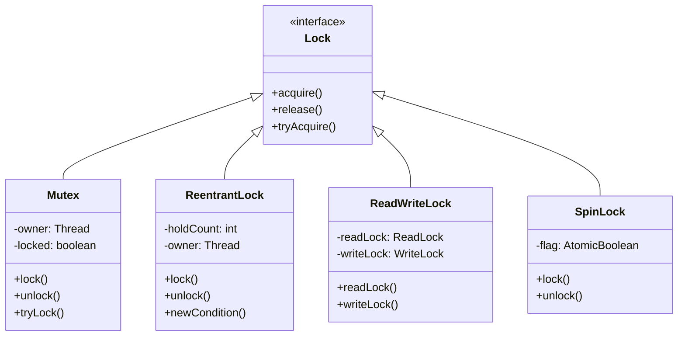
```mermaid
classDiagram
    class Lock {
        <<interface>>
        +acquire()
        +release()
        +tryAcquire()
    }
    
    class Mutex {
        -owner: Thread
        -locked: boolean
        +lock()
        +unlock()
        +tryLock()
    }
    
    class ReentrantLock {
        -holdCount: int
        -owner: Thread
        +lock()
        +unlock()
        +newCondition()
    }
    
    class ReadWriteLock {
        -readLock: ReadLock
        -writeLock: WriteLock
        +readLock()
        +writeLock()
    }
    
    class SpinLock {
        -flag: AtomicBoolean
        +lock()
        +unlock()
    }
    
    Lock <|-- Mutex
    Lock <|-- ReentrantLock
    Lock <|-- ReadWriteLock
    Lock <|-- SpinLock
```

互斥实现详解，读写锁模式

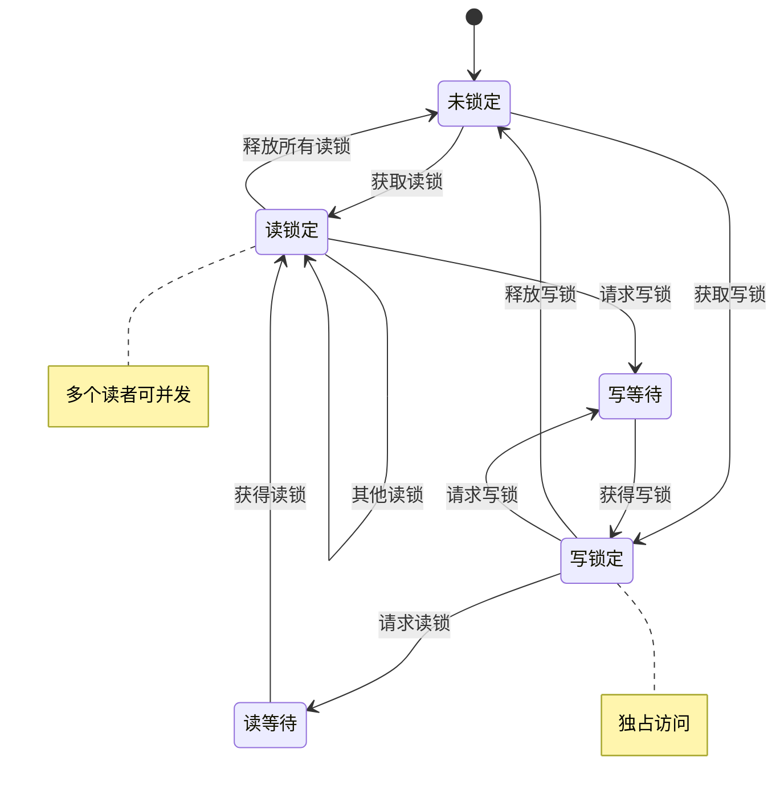
```mermaid
stateDiagram-v2
    [*] --> 未锁定
    未锁定 --> 读锁定 : 获取读锁
    未锁定 --> 写锁定 : 获取写锁
    
    读锁定 --> 读锁定 : 其他读锁
    读锁定 --> 未锁定 : 释放所有读锁
    读锁定 --> 写等待 : 请求写锁
    
    写锁定 --> 未锁定 : 释放写锁
    写锁定 --> 读等待 : 请求读锁
    写锁定 --> 写等待 : 请求写锁
    
    写等待 --> 写锁定 : 获得写锁
    读等待 --> 读锁定 : 获得读锁
    
    note right of 读锁定 : 多个读者可并发
    note right of 写锁定 : 独占访问
```


### 5.3 原子变量设计


### 5.4 无锁编程设计


## 06.跨语言对比
### 6.1 语言特性对比表

| 特性 | Java | C++ | Objective-C |
|------|------|-----|-------------|
| **分工机制** | | | |
| 线程池 | ExecutorService | std::thread + 自实现 | NSOperationQueue |
| Fork/Join | ForkJoinPool | std::async | GCD dispatch_apply |
| 任务调度 | ScheduledExecutorService | std::chrono + timer | NSTimer + GCD |
| **同步机制** | | | |
| 计数同步 | CountDownLatch | std::latch (C++20) | dispatch_semaphore |
| 屏障同步 | CyclicBarrier | std::barrier (C++20) | dispatch_group |
| 条件同步 | Condition | std::condition_variable | NSCondition |
| 异步编排 | CompletableFuture | std::future | NSOperation依赖 |
| **互斥机制** | | | |
| 基础锁 | synchronized | std::mutex | @synchronized |
| 读写锁 | ReadWriteLock | std::shared_mutex | pthread_rwlock |
| 原子操作 | AtomicInteger | std::atomic | OSAtomic函数 |
| 自旋锁 | 自实现 | std::atomic_flag | OSSpinLock |

### 6.2 性能特性对比

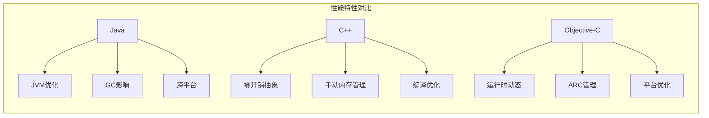
```mermaid
graph LR
    subgraph "性能特性对比"
        A[Java] --> A1[JVM优化]
        A --> A2[GC影响]
        A --> A3[跨平台]
        
        B[C++] --> B1[零开销抽象]
        B --> B2[手动内存管理]
        B --> B3[编译优化]
        
        C[Objective-C] --> C1[运行时动态]
        C --> C2[ARC管理]
        C --> C3[平台优化]
    end
```

## 07.并发编程架构模式

### 7.1 Actor模型

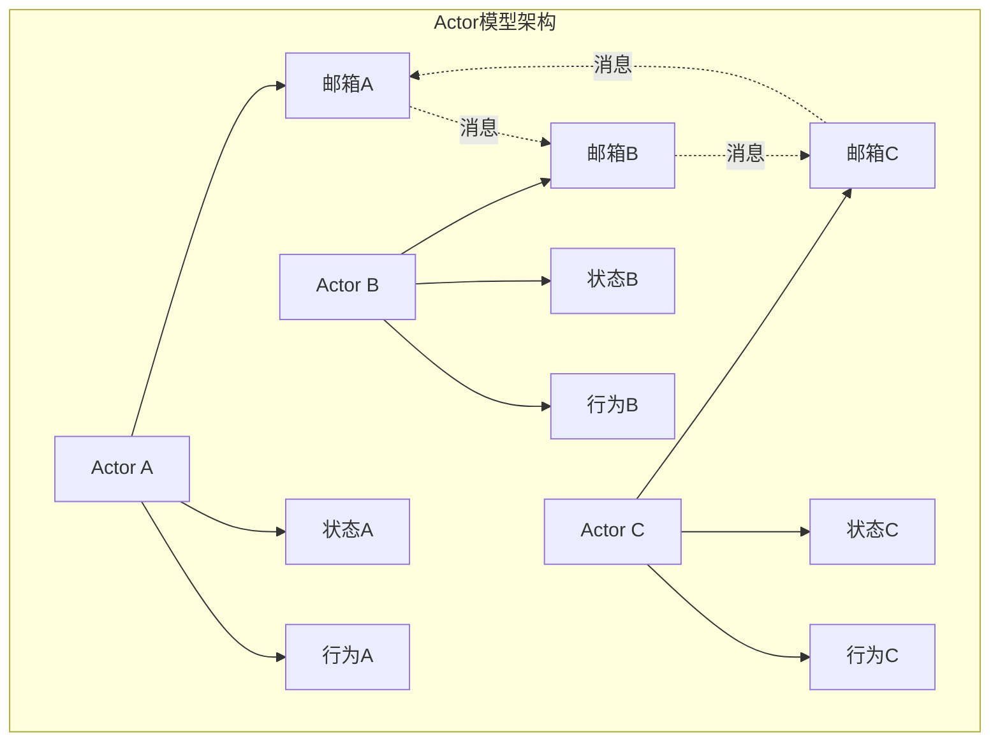
```mermaid
graph TB
    subgraph "Actor模型架构"
        A[Actor A] --> MA[邮箱A]
        B[Actor B] --> MB[邮箱B]
        C[Actor C] --> MC[邮箱C]
        
        MA -.->|消息| MB
        MB -.->|消息| MC
        MC -.->|消息| MA
        
        A --> SA[状态A]
        B --> SB[状态B]
        C --> SC[状态C]
        
        A --> BA[行为A]
        B --> BB[行为B]
        C --> BC[行为C]
    end
```

### 7.2 生产者-消费者模式

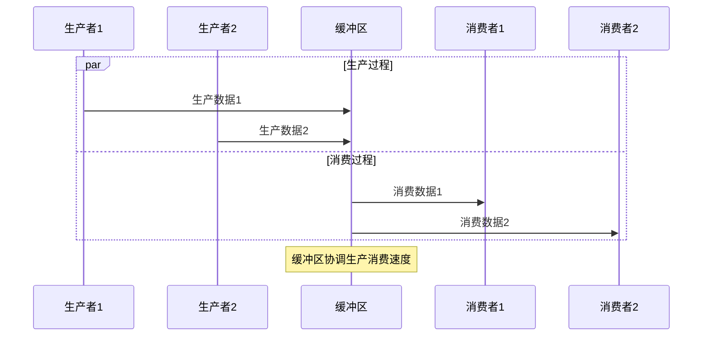
```mermaid
sequenceDiagram
    participant P1 as 生产者1
    participant P2 as 生产者2
    participant Buffer as 缓冲区
    participant C1 as 消费者1
    participant C2 as 消费者2
    
    par 生产过程
        P1->>Buffer: 生产数据1
        P2->>Buffer: 生产数据2
    and 消费过程
        Buffer->>C1: 消费数据1
        Buffer->>C2: 消费数据2
    end
    
    Note over Buffer: 缓冲区协调生产消费速度
```

### 7.3 Master-Worker模式

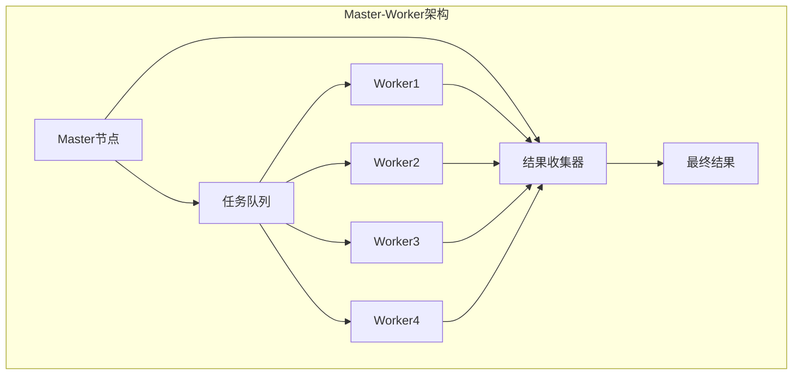
```mermaid
graph TD
    subgraph "Master-Worker架构"
        Master[Master节点] --> TaskQueue[任务队列]
        Master --> ResultCollector[结果收集器]
        
        TaskQueue --> W1[Worker1]
        TaskQueue --> W2[Worker2]
        TaskQueue --> W3[Worker3]
        TaskQueue --> W4[Worker4]
        
        W1 --> ResultCollector
        W2 --> ResultCollector
        W3 --> ResultCollector
        W4 --> ResultCollector
        
        ResultCollector --> FinalResult[最终结果]
    end
```

## 08.优化与最佳实践

### 8.1 性能优化策略

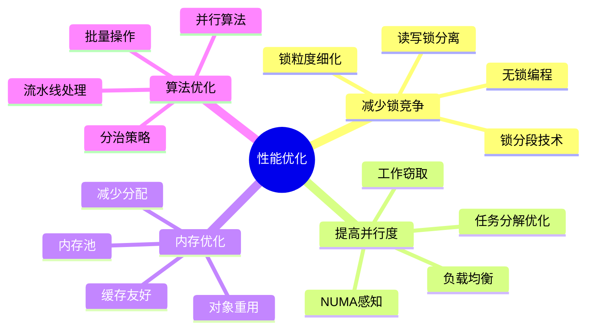
```mermaid
mindmap
  root((性能优化))
    减少锁竞争
      锁粒度细化
      读写锁分离
      锁分段技术
      无锁编程
    提高并行度
      任务分解优化
      负载均衡
      工作窃取
      NUMA感知
    内存优化
      缓存友好
      内存池
      对象重用
      减少分配
    算法优化
      并行算法
      分治策略
      流水线处理
      批量操作
```

### 8.2 分工最佳实践

```java
// ✅ 推荐：使用合适的线程池
ExecutorService executor = Executors.newWorkStealingPool();

// ✅ 推荐：任务大小适中
int optimalTaskSize = availableProcessors() * 2;

// ❌ 避免：创建过多线程
// new Thread(() -> task.run()).start(); // 每次创建新线程

// ✅ 推荐：使用CompletableFuture进行异步编排
CompletableFuture.supplyAsync(() -> fetchData())
    .thenApply(data -> processData(data))
    .thenAccept(result -> saveResult(result));
```

### 8.3 同步最佳实践

```java
// ✅ 推荐：使用CountDownLatch等待多个任务
CountDownLatch latch = new CountDownLatch(taskCount);

// ✅ 推荐：使用CyclicBarrier进行阶段同步
CyclicBarrier barrier = new CyclicBarrier(threadCount, () -> {
    System.out.println("所有线程完成当前阶段");
});

// ❌ 避免：使用Thread.sleep进行同步
// Thread.sleep(1000); // 不可靠的同步方式
```

### 8.4 互斥最佳实践

```java
// ✅ 推荐：使用读写锁提高并发度
ReadWriteLock rwLock = new ReentrantReadWriteLock();

// ✅ 推荐：使用原子类避免锁
AtomicInteger counter = new AtomicInteger(0);

// ✅ 推荐：最小化锁的范围
synchronized(lockObject) {
    // 只包含必要的临界区代码
    criticalSection();
}

// ❌ 避免：过大的同步块
// synchronized(this) {
//     longRunningOperation(); // 锁持有时间过长
// }
```

### 8.3 性能监控与调优

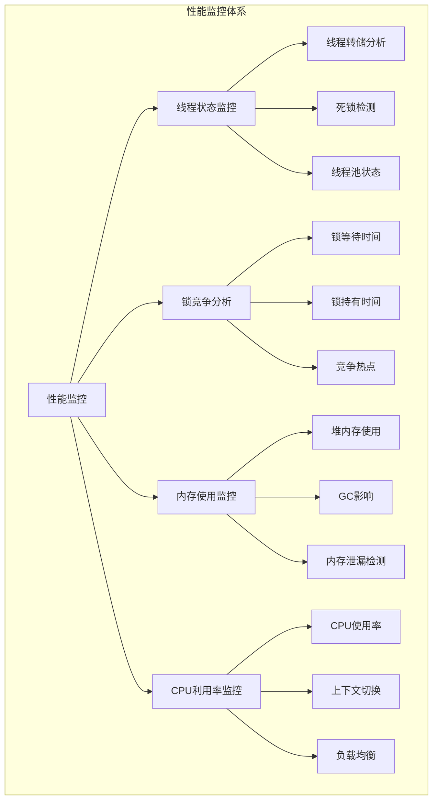
```mermaid
graph TB
    subgraph "性能监控体系"
        A[性能监控] --> B[线程状态监控]
        A --> C[锁竞争分析]
        A --> D[内存使用监控]
        A --> E[CPU利用率监控]
        
        B --> B1[线程转储分析]
        B --> B2[死锁检测]
        B --> B3[线程池状态]
        
        C --> C1[锁等待时间]
        C --> C2[锁持有时间]
        C --> C3[竞争热点]
        
        D --> D1[堆内存使用]
        D --> D2[GC影响]
        D --> D3[内存泄漏检测]
        
        E --> E1[CPU使用率]
        E --> E2[上下文切换]
        E --> E3[负载均衡]
    end
```

## 总结

并发编程的核心在于正确理解和应用分工、同步、互斥三大核心思想：

### 9.1 核心要点总结

```mermaid
graph LR
    subgraph "并发编程核心要点"
        A[分工 Division] --> A1[任务分解]
        A --> A2[负载均衡]
        A --> A3[并行执行]
        
        B[同步 Synchronization] --> B1[时序控制]
        B --> B2[状态协调]
        B --> B3[依赖管理]
        
        C[互斥 Mutual Exclusion] --> C1[资源保护]
        C --> C2[数据一致性]
        C --> C3[竞争避免]
        
        A1 --> D[高性能]
        B1 --> E[正确性]
        C1 --> F[安全性]
        
        D --> G[并发系统]
        E --> G
        F --> G
    end
```

### 9.2 设计原则

1. **分工原则**
  - 任务分解要合理，避免过度分解导致开销增大
  - 负载均衡要动态，适应不同的工作负载
  - 并行度要适中，考虑硬件资源限制

2. **同步原则**
  - 同步点要明确，避免不必要的等待
  - 依赖关系要清晰，防止循环依赖
  - 超时机制要完善，避免无限等待

3. **互斥原则**
  - 锁粒度要适当，平衡性能和安全
  - 锁顺序要一致，预防死锁发生
  - 无锁优先，在可能的情况下使用原子操作

### 9.3 技术选型建议

| 场景 | Java推荐 | C++推荐 | Objective-C推荐 |
|------|----------|---------|-----------------|
| CPU密集型任务 | ForkJoinPool | std::async | GCD dispatch_apply |
| I/O密集型任务 | CompletableFuture | std::future | NSOperation |
| 实时系统 | 自定义线程池 | 实时线程 | 高优先级队列 |
| 高并发读写 | ConcurrentHashMap | lock-free结构 | dispatch_concurrent |
| 简单同步 | CountDownLatch | std::latch | dispatch_semaphore |
| 复杂协调 | CyclicBarrier | 自实现 | NSOperation依赖 |
