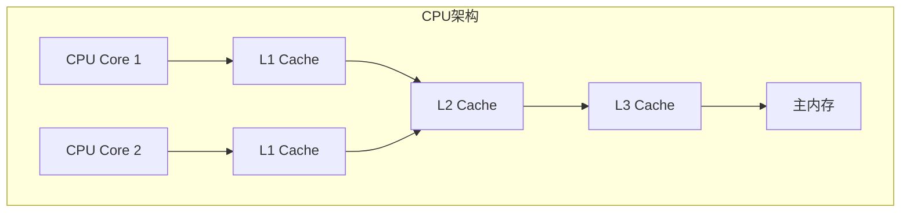
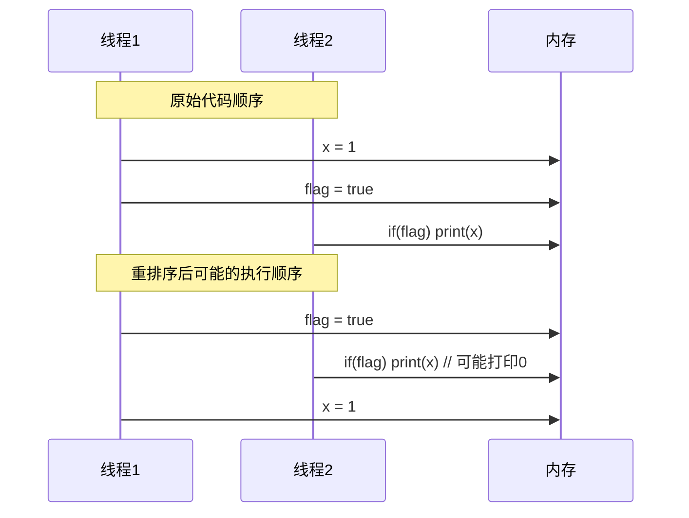
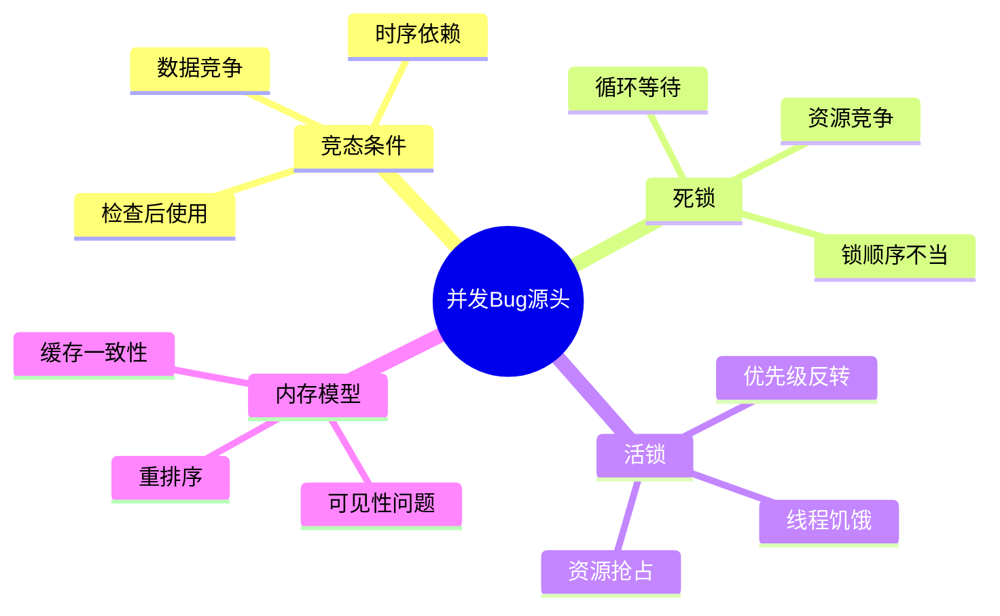
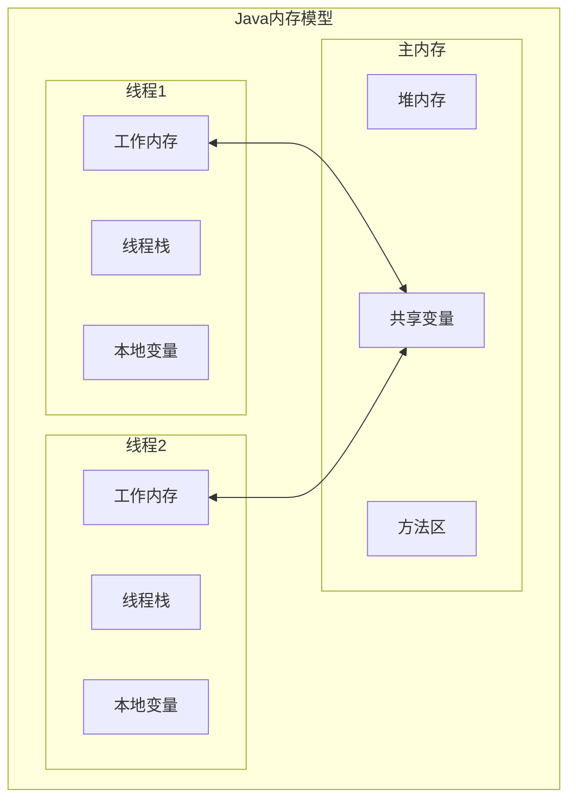
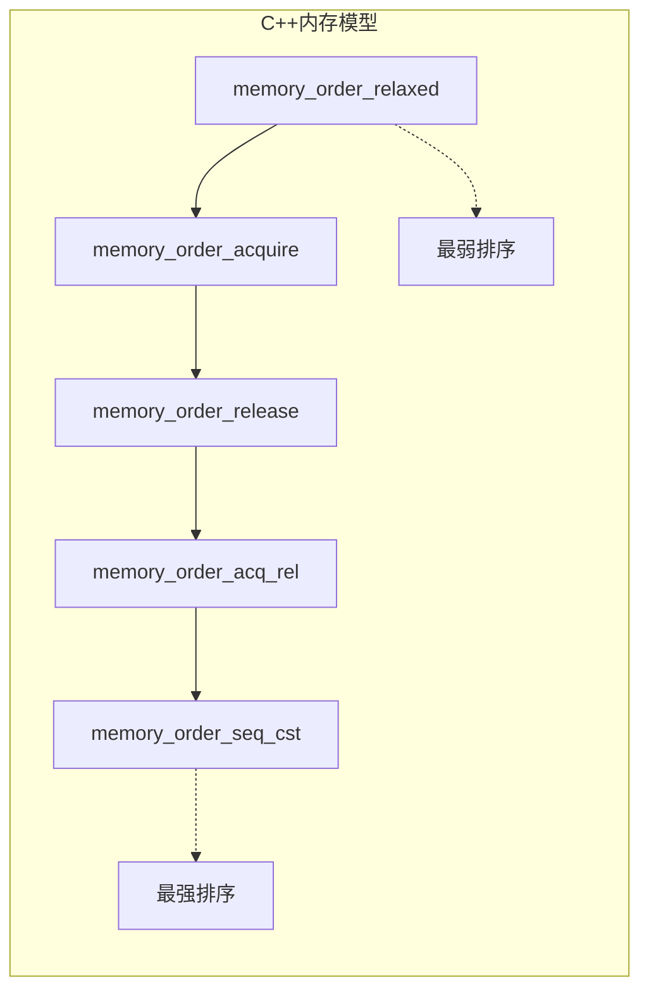
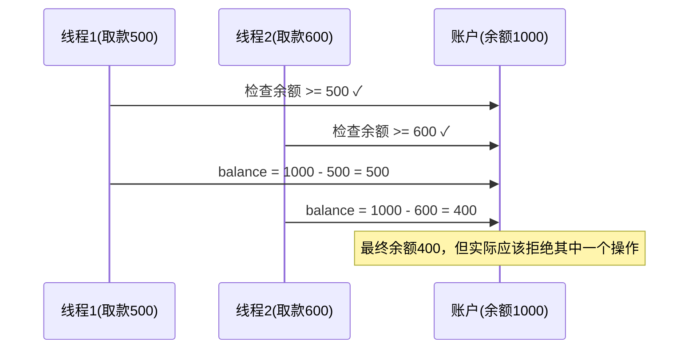

#### 目录介绍
- 1.并发编程挑战
  - 1.1 并发的挑战
- 2.多线程脏数据
  - 2.1 脏数据由来
  - 2.2 i++脏数据
  - 2.3 单例脏数据
  - 2.4 指令重排序
- 3.脏数据根因
  - 3.1 原子性问题
  - 3.2 可见性问题
  - 3.3 有序性问题


## 01.并发编程挑战

### 1.1 并发的挑战

并发编程的核心挑战在于：**多个执行单元共享可变状态时，执行顺序不可预测。**

单线程程序是确定性的——相同输入总能得到相同输出。而并发程序中，线程调度由OS内核控制，开发者无法控制线程何时被中断、何时恢复，这引入了**不确定性**。

并发问题难以调试的根源：

- **时序依赖**：Bug只在特定调度顺序下触发
- **不可复现**：同样的代码运行多次，结果可能不同
- **海森堡效应**：加日志/断点后，时序改变，Bug消失

### 1.2 核心挑战

- **数据竞争**：多个线程同时访问共享数据
- **原子性**：操作的不可分割性
- **可见性**：一个线程对共享变量的修改对其他线程的可见性
- **有序性**：程序执行的顺序性保证

## 02.多线程脏数据

### 2.1 脏数据由来

为什么会出现脏数据？脏数据的本质是**对共享状态的非原子性操作**。

当一个操作在逻辑上应该是不可分割的，但实际执行中被拆分成多个步骤，其他线程在中间状态读写了同一数据，就产生了脏数据。

三个必要条件（缺一不可）：

1. **共享**：多个线程访问同一内存
2. **可变**：至少一个线程在写
3. **非原子**：读写操作不是一步完成

### 2.2 i++脏数据

**案例：i++ 不是原子操作**

```cpp
// 共享变量
int counter = 0;

// 线程A和线程B同时执行
void Increment() {
  for (int i = 0; i < 100000; ++i) {
    counter++;  // 看似一行，实则三步
  }
}
```

`counter++` 在CPU层面分解为：

```
1. LOAD   counter → register    // 读
2. ADD    register, 1           // 改
3. STORE  register → counter    // 写
```

两个线程交错执行：

```
时刻    线程A                线程B               counter(内存)
─────────────────────────────────────────────────────────────
T1     LOAD counter(=0)                            0
T2                          LOAD counter(=0)       0
T3     ADD → 1                                     0
T4                          ADD → 1                0
T5     STORE 1                                     1
T6                          STORE 1                1  ← 期望2，实际1
```

**两次自增，结果只加了1。**

### 2.3 单例脏数据

```cpp
// 典型的 TOCTOU (Time-of-Check to Time-of-Use)
class LazyInit {
  Widget* widget_ = nullptr;

  Widget* GetWidget() {
    if (widget_ == nullptr) {       // Check
      widget_ = new Widget();       // Act
    }
    return widget_;
  }
};
```

可能执行结果如下所示：

```
线程A: if(widget_==nullptr) → true
线程B: if(widget_==nullptr) → true    // A还没赋值，B也进来了
线程A: widget_ = new Widget()         // 创建第一个
线程B: widget_ = new Widget()         // 创建第二个，第一个泄漏
```

### 2.4 指令重排序

半初始化对象，Java中著名的双重检查锁定（DCL）问题：

```java
class Singleton {
    private static Singleton instance;

    public static Singleton getInstance() {
        if (instance == null) {                // 第一次检查
            synchronized (Singleton.class) {
                if (instance == null) {        // 第二次检查
                    instance = new Singleton(); // 问题在这里
                }
            }
        }
        return instance;
    }
}
```

`instance = new Singleton()` 在JVM层面分解为：

```
1. 分配内存
2. 调用构造函数初始化
3. 将引用赋值给 instance
```

编译器/CPU可能重排序为 `1→3→2`，此时线程B在步骤3后读到非null的 `instance`，但对象还没初始化完——**读到半初始化的对象**。

## 3.脏数据根因

### 3.1 原子性问题

> 一组操作要么全部执行完成，要么全部不执行。

CPU指令级别只保证单条指令的原子性。高级语言中一条语句通常编译成多条指令，中间随时可能被线程切换打断。

```
高级语言           CPU指令数
──────────────────────────
i++               3条 (LOAD/ADD/STORE)
i = j             可能2条 (64位变量在32位CPU上)
map[key] = val    几十条
```

### 3.2 可见性问题

> 一个线程对共享变量的修改，另一个线程能否立即看到。

现代CPU架构：

```
┌──────────┐    ┌──────────┐
│  CPU 0   │    │  CPU 1   │
│┌────────┐│    │┌────────┐│
││Register││    ││Register││
│└───┬────┘│    │└───┬────┘│
│┌───┴────┐│    │┌───┴────┐│
││ L1 Cache││    ││ L1 Cache││
│└───┬────┘│    │└───┬────┘│
│┌───┴────┐│    │┌───┴────┐│
││ L2 Cache││    ││ L2 Cache││
│└───┬────┘│    │└───┬────┘│
└────┼─────┘    └────┼─────┘
     └───────┬───────┘
        ┌────┴────┐
        │ L3 Cache│
        └────┬────┘
        ┌────┴────┐
        │Main Memory│
        └─────────┘
```

线程A在CPU0上修改了变量，值可能停留在L1 Cache中，CPU1上的线程B从自己的Cache读到的仍然是旧值。

```cpp
// C++ 示例
bool stop = false;

// 线程A
void Worker() {
  while (!stop) {  // 编译器可能优化为只读一次，永远循环
    DoWork();
  }
}

// 线程B
void RequestStop() {
  stop = true;     // 写入可能滞留在CPU Cache中
}
```

### 3.3 有序性问题

> 程序执行的顺序不一定是代码书写的顺序。

重排序发生在三个层面：

1. **编译器优化**：编译器为了性能调整指令顺序
2. **CPU指令流水线**：CPU乱序执行（Out-of-Order Execution）
3. **内存系统**：Store Buffer和Invalidate Queue导致写读顺序变化

```cpp
// 初始: x = 0, y = 0

// 线程A            // 线程B
x = 1;              y = 1;
r1 = y;             r2 = x;

// 理论上 r1=0 且 r2=0 不可能
// 但在弱内存序的CPU（如ARM）上确实可能发生
```


### 2.1 CPU缓存一致性



### 2.2 指令重排序



### 2.3 原子性缺失

多步操作在执行过程中被其他线程中断，导致数据不一致。

### 2.4 Bug分类与源头



## 03.线程模型设计

### 3.1 Java内存模型



### 3.2 C++内存模型



## 03.脏数据案例

### 3.1 银行转账问题


案例1：银行转账问题（Java）

```java
public class BankAccount {
    private volatile int balance = 1000;
    
    // 问题代码：非原子操作
    public void withdraw(int amount) {
        if (balance >= amount) {  // 步骤1：检查余额
            // 此处可能被其他线程中断
            balance -= amount;    // 步骤2：扣减余额
        }
    }
}
```

**问题分析时序图：**



### 3.2 计数器问题

```cpp
class Counter {
private:
    int count = 0;
public:
    void increment() {
        count++;  // 非原子操作：读取->增加->写入
    }
    
    int getCount() {
        return count;
    }
};
```

### 3.3 单例模式问题

```objc
@implementation Singleton

+ (instancetype)sharedInstance {
    static Singleton *instance = nil;
    if (instance == nil) {  // 问题：双重检查但无同步
        instance = [[Singleton alloc] init];
    }
    return instance;
}

@end
```


