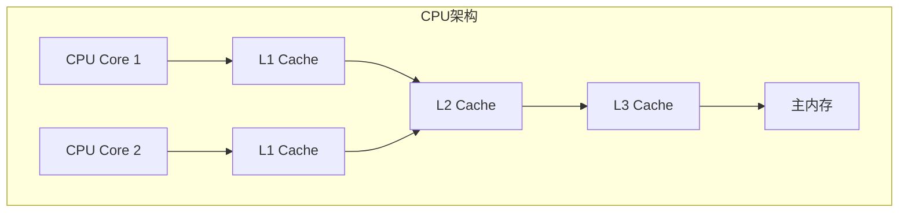
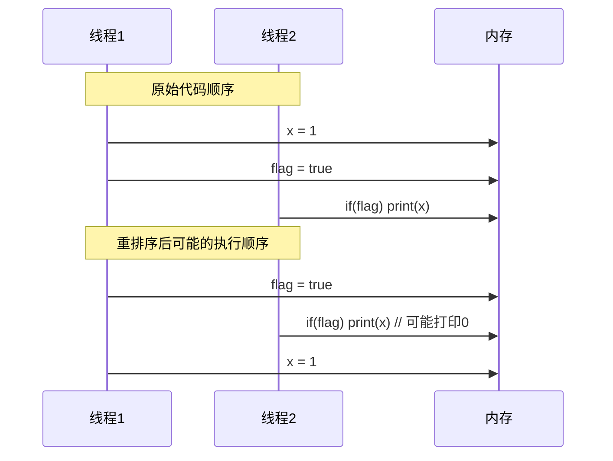

#### 目录介绍
- 01.并发编程挑战
  - 1.1 核心挑战
- 02.多线程脏数据
  - 2.1 CPU缓存一致性
  - 2.2 指令重排序
  - 2.3 原子性缺失

## 01.并发编程挑战

### 1.1 核心挑战

- **数据竞争**：多个线程同时访问共享数据
- **原子性**：操作的不可分割性
- **可见性**：一个线程对共享变量的修改对其他线程的可见性
- **有序性**：程序执行的顺序性保证

## 02.多线程脏数据

为什么会出现脏数据？脏数据的产生主要源于以下几个方面：

### 2.1 CPU缓存一致性

### 2.2 指令重排序

### 2.3 原子性缺失

多步操作在执行过程中被其他线程中断，导致数据不一致。

