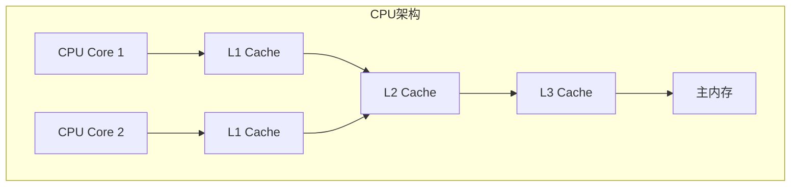
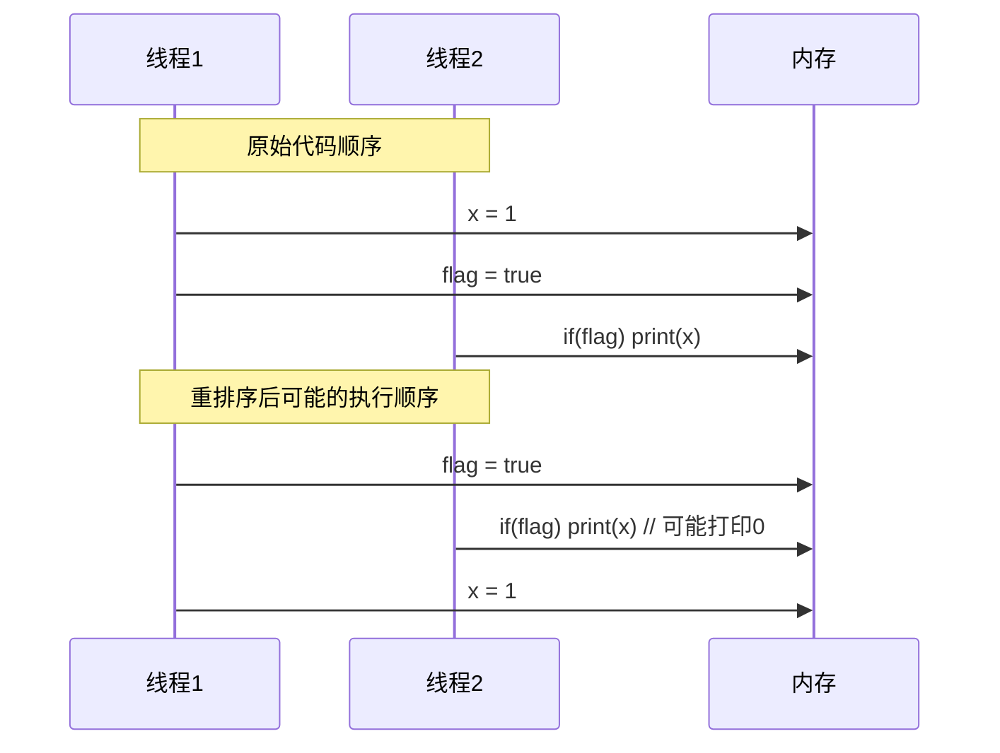
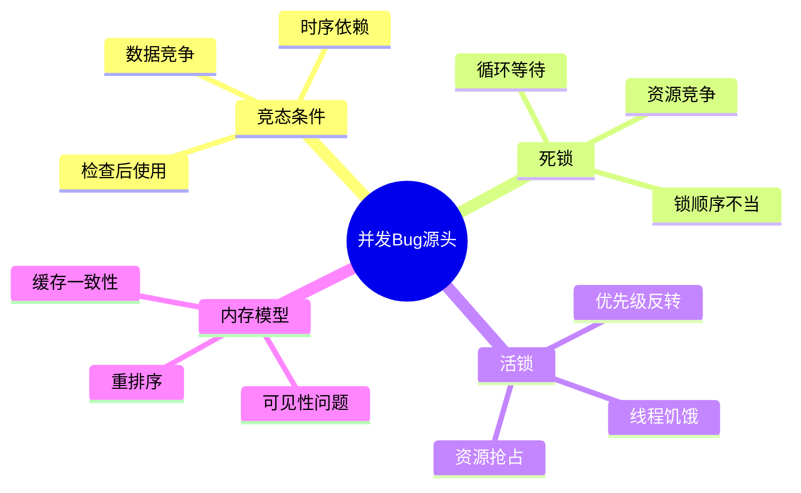
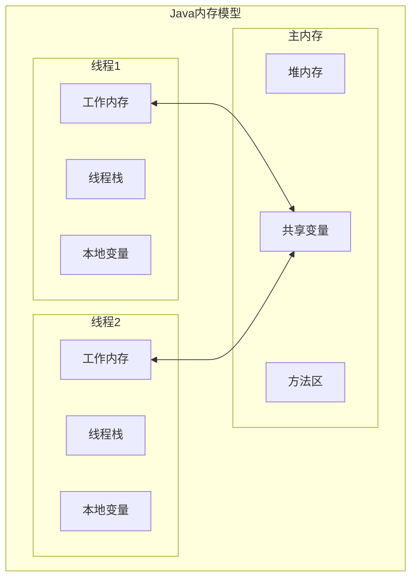
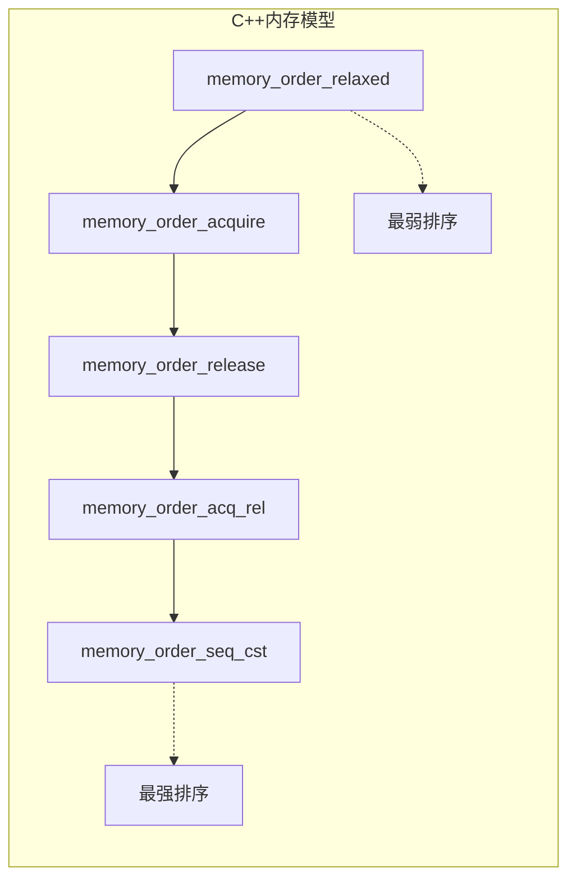
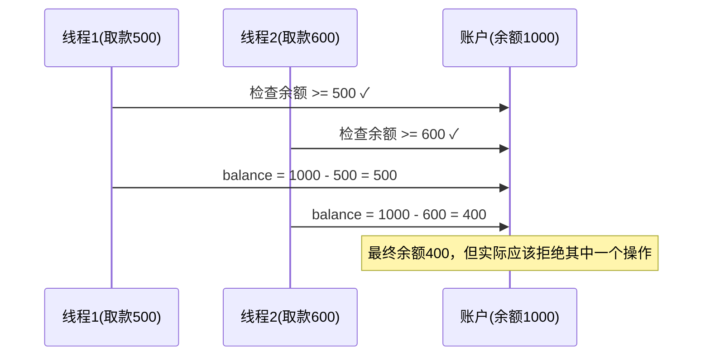

#### 目录介绍
- 01.并发编程挑战
  - 1.1 并发的挑战
- 02.多线程脏数据
  - 2.1 CPU缓存一致性
  - 2.2 指令重排序
  - 2.3 原子性缺失
  - 2.4 Bug分类与源头
- 03.线程模型设计
  - 3.1 Java内存模型
  - 3.2 C++内存模型
- 03.脏数据案例
  - 3.1 银行转账问题
  - 3.2 计数器问题
  - 3.3 单例模式问题


## 01.并发编程挑战

### 1.1 并发的挑战

并发编程的核心挑战在于：**多个执行单元共享可变状态时，执行顺序不可预测。**

单线程程序是确定性的——相同输入总能得到相同输出。而并发程序中，线程调度由OS内核控制，开发者无法控制线程何时被中断、何时恢复，这引入了**不确定性**。

并发问题难以调试的根源：

- **时序依赖**：Bug只在特定调度顺序下触发
- **不可复现**：同样的代码运行多次，结果可能不同
- **海森堡效应**：加日志/断点后，时序改变，Bug消失

### 1.2 核心挑战

- **数据竞争**：多个线程同时访问共享数据
- **原子性**：操作的不可分割性
- **可见性**：一个线程对共享变量的修改对其他线程的可见性
- **有序性**：程序执行的顺序性保证

## 02.多线程脏数据

为什么会出现脏数据？脏数据的产生主要源于以下几个方面：

### 2.1 CPU缓存一致性



### 2.2 指令重排序



### 2.3 原子性缺失

多步操作在执行过程中被其他线程中断，导致数据不一致。

### 2.4 Bug分类与源头



## 03.线程模型设计

### 3.1 Java内存模型



### 3.2 C++内存模型



## 03.脏数据案例

### 3.1 银行转账问题


案例1：银行转账问题（Java）

```java
public class BankAccount {
    private volatile int balance = 1000;
    
    // 问题代码：非原子操作
    public void withdraw(int amount) {
        if (balance >= amount) {  // 步骤1：检查余额
            // 此处可能被其他线程中断
            balance -= amount;    // 步骤2：扣减余额
        }
    }
}
```

**问题分析时序图：**



### 3.2 计数器问题

```cpp
class Counter {
private:
    int count = 0;
public:
    void increment() {
        count++;  // 非原子操作：读取->增加->写入
    }
    
    int getCount() {
        return count;
    }
};
```

### 3.3 单例模式问题

```objc
@implementation Singleton

+ (instancetype)sharedInstance {
    static Singleton *instance = nil;
    if (instance == nil) {  // 问题：双重检查但无同步
        instance = [[Singleton alloc] init];
    }
    return instance;
}

@end
```


