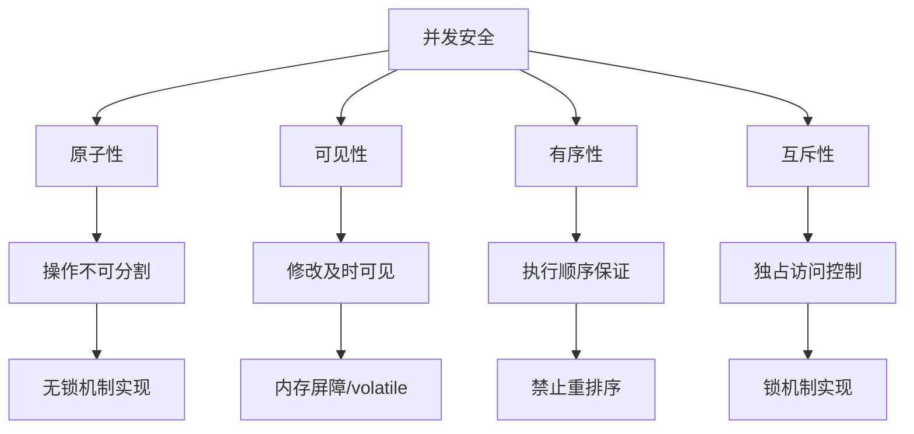
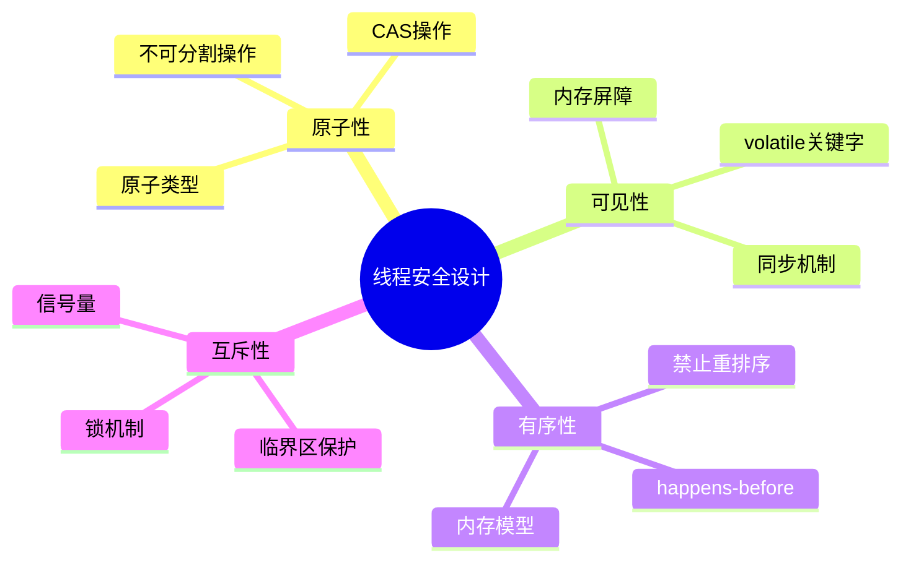
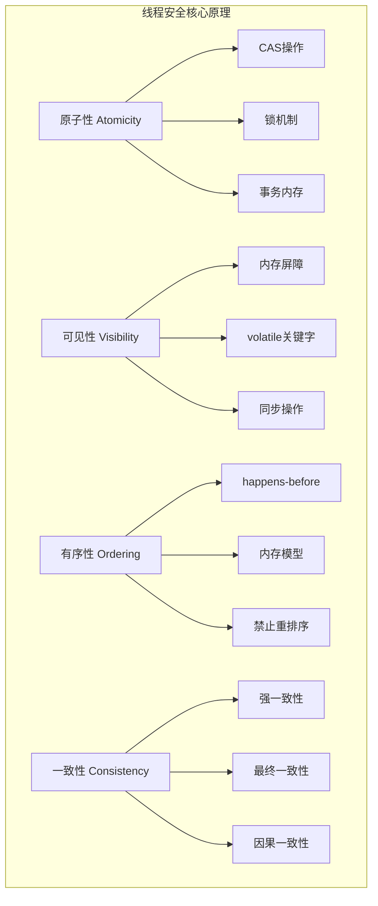
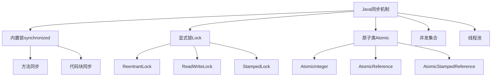

#### 目录介绍
- 01.核心设计思想
  - 1.1 并发四个原理
  - 1.2 安全核心原则
  - 1.3 并发场景选择
- 02.线程安全原理
  - 2.1 三大解法体系
  - 2.2 消除共享
  - 2.3 互斥访问
  - 2.4 原子操作
  - 2.5 三个层面对比
- 03.不可变
  - 3.1 如何保证安全
  - 3.2 示例
  - 3.3 核心设计思想
  - 3.4 核心原理
  - 3.5 遇到问题
- 04.线程局部存储
  - 4.1 如何保证安全
  - 4.2 示例
  - 4.3 核心设计思想
  - 4.4 核心原理
  - 4.5 遇到问题
- 05.读写分离
  - 5.1 如何保证安全
  - 5.2 示例
  - 5.3 核心设计思想
  - 5.4 核心原理
  - 5.5 遇到问题
- 06.无锁机制
  - 6.1 如何保证安全
  - 6.2 示例
  - 6.3 核心设计思想
  - 6.4 核心原理
  - 6.5 遇到问题
- 07.并发锁
  - 7.1 如何保证安全
  - 7.2 示例
  - 7.3 核心设计思想
  - 7.4 核心原理
  - 7.5 遇到问题
- 08.分段锁
  - 8.1 如何保证安全
  - 8.2 示例
  - 8.3 核心设计思想
  - 8.4 核心原理
  - 8.5 遇到问题
- 09.各编程语言方案
  - 9.1 Java解决方案
  - 9.2 C++解决方案
  - 9.3 Obj-C解决方案


## 01.核心设计思想

### 1.1 并发四个原理

在并发编程中，我们必须处理以下四个核心问题：

1. 原子性（Atomicity）：一个操作是不可中断的，要么全部执行成功，要么全部不执行。
2. 可见性（Visibility）：一个线程对共享变量的修改，能够及时被其他线程看到。
3. 有序性（Ordering）：程序执行的顺序按照代码的先后顺序执行。但是，由于指令重排序，实际执行顺序可能会与代码顺序不同。我们需要通过同步机制来保证有序性。
4. 互斥性（Mutual Exclusion）：同一时刻，只允许一个线程访问共享资源。



### 1.2 安全核心原则



### 1.3 并发场景选择

在设计并发安全系统时，我们可以根据具体场景选择不同的机制：

1. 如果数据不经常变化，或者变化时创建新对象代价不大，考虑使用不可变对象。
2. 如果数据是线程私有的，使用线程局部存储。
3. 如果读多写少，考虑读写分离。 
4. 如果竞争不激烈，或者需要高性能，考虑无锁机制。 
5. 如果需要灵活的锁操作，考虑并发锁。 
6. 如果共享资源可以划分为多个独立的部分，考虑分段锁。

| 机制 | 原子性 | 可见性 | 有序性 | 互斥性 | 适用场景 | 性能特点 |
|------|--------|--------|--------|--------|----------|----------|
| **不可变** | 强保证 | 强保证 | 强保证 | 不需要 | 配置信息、状态快照 | 读性能极佳，写需创建新对象 |
| **线程局部** | 线程内 | 线程内 | 线程内 | 不需要 | 线程上下文、连接管理 | 零竞争，内存占用高 |
| **读写分离** | 写时保证 | 锁保证 | 锁保证 | 读写互斥 | 读多写少缓存 | 高读并发，写有竞争 |
| **无锁机制** | CAS保证 | volatile | 内存屏障 | 乐观重试 | 计数器、队列 | 高吞吐，可能饥饿 |
| **并发锁** | 锁保证 | 锁保证 | 锁保证 | 完全互斥 | 复杂临界区 | 灵活，有阻塞开销 |
| **分段锁** | 分段内 | 分段内 | 分段内 | 分段互斥 | 哈希表、缓存 | 减少竞争，实现复杂 |


## 02.线程安全原理

### 2.1 三大解法体系

所有线程安全方案归结为三条路：

```
            线程安全
           ┌───┼───┐
           ▼   ▼   ▼
        消除共享  互斥访问  原子操作
```

详细一点来说就是下面这种，线程安全核心原理



### 2.2 消除共享

没有共享就没有竞争，这是最彻底的方案。

| 手段 | 原理 |
|------|------|
| **线程封闭** | 数据只属于一个线程，其他线程通过消息传递访问 |
| **不可变对象** | `const` / immutable，只读不写，无竞争 |
| **thread_local** | 每个线程一份独立副本 |
| **值拷贝** | 传参时拷贝而非共享引用 |

典型模式就是 **Actor / 事件循环**：

```
Thread A          Thread B          Thread C
┌────────┐       ┌────────┐       ┌────────┐
│ 私有数据│       │ 私有数据 │       │ 私有数据│
│        │       │        │       │        │
│ 消息队列 │◄─msg─┤        ├──msg──►│ 消息队列│
│ [T1|T2]│       │        │       │ [T3]   │
└────────┘       └────────┘       └────────┘
```

每个线程拥有私有数据，通过消息（函数对象/lambda）通信。消息投递是线程安全的（队列本身用锁或无锁实现），但业务数据**永远只在一个线程上被读写**，因此不需要额外加锁。

**这是性能最好的方案**，因为完全避免了锁竞争和缓存行弹跳。

### 2.3 互斥访问


当共享不可避免时，用锁保证**同一时刻只有一个线程**能访问临界区。

**互斥锁原理（Mutex）**：

```
lock():
    while (true) {
        if (CAS(state, UNLOCKED, LOCKED))   // 原子比较并交换
            return;                          // 获锁成功
        futex_wait(state, LOCKED);           // 获锁失败，陷入内核等待
    }

unlock():
    state = UNLOCKED;          // 释放锁
    futex_wake(state, 1);      // 唤醒一个等待者
```

核心是 **CAS（Compare-And-Swap）** 指令，这是 CPU 提供的硬件原子操作：

```
CAS(addr, expected, desired):
    atomically {
        if (*addr == expected) {
            *addr = desired;
            return true;
        }
        return false;
    }
```

**锁为什么能保证可见性和有序性？**

加锁/解锁会插入**内存屏障（Memory Barrier）**：

```
lock()   → 插入 acquire barrier → 阻止锁后的读写被重排到锁前
                                   + 使当前核心的缓存失效，强制从内存重读

unlock() → 插入 release barrier → 阻止锁前的读写被重排到锁后
                                   + 将当前核心的写入刷回主内存
```

这样就保证了：
- **可见性**：`unlock` 刷缓存，`lock` 清缓存，A 解锁前的写入对 B 加锁后可见
- **有序性**：屏障阻止跨越临界区边界的重排
- **原子性**：同时只有一个线程在临界区内

**锁的代价**：

```
无竞争加锁 ≈ 几十 ns（仅一次 CAS）
有竞争加锁 ≈ 数百 ns ~ 数十 μs（内核态切换 + 上下文切换）
```

关键概念 —— **缓存行弹跳（Cache Line Bouncing）**：锁变量被多个核心争抢时，包含它的缓存行在各核心间反复失效/重载，严重降低性能。

### 2.4 原子操作


利用 CPU 的原子指令直接操作，不需要锁。

**原子操作的硬件基础**：

| 指令 | 功能 | 用途 |
|------|------|------|
| `CAS` | 比较并交换 | 无锁数据结构、自旋锁 |
| `XCHG` | 原子交换 | `atomic::exchange()` |
| `LOCK ADD` | 原子加 | `atomic::fetch_add()` |
| `MFENCE/SFENCE/LFENCE` | 内存屏障 | 控制指令排序 |

**内存序（Memory Order）**—— 原子操作的精髓：

```cpp
enum memory_order {
    memory_order_relaxed,   // 无屏障，仅保证原子性
    memory_order_acquire,   // 读屏障：此操作后的读写不能重排到它之前
    memory_order_release,   // 写屏障：此操作前的读写不能重排到它之后
    memory_order_acq_rel,   // 双向屏障
    memory_order_seq_cst    // 全序一致（默认，最强最慢）
};
```

经典的 **acquire-release 配对**：

```cpp
// 生产者（线程A）                    // 消费者（线程B）
data = 42;                           while (!flag.load(acquire)) {}
flag.store(true, release);           assert(data == 42);  // 保证成立
    ↑                                     ↑
    release 保证 data=42                  acquire 保证能看到
    不会被重排到 flag 之后                 flag=true 之前的所有写入
```

**原理**：`release` 在写入端建立一个"发布点"，保证之前的所有写入都对后续通过 `acquire` 读到该值的线程可见。这建立了一个 **happens-before** 关系。

### 2.5 三个层面对比

| 问题 | mutex | atomic(relaxed) | atomic(acq/rel) | atomic(seq_cst) | 线程隔离 |
|------|:-----:|:---------------:|:----------------:|:----------------:|:--------:|
| 原子性 | ✅ | ✅ | ✅ | ✅ | N/A |
| 可见性 | ✅ | ❌ | ✅ | ✅ | N/A |
| 有序性 | ✅ | ❌ | ✅(局部序) | ✅(全局序) | N/A |
| 竞争 | 消除 | 可能存在 | 消除 | 消除 | 不存在 |

**一句话总结**：线程安全的本质是控制**共享可变状态**的访问，最优解是消除共享，次优是用原子操作保证单变量一致性，最后才是用锁保护复合操作的互斥性。

所有同步机制的底层都依赖 CPU 的**原子指令 + 内存屏障**来同时解决原子性、可见性、有序性三个问题。

## 03.不可变

不可变对象是指一旦创建，其状态就不能被修改的对象。因此，多个线程同时访问该对象时，不会出现一个线程正在修改而另一个线程正在读取的不一致情况。

### 3.1 如何保证安全

如何保证并发安全

原子性：因为对象不可变，所以任何操作都是原子性的。例如，读取操作要么看到旧对象，要么看到新对象（如果发布了新的不可变对象），不会看到中间状态。
可见性：由于对象不可变，所以一旦对象被正确发布（即安全初始化，没有this引用逸出），所有线程看到的都是同一个状态。而且，不可变对象通常使用final字段，final字段的初始化在构造函数中完成，根据Java内存模型，构造函数执行完毕，final字段的值对其他线程是可见的。
有序性：不可变对象的创建和发布遵循happens-before原则。例如，使用final字段可以禁止指令重排序，保证对象引用和对象内部状态的初始化顺序。
互斥性：由于不需要修改，所以不需要互斥锁。

### 3.2 示例

```java
// 不可变类的标准实现
public final class ImmutablePoint {
    // 1. 所有字段final
    private final int x;
    private final int y;
    private final long timestamp;
    // 2. 不可变对象引用
    private final String name;  // String本身不可变
    
    // 3. 构造器完成所有初始化
    public ImmutablePoint(int x, int y, String name) {
        this.x = x;
        this.y = y;
        this.name = name;
        this.timestamp = System.currentTimeMillis();
    }
    
    // 4. 不提供setter，只提供getter
    public int getX() { return x; }
    public int getY() { return y; }
    public String getName() { return name; }
    
    // 5. 创建新对象而非修改
    public ImmutablePoint withX(int newX) {
        return new ImmutablePoint(newX, this.y, this.name);
    }
}
```

| 原则 | 实现机制 | 技术细节 |
|------|---------|---------|
| **原子性** | 对象创建是原子的 | 构造器中的操作要么全部成功，要么全部失败 |
| **可见性** | final字段安全发布 | JMM保证：final字段在构造完成后对其他线程立即可见 |
| **有序性** | 禁止重排序 | 构造函数中的final字段写入不会被重排序到构造函数外 |
| **互斥性** | 不需要互斥 | 无需锁，因为不可修改 |

### 3.3 核心设计思想

内存模型（JMM）为不可变对象提供了特殊保证：

在构造器完成时，final字段的写入对其他线程立即可见
引用不可变对象的引用本身没有特殊要求
如果对象引用逃逸（this逸出），保证失效

### 3.4 核心原理


### 3.5 遇到问题

## 04.线程局部存储

线程局部存储为每个线程提供了一个独立的变量副本，这样每个线程都可以独立地改变自己的副本，而不会影响其他线程所拥有的副本。从而避免了共享数据。

### 4.1 如何保证安全

如何保证并发安全

原子性：因为变量不共享，每个线程操作自己的副本，所以操作是原子的。
可见性：变量对其他线程不可见，所以不存在可见性问题。
有序性：因为不共享，所以不需要考虑有序性。
互斥性：不需要互斥锁。

### 4.2 示例

```cpp
// ThreadLocal实现原理
public class ThreadLocal<T> {
    // ThreadLocalMap是Thread的成员变量
    static class ThreadLocalMap {
        // 键值对条目
        static class Entry extends WeakReference<ThreadLocal<?>> {
            Object value;
            Entry(ThreadLocal<?> k, Object v) {
                super(k);  // 弱引用键
                value = v;
            }
        }
        
        private Entry[] table;
        
        // 获取当前线程的值
        private Entry getEntry(ThreadLocal<?> key) {
            int i = key.threadLocalHashCode & (table.length - 1);
            for (Entry e = table[i]; e != null; e = e.next) {
                if (e.get() == key) {
                    return e;
                }
            }
            return null;
        }
    }
}
```

| 原则 | 实现机制 | 技术细节 |
|------|---------|---------|
| **原子性** | 每个线程独立副本 | 线程内操作自然原子，无需跨线程同步 |
| **可见性** | 变量在线程栈中 | 变量对创建它的线程立即可见 |
| **有序性** | 线程内保证 | 线程内操作顺序由程序顺序决定 |
| **互斥性** | 天然互斥 | 每个线程访问自己的副本，无需互斥 |

### 4.3 核心设计思想


### 4.4 核心原理

**内存隔离原理**：

1. 每个线程有自己的ThreadLocalMap实例
2. ThreadLocal作为键，存储在Thread.threadLocals中
3. 值存储在线程的Entry数组中
4. 线程退出时会清理ThreadLocalMap，防止内存泄漏

### 4.5 遇到问题

## 05.读写分离

读写分离将共享资源的访问分为读访问和写访问。读操作可以并发执行，而写操作需要独占资源。通过读写锁（ReadWriteLock）实现，允许多个读线程同时访问，但只允许一个写线程访问，且写线程访问时，所有读线程和其他写线程都被阻塞。

### 5.1 如何保证安全

如何保证并发安全
原子性：写操作是原子的，读操作在写操作之后能看到完整的更新。
可见性：读写锁的释放和获取遵循happens-before原则，保证写操作的结果对后续的读操作可见。
有序性：读写锁保证了临界区内的操作不会与临界区外的操作重排序（内存屏障）。
互斥性：写操作是互斥的，读操作之间不互斥，但读操作和写操作之间互斥。


### 5.2 示例

```cpp
public class ReadWriteCache {
    private final Map<String, String> cache = new HashMap<>();
    private final ReadWriteLock rwLock = new ReentrantReadWriteLock();
    
    public String get(String key) {
        rwLock.readLock().lock();
        try {
            return cache.get(key);
        } finally {
            rwLock.readLock().unlock();
        }
    }
    
    public void put(String key, String value) {
        rwLock.writeLock().lock();
        try {
            cache.put(key, value);
        } finally {
            rwLock.writeLock().unlock();
        }
    }
}
```

四大原则的实现机制

| 原则 | 实现机制 | 技术细节 |
|------|---------|---------|
| **原子性** | CAS更新状态 | compareAndSetState保证状态变更原子性 |
| **可见性** | volatile状态 | 状态变量声明为volatile |
| **有序性** | 内存屏障 | 锁的获取/释放插入内存屏障 |
| **互斥性** | 写写互斥，读写互斥 | 写锁独占，读锁共享 |

### 5.3 核心设计思想


### 5.4 核心原理


### 5.5 遇到问题

## 06.无锁机制

无锁编程通过原子操作（如CAS，Compare-And-Swap）来实现并发安全，它不需要传统的锁，从而避免了线程阻塞和上下文切换的开销。无锁算法通常基于循环重试，直到操作成功。

### 6.1 如何保证安全

如何保证并发安全
原子性：通过CPU提供的原子指令（如CAS）来保证单个操作的原子性。
可见性：原子操作通常包含内存屏障，保证操作结果对其他线程可见。
有序性：原子操作也会禁止指令重排序，保证操作顺序。
互斥性：无锁算法通常不需要互斥，但可能存在竞争，通过重试来解决。

### 6.2 示例

```java
// CAS实现原理
public class AtomicInteger {
    // 使用Unsafe进行底层CAS操作
    private static final Unsafe unsafe = Unsafe.getUnsafe();
    private static final long valueOffset;
    
    static {
        try {
            // 获取value字段的内存偏移量
            valueOffset = unsafe.objectFieldOffset(
                AtomicInteger.class.getDeclaredField("value"));
        } catch (Exception ex) { throw new Error(ex); }
    }
    
    private volatile int value;
    
    // CAS操作
    public final boolean compareAndSet(int expect, int update) {
        return unsafe.compareAndSwapInt(this, valueOffset, expect, update);
    }
    
    // 自增的CAS循环
    public final int incrementAndGet() {
        for (;;) {
            int current = get();
            int next = current + 1;
            if (compareAndSet(current, next)) {
                return next;
            }
            // CAS失败，重试
        }
    }
}
```


四大原则的实现机制

| 原则 | 实现机制 | 技术细节 |
|------|---------|---------|
| **原子性** | 硬件CAS指令 | CPU提供compare-and-swap原子指令 |
| **可见性** | volatile变量 | CAS操作包含内存屏障 |
| **有序性** | 内存屏障 | CAS是全屏障（load-store） |
| **互斥性** | 无互斥 | 通过重试解决冲突，不阻塞线程 |


### 6.3 核心设计思想


### 6.4 核心原理


### 6.5 遇到问题

## 07.并发锁

并发锁（如ReentrantLock）是一种显式锁，提供了与synchronized类似的功能，但更灵活，支持可中断、可定时、可轮询的锁请求，以及公平锁等。

### 7.1 如何保证安全

如何保证并发安全
原子性：锁内的操作是原子性的，因为同一时间只有一个线程能持有锁。
可见性：锁的释放和获取会建立happens-before关系，保证锁内操作的结果对后续获取锁的线程可见。
有序性：锁通过内存屏障禁止指令重排序，保证临界区内的操作不会逸出到临界区外。
互斥性：锁提供了互斥性，同一时间只有一个线程能进入临界区。

### 7.2 示例


```
public class ConcurrentStack<T> {

    private final ReentrantLock lock = new ReentrantLock();
    private Node<T> top = null;
    
    public void push(T value) {
        lock.lock();
        try {
            top = new Node<>(value, top);
        } finally {
            lock.unlock();
        }
    }
    
    public T pop() {
        lock.lock();
        try {
            if (top == null) return null;
            T value = top.value;
            top = top.next;
            return value;
        } finally {
            lock.unlock();
        }
    }
    
    private static class Node<T> {
        T value;
        Node<T> next;
        Node(T value, Node<T> next) {
            this.value = value;
            this.next = next;
        }
    }
}
```

四大原则的实现机制

| 原则 | 实现机制 | 技术细节 |
|------|---------|---------|
| **原子性** | CAS设置状态 | 锁状态变更原子性 |
| **可见性** | volatile状态 | 锁状态变更对其他线程立即可见 |
| **有序性** | 内存屏障 | lock/unlock建立happens-before关系 |
| **互斥性** | 状态控制 | 通过状态位控制独占访问 |

### 7.3 核心设计思想


### 7.4 核心原理


### 7.5 遇到问题

## 08.分段锁

分段锁是一种锁的优化技术，将共享资源分成多个段，每个段独立加锁。这样，访问不同段的操作可以并发执行，从而提高并发度。例如，ConcurrentHashMap就使用了分段锁。

### 8.1 如何保证安全

如何保证并发安全
原子性：对每个段的操作是原子性的，因为每个段有自己的锁。
可见性：每个段的锁保证可见性，类似并发锁。
有序性：每个段的锁保证有序性。
互斥性：互斥发生在段级别，不同段之间不互斥。


### 8.2 示例

```
public class SegmentedMap<K, V> {
    private final int segmentsCount = 16;
    private final Map<K, V>[] segments;
    private final ReentrantLock[] locks;
    
    @SuppressWarnings("unchecked")
    public SegmentedMap() {
        segments = new HashMap[segmentsCount];
        locks = new ReentrantLock[segmentsCount];
        for (int i = 0; i < segmentsCount; i++) {
            segments[i] = new HashMap<>();
            locks[i] = new ReentrantLock();
        }
    }
    
    private int segmentIndex(K key) {
        return Math.abs(key.hashCode()) % segmentsCount;
    }
    
    public V get(K key) {
        int index = segmentIndex(key);
        locks[index].lock();
        try {
            return segments[index].get(key);
        } finally {
            locks[index].unlock();
        }
    }
    
    public void put(K key, V value) {
        int index = segmentIndex(key);
        locks[index].lock();
        try {
            segments[index].put(key, value);
        } finally {
            locks[index].unlock();
        }
    }
}
```

### 8.3 核心设计思想
### 8.4 核心原理
### 8.5 遇到问题

## 09.各编程语言方案

### 9.1 Java解决方案

同步机制层次结构



Java锁的实现

```java
// 1. synchronized关键字
public class SynchronizedExample {
    private final Object lock = new Object();
    private int count = 0;
    
    public synchronized void increment() {
        count++;
    }
    
    public void incrementWithBlock() {
        synchronized(lock) {
            count++;
        }
    }
}

// 2. ReentrantLock
public class LockExample {
    private final ReentrantLock lock = new ReentrantLock();
    private int count = 0;
    
    public void increment() {
        lock.lock();
        try {
            count++;
        } finally {
            lock.unlock();
        }
    }
}

// 3. 原子类
public class AtomicExample {
    private final AtomicInteger count = new AtomicInteger(0);
    
    public void increment() {
        count.incrementAndGet();
    }
}
```

### 9.2 C++解决方案

C++同步原语

```cpp
#include <mutex>
#include <atomic>
#include <shared_mutex>

class ThreadSafeCounter {
private:
    mutable std::mutex mtx;
    int count = 0;
    
public:
    // 1. 互斥锁
    void increment() {
        std::lock_guard<std::mutex> lock(mtx);
        ++count;
    }
    
    // 2. 读写锁
    int getCount() const {
        std::shared_lock<std::shared_mutex> lock(mtx);
        return count;
    }
};

// 3. 原子操作
class AtomicCounter {
private:
    std::atomic<int> count{0};
    
public:
    void increment() {
        count.fetch_add(1, std::memory_order_relaxed);
    }
    
    int getCount() const {
        return count.load(std::memory_order_acquire);
    }
};
```

### 9.3 Obj-C解决方案


```objc
// 1. @synchronized
@implementation ThreadSafeClass {
    NSMutableArray *_array;
}

- (void)addObject:(id)object {
    @synchronized(self) {
        [_array addObject:object];
    }
}

// 2. NSLock
- (void)addObjectWithLock:(id)object {
    [_lock lock];
    [_array addObject:object];
    [_lock unlock];
}

// 3. dispatch_queue (GCD)
- (void)addObjectWithGCD:(id)object {
    dispatch_sync(_serialQueue, ^{
        [_array addObject:object];
    });
}

// 4. 原子属性
@property (atomic, strong) NSString *atomicProperty;
@end
```


