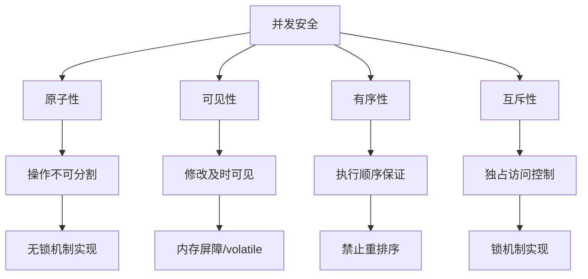
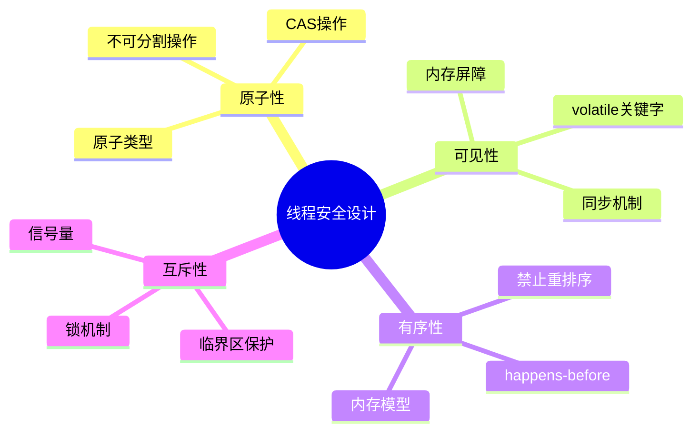
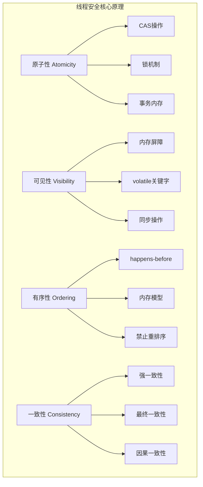
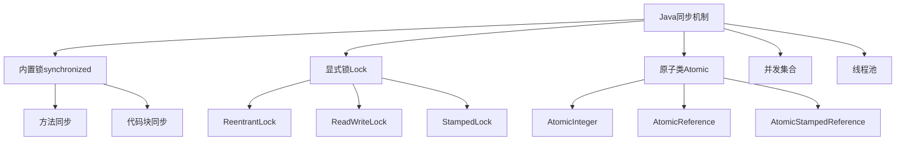

#### 目录介绍
- 01.核心设计思想
  - 1.1 并发四个原理
  - 1.2 安全核心原则
  - 1.3 并发场景选择
- 02.线程安全原理
  - 2.1 三大解法体系
  - 2.2 消除共享
  - 2.3 互斥访问
  - 2.4 原子操作
  - 2.5 三个层面对比
- 03.不可变
  - 3.1 核心思想
  - 3.2 不可变示例
  - 3.3 核心原理
  - 3.4 不可变哲学
  - 3.5 不可变局限
  - 3.6 不可变总结
- 04.线程局部存储
  - 4.1 核心思想
  - 4.2 局部存储核心
  - 4.3 底层原理
  - 4.4 不同语言对比
  - 4.5 TLS局限性
  - 4.6 TLS总结
- 05.读写分离
  - 5.1 核心思想
  - 5.2 并发的演进
  - 5.3 底层原理
  - 5.4 各语言实现
  - 5.5 各方案对比
  - 5.6 局限性分析
- 06.无锁机制
  - 6.1 如何保证安全
  - 6.2 示例
  - 6.3 核心设计思想
  - 6.4 核心原理
  - 6.5 遇到问题
- 07.并发锁
  - 7.1 如何保证安全
  - 7.2 示例
  - 7.3 核心设计思想
  - 7.4 核心原理
  - 7.5 遇到问题
- 08.分段锁
  - 8.1 如何保证安全
  - 8.2 示例
  - 8.3 核心设计思想
  - 8.4 核心原理
  - 8.5 遇到问题
- 09.各编程语言方案
  - 9.1 Java解决方案
  - 9.2 C++解决方案
  - 9.3 Obj-C解决方案


## 01.核心设计思想

### 1.1 并发四个原理

在并发编程中，我们必须处理以下四个核心问题：

1. 原子性（Atomicity）：一个操作是不可中断的，要么全部执行成功，要么全部不执行。
2. 可见性（Visibility）：一个线程对共享变量的修改，能够及时被其他线程看到。
3. 有序性（Ordering）：程序执行的顺序按照代码的先后顺序执行。但是，由于指令重排序，实际执行顺序可能会与代码顺序不同。我们需要通过同步机制来保证有序性。
4. 互斥性（Mutual Exclusion）：同一时刻，只允许一个线程访问共享资源。



### 1.2 安全核心原则



### 1.3 并发场景选择

在设计并发安全系统时，我们可以根据具体场景选择不同的机制：

1. 如果数据不经常变化，或者变化时创建新对象代价不大，考虑使用不可变对象。
2. 如果数据是线程私有的，使用线程局部存储。
3. 如果读多写少，考虑读写分离。 
4. 如果竞争不激烈，或者需要高性能，考虑无锁机制。 
5. 如果需要灵活的锁操作，考虑并发锁。 
6. 如果共享资源可以划分为多个独立的部分，考虑分段锁。

| 机制 | 原子性 | 可见性 | 有序性 | 互斥性 | 适用场景 | 性能特点 |
|------|--------|--------|--------|--------|----------|----------|
| **不可变** | 强保证 | 强保证 | 强保证 | 不需要 | 配置信息、状态快照 | 读性能极佳，写需创建新对象 |
| **线程局部** | 线程内 | 线程内 | 线程内 | 不需要 | 线程上下文、连接管理 | 零竞争，内存占用高 |
| **读写分离** | 写时保证 | 锁保证 | 锁保证 | 读写互斥 | 读多写少缓存 | 高读并发，写有竞争 |
| **无锁机制** | CAS保证 | volatile | 内存屏障 | 乐观重试 | 计数器、队列 | 高吞吐，可能饥饿 |
| **并发锁** | 锁保证 | 锁保证 | 锁保证 | 完全互斥 | 复杂临界区 | 灵活，有阻塞开销 |
| **分段锁** | 分段内 | 分段内 | 分段内 | 分段互斥 | 哈希表、缓存 | 减少竞争，实现复杂 |


## 02.线程安全原理

### 2.1 三大解法体系

所有线程安全方案归结为三条路：

```
            线程安全
           ┌───┼───┐
           ▼   ▼   ▼
        消除共享  互斥访问  原子操作
```

详细一点来说就是下面这种，线程安全核心原理



### 2.2 消除共享

没有共享就没有竞争，这是最彻底的方案。

| 手段 | 原理 |
|------|------|
| **线程封闭** | 数据只属于一个线程，其他线程通过消息传递访问 |
| **不可变对象** | `const` / immutable，只读不写，无竞争 |
| **thread_local** | 每个线程一份独立副本 |
| **值拷贝** | 传参时拷贝而非共享引用 |

典型模式就是 **Actor / 事件循环**：

```
Thread A          Thread B          Thread C
┌────────┐       ┌────────┐       ┌────────┐
│ 私有数据│       │ 私有数据 │       │ 私有数据│
│        │       │        │       │        │
│ 消息队列 │◄─msg─┤        ├──msg──►│ 消息队列│
│ [T1|T2]│       │        │       │ [T3]   │
└────────┘       └────────┘       └────────┘
```

每个线程拥有私有数据，通过消息（函数对象/lambda）通信。消息投递是线程安全的（队列本身用锁或无锁实现），但业务数据**永远只在一个线程上被读写**，因此不需要额外加锁。

**这是性能最好的方案**，因为完全避免了锁竞争和缓存行弹跳。

### 2.3 互斥访问


当共享不可避免时，用锁保证**同一时刻只有一个线程**能访问临界区。

**互斥锁原理（Mutex）**：

```
lock():
    while (true) {
        if (CAS(state, UNLOCKED, LOCKED))   // 原子比较并交换
            return;                          // 获锁成功
        futex_wait(state, LOCKED);           // 获锁失败，陷入内核等待
    }

unlock():
    state = UNLOCKED;          // 释放锁
    futex_wake(state, 1);      // 唤醒一个等待者
```

核心是 **CAS（Compare-And-Swap）** 指令，这是 CPU 提供的硬件原子操作：

```
CAS(addr, expected, desired):
    atomically {
        if (*addr == expected) {
            *addr = desired;
            return true;
        }
        return false;
    }
```

**锁为什么能保证可见性和有序性？**

加锁/解锁会插入**内存屏障（Memory Barrier）**：

```
lock()   → 插入 acquire barrier → 阻止锁后的读写被重排到锁前
                                   + 使当前核心的缓存失效，强制从内存重读

unlock() → 插入 release barrier → 阻止锁前的读写被重排到锁后
                                   + 将当前核心的写入刷回主内存
```

这样就保证了：
- **可见性**：`unlock` 刷缓存，`lock` 清缓存，A 解锁前的写入对 B 加锁后可见
- **有序性**：屏障阻止跨越临界区边界的重排
- **原子性**：同时只有一个线程在临界区内

**锁的代价**：

```
无竞争加锁 ≈ 几十 ns（仅一次 CAS）
有竞争加锁 ≈ 数百 ns ~ 数十 μs（内核态切换 + 上下文切换）
```

关键概念 —— **缓存行弹跳（Cache Line Bouncing）**：锁变量被多个核心争抢时，包含它的缓存行在各核心间反复失效/重载，严重降低性能。

### 2.4 原子操作


利用 CPU 的原子指令直接操作，不需要锁。

**原子操作的硬件基础**：

| 指令 | 功能 | 用途 |
|------|------|------|
| `CAS` | 比较并交换 | 无锁数据结构、自旋锁 |
| `XCHG` | 原子交换 | `atomic::exchange()` |
| `LOCK ADD` | 原子加 | `atomic::fetch_add()` |
| `MFENCE/SFENCE/LFENCE` | 内存屏障 | 控制指令排序 |

**内存序（Memory Order）**—— 原子操作的精髓：

```cpp
enum memory_order {
    memory_order_relaxed,   // 无屏障，仅保证原子性
    memory_order_acquire,   // 读屏障：此操作后的读写不能重排到它之前
    memory_order_release,   // 写屏障：此操作前的读写不能重排到它之后
    memory_order_acq_rel,   // 双向屏障
    memory_order_seq_cst    // 全序一致（默认，最强最慢）
};
```

经典的 **acquire-release 配对**：

```cpp
// 生产者（线程A）                    // 消费者（线程B）
data = 42;                           while (!flag.load(acquire)) {}
flag.store(true, release);           assert(data == 42);  // 保证成立
    ↑                                     ↑
    release 保证 data=42                  acquire 保证能看到
    不会被重排到 flag 之后                 flag=true 之前的所有写入
```

**原理**：`release` 在写入端建立一个"发布点"，保证之前的所有写入都对后续通过 `acquire` 读到该值的线程可见。这建立了一个 **happens-before** 关系。

### 2.5 三个层面对比

| 问题 | mutex | atomic(relaxed) | atomic(acq/rel) | atomic(seq_cst) | 线程隔离 |
|------|:-----:|:---------------:|:----------------:|:----------------:|:--------:|
| 原子性 | ✅ | ✅ | ✅ | ✅ | N/A |
| 可见性 | ✅ | ❌ | ✅ | ✅ | N/A |
| 有序性 | ✅ | ❌ | ✅(局部序) | ✅(全局序) | N/A |
| 竞争 | 消除 | 可能存在 | 消除 | 消除 | 不存在 |

**一句话总结**：线程安全的本质是控制**共享可变状态**的访问，最优解是消除共享，次优是用原子操作保证单变量一致性，最后才是用锁保护复合操作的互斥性。

所有同步机制的底层都依赖 CPU 的**原子指令 + 内存屏障**来同时解决原子性、可见性、有序性三个问题。

## 03.不可变

> **一个对象构造完成后，如果其所有可达状态都不可被修改，那么对该对象的并发读取天然安全，无需任何同步。**

不可变对象是指一旦创建，其状态就不能被修改的对象。因此，多个线程同时访问该对象时，不会出现一个线程正在修改而另一个线程正在读取的不一致情况。

### 3.1 核心思想

从"实体"到"值"的降维。不可变对象就是把复合数据提升到了与数值相同的语义层次。

```
可变对象 = identity（身份）+ state（可变状态）
  → 同一个引用，不同时刻观测到不同值
  → "它是谁"和"它现在是什么"是两个独立问题

不可变对象 = value（值）
  → 引用 ≡ 值，观测结果永远一致
  → "它是谁" ≡ "它是什么"
```

### 3.2 不可变示例

将"N 次字段同步"压缩为"1 次指针发布"。

可变对象有 N 个字段，修改它们不是原子的，读者可能在第 k 次写入后介入，看到前 k 个新值、后 N-k 个旧值——**状态撕裂**。

```
可变: field₁ ← new₁; field₂ ← new₂; ... fieldₙ ← newₙ
      ↑ 每一步都是一个可被切割的竞态窗口

不可变: new_obj = construct(new₁, new₂, ... newₙ);  // 私有构造，无人可见
        ref = new_obj;  // 一次指针赋值，原子发布
        ↑ 唯一的同步点
```

**O(N) 的同步问题降为 O(1)。**

### 3.3 核心原理

> 第一层——逻辑层：读-读无冲突定理

并发理论的基本事实：如果所有线程对某块内存只做读操作，则任意调度顺序下的结果都相同。

读操作不改变内存状态，因此不同调度序列之间的最终状态（即内存内容）相同，每个线程读到的值也相同。

不可变对象构造完成后只允许读 → 适用此定理 → **无需同步即安全**。

> 第二层——内存模型层：happens-before 与可见性

逻辑上"只读=安全"很直观，但现代硬件有**缓存、写缓冲区、指令重排序**，会导致一个线程的写入对另一个线程"不可见"或"乱序可见"。这就是为什么还需要内存模型来提供形式化保证。

关键问题：**线程 A 构造了不可变对象，线程 B 如何保证看到完整的构造结果？**

答案取决于语言的内存模型，但核心逻辑是一致的：

```
线程A:
  ① write field₁ = v₁
  ② write field₂ = v₂
  ③ [内存屏障]              ← 语言/运行时保证的屏障
  ④ publish reference       ← 将对象引用写入共享变量

线程B:
  ⑤ read reference          ← 看到非 null
  ⑥ [内存屏障]              ← 语言/运行时保证的屏障
  ⑦ read field₁             ← 保证看到 v₁
  ⑧ read field₂             ← 保证看到 v₂
```

**各语言的实现机制：**

| 语言 | 保证机制 | 本质 |
|------|---------|------|
| **Java** | `final` 字段语义（JSR-133）：构造函数末尾隐含 StoreStore 屏障，读 final 字段前隐含 LoadLoad 屏障 | 编译器在字节码中插入屏障指令 |
| **C++** | 构造函数中的写 happens-before 于构造函数返回；通过 `std::atomic`/`mutex` 发布引用时建立 happens-before 链 | 内存序（memory_order）约束 |
| **Rust** | 所有权系统 + `Send`/`Sync` trait：编译期证明不可变共享引用无数据竞争 | 零运行时开销，编译期排除 |
| **Go** | 通过 channel 传递时建立 happens-before | channel 操作内含内存屏障 |
| **Erlang/Elixir** | 所有数据天然不可变 + actor 模型 | 消息传递即同步 |

**关键洞察**：不可变性把所有写操作集中在构造函数内，而构造函数完成到引用发布之间，语言内存模型几乎都能保证 happens-before 关系。这意味着**读者不需要做任何额外的同步动作**就能看到完整的值。

> 第三层——硬件层：缓存一致性的免费搭车

现代 CPU 的缓存一致性协议（如 MESI）：

```
状态:
  M (Modified)  — 本核独占且已修改
  E (Exclusive) — 本核独占但未修改
  S (Shared)    — 多核共享，只读
  I (Invalid)   — 无效
```

不可变对象一旦构造完成，所有核心的缓存行都会稳定在 **S（Shared）** 状态：

```
可变对象:
  Core1 写 → cache line 变 M → 广播 Invalidate → Core2 的 cache line 变 I
  → Core2 读 → cache miss → 从 Core1 拉取 → Core1 变 S, Core2 变 S
  → Core1 再写 → 又一轮 Invalidate...
  ↑ 每次写入都触发跨核通信（cache line bouncing）

不可变对象:
  构造完成后:
  Core1 读 → cache line 进入 S
  Core2 读 → cache line 进入 S
  Core3 读 → cache line 进入 S
  → 永远不会有 Invalidate → 零跨核通信
  → 所有核心从本地 L1/L2 缓存读取 → 接近内存带宽的理论上限
```

**不可变对象不仅是"安全的"，在多核读密集场景下还更快。**

### 3.4 不可变哲学

不可变性的本质是**时间无关性（Time Independence）**：

```
可变:   value(obj, t) = f(t)     // 对象的值是时间的函数
不可变: value(obj, t) = constant  // 对象的值与时间无关
```

并发问题的根源是**多个线程对"时间"的感知不同**（由于缓存、重排序、调度）。如果值与时间无关，那么不同线程对时间的不同感知就不再是问题。

这也解释了为什么函数式编程（FP）天然适合并发：FP 的核心就是**消除时间依赖**——没有赋值，没有状态变化，一切都是从输入到输出的纯函数映射。

```
命令式: x = 1; x = 2; x = 3;  // x 的值取决于"现在执行到哪一行"
函数式: let x₁ = 1 in
        let x₂ = 2 in
        let x₃ = 3 in ...      // x₁ x₂ x₃ 是三个不同的绑定，都不变
```

### 3.5 不可变局限

局限性：不可变无法解决的问题

| 问题 | 原因 | 不可变性的边界 |
|------|------|--------------|
| **写-写冲突** | 两个线程同时创建新版本，谁赢？需要 CAS 或锁来决定 | 不可变只消除了读端同步，写端发布仍需原子操作 |
| **ABA 问题** | 值从 A→B→A，版本号方案中不可变对象也需要额外的版本标记 | 不可变对象的身份（指针地址）可以区分，但语义上可能相同 |
| **一致性更新多个引用** | 同时更新两个不可变对象的引用使其一致 → 仍然是一个非原子的复合操作 | 需要 STM（软件事务内存）或将两个引用包装进一个不可变结构 |
| **IO / 外部副作用** | 数据库、文件系统、网络本质上是可变的 | 不可变层必须在某个边界处与可变世界交互 |
| **内存开销** | 每次"修改"都创建新对象 | 需要持久化数据结构（Persistent DS）或写时复制（COW）来缓解 |

### 3.6 不可变总结

```
不可变性安全的推导链：

所有字段构造后不可写
    ↓
并发访问只有 读-读，无 读-写 / 写-写
    ↓
不满足数据竞争的充要条件（缺少"可变"这个必要条件）
    ↓
无数据竞争 → 无需同步 → 无锁 → 无死锁 → 安全且高性能
    ↓
硬件层面：缓存行稳定在 Shared 状态 → 零 cache line bouncing
    ↓
类型系统层面：可以在编译期证明安全性
```

**不可变性的力量在于：它不是一种"防御手段"，而是从数学上消除了问题存在的前提。**

## 04.线程局部存储

线程局部存储为每个线程提供了一个独立的变量副本，这样每个线程都可以独立地改变自己的副本，而不会影响其他线程所拥有的副本。从而避免了共享数据。

### 4.1 核心思想

**本质：用空间换安全。每个线程持有变量的独立副本，从根本上消除共享，从而无需加锁。**

```
普通全局变量:
  Thread A ──┐
  Thread B ──┼──> [ 同一块内存 ] ──> 竞争！需要锁
  Thread C ──┘

TLS变量:
  Thread A ──> [ 副本 A ]
  Thread B ──> [ 副本 B ]   ──> 无共享，无竞争
  Thread C ──> [ 副本 C ]
```

### 4.2 局部存储核心

为什么能保证数据安全。关键在于三个不变量：

**1. 隔离性不变量**： 每个线程访问 TLS 变量时，CPU 指令操作的**物理地址不同**。这不是软件层面的互斥，而是硬件寻址层面的隔离——根本不存在"同一块内存被两个线程同时写"的可能。

**2. 生命周期绑定**： TLS 变量的生命周期与线程绑定：线程创建时分配，线程销毁时释放。不存在"线程已死但数据还被别人访问"的悬垂问题。

**3. 无需同步原语**： 因为不共享，所以不需要 mutex/spinlock/atomic。没有锁就没有死锁、优先级反转、性能退化等一系列并发问题。

### 4.3 底层原理

> 1.访问一个 TLS 变量的汇编级过程

C++ 代码：

```cpp
thread_local int counter = 0;
counter++;
```

编译器生成的伪汇编（简化）：

```asm
; 通过 FS 段寄存器 + 偏移量直接寻址
mov eax, fs:[tls_offset_of_counter]   ; 读取当前线程的 counter
inc eax
mov fs:[tls_offset_of_counter], eax   ; 写回当前线程的 counter
```

**关键点**：`fs:` 前缀让 CPU 自动加上当前线程 FS 寄存器的基地址。不同线程的 FS 基地址不同，所以同一条指令在不同线程中访问的是不同的物理地址。

> 2.线程创建时的分配过程

```
pthread_create()
    │
    ├─ 1. 分配线程栈（mmap）
    │
    ├─ 2. 分配 TLS Block
    │     ├─ 计算所有 TLS 变量总大小（编译期确定，存在 ELF .tdata/.tbss 段）
    │     ├─ mmap 分配内存
    │     └─ 从 .tdata 段拷贝初始值（.tbss 段零初始化）
    │
    ├─ 3. 设置 TCB，将 TLS Block 地址写入
    │
    ├─ 4. arch_prctl(ARCH_SET_FS, tcb_addr)  ← 设置 FS 寄存器
    │
    └─ 5. 跳转到线程入口函数执行
```

> 3.ELF 二进制中的 TLS 段

```
编译期：
  thread_local int x = 100;  →  放入 .tdata 段（有初始值）
  thread_local int y;        →  放入 .tbss 段（零初始化）

链接期：
  链接器为每个 TLS 变量分配一个固定偏移量（tls_offset）

运行期：
  每个新线程 = 拷贝 .tdata 模板 + 零初始化 .tbss 区域
```

### 4.4 不同语言对比

不同语言的 TLS 实现对比

| 语言 | 语法 | 底层机制 |
|------|------|----------|
| C/C++ | `thread_local` / `__thread` | ELF TLS + FS 段寄存器，零开销访问 |
| Java | `ThreadLocal<T>` | 每个 Thread 对象持有 `ThreadLocalMap`，hash 查找 |
| Go | 无显式 TLS（goroutine 级别） | runtime 通过 `getg()` 获取当前 goroutine 结构体 |
| Python | `threading.local()` | 字典实现，以 thread id 为 key |
| Rust | `thread_local!` 宏 | 类似 C++，编译到 ELF TLS 段 |

**性能差异巨大**：

- C/C++ 的 `thread_local`：**1条指令**（直接段寄存器偏移寻址）
- Java 的 `ThreadLocal.get()`：**hash 查找 + 可能的弱引用处理**，约慢 10-50x

### 4.5 TLS局限性

```
TLS 能解决:
  ✓ 每个线程独立的计数器、缓存、errno
  ✓ 线程级别的上下文传递（如当前事务、用户身份）
  ✓ 避免高频读写场景的锁竞争

TLS 不能解决:
  ✗ 线程间需要通信/汇总的场景（最终还是要聚合）
  ✗ 生产者-消费者模型（本质就是要共享）
  ✗ 共享状态的一致性问题
```

### 4.6 TLS总结

TLS 的安全性本质是**硬件级隔离**：

```
                   软件锁方案                    TLS方案
                ┌──────────────┐          ┌──────────────┐
数据模型:       │  一份数据+锁  │          │  N份数据     │
安全保证来源:   │  互斥协议     │          │  地址隔离    │
性能代价:       │  锁竞争开销   │          │  内存×N      │
实现层次:       │  软件层       │          │  CPU段寄存器 │
故障模式:       │  死锁/饥饿    │          │  无           │
                └──────────────┘          └──────────────┘
```

**一句话**：锁是"同一个房间加一把锁"，TLS 是"每人一个房间"——后者根本不需要锁。

## 05.读写分离

### 5.1 核心思想

读写分离的本质是一个**基于访问模式不对称性的并发优化策略**。

核心观察：**绝大多数并发场景中，读操作远多于写操作（通常 90%+ 是读）**。如果让读和写互相排斥，读操作的高频会导致严重的性能瓶颈。读写分离的核心思想就是：

> **读操作之间不互斥，只有写操作需要独占。**

用一句话概括：**共享读，独占写。**

### 5.2 并发的演进

理解读写分离需要从并发控制的演进路径来看：

```
级别0: 无保护          → 数据竞争，未定义行为
级别1: 互斥锁(Mutex)    → 安全但串行化，读-读也互斥
级别2: 读写锁(RWLock)   → 读并行，写独占
级别3: 无锁(Lock-free)  → CAS 原子操作，无阻塞
级别4: 无等待(Wait-free) → 每个操作有界步数完成
```

读写锁（级别2）是最经典的读写分离实现，但读写分离的思想渗透在每一个级别中。

### 5.3 底层原理

> 1.读写锁（RWLock）的内核实现

以 Linux `pthread_rwlock` 为例，其内部维护三个核心状态：

```
┌──────────────────────────────────┐
│         rwlock 内部状态           │
│                                  │
│  int32_t readers;    // 当前读者数│
│  int32_t writer;     // 是否有写者│
│  int32_t pending_w;  // 等待写者数│
│                                  │
│  futex  readers_futex;           │
│  futex  writers_futex;           │
└──────────────────────────────────┘
```

**状态转换矩阵**：

| 当前状态 | 请求读锁 | 请求写锁 |
|---------|---------|---------|
| 空闲 | 立即获取，readers++ | 立即获取，writer=1 |
| 有读者(readers>0) | 立即获取，readers++ | **阻塞**，进入 writers_futex 等待 |
| 有写者(writer=1) | **阻塞**，进入 readers_futex 等待 | **阻塞**，进入 writers_futex 等待 |

**读锁获取的关键路径**（简化的内核逻辑）：

```c
int rwlock_rdlock(rwlock_t *rw) {
  for (;;) {
    int32_t old = atomic_load(&rw->state);
    
    // 没有写者且没有等待写者（或不偏向写者）
    if (old >= 0 && !has_pending_writers(rw)) {
      // CAS 原子递增 readers 计数
      if (atomic_compare_exchange(&rw->state, &old, old + 1)) {
        return 0;  // 获取成功，无需系统调用
      }
      continue;  // CAS 失败（竞争），重试
    }
    
    // 有写者，需要阻塞
    futex_wait(&rw->readers_futex, ...);  // 陷入内核态等待
  }
}
```

**关键点**：读锁在无写者竞争时，通过 `atomic_compare_exchange`（一条 CPU 指令 `CMPXCHG`/`LDXR+STXR`）完成，**不需要系统调用**，这是读操作快的根本原因。

> 2.CPU 缓存行层面的开销

即使读锁只是一个原子操作，它仍有隐含开销——**缓存行弹跳（Cache Line Bouncing）**：

```
CPU 0 (读者A)        CPU 1 (读者B)        CPU 2 (读者C)
┌──────────┐        ┌──────────┐        ┌──────────┐
│ L1 Cache │        │ L1 Cache │        │ L1 Cache │
│ rwlock ─── Shared  │ rwlock ─── Shared  │ rwlock ─── Shared
└────┬─────┘        └────┬─────┘        └────┬─────┘
     │ atomic_add(&readers, 1)
     │ → 缓存状态从 Shared → Modified
     │ → 其他 CPU 的缓存行失效（Invalidate）
     │ → 其他 CPU 下次访问需要从 L3/内存重新加载
```

MESI 协议下，每次 `readers++` 都会触发一次**缓存行失效广播**。在 64 核以上的机器上，这个开销非常显著，即使全是读者也会因为原子计数器的竞争而性能下降。

这是传统 RWLock 的**根本瓶颈**。

> 3.更深层的解决方案：Per-CPU / Per-Thread 计数

Linux 内核的 `percpu_rw_semaphore` 解决了上述问题：

```
每个 CPU 维护独立的 readers 计数器（不在同一缓存行）

CPU 0: local_readers[0] = 3    ← 只有 CPU 0 写这个变量
CPU 1: local_readers[1] = 5    ← 只有 CPU 1 写这个变量
CPU 2: local_readers[2] = 2    ← 只有 CPU 2 写这个变量

读锁获取: local_readers[cpu_id]++   → 只改本 CPU 的计数，零竞争
读锁释放: local_readers[cpu_id]--

写锁获取: sum = Σ local_readers[i]  → 遍历所有 CPU 求和
          等待 sum == 0
```

**读操作开销降到极致**（无原子操作、无缓存行竞争），代价是**写操作需要遍历所有 CPU 的计数器**，写路径变慢。这是一个典型的**读写分离极端化**设计。

### 5.4 各语言实现

> 1.C++ `std::shared_mutex` (C++17)

```cpp
std::shared_mutex rw_mutex;

// 读操作：shared_lock 允许多个并发
{
  std::shared_lock<std::shared_mutex> lock(rw_mutex);
  auto val = data;  // 多个线程可同时执行
}

// 写操作：unique_lock 独占
{
  std::unique_lock<std::shared_mutex> lock(rw_mutex);
  data = new_val;  // 独占访问
}
```

底层通常基于 `pthread_rwlock` 或 Windows `SRWLock`。

> 2.Java `CopyOnWrite` — 另一种读写分离思路

```java
CopyOnWriteArrayList<String> list = new CopyOnWriteArrayList<>();

// 读：直接读取底层数组引用，零同步开销
String val = list.get(0);  // 无锁

// 写：复制整个数组，修改副本，原子替换引用
list.add("new");
// 内部实现：
// Object[] newArray = Arrays.copyOf(array, len + 1);
// newArray[len] = element;
// this.array = newArray;  // volatile write，对所有读者可见
```

**原理**：利用 **JMM（Java Memory Model）** 的 volatile 语义——`volatile` 写操作建立 happens-before 关系，确保新数组对所有读线程可见。读操作完全无锁，写操作通过复制+替换实现隔离。

> 3.Linux 内核 RCU（Read-Copy-Update）

RCU 是读写分离的**终极形态**，读操作开销几乎为零：

```
时间线：
───────────────────────────────────────────────────
Reader A:  ╔═══ rcu_read_lock ═══╗  (读旧数据)
Reader B:       ╔═══ rcu_read_lock ═══╗  (读旧数据)

Writer:    ┌─ 分配新节点 ─┐
           │  复制旧数据    │
           │  修改新节点    │
           └─ rcu_assign_pointer ─┘  ← 原子替换指针
                    │
           ┌─ synchronize_rcu() ─────────────────┐  等待 grace period
           │  等待所有旧读者退出 rcu_read_lock     │
           └──────────────────────────────────────┘
           └─ kfree(旧节点) ─┘  ← 安全释放旧内存
───────────────────────────────────────────────────
```

**`rcu_read_lock()` 在非抢占内核上的实现**：

```c
static inline void rcu_read_lock(void) {
  preempt_disable();  // 仅关闭抢占，无原子操作、无内存屏障
}

static inline void rcu_read_unlock(void) {
  preempt_enable();
}
```

**读操作开销 = 一条关闭抢占的指令**，比 RWLock 快一个数量级。

**grace period 原理**：写者调用 `synchronize_rcu()` 后，等待所有 CPU 至少经历一次上下文切换（意味着所有旧的 `rcu_read_lock` 临界区都已退出），然后安全释放旧内存。

> 4.数据库的读写分离

```
                    ┌───────────────┐
    写请求 ────────→│  Master (主库) │
                    └──────┬────────┘
                           │ binlog 复制
              ┌────────────┼────────────┐
              ▼            ▼            ▼
        ┌──────────┐ ┌──────────┐ ┌──────────┐
 读请求→│ Slave 1  │ │ Slave 2  │ │ Slave 3  │
        └──────────┘ └──────────┘ └──────────┘
```

MySQL 主从复制过程：

```
Master:
  1. 事务提交 → 写入 binlog（二进制日志）
  2. binlog dump thread → 发送给 Slave

Slave:
  1. IO Thread → 接收 binlog，写入 relay log
  2. SQL Thread → 回放 relay log 中的 SQL
```

### 5.5 各方案对比


| 方案 | 读开销 | 写开销 | 内存开销 | 一致性 | 适用场景 |
|------|--------|--------|----------|--------|---------|
| Mutex | 系统调用级 | 系统调用级 | 极低 | 强一致 | 读写均衡 |
| RWLock | 原子操作级 | 系统调用级 | 低 | 强一致 | 读多写少 |
| Per-CPU RWLock | 本地变量++ | 遍历所有CPU | 中等 | 强一致 | 极端读多写极少 |
| CopyOnWrite | 零（volatile read） | O(n) 复制 | 高（两份数据） | 最终一致 | 小数据集、读极多 |
| RCU | 接近零 | 分配+等待 grace period | 高（新旧共存） | 最终一致 | 内核数据结构 |
| 数据库主从 | 网络延迟 | 单点写入 | 高（多副本） | 最终一致 | 分布式系统 |


### 5.6 局限性分析

> 1.写者饥饿（Writer Starvation）

如果采用**读者优先**策略（读者源源不断，writers 永远等不到 readers=0）：

```
时间线：
Reader1: ╔══════════════════════╗
Reader2:     ╔══════════════════════╗
Reader3:         ╔══════════════════════╗
Writer:  ────等待─────等待──────等待──────→ 饥饿！
```

解决方案：**写者优先**——一旦有写者等待，新来的读者也阻塞。但这又会导致**读者饥饿**。没有完美方案，只有 trade-off。

POSIX 提供了 `PTHREAD_RWLOCK_PREFER_WRITER_NONRECURSIVE_NP` 选项，但实现因平台而异。

> 2.缓存一致性开销（Scalability Ceiling）

即使是原子操作级的 RWLock，在 **NUMA 架构**下也有瓶颈：

```
NUMA Node 0              NUMA Node 1
┌──────────────┐        ┌──────────────┐
│ CPU 0-15     │        │ CPU 16-31    │
│ 本地内存      │←─互联─→│ 本地内存      │
│ rwlock 在这里 │  延迟高  │ 远程访问慢    │
└──────────────┘        └──────────────┘
```

Node 1 上的 CPU 访问 Node 0 上的 rwlock 原子变量，延迟可达本地访问的 **3-5 倍**。核数越多，跨 NUMA 节点的缓存一致性通信（QPI/UPI 总线）越成为瓶颈。

> 3.优先级反转（Priority Inversion）

```
高优先级线程(Writer) → 等待 rwlock
中优先级线程         → 抢占了低优先级线程
低优先级线程(Reader) → 持有 rwlock 但被抢占，无法释放

结果：高优先级被低优先级间接阻塞
```

RWLock 无法像 Mutex 那样使用**优先级继承协议（PIP）**来解决此问题，因为可能有多个读者同时持有锁。

> 4.复制开销（CopyOnWrite 的硬伤）

CopyOnWrite 在数据量大时，每次写操作的 O(n) 复制代价极高。Java `CopyOnWriteArrayList` 官方文档明确说明只适合"遍历远多于修改"的场景。

> 5.不适合写密集场景

当写操作占比超过 20-30%，RWLock 的性能可能**劣于**普通 Mutex，因为：

1. RWLock 内部状态更复杂（readers 计数 + writer 标志 + 两个等待队列）
2. 写锁释放时需要唤醒所有等待的读者（thundering herd）
3. 读写交替频繁时，缓存行在 Shared ↔ Modified 之间反复切换

## 05.读写分离

读写分离将共享资源的访问分为读访问和写访问。读操作可以并发执行，而写操作需要独占资源。通过读写锁（ReadWriteLock）实现，允许多个读线程同时访问，但只允许一个写线程访问，且写线程访问时，所有读线程和其他写线程都被阻塞。

### 5.1 如何保证安全

如何保证并发安全
原子性：写操作是原子的，读操作在写操作之后能看到完整的更新。
可见性：读写锁的释放和获取遵循happens-before原则，保证写操作的结果对后续的读操作可见。
有序性：读写锁保证了临界区内的操作不会与临界区外的操作重排序（内存屏障）。
互斥性：写操作是互斥的，读操作之间不互斥，但读操作和写操作之间互斥。


### 5.2 示例

```cpp
public class ReadWriteCache {
    private final Map<String, String> cache = new HashMap<>();
    private final ReadWriteLock rwLock = new ReentrantReadWriteLock();
    
    public String get(String key) {
        rwLock.readLock().lock();
        try {
            return cache.get(key);
        } finally {
            rwLock.readLock().unlock();
        }
    }
    
    public void put(String key, String value) {
        rwLock.writeLock().lock();
        try {
            cache.put(key, value);
        } finally {
            rwLock.writeLock().unlock();
        }
    }
}
```

四大原则的实现机制

| 原则 | 实现机制 | 技术细节 |
|------|---------|---------|
| **原子性** | CAS更新状态 | compareAndSetState保证状态变更原子性 |
| **可见性** | volatile状态 | 状态变量声明为volatile |
| **有序性** | 内存屏障 | 锁的获取/释放插入内存屏障 |
| **互斥性** | 写写互斥，读写互斥 | 写锁独占，读锁共享 |

### 5.3 核心设计思想


### 5.4 核心原理


### 5.5 遇到问题

## 06.无锁机制

无锁编程通过原子操作（如CAS，Compare-And-Swap）来实现并发安全，它不需要传统的锁，从而避免了线程阻塞和上下文切换的开销。无锁算法通常基于循环重试，直到操作成功。

### 6.1 如何保证安全

如何保证并发安全
原子性：通过CPU提供的原子指令（如CAS）来保证单个操作的原子性。
可见性：原子操作通常包含内存屏障，保证操作结果对其他线程可见。
有序性：原子操作也会禁止指令重排序，保证操作顺序。
互斥性：无锁算法通常不需要互斥，但可能存在竞争，通过重试来解决。

### 6.2 示例

```java
// CAS实现原理
public class AtomicInteger {
    // 使用Unsafe进行底层CAS操作
    private static final Unsafe unsafe = Unsafe.getUnsafe();
    private static final long valueOffset;
    
    static {
        try {
            // 获取value字段的内存偏移量
            valueOffset = unsafe.objectFieldOffset(
                AtomicInteger.class.getDeclaredField("value"));
        } catch (Exception ex) { throw new Error(ex); }
    }
    
    private volatile int value;
    
    // CAS操作
    public final boolean compareAndSet(int expect, int update) {
        return unsafe.compareAndSwapInt(this, valueOffset, expect, update);
    }
    
    // 自增的CAS循环
    public final int incrementAndGet() {
        for (;;) {
            int current = get();
            int next = current + 1;
            if (compareAndSet(current, next)) {
                return next;
            }
            // CAS失败，重试
        }
    }
}
```


四大原则的实现机制

| 原则 | 实现机制 | 技术细节 |
|------|---------|---------|
| **原子性** | 硬件CAS指令 | CPU提供compare-and-swap原子指令 |
| **可见性** | volatile变量 | CAS操作包含内存屏障 |
| **有序性** | 内存屏障 | CAS是全屏障（load-store） |
| **互斥性** | 无互斥 | 通过重试解决冲突，不阻塞线程 |


### 6.3 核心设计思想


### 6.4 核心原理


### 6.5 遇到问题

## 07.并发锁

并发锁（如ReentrantLock）是一种显式锁，提供了与synchronized类似的功能，但更灵活，支持可中断、可定时、可轮询的锁请求，以及公平锁等。

### 7.1 如何保证安全

如何保证并发安全
原子性：锁内的操作是原子性的，因为同一时间只有一个线程能持有锁。
可见性：锁的释放和获取会建立happens-before关系，保证锁内操作的结果对后续获取锁的线程可见。
有序性：锁通过内存屏障禁止指令重排序，保证临界区内的操作不会逸出到临界区外。
互斥性：锁提供了互斥性，同一时间只有一个线程能进入临界区。

### 7.2 示例


```
public class ConcurrentStack<T> {

    private final ReentrantLock lock = new ReentrantLock();
    private Node<T> top = null;
    
    public void push(T value) {
        lock.lock();
        try {
            top = new Node<>(value, top);
        } finally {
            lock.unlock();
        }
    }
    
    public T pop() {
        lock.lock();
        try {
            if (top == null) return null;
            T value = top.value;
            top = top.next;
            return value;
        } finally {
            lock.unlock();
        }
    }
    
    private static class Node<T> {
        T value;
        Node<T> next;
        Node(T value, Node<T> next) {
            this.value = value;
            this.next = next;
        }
    }
}
```

四大原则的实现机制

| 原则 | 实现机制 | 技术细节 |
|------|---------|---------|
| **原子性** | CAS设置状态 | 锁状态变更原子性 |
| **可见性** | volatile状态 | 锁状态变更对其他线程立即可见 |
| **有序性** | 内存屏障 | lock/unlock建立happens-before关系 |
| **互斥性** | 状态控制 | 通过状态位控制独占访问 |

### 7.3 核心设计思想


### 7.4 核心原理


### 7.5 遇到问题

## 08.分段锁

分段锁是一种锁的优化技术，将共享资源分成多个段，每个段独立加锁。这样，访问不同段的操作可以并发执行，从而提高并发度。例如，ConcurrentHashMap就使用了分段锁。

### 8.1 如何保证安全

如何保证并发安全
原子性：对每个段的操作是原子性的，因为每个段有自己的锁。
可见性：每个段的锁保证可见性，类似并发锁。
有序性：每个段的锁保证有序性。
互斥性：互斥发生在段级别，不同段之间不互斥。


### 8.2 示例

```
public class SegmentedMap<K, V> {
    private final int segmentsCount = 16;
    private final Map<K, V>[] segments;
    private final ReentrantLock[] locks;
    
    @SuppressWarnings("unchecked")
    public SegmentedMap() {
        segments = new HashMap[segmentsCount];
        locks = new ReentrantLock[segmentsCount];
        for (int i = 0; i < segmentsCount; i++) {
            segments[i] = new HashMap<>();
            locks[i] = new ReentrantLock();
        }
    }
    
    private int segmentIndex(K key) {
        return Math.abs(key.hashCode()) % segmentsCount;
    }
    
    public V get(K key) {
        int index = segmentIndex(key);
        locks[index].lock();
        try {
            return segments[index].get(key);
        } finally {
            locks[index].unlock();
        }
    }
    
    public void put(K key, V value) {
        int index = segmentIndex(key);
        locks[index].lock();
        try {
            segments[index].put(key, value);
        } finally {
            locks[index].unlock();
        }
    }
}
```

### 8.3 核心设计思想
### 8.4 核心原理
### 8.5 遇到问题

## 09.各编程语言方案

### 9.1 Java解决方案

同步机制层次结构



Java锁的实现

```java
// 1. synchronized关键字
public class SynchronizedExample {
    private final Object lock = new Object();
    private int count = 0;
    
    public synchronized void increment() {
        count++;
    }
    
    public void incrementWithBlock() {
        synchronized(lock) {
            count++;
        }
    }
}

// 2. ReentrantLock
public class LockExample {
    private final ReentrantLock lock = new ReentrantLock();
    private int count = 0;
    
    public void increment() {
        lock.lock();
        try {
            count++;
        } finally {
            lock.unlock();
        }
    }
}

// 3. 原子类
public class AtomicExample {
    private final AtomicInteger count = new AtomicInteger(0);
    
    public void increment() {
        count.incrementAndGet();
    }
}
```

### 9.2 C++解决方案

C++同步原语

```cpp
#include <mutex>
#include <atomic>
#include <shared_mutex>

class ThreadSafeCounter {
private:
    mutable std::mutex mtx;
    int count = 0;
    
public:
    // 1. 互斥锁
    void increment() {
        std::lock_guard<std::mutex> lock(mtx);
        ++count;
    }
    
    // 2. 读写锁
    int getCount() const {
        std::shared_lock<std::shared_mutex> lock(mtx);
        return count;
    }
};

// 3. 原子操作
class AtomicCounter {
private:
    std::atomic<int> count{0};
    
public:
    void increment() {
        count.fetch_add(1, std::memory_order_relaxed);
    }
    
    int getCount() const {
        return count.load(std::memory_order_acquire);
    }
};
```

### 9.3 Obj-C解决方案


```objc
// 1. @synchronized
@implementation ThreadSafeClass {
    NSMutableArray *_array;
}

- (void)addObject:(id)object {
    @synchronized(self) {
        [_array addObject:object];
    }
}

// 2. NSLock
- (void)addObjectWithLock:(id)object {
    [_lock lock];
    [_array addObject:object];
    [_lock unlock];
}

// 3. dispatch_queue (GCD)
- (void)addObjectWithGCD:(id)object {
    dispatch_sync(_serialQueue, ^{
        [_array addObject:object];
    });
}

// 4. 原子属性
@property (atomic, strong) NSString *atomicProperty;
@end
```


