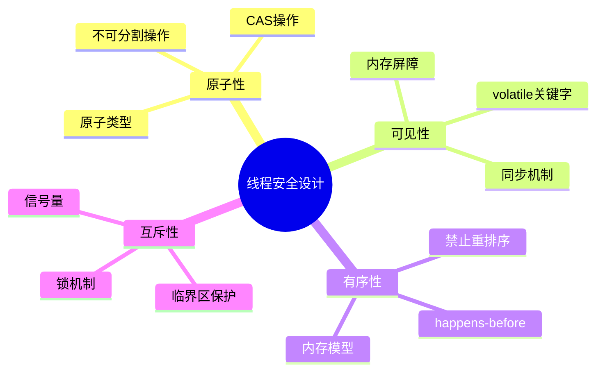
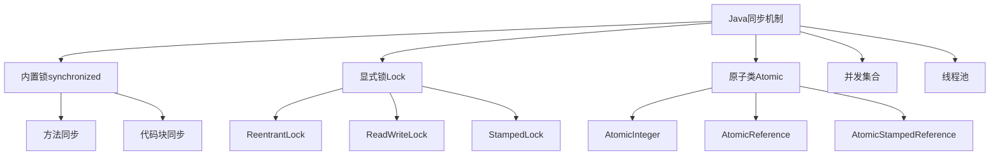

#### 目录介绍
- 01.核心设计思想
  - 1.1 安全核心原则
- 04.各编程语言方案
  - 4.1 Java解决方案
  - 4.2 C++解决方案


## 01.核心设计思想

### 1.1 安全核心原则




## 04.各编程语言方案

### 4.1 Java解决方案

同步机制层次结构



Java锁的实现

```java
// 1. synchronized关键字
public class SynchronizedExample {
    private final Object lock = new Object();
    private int count = 0;
    
    public synchronized void increment() {
        count++;
    }
    
    public void incrementWithBlock() {
        synchronized(lock) {
            count++;
        }
    }
}

// 2. ReentrantLock
public class LockExample {
    private final ReentrantLock lock = new ReentrantLock();
    private int count = 0;
    
    public void increment() {
        lock.lock();
        try {
            count++;
        } finally {
            lock.unlock();
        }
    }
}

// 3. 原子类
public class AtomicExample {
    private final AtomicInteger count = new AtomicInteger(0);
    
    public void increment() {
        count.incrementAndGet();
    }
}
```


### 4.2 C++解决方案

C++同步原语

```cpp
#include <mutex>
#include <atomic>
#include <shared_mutex>

class ThreadSafeCounter {
private:
    mutable std::mutex mtx;
    int count = 0;
    
public:
    // 1. 互斥锁
    void increment() {
        std::lock_guard<std::mutex> lock(mtx);
        ++count;
    }
    
    // 2. 读写锁
    int getCount() const {
        std::shared_lock<std::shared_mutex> lock(mtx);
        return count;
    }
};

// 3. 原子操作
class AtomicCounter {
private:
    std::atomic<int> count{0};
    
public:
    void increment() {
        count.fetch_add(1, std::memory_order_relaxed);
    }
    
    int getCount() const {
        return count.load(std::memory_order_acquire);
    }
};
```


