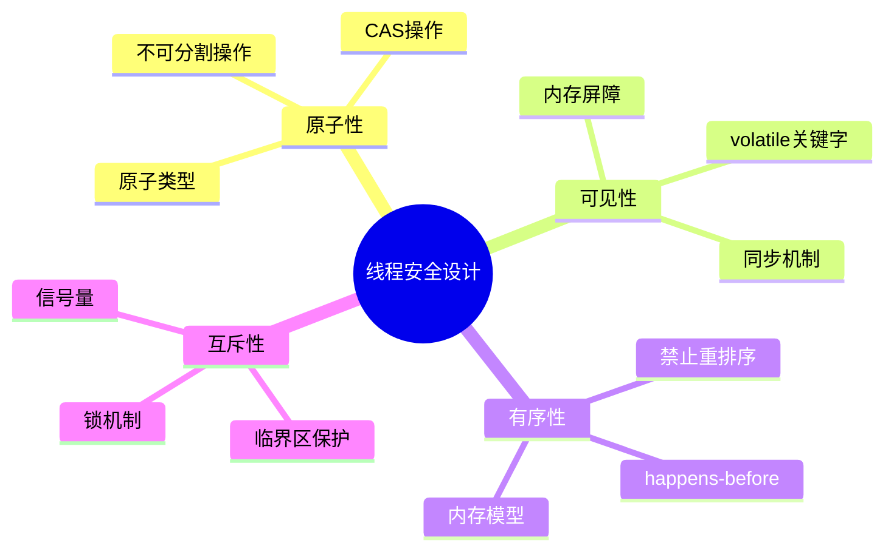

#### 目录介绍
- 01.核心设计思想
  - 1.1 安全核心原则

## 01.核心设计思想

### 1.1 安全核心原则

```mermaid
mindmap
  root((线程安全设计))
    原子性
      不可分割操作
      CAS操作
      原子类型
    可见性
      内存屏障
      volatile关键字
      同步机制
    有序性
      禁止重排序
      happens-before
      内存模型
    互斥性
      临界区保护
      锁机制
      信号量
```

