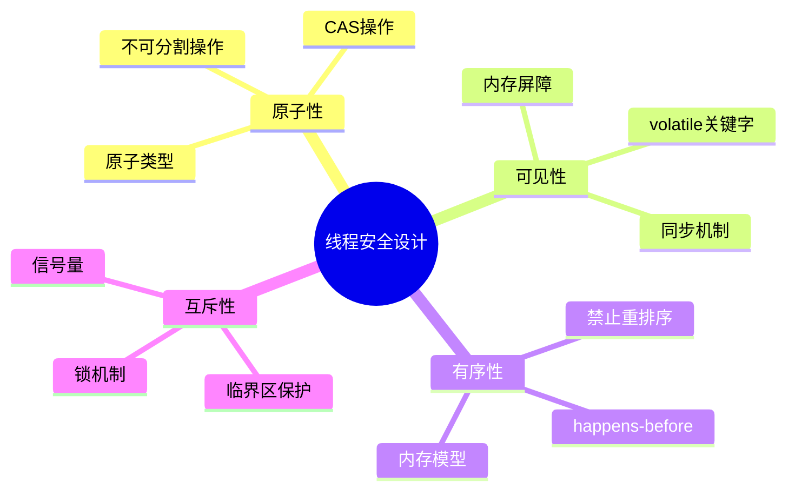
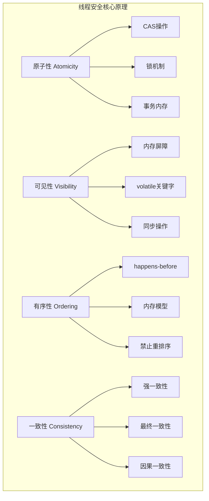
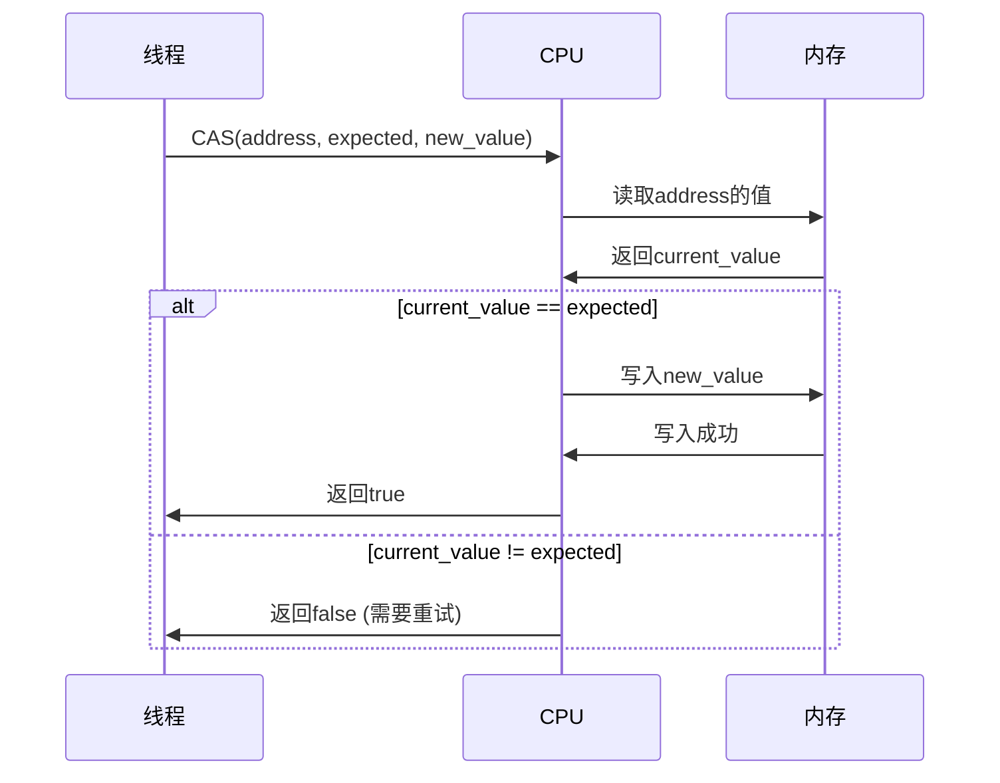
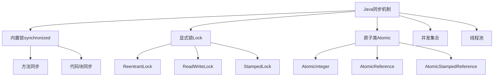

#### 目录介绍
- 01.核心设计思想
  - 1.1 安全核心原则
- 02.线程安全原理
  - 2.1 核心原理架构
  - 2.2 CAS原理详解
  - 2.3 内存屏障原理
- 04.各编程语言方案
  - 4.1 Java解决方案
  - 4.2 C++解决方案
  - 4.3 Obj-C解决方案


## 01.核心设计思想

### 1.1 安全核心原则



## 02.线程安全原理

### 2.1 核心原理架构



### 2.2 CAS原理详解



### 2.3 内存屏障原理

```cpp
// C++内存屏障示例
class MemoryBarrierExample {
private:
    std::atomic<bool> flag{false};
    int data = 0;
    
public:
    void producer() {
        data = 42;                                    // 1
        flag.store(true, std::memory_order_release);  // 2 (release屏障)
    }
    
    void consumer() {
        if (flag.load(std::memory_order_acquire)) {   // 3 (acquire屏障)
            assert(data == 42);                       // 4 保证能看到data=42
        }
    }
};
```

## 04.各编程语言方案

### 4.1 Java解决方案

同步机制层次结构



Java锁的实现

```java
// 1. synchronized关键字
public class SynchronizedExample {
    private final Object lock = new Object();
    private int count = 0;
    
    public synchronized void increment() {
        count++;
    }
    
    public void incrementWithBlock() {
        synchronized(lock) {
            count++;
        }
    }
}

// 2. ReentrantLock
public class LockExample {
    private final ReentrantLock lock = new ReentrantLock();
    private int count = 0;
    
    public void increment() {
        lock.lock();
        try {
            count++;
        } finally {
            lock.unlock();
        }
    }
}

// 3. 原子类
public class AtomicExample {
    private final AtomicInteger count = new AtomicInteger(0);
    
    public void increment() {
        count.incrementAndGet();
    }
}
```


### 4.2 C++解决方案

C++同步原语

```cpp
#include <mutex>
#include <atomic>
#include <shared_mutex>

class ThreadSafeCounter {
private:
    mutable std::mutex mtx;
    int count = 0;
    
public:
    // 1. 互斥锁
    void increment() {
        std::lock_guard<std::mutex> lock(mtx);
        ++count;
    }
    
    // 2. 读写锁
    int getCount() const {
        std::shared_lock<std::shared_mutex> lock(mtx);
        return count;
    }
};

// 3. 原子操作
class AtomicCounter {
private:
    std::atomic<int> count{0};
    
public:
    void increment() {
        count.fetch_add(1, std::memory_order_relaxed);
    }
    
    int getCount() const {
        return count.load(std::memory_order_acquire);
    }
};
```

### 4.3 Obj-C解决方案


```objc
// 1. @synchronized
@implementation ThreadSafeClass {
    NSMutableArray *_array;
}

- (void)addObject:(id)object {
    @synchronized(self) {
        [_array addObject:object];
    }
}

// 2. NSLock
- (void)addObjectWithLock:(id)object {
    [_lock lock];
    [_array addObject:object];
    [_lock unlock];
}

// 3. dispatch_queue (GCD)
- (void)addObjectWithGCD:(id)object {
    dispatch_sync(_serialQueue, ^{
        [_array addObject:object];
    });
}

// 4. 原子属性
@property (atomic, strong) NSString *atomicProperty;
@end
```


