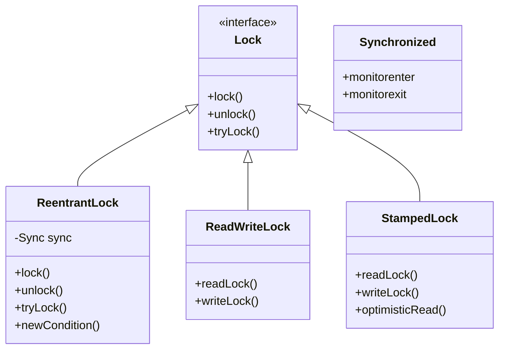

#### 目录介绍
- 03.锁的架构设计
  - 3.1 锁的层次结构

## 03.锁的架构设计

### 3.1 锁的层次结构

```mermaid
classDiagram
    class Lock {
        <<interface>>
        +lock()
        +unlock()
        +tryLock()
    }
    
    class ReentrantLock {
        -Sync sync
        +lock()
        +unlock()
        +tryLock()
        +newCondition()
    }
    
    class ReadWriteLock {
        +readLock()
        +writeLock()
    }
    
    class StampedLock {
        +readLock()
        +writeLock()
        +optimisticRead()
    }
    
    class Synchronized {
        +monitorenter
        +monitorexit
    }
    
    Lock <|-- ReentrantLock
    Lock <|-- ReadWriteLock
    Lock <|-- StampedLock
```

