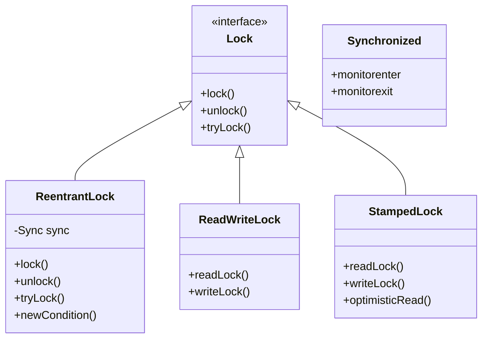
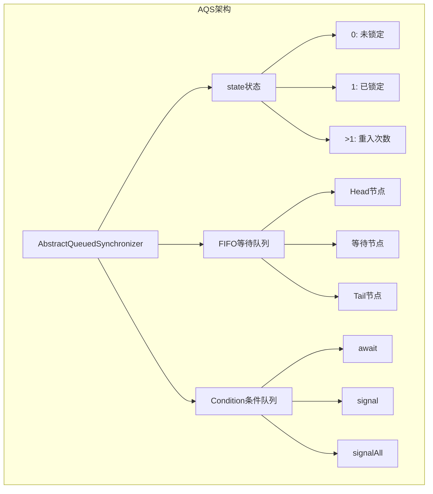
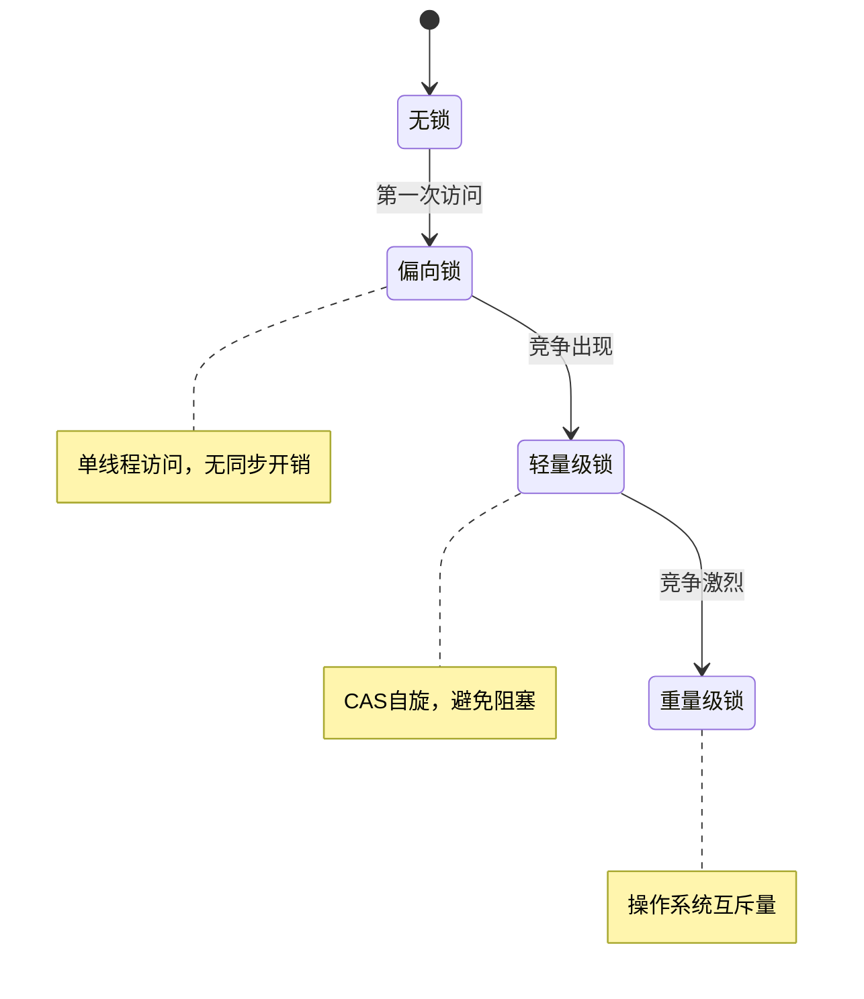

#### 目录介绍
- 03.锁的架构设计
  - 3.1 锁的层次结构
  - 3.2 AQS设计架构
  - 3.3 锁升级机制

## 03.锁的架构设计

### 3.1 锁的层次结构

```mermaid
classDiagram
    class Lock {
        <<interface>>
        +lock()
        +unlock()
        +tryLock()
    }
    
    class ReentrantLock {
        -Sync sync
        +lock()
        +unlock()
        +tryLock()
        +newCondition()
    }
    
    class ReadWriteLock {
        +readLock()
        +writeLock()
    }
    
    class StampedLock {
        +readLock()
        +writeLock()
        +optimisticRead()
    }
    
    class Synchronized {
        +monitorenter
        +monitorexit
    }
    
    Lock <|-- ReentrantLock
    Lock <|-- ReadWriteLock
    Lock <|-- StampedLock
```

### 3.2 AQS设计架构

AQS (AbstractQueuedSynchronizer) 架构

```mermaid
graph TB
    subgraph "AQS架构"
        A[AbstractQueuedSynchronizer] --> B[state状态]
        A --> C[FIFO等待队列]
        A --> D[Condition条件队列]
        
        B --> B1[0: 未锁定]
        B --> B2[1: 已锁定]
        B --> B3[>1: 重入次数]
        
        C --> C1[Head节点]
        C --> C2[等待节点]
        C --> C3[Tail节点]
        
        D --> D1[await]
        D --> D2[signal]
        D --> D3[signalAll]
    end
```

### 3.3 锁升级机制

锁升级机制（Java）

```mermaid
stateDiagram-v2
    [*] --> 无锁
    无锁 --> 偏向锁 : 第一次访问
    偏向锁 --> 轻量级锁 : 竞争出现
    轻量级锁 --> 重量级锁 : 竞争激烈
    
    note right of 偏向锁 : 单线程访问，无同步开销
    note right of 轻量级锁 : CAS自旋，避免阻塞
    note right of 重量级锁 : 操作系统互斥量
```

