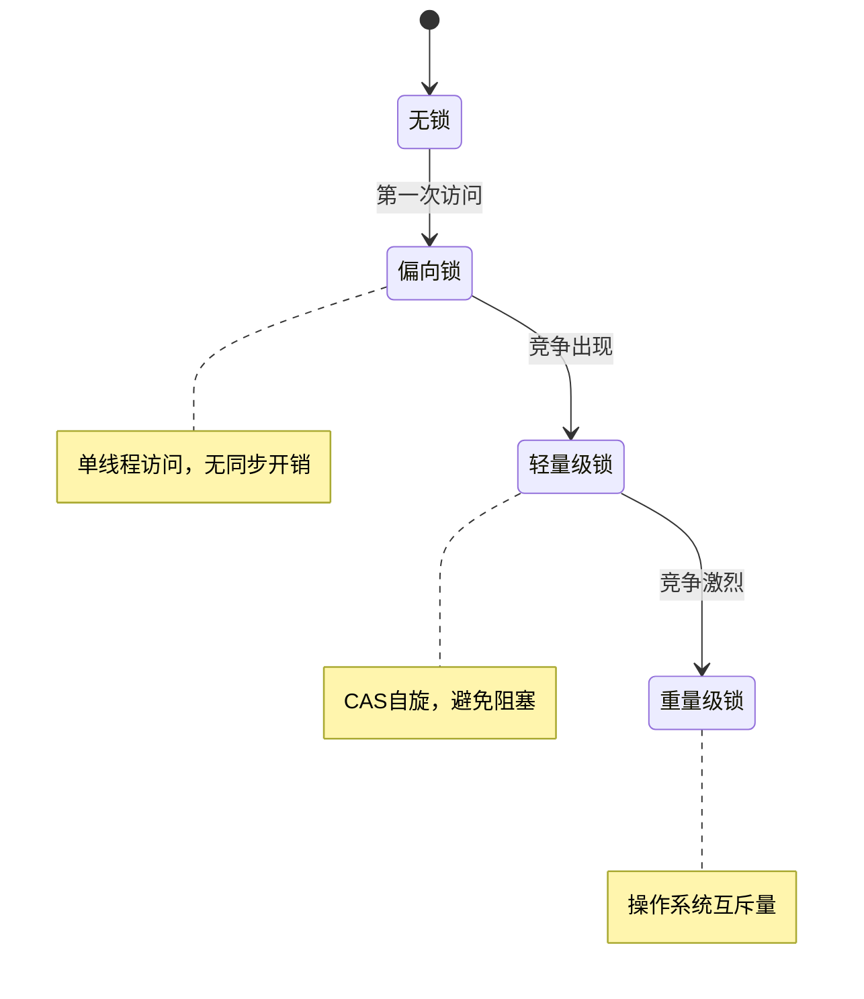

#### 目录介绍
- 1.锁基础概念
  - 1.1 锁的作用
  - 1.2 为何需要锁
  - 1.3 核心思想
  - 1.4 锁的理解
- 2.锁类型分类
  - 2.1 按策略分类
  - 2.2 按独占分类
  - 2.3 按实现分类
  - 2.4 按重入分类
  - 2.5 按公平分类
  - 2.6 Java特有锁
  - 2.7 按粒度分类
  - 2.8 按功能分类
- 3.锁核心逻辑
  - 3.1 解决原子性
  - 3.2 解决可见性
  - 3.3 等待策略
- 4.锁底层原理
  - 4.1 硬件原子指令
  - 4.2 内存可见性
  - 4.3 操作系统锁
  - 4.4 锁慢物理根源
  - 4.5 锁原理总结
- 5.锁架构设计
  - 5.1 锁分层架构


## 1.锁基础概念

### 1.1 锁的作用

当满足以下三个条件时，**数据竞争（Data Race）** 必然出现：

1. **共享**：多个执行体（线程/进程/CPU核）访问同一块内存
2. **可变**：至少有一个执行体在写
3. **无序**：访问之间没有 happens-before 关系

**锁** 是用于多线程编程的同步机制，用于保护共享资源，避免数据竞争和并发访问导致的问题。提供了多种锁的实现，包括互斥锁、读写锁、条件变量等。

### 1.2 为何需要锁

在多线程环境中，多个线程可能同时访问或修改共享资源（如全局变量、数据结构等）。如果没有同步机制，可能会导致以下问题：

1. **数据竞争**： 多个线程同时修改同一数据，导致数据不一致或程序行为异常。
2. **竞态条件**： 程序的执行结果依赖于线程的执行顺序，导致不可预测的行为。

线程锁通过确保同一时间只有一个线程可以访问共享资源来解决这些问题。

### 1.3 核心思想

锁的核心思想可以用一句话概括：

> **通过序列化对共享资源的访问，将并发问题降维为顺序问题。**

更细化地看：

| 思想层面 | 内容 |
|---------|------|
| 并发控制 | 将并行执行的临界区**串行化**，消除交错执行的不确定性 |
| 资源管理 | 锁是一种**许可证**，持有者可进入临界区，未持有者必须等待 |
| 内存可见性 | 锁的获取/释放隐含**内存屏障**，确保临界区内的修改对后续持有者可见 |
| 抽象封装 | 将底层硬件原子指令封装为高层语义，让程序员不需要关心缓存一致性协议 |

### 1.4 锁的理解

抛开所有编程语言，锁要解决的本质问题只有一个：

> **多个执行体争抢同一资源时，如何保证在任意时刻只有一个执行体在操作该资源。**

这个问题的根源在于**时间**——如果所有操作都是瞬时完成的（零耗时），就不需要锁。正因为操作需要时间，操作过程中就可能被其他执行体打断或交错，产生**中间状态的暴露**。

用最朴素的类比：一间厕所只能一个人用。锁的本质就是**门上的那把锁**——进去的人锁门，其他人在外面等，用完了开门出来，下一个人进去。

但计算机世界比物理世界复杂得多，因为：
1. **"锁门"这个动作本身也不是瞬时的**——可能两个人同时伸手去锁
2. **没有"物理实体"来阻挡**——CPU 只认 0 和 1，没有物理门
3. **观察者效应**——CPU 缓存导致不同核"看到"的内存值不同

所以锁的核心设计原理归结为两个基本问题：

> **问题一：如何实现一个不可分割的"占有"动作（原子性）**
> **问题二：如何让所有参与者看到一致的"占有"状态（可见性）**

## 2.锁类型分类

### 2.1 按策略分类

| 分类 | 核心思想 | 实现 | 适用场景 |
|------|---------|------|---------|
| **悲观锁** | 假设冲突频繁，先加锁再操作 | Mutex、RWLock、synchronized | 写多/冲突频繁 |
| **乐观锁** | 假设冲突罕见，先操作再检测冲突 | CAS、版本号、MVCC | 读多写少/冲突罕见 |

**悲观锁 vs 乐观锁的本质区别**：

- 悲观锁：先获取**独占权**，再修改数据
- 乐观锁：先修改数据，在**提交时验证**是否有冲突，冲突则重试

```
悲观锁：                          乐观锁：
Lock()                           old = Load(data)
  data = modify(data)             new = modify(old)
Unlock()                          if CAS(data, old, new) == false:
                                    retry
```

### 2.2 按独占分类

| 分类 | 并发度 | 实现 |
|------|-------|------|
| **独占锁（Exclusive Lock）** | 同一时刻只有一个持有者 | Mutex、ReentrantLock |
| **共享锁（Shared Lock）** | 允许多个读者同时持有 | RWLock 的读锁 |
| **意向锁（Intention Lock）** | 表示对子资源加锁的意向 | 数据库 IS/IX 锁 |

### 2.3 按实现分类

| 分类 | 等待方式 | 开销 | 适用场景 |
|------|---------|------|---------|
| **自旋锁（Spinlock）** | 忙等（循环 CAS） | CPU 空转，但无上下文切换 | 临界区极短（<1μs），中断上下文 |
| **互斥锁（Mutex）** | 阻塞挂起（futex） | 上下文切换（~1μs），但不浪费 CPU | 临界区较长，通用场景 |
| **混合锁（Adaptive）** | 先自旋后阻塞 | 平衡两者 | 大多数现代实现 |

### 2.4 按重入分类

| 分类 | 行为 | 实现原理 |
|------|------|---------|
| **可重入锁（Reentrant）** | 同一线程可重复获取 | 维护 owner_tid + 递归计数器 |
| **不可重入锁（Non-reentrant）** | 同一线程重复获取会死锁 | 不记录 owner |

```cpp
// 可重入锁伪代码
void reentrant_lock(lock_t *l) {
  if (l->owner == current_thread()) {
    l->count++;  // 递归计数+1
    return;
  }
  // 正常获取锁...
  l->owner = current_thread();
  l->count = 1;
}
```

### 2.5 按公平分类

| 分类 | 行为 | 吞吐量 | 尾延迟 |
|------|------|--------|-------|
| **非公平锁** | 新来的线程直接 CAS 抢锁，失败再排队 | 高（减少上下文切换） | 高（可能饥饿） |
| **公平锁** | 严格 FIFO，新来的必须排队 | 低 | 低（无饥饿） |

**非公平锁为什么吞吐量更高**？
```
公平锁：
  线程A释放 → 唤醒队首线程B → B 从内核态恢复(~1μs) → B获得锁
  这 1μs 锁是空闲的，无人使用

非公平锁：
  线程A释放 → 线程C(刚到)直接CAS抢到 → C 立即执行临界区
  B 被唤醒后发现锁被抢，重新排队
  结果：锁的空闲窗口被 C 利用了
```

### 2.6 Java特有锁

Java `synchronized` 在 JVM 中有**四个级别**的锁升级：

```
                    偏向锁 (Biased Locking)
                       │ 出现第二个线程竞争
                       ▼
                    轻量级锁 (Lightweight / Thin Lock)
                       │ CAS 自旋失败超过阈值
                       ▼
                    重量级锁 (Heavyweight / Fat Lock)
                       │
                       ▼
                    (mutex + 内核态挂起)
```

其流程是：



> 偏向锁（Biased Locking）

**思想**：统计表明大多数锁在整个生命周期中只被**同一个线程**获取。偏向锁消除了这种情况下的所有同步开销。

```
Mark Word (64-bit object header):
┌────────────────────────────────────────────────┐
│ Thread ID (54bit) │ Epoch(2) │ Age(4) │ 1│0│1 │ ← 偏向锁标记
└────────────────────────────────────────────────┘

首次获取：CAS 将 Thread ID 写入 Mark Word
后续获取：只需比较 Thread ID == 当前线程？
  → 是：直接进入，无任何原子操作
  → 否：撤销偏向（Stop-the-World），升级为轻量级锁
```

**JDK 15+ 默认禁用偏向锁**（JEP 374），因为现代应用中单线程锁的场景减少，偏向锁撤销的 STW 开销反而成为负担。

> 轻量级锁

```
线程栈帧中分配 Lock Record:
┌──────────────┐       ┌──────────────┐
│ Lock Record  │       │ Object Header│
│ ┌──────────┐ │       │ ┌──────────┐ │
│ │displaced │ │←─CAS─→│ │Mark Word │ │
│ │mark word │ │       │ │→Lock Rec │ │
│ └──────────┘ │       │ └──────────┘ │
└──────────────┘       └──────────────┘

获取：CAS 将 Mark Word 替换为指向 Lock Record 的指针
释放：CAS 将 displaced mark word 写回

全程用户态 CAS，无系统调用
```

> 重量级锁

轻量级锁 CAS 失败超过阈值后膨胀为重量级锁——分配 `ObjectMonitor` 结构：

```c
struct ObjectMonitor {
  volatile markWord _header;     // 保存原始 Mark Word
  ObjectMonitor* _next;
  volatile Thread* _owner;       // 当前持有者
  volatile int _count;           // 重入计数
  ObjectWaiter* _EntryList;      // 阻塞等待队列
  ObjectWaiter* _WaitSet;        // wait() 等待队列
  volatile int _waiters;
  // ...
};
```

最终通过 `pthread_mutex` + `pthread_cond`（Linux）或 `WaitForSingleObject`（Windows）进入内核态。

### 2.7 按粒度分类

| 粒度 | 示例 | 并发度 | 开销 |
|------|------|-------|------|
| **粗粒度** | 全局一把大锁 | 低 | 简单 |
| **细粒度** | 每个桶一把锁（ConcurrentHashMap） | 高 | 复杂、死锁风险 |
| **分段锁** | 将数据分 N 段，每段一把锁 | 中高 | 中等 |
| **无锁** | CAS + 重试 | 最高 | 编程困难 |

### 2.8 按功能分类

| 类型 | 描述 | 实现 |
|------|------|------|
| **读写锁** | 读共享写独占 | `pthread_rwlock`, `std::shared_mutex` |
| **顺序锁（SeqLock）** | 写者不阻塞，读者通过版本号检测一致性 | Linux 内核 `seqlock_t` |
| **RCU** | 读零开销，写延迟回收 | Linux 内核 `rcu_read_lock` |
| **条件变量** | 锁 + 等待/通知机制 | `pthread_cond`, `std::condition_variable` |
| **信号量** | 允许 N 个并发 | `sem_t`, `std::counting_semaphore` |
| **递归锁** | 同线程可递归获取 | `std::recursive_mutex` |
| **分布式锁** | 跨进程/机器互斥 | Redis RedLock, ZooKeeper, etcd |

## 3.锁核心逻辑

**锁 = 硬件原子指令（保证只有一个人抢到）+ 内存屏障（保证所有人看到一致状态）+ 等待策略（没抢到的人自旋或睡眠）。**

### 3.1 解决原子性

锁的根本问题是：多个线程同时伸手去"抢"一个资源，如何保证只有一个人抢到。

这依赖 CPU 提供的**硬件原子指令**，一条指令完成"读取旧值 + 写入新值"，中间不可被打断：

```
CAS(addr, expected, desired):
  原子地：
    if (*addr == expected)
      *addr = desired → 成功（我抢到了）
    else
      → 失败（别人已经抢了）
```

x86 是 `LOCK CMPXCHG`，ARM 是 `LDXR/STXR`（LL/SC）。没有硬件支持，纯软件无法高效实现互斥。

### 3.2 解决可见性

现代 CPU 每个核有自己的缓存，写入可能暂存在 Store Buffer 中，其他核看不到。

锁的获取和释放隐含**内存屏障**：

- **Acquire（加锁时）**：强制刷新失效队列，后续读写不能重排到加锁之前
- **Release（解锁时）**：强制刷出 Store Buffer，之前的写对其他核可见

```
                acquire barrier
                     ↓
             ╔═══ 临界区 ═══╗    这段内的修改
             ╚═══════════════╝    在 release 时
                     ↓              对所有核可见
                release barrier
```

没有内存屏障，即使 CAS 成功拿到锁，临界区内的数据修改也可能对其他线程**不可见**。

### 3.3 等待策略

| 策略 | 做法 | 适用 |
|------|------|------|
| 自旋 | 循环 CAS 重试（忙等） | 临界区极短（< 1μs） |
| 阻塞 | 系统调用挂起线程，让出 CPU | 临界区较长 |
| 混合 | 先自旋几轮，超限再阻塞 | 大多数现代实现 |

现代锁（如 Linux futex、Java synchronized）都是**混合策略**：

```
CAS 尝试 ── 成功 → 进入（零系统调用）
   │
   失败
   │
短暂自旋 ── 等到 → 进入
   │
   超限
   │
futex_wait → 内核挂起，让出 CPU
```

无竞争时一条 CAS 指令（几纳秒）搞定，有竞争才付出系统调用的代价（几微秒）。

## 4.锁底层原理

### 4.1 硬件原子指令

CPU 执行 `counter++` 实际是三步：

```
1. LOAD   [counter] → 寄存器    // 读
2. ADD    寄存器, 1              // 改
3. STORE  寄存器 → [counter]    // 写
```

两个核同时执行这三步，步骤会交错，结果就错了。锁的目标：**让这三步对外表现为不可分割的一步**。

硬件原子指令——一切锁的基石。纯软件做不到"不可分割"，必须靠 CPU 硬件。CPU 提供了**一条指令完成读+判断+写**的能力。

> x86: `LOCK CMPXCHG`（Compare-And-Swap）

```asm
; 原子地：如果 [rdi] == eax，则 [rdi] = ecx
LOCK CMPXCHG [rdi], ecx
```

`LOCK` 前缀做了什么？

**早期 x86（奔腾之前）**：直接**锁定整条内存总线**，其他所有核的所有内存操作都被阻塞。简单粗暴，代价极高。

**现代 x86**：不再锁总线，而是利用**缓存一致性协议（MESI）锁定单条缓存行**：

```
Core 0 执行 LOCK CMPXCHG：
  1. 将目标缓存行的状态从 S(Shared)/I(Invalid) → M(Modified)
  2. 向所有其他核发送 Invalidate 消息
  3. 等待所有核回复 Acknowledge（此时其他核无法访问该行）
  4. 在独占状态下完成 读→比较→写
  5. 操作完成，其他核可以重新请求该缓存行
```

粒度从"锁整条总线"缩小到"锁 64 字节缓存行"，性能提升巨大。

> ARM: LL/SC（Load-Linked / Store-Conditional）

ARM 走了完全不同的路线，不锁任何东西，靠**检测干扰**：

```asm
retry:
  LDXR  w0, [x1]       ; Load-Exclusive: 读取，并在本核标记"我在监视这个地址"
  ADD   w0, w0, #1
  STXR  w2, w0, [x1]   ; Store-Exclusive: 尝试写入
                        ;   如果自 LDXR 以来没有其他核碰过这个缓存行 → 写入成功(w2=0)
                        ;   如果被碰过 → 写入失败(w2=1)
  CBNZ  w2, retry       ; 失败就重来
```

**检测机制**：LDXR 时 CPU 在内部设置一个"Exclusive Monitor"标记。如果其他核写了同一缓存行，MESI 协议发来 Invalidate 消息，Monitor 被清除，STXR 就知道"被干扰了"。

**x86 CAS vs ARM LL/SC 本质差异**：

| | CAS | LL/SC |
|---|---|---|
| 判断依据 | 值没变就算没人碰 | 缓存行有没有被碰过 |
| ABA 问题 | 有（A→B→A 检测不到） | 无（只要被碰过就失败） |
| 锁的代价 | 独占缓存行期间阻塞他人 | 不阻塞，失败重试 |

### 4.2 内存可见性

内存可见性——光有原子性不够，还保证**内存可见性**。这依赖**内存屏障（Memory Barrier / Fence）。

假设 Core 0 在锁保护下写了 `data = 42`，Core 1 获取锁后读 `data`，能保证读到 42 吗？

**不一定**。因为现代 CPU 有两个"缓冲区"会延迟数据的传播：

```
Core 0 写入路径:
  寄存器 → Store Buffer → L1 Cache → L2 → L3 → 内存
           ↑
           写入可能暂存在这里，其他核看不到

Core 1 读取路径:
  内存 → L3 → L2 → L1 Cache → Invalidate Queue → 寄存器
                                ↑
                                失效消息可能堆积在这里，还没处理
```

**Store Buffer**：CPU 为了不等缓存行独占就能继续执行，先把写操作暂存。其他核此时读不到。

**Invalidate Queue**：收到"你的缓存行失效了"的消息后，为了不打断流水线，先放队列里稍后处理。导致本核仍然读到旧值。

**内存屏障（Memory Barrier）** 就是强制清空这些缓冲区：

```
acquire 屏障（加锁时）：
  - 强制处理 Invalidate Queue（确保读到最新值）
  - 禁止后续读写被重排到屏障之前。相当于一个**单向屏障**，后面的操作不能跑到前面

release 屏障（解锁时）：
  - 强制刷出 Store Buffer（确保写入对他人可见）
  - 禁止之前读写被重排到屏障之后
```

在 x86 上，`LOCK` 前缀指令天然包含 **full barrier**（既 flush Store Buffer 又处理 Invalidate Queue），所以 x86 的锁实现相对简单。

在 ARM 上，需要显式插入屏障指令（`DMB`），LL/SC 本身不带屏障语义。

### 4.3 操作系统锁

从原子指令到操作系统锁——Futex

有了原子指令和内存屏障，就能实现最简单的**自旋锁**：

```c
void lock(int *L) {
  while (CAS(L, 0, 1) != 0)  // 抢不到就一直转
    ;
}
void unlock(int *L) {
  *L = 0;  // 释放（带 release 语义）
}
```

**问题**：等待时 CPU 100% 空转，浪费电和算力。

**解决**：等不到就去**睡觉**，让操作系统把 CPU 给别人用。这就需要内核帮忙。

Linux Futex 的设计

```
用户态                                     内核态
┌──────────────────┐                ┌──────────────────┐
│ CAS 快速路径      │                │ 等待队列           │
│ 无竞争时零系统调用  │                │ (哈希表, 按地址索引) │
│                  │   futex_wait   │                  │
│ 竞争时 ──────────│───────────────→│ 挂起线程到队列     │
│                  │   futex_wake   │                  │
│         ←────────│───────────────│ 唤醒队列头线程     │
└──────────────────┘                └──────────────────┘
```

**完整的 mutex 实现（三态）**：

```c
// 状态编码：0=空闲, 1=被占无等待者, 2=被占有等待者

void lock(atomic_int *state) {
  // 快速路径：无竞争
  if (CAS(state, 0, 1) == 0)
    return;                          // 一条指令搞定

  // 慢速路径：有竞争
  while (XCHG(state, 2) != 0)       // 标记为"有等待者"
    futex_wait(state, 2);            // 值仍为2则睡眠
}

void unlock(atomic_int *state) {
  if (XCHG(state, 0) == 2)          // 旧值=2说明有人在等
    futex_wake(state, 1);            // 唤醒一个
  // 旧值=1说明没人等，不需要系统调用
}
```

**为什么需要三个状态？**

两个状态（0/1）无法区分"有人等"和"没人等"。如果只有两态：

- 解锁时不知道要不要调 `futex_wake`
- 总是调 → 无竞争时也做系统调用，慢
- 不调 → 等待者永远醒不过来

三态把"有人在等"编码进锁变量本身，让解锁操作能做出正确决策。

### 4.4 锁慢物理根源


即使锁的逻辑完美，物理上还有一个瓶颈——**缓存一致性通信开销**。

```
4 个核争抢同一把锁（同一缓存行）:

时刻1: Core0 CAS 成功 → 缓存行状态: Core0=M, 其他=I
       (发送 3 次 Invalidate, 等待 3 次 Ack)

时刻2: Core0 解锁 → Core1 CAS → 缓存行从 Core0 传到 Core1
       (1 次 Cache-to-Cache transfer, ~40ns on same NUMA node)

时刻3: Core1 解锁 → Core2 CAS → 缓存行弹到 Core2

每次锁传递 = 一次跨核缓存行迁移 ≈ 40-200ns（取决于NUMA距离）
```

在 64 核服务器上，如果所有核争抢同一把锁，缓存行在核间疯狂弹跳，吞吐量可能还不如单核。

**MCS Lock 的解决方案**：

```
传统锁：所有人盯着同一个变量自旋（同一缓存行）
         Core0  Core1  Core2  Core3
           ↘     ↓     ↓     ↙
           [  lock variable  ]     ← 一条缓存行被4核争抢

MCS Lock：每人在自己的变量上自旋（不同缓存行）
  Core0: spin on [node0.locked]  ← Core0 的 L1 缓存
  Core1: spin on [node1.locked]  ← Core1 的 L1 缓存
  Core2: spin on [node2.locked]  ← Core2 的 L1 缓存

  解锁时只写后继的 node.locked → 只有一次跨核通信
```

### 4.5 锁原理总结


```
层级5  语言层    std::mutex / synchronized / sync.Mutex
                 封装为 RAII / monitor / 语法糖
                    │
层级4  OS 层     futex = 用户态CAS快路径 + 内核态等待队列
                 三态设计: 空闲/被占无等待/被占有等待
                    │
层级3  可见性    内存屏障 (acquire/release)
                 flush Store Buffer + 处理 Invalidate Queue
                    │
层级2  原子性    CAS (x86 LOCK CMPXCHG) / LL-SC (ARM LDXR/STXR)
                 锁缓存行 / 检测干扰
                    │
层级1  硬件      MESI 缓存一致性协议
                 Invalidate + Acknowledge + Cache-to-Cache Transfer
                    │
层级0  物理      总线仲裁 / 互联网络 / 晶体管
```

每一层解决一个问题：

- **物理层**：电信号如何传播
- **MESI**：多核缓存如何保持一致
- **原子指令**：如何不可分割地读-改-写
- **内存屏障**：如何让修改对其他核可见
- **Futex**：如何在无竞争时零开销、有竞争时不浪费 CPU
- **语言层**：如何让程序员安全易用

**一句话**：锁 = CPU 提供原子指令保证"只有一个人抢到" + 内存屏障保证"所有人看到一致状态" + 操作系统提供"抢不到就睡觉"的能力。三者缺一不可。

## 5.锁架构设计

### 5.1 锁分层架构

```
┌─────────────────────────────────────────────┐
│         应用层 (Application)                  │
│  synchronized / std::mutex / Lock            │
├─────────────────────────────────────────────┤
│         语言运行时 (Runtime / JVM / libc)      │
│  Lock 升级/降级、自适应自旋、锁消除、锁粗化     │
├─────────────────────────────────────────────┤
│         操作系统 (OS Kernel)                   │
│  futex / WaitForSingleObject / 等待队列        │
├─────────────────────────────────────────────┤
│         硬件 (CPU + 内存系统)                   │
│  CAS / LL-SC / MESI / 内存屏障 / Store Buffer  │
└─────────────────────────────────────────────┘
```


