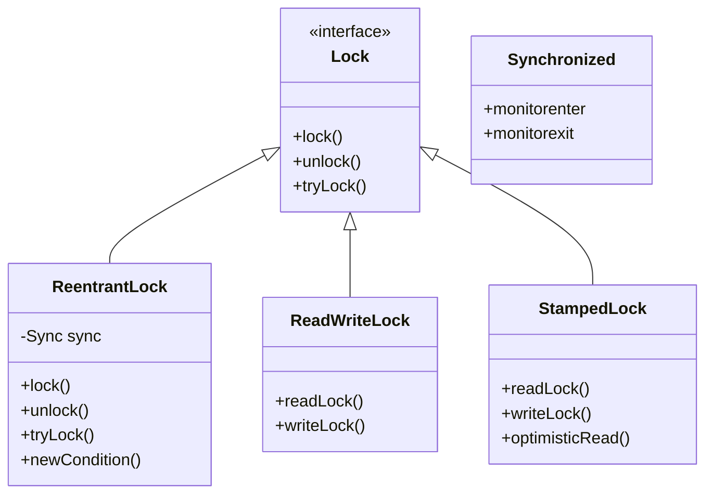
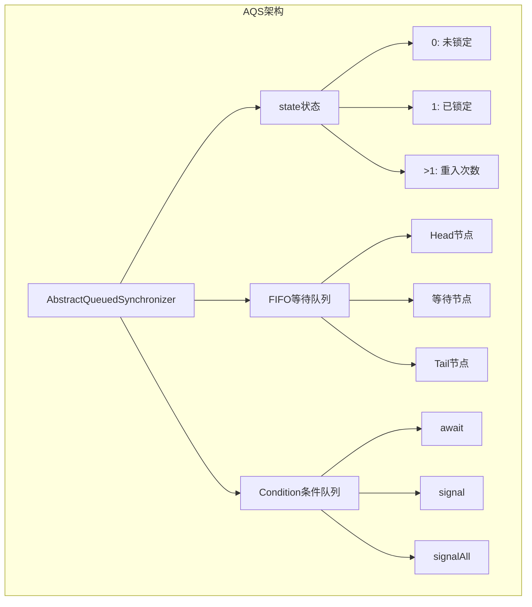
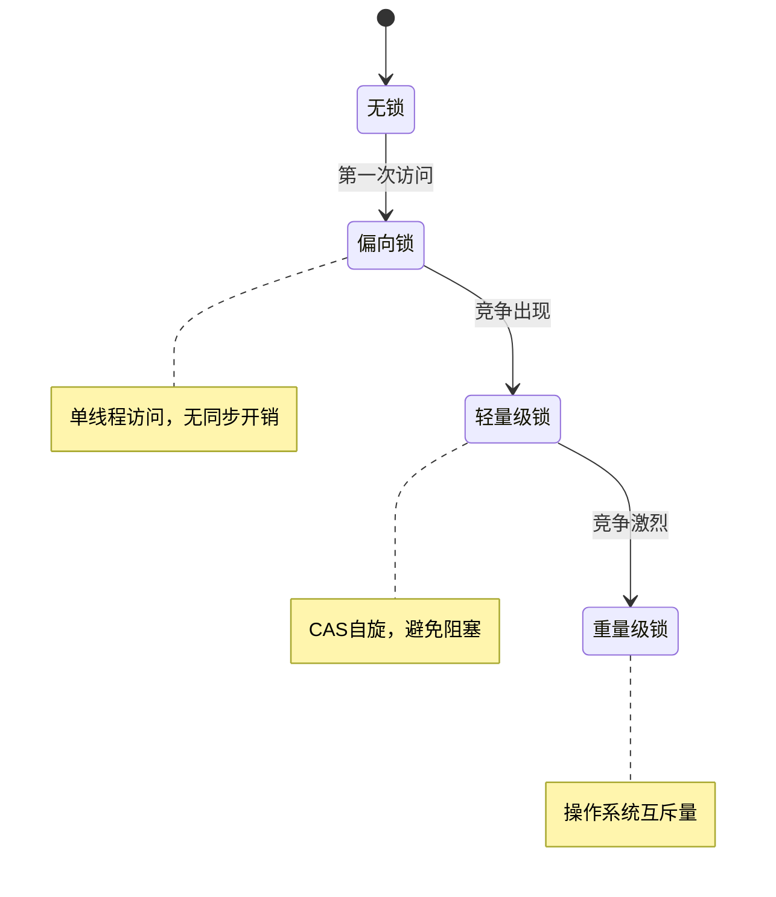
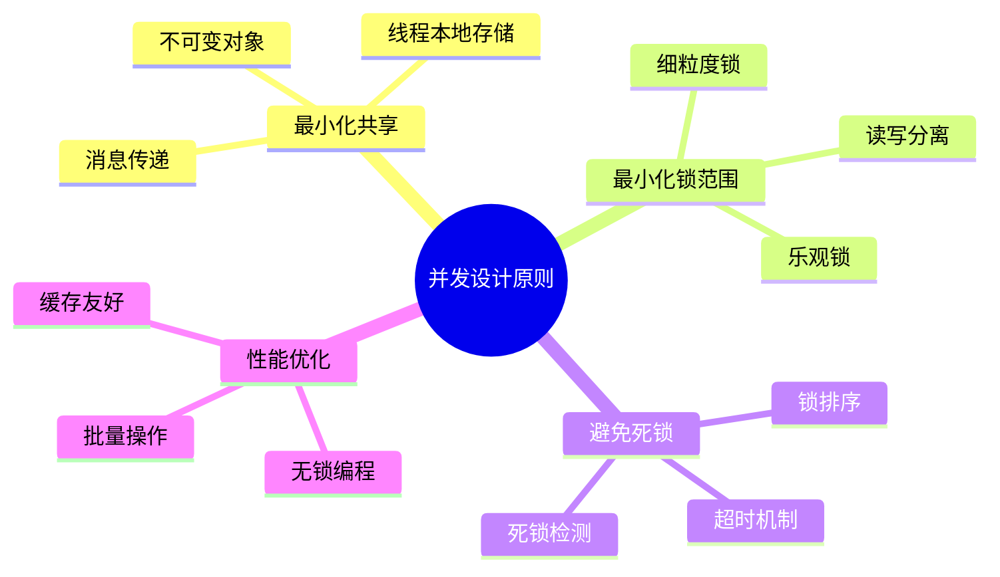
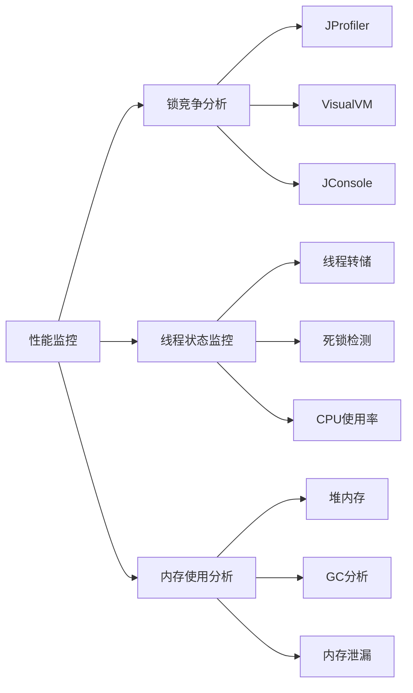

#### 目录介绍
- 1.锁基础概念
  - 1.1 锁的作用
  - 1.2 为何需要锁
- 2.锁的类型
  - 2.1 悲观锁和乐观锁
  - 2.2 互斥锁
  - 2.3 读写锁
- 03.锁的架构设计
  - 3.1 锁的层次结构
  - 3.2 AQS设计架构
  - 3.3 锁升级机制
  - 3.4 分段锁设计
  - 3.5 无锁数据结构
- 09.总结与实践
  - 9.1 并发设计原则
  - 9.2 Java最佳实践
  - 9.3 性能监控与调优
  - 9.4 锁的总结


## 1.锁基础概念

### 1.1 锁的作用

**锁** 是用于多线程编程的同步机制，用于保护共享资源，避免数据竞争和并发访问导致的问题。

C++ 标准库提供了多种锁的实现，包括互斥锁、读写锁、条件变量等。

### 1.2 为何需要锁

在多线程环境中，多个线程可能同时访问或修改共享资源（如全局变量、数据结构等）。如果没有同步机制，可能会导致以下问题：

1. **数据竞争**： 多个线程同时修改同一数据，导致数据不一致或程序行为异常。
2. **竞态条件**： 程序的执行结果依赖于线程的执行顺序，导致不可预测的行为。

线程锁通过确保同一时间只有一个线程可以访问共享资源来解决这些问题。


## 03.锁的架构设计

### 3.1 锁的层次结构



### 3.2 AQS设计架构

AQS (AbstractQueuedSynchronizer) 架构



### 3.3 锁升级机制

锁升级机制（Java）



### 3.4 分段锁设计

分段锁（ConcurrentHashMap）

```java
public class SegmentedLock<K, V> {
    private final Segment<K, V>[] segments;
    private final int segmentMask;
    
    static class Segment<K, V> extends ReentrantLock {
        private final Map<K, V> table = new HashMap<>();
        
        V put(K key, V value) {
            lock();
            try {
                return table.put(key, value);
            } finally {
                unlock();
            }
        }
    }
    
    private Segment<K, V> segmentFor(int hash) {
        return segments[hash & segmentMask];
    }
}
```

### 3.5 无锁数据结构

```cpp
// 无锁栈实现
template<typename T>
class LockFreeStack {
private:
    struct Node {
        T data;
        Node* next;
        Node(T const& data_) : data(data_) {}
    };
    
    std::atomic<Node*> head;
    
public:
    void push(T const& data) {
        Node* new_node = new Node(data);
        new_node->next = head.load();
        while (!head.compare_exchange_weak(new_node->next, new_node));
    }
    
    bool pop(T& result) {
        Node* old_head = head.load();
        while (old_head && 
               !head.compare_exchange_weak(old_head, old_head->next));
        
        if (old_head) {
            result = old_head->data;
            delete old_head;
            return true;
        }
        return false;
    }
};
```

## 09.总结与实践

### 9.1 并发设计原则



### 9.2 Java最佳实践

```java
// 推荐做法
public class BestPracticeExample {
    // 1. 使用并发集合
    private final ConcurrentHashMap<String, String> cache = new ConcurrentHashMap<>();
    
    // 2. 使用原子类
    private final AtomicLong counter = new AtomicLong(0);
    
    // 3. 使用不可变对象
    private final List<String> immutableList = Collections.unmodifiableList(Arrays.asList("a", "b"));
    
    // 4. 正确使用锁
    private final ReentrantReadWriteLock rwLock = new ReentrantReadWriteLock();
    
    public String getValue(String key) {
        rwLock.readLock().lock();
        try {
            return cache.get(key);
        } finally {
            rwLock.readLock().unlock();
        }
    }
    
    public void setValue(String key, String value) {
        rwLock.writeLock().lock();
        try {
            cache.put(key, value);
        } finally {
            rwLock.writeLock().unlock();
        }
    }
}
```

### 9.3 性能监控与调优



### 9.4 锁的总结

并发编程中的锁设计是一个复杂而重要的主题。通过理解线程安全的核心原理、掌握各种同步机制的使用场景、遵循最佳实践，我们可以构建出高性能、可靠的并发系统。

**关键要点：**

1. **理解根本原因**：脏数据源于原子性、可见性、有序性问题
2. **选择合适工具**：根据场景选择synchronized、Lock、原子类等
3. **遵循设计原则**：最小化共享、避免死锁、优化性能
4. **持续监控优化**：使用工具监控锁竞争，持续优化性能


