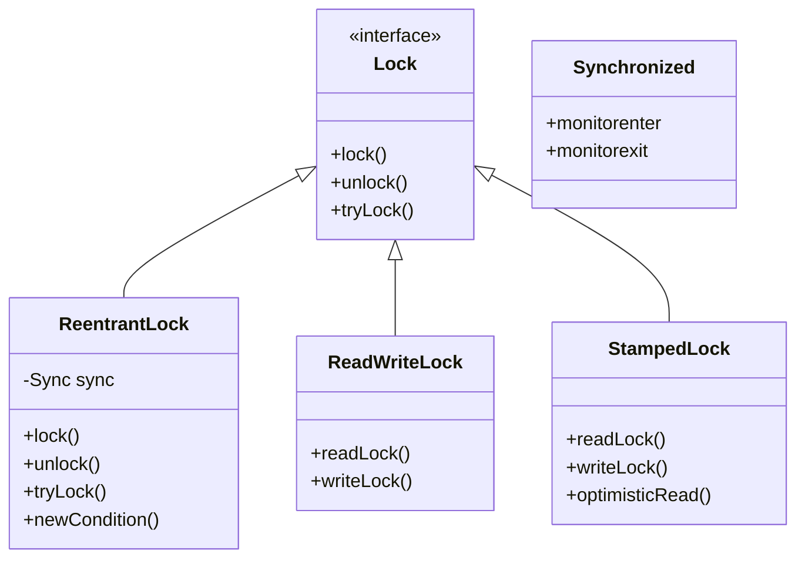
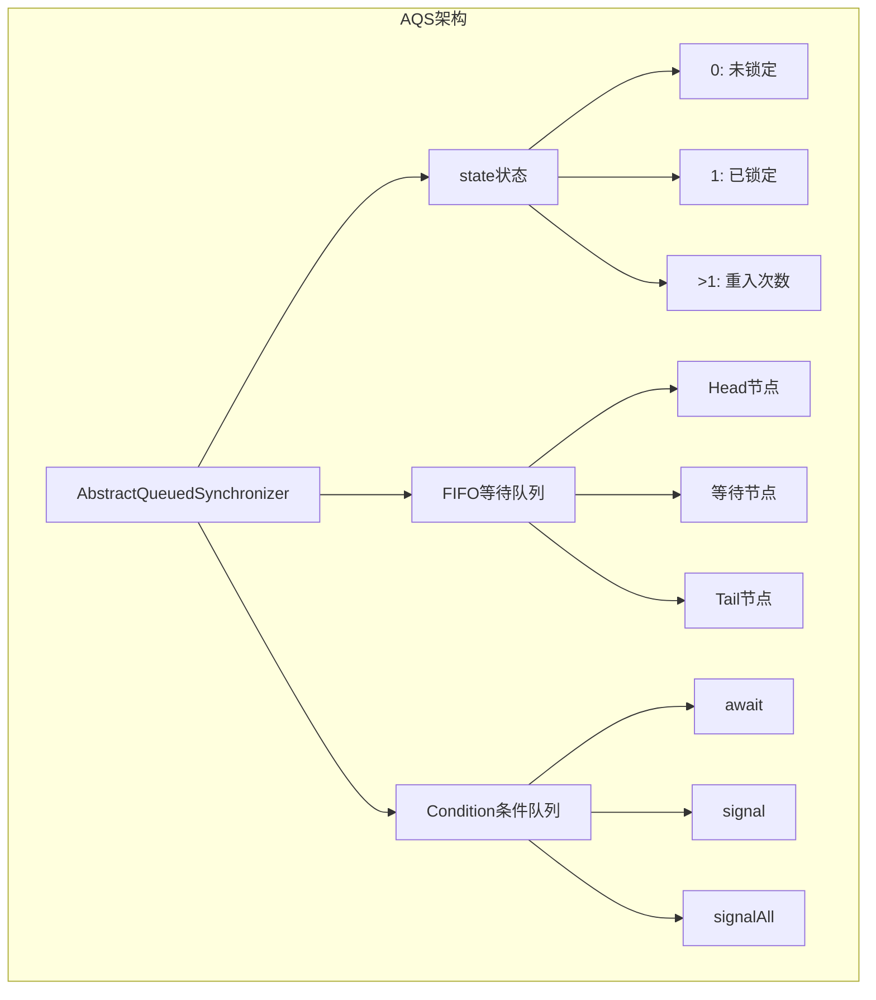
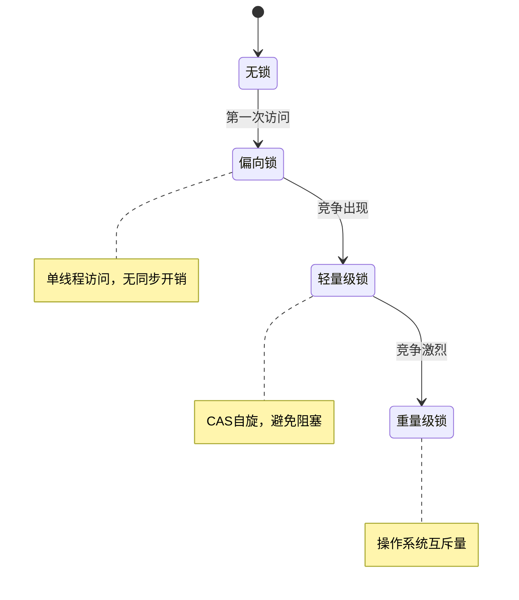
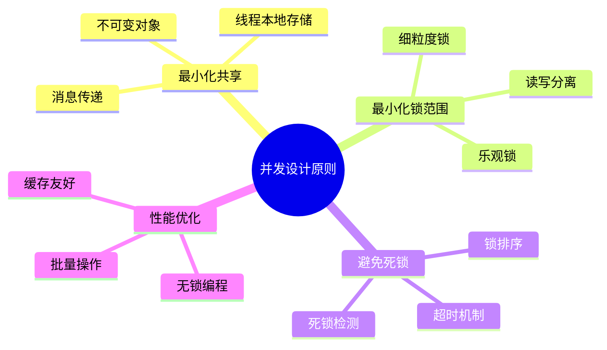
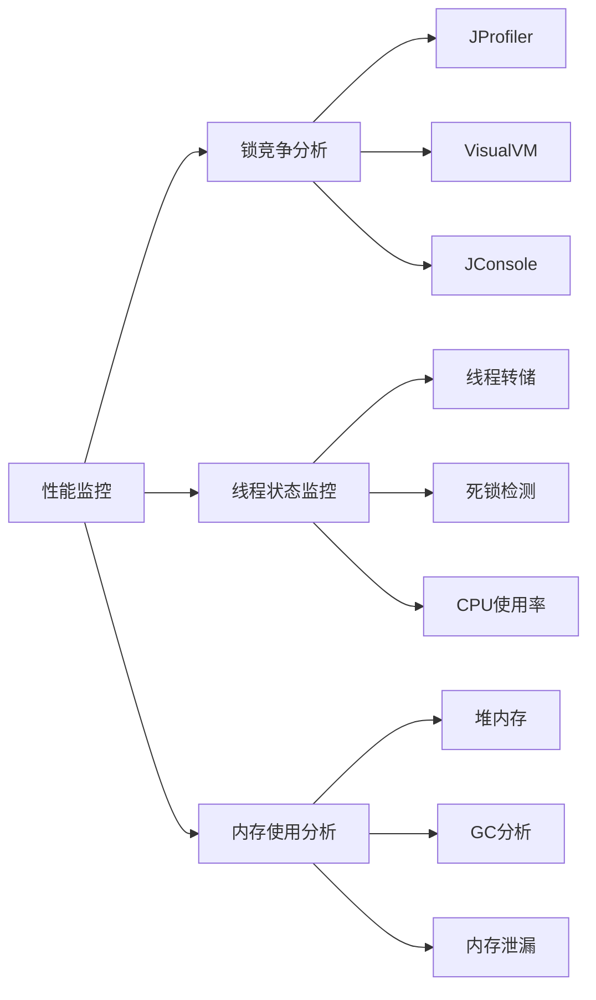

#### 目录介绍
- 1.锁基础概念
  - 1.1 锁的作用
  - 1.2 为何需要锁
  - 1.3 核心思想
- 2.锁类型分类
  - 2.1 按策略分类
  - 2.2


- 03.锁的架构设计
  - 3.1 锁的层次结构
  - 3.2 AQS设计架构
  - 3.3 锁升级机制
  - 3.4 分段锁设计
  - 3.5 无锁数据结构
- 09.总结与实践
  - 9.1 并发设计原则
  - 9.2 Java最佳实践
  - 9.3 性能监控与调优
  - 9.4 锁的总结


## 1.锁基础概念

### 1.1 锁的作用

当满足以下三个条件时，**数据竞争（Data Race）** 必然出现：

1. **共享**：多个执行体（线程/进程/CPU核）访问同一块内存
2. **可变**：至少有一个执行体在写
3. **无序**：访问之间没有 happens-before 关系

**锁** 是用于多线程编程的同步机制，用于保护共享资源，避免数据竞争和并发访问导致的问题。提供了多种锁的实现，包括互斥锁、读写锁、条件变量等。

### 1.2 为何需要锁

在多线程环境中，多个线程可能同时访问或修改共享资源（如全局变量、数据结构等）。如果没有同步机制，可能会导致以下问题：

1. **数据竞争**： 多个线程同时修改同一数据，导致数据不一致或程序行为异常。
2. **竞态条件**： 程序的执行结果依赖于线程的执行顺序，导致不可预测的行为。

线程锁通过确保同一时间只有一个线程可以访问共享资源来解决这些问题。

### 1.3 核心思想

锁的核心思想可以用一句话概括：

> **通过序列化对共享资源的访问，将并发问题降维为顺序问题。**

更细化地看：

| 思想层面 | 内容 |
|---------|------|
| 并发控制 | 将并行执行的临界区**串行化**，消除交错执行的不确定性 |
| 资源管理 | 锁是一种**许可证**，持有者可进入临界区，未持有者必须等待 |
| 内存可见性 | 锁的获取/释放隐含**内存屏障**，确保临界区内的修改对后续持有者可见 |
| 抽象封装 | 将底层硬件原子指令封装为高层语义，让程序员不需要关心缓存一致性协议 |

## 2.锁类型分类

### 2.1 按策略分类

| 分类 | 核心思想 | 实现 | 适用场景 |
|------|---------|------|---------|
| **悲观锁** | 假设冲突频繁，先加锁再操作 | Mutex、RWLock、synchronized | 写多/冲突频繁 |
| **乐观锁** | 假设冲突罕见，先操作再检测冲突 | CAS、版本号、MVCC | 读多写少/冲突罕见 |

**悲观锁 vs 乐观锁的本质区别**：

- 悲观锁：先获取**独占权**，再修改数据
- 乐观锁：先修改数据，在**提交时验证**是否有冲突，冲突则重试

```
悲观锁：                          乐观锁：
Lock()                           old = Load(data)
  data = modify(data)             new = modify(old)
Unlock()                          if CAS(data, old, new) == false:
                                    retry
```


## 2.锁类型核心思想

### 2.1 悲观锁和乐观锁


### 2.2 互斥锁


### 2.3 读写锁

它的核心思想是允许多个线程同时读取共享资源，但只允许一个线程写入资源，从而在保证数据一致性的同时提高并发性能。用于实现**多读单写**的并发控制。

读写锁（Read-Write Lock）是一种特殊的锁，它区分了读操作和写操作：

- **读锁（Shared Lock）**：允许多个线程同时获取读锁。适用于只读操作，不会修改共享资源。
- **写锁（Exclusive Lock）**： 只允许一个线程获取写锁。适用于写操作，会修改共享资源。获取写锁时，不允许其他线程获取读锁或写锁。

读写锁的核心目标是：

- 提高并发性：允许多个读线程同时访问共享资源。
- 保证数据一致性：写操作是独占的，确保数据不会被并发修改。

`std::shared_mutex` 的实现通常基于以下机制：

#### **（1）内部状态**
- **读计数器**：记录当前持有读锁的线程数量。
- **写标志**：标识是否有线程持有写锁。
- **条件变量**：用于线程的等待和唤醒。

#### **（2）读锁的获取与释放**
- **获取读锁**：
  - 如果没有线程持有写锁，则增加读计数器，允许线程获取读锁。
  - 如果有线程持有写锁，则当前线程需要等待，直到写锁被释放。
- **释放读锁**：
  - 减少读计数器。
  - 如果读计数器为 0，则唤醒等待写锁的线程。

#### **（3）写锁的获取与释放**
- **获取写锁**：
  - 如果没有线程持有读锁或写锁，则设置写标志，允许线程获取写锁。
  - 如果有线程持有读锁或写锁，则当前线程需要等待，直到所有读锁和写锁被释放。
- **释放写锁**：
  - 清除写标志。
  - 唤醒等待读锁或写锁的线程。

#### **（4）公平性与优先级**
- 读写锁的实现需要解决**写线程饥饿**问题：
  - 如果读线程持续获取读锁，写线程可能一直无法获取写锁。
  - 通常通过优先级机制或公平锁策略来避免写线程饥饿。


## 03.锁的架构设计

### 3.1 锁的层次结构



### 3.2 AQS设计架构

AQS (AbstractQueuedSynchronizer) 架构



### 3.3 锁升级机制

锁升级机制（Java）



### 3.4 分段锁设计

分段锁（ConcurrentHashMap）

```java
public class SegmentedLock<K, V> {
    private final Segment<K, V>[] segments;
    private final int segmentMask;
    
    static class Segment<K, V> extends ReentrantLock {
        private final Map<K, V> table = new HashMap<>();
        
        V put(K key, V value) {
            lock();
            try {
                return table.put(key, value);
            } finally {
                unlock();
            }
        }
    }
    
    private Segment<K, V> segmentFor(int hash) {
        return segments[hash & segmentMask];
    }
}
```

### 3.5 无锁数据结构

```cpp
// 无锁栈实现
template<typename T>
class LockFreeStack {
private:
    struct Node {
        T data;
        Node* next;
        Node(T const& data_) : data(data_) {}
    };
    
    std::atomic<Node*> head;
    
public:
    void push(T const& data) {
        Node* new_node = new Node(data);
        new_node->next = head.load();
        while (!head.compare_exchange_weak(new_node->next, new_node));
    }
    
    bool pop(T& result) {
        Node* old_head = head.load();
        while (old_head && 
               !head.compare_exchange_weak(old_head, old_head->next));
        
        if (old_head) {
            result = old_head->data;
            delete old_head;
            return true;
        }
        return false;
    }
};
```

## 09.总结与实践

### 9.1 并发设计原则



### 9.2 Java最佳实践

```java
// 推荐做法
public class BestPracticeExample {
    // 1. 使用并发集合
    private final ConcurrentHashMap<String, String> cache = new ConcurrentHashMap<>();
    
    // 2. 使用原子类
    private final AtomicLong counter = new AtomicLong(0);
    
    // 3. 使用不可变对象
    private final List<String> immutableList = Collections.unmodifiableList(Arrays.asList("a", "b"));
    
    // 4. 正确使用锁
    private final ReentrantReadWriteLock rwLock = new ReentrantReadWriteLock();
    
    public String getValue(String key) {
        rwLock.readLock().lock();
        try {
            return cache.get(key);
        } finally {
            rwLock.readLock().unlock();
        }
    }
    
    public void setValue(String key, String value) {
        rwLock.writeLock().lock();
        try {
            cache.put(key, value);
        } finally {
            rwLock.writeLock().unlock();
        }
    }
}
```

### 9.3 性能监控与调优



### 9.4 锁的总结

并发编程中的锁设计是一个复杂而重要的主题。通过理解线程安全的核心原理、掌握各种同步机制的使用场景、遵循最佳实践，我们可以构建出高性能、可靠的并发系统。

**关键要点：**

1. **理解根本原因**：脏数据源于原子性、可见性、有序性问题
2. **选择合适工具**：根据场景选择synchronized、Lock、原子类等
3. **遵循设计原则**：最小化共享、避免死锁、优化性能
4. **持续监控优化**：使用工具监控锁竞争，持续优化性能


