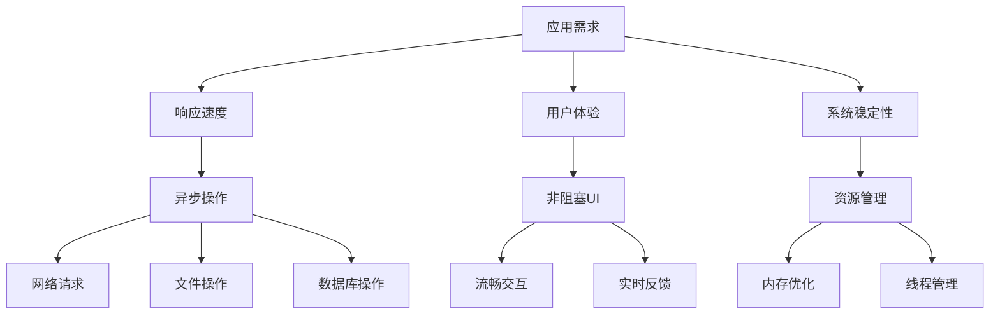
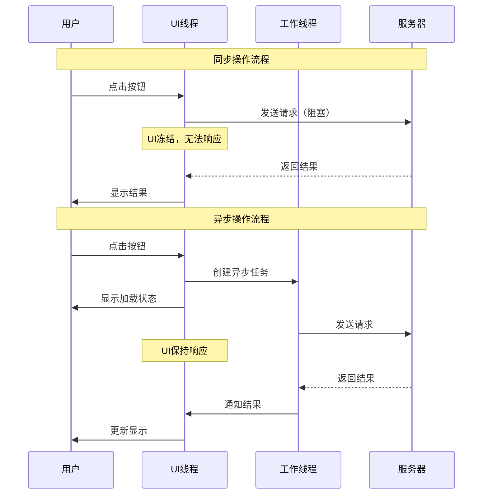

#### 目录介绍
- 01.基础概念介绍
  - 1.1 先看个案例
  - 1.2 为何要同步异步
- 02.两种不同世界观
  - 2.1 同步编程模型
  - 2.2 异步编程模型
  - 2.3 适用场景
  - 2.4 模型流程图
- 03.技术原理解析
  - 3.1 同步底层实现
  - 3.2 异步底层实现


## 01.基础概念介绍

### 1.1 先看个案例

### 1.1 为何需要同步异步

为什么需要同步异步技术方案。在现代应用开发中，同步和异步操作是核心技术概念，直接影响应用的性能、用户体验和系统稳定性。



## 02.两种不同世界观

### 2.1 同步编程模型

同步编程：**“顺序执行”的直觉模型**

**设计哲学**：代码执行流程与人类阅读顺序一致，一步完成再执行下一步。

```python
# 经典的同步模式 - 符合直觉
print("开始任务")
data = read_file("large_file.txt")  # 阻塞点：程序在这里"停止"等待
processed_data = process(data)      # 前一步完成才执行这一步
result = send_to_network(processed_data)  # 可能再次阻塞
print("任务完成，结果:", result)
```

**思维模型**：像**厨师独自做菜** - 洗菜 → 切菜 → 炒菜 → 装盘，必须按顺序进行。

特点是简单直观，但可能阻塞主线程。

适用场景：快速操作、UI更新、简单计算。

### 2.2 异步编程模型

异步编程：**“事件驱动”的响应模型**

**设计哲学**：遇到需要等待的操作时，不阻塞主线，而是注册回调，后续通过事件通知继续。

```javascript
// 典型的异步模式 - 基于回调
console.log("开始任务");

readFile("large_file.txt", (error, data) => {
    // 这是回调函数，文件读取完成后才执行
    process(data, (processed) => {
        // 又一个回调
        sendToNetwork(processed, (result) => {
            console.log("任务完成，结果:", result);
        });
    });
});

console.log("我可以做其他事情..."); // 不会等待文件读取
```

**思维模型**：像**餐厅厨师团队** - 主厨安排任务：A洗菜、B切菜、C炒菜，主厨不等待，继续安排其他订单。

### 2.3 适用场景

| 场景类型 | 同步操作 | 异步操作 |
|----------|----------|----------|
| 网络请求 | ❌ 阻塞UI | ✅ 推荐 |
| 文件读写 | ⚠️ 小文件可用 | ✅ 大文件推荐 |
| 数据库操作 | ⚠️ 简单查询 | ✅ 复杂操作推荐 |
| UI更新 | ✅ 主线程必须 | ❌ 不适用 |
| 计算密集 | ❌ 阻塞UI | ✅ 后台处理 |

### 2.4 模型流程图



## 03.技术原理解析

### 3.1 同步底层实现

同步的底层实现：线程阻塞

```java
// Java 同步IO的底层原理
public class SynchronousExample {
    public void readData() {
        // 线程在这里被阻塞，直到数据就绪
        InputStream input = socket.getInputStream();
        byte[] buffer = new byte[1024];
        int bytesRead = input.read(buffer); // 线程在此挂起，等待数据
        
        // 只有数据到达后，才继续执行
        processData(buffer, bytesRead);
    }
}
```

**核心机制**：

- **线程状态切换**：运行态 → 阻塞态（等待I/O）→ 就绪态 → 运行态
- **上下文切换成本**：每次阻塞/唤醒都需要保存/恢复线程状态
- **资源浪费**：阻塞期间线程不工作，但仍占用内存等资源

### 3.2 异步底层实现

异步底层实现：事件循环 + 就绪通知

```python
# 异步IO的伪代码示意
class EventLoop:
    def __init__(self):
        self.ready_tasks = []        # 就绪任务队列
        self.io_watchers = {}        # I/O监视器（如epoll、kqueue）
    
    def run_forever(self):
        while True:
            # 1. 执行就绪的任务
            while self.ready_tasks:
                task = self.ready_tasks.pop(0)
                task.execute()
            
            # 2. 检查哪些I/O操作已就绪
            ready_events = self.io_watchers.poll(timeout=0)
            
            # 3. 将就绪的I/O对应的回调加入任务队列
            for event in ready_events:
                callback = event.get_callback()
                self.ready_tasks.append(callback)
```

**操作系统支持**：

- **Linux**: `epoll` - 监控大量文件描述符
- **Windows**: `IOCP` (I/O Completion Ports) - 完成端口
- **BSD**: `kqueue` - 事件通知接口


