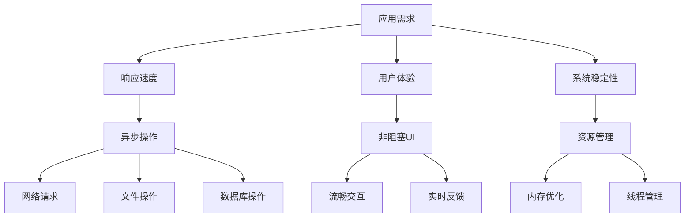
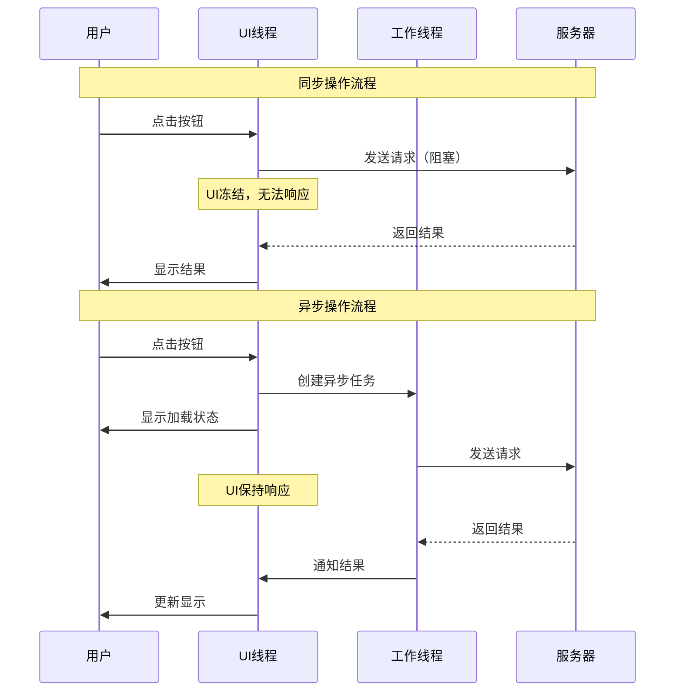
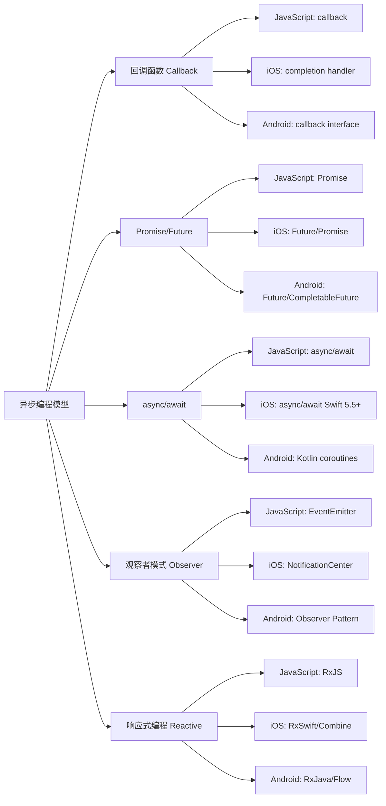
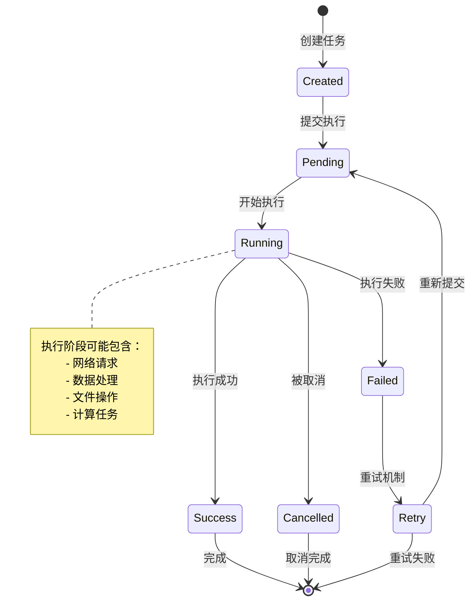
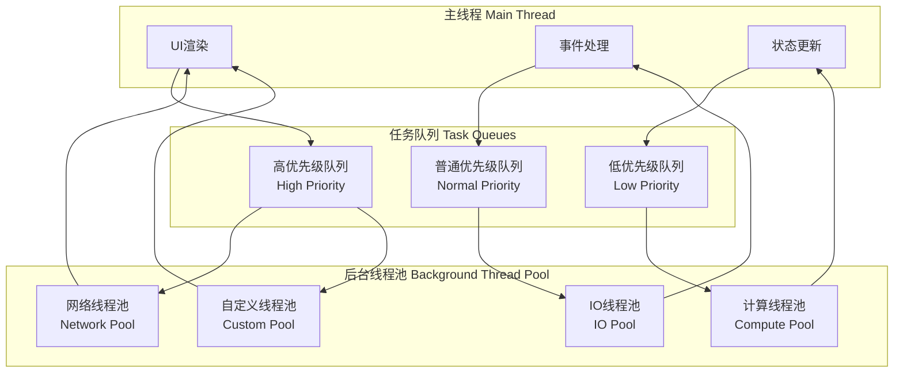
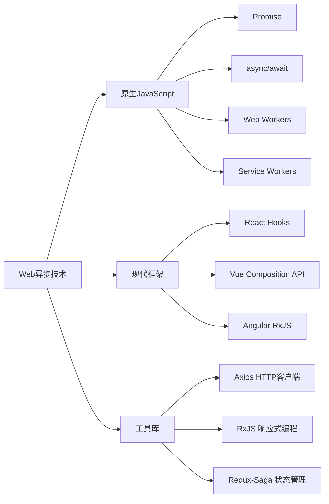
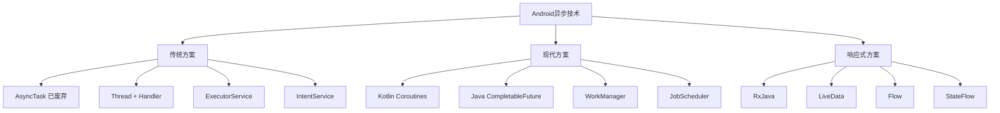
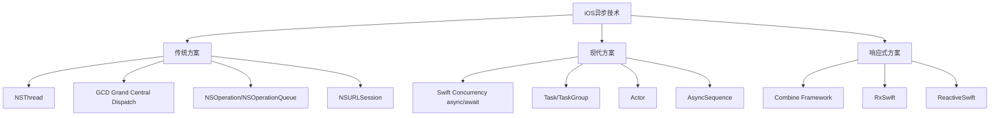

#### 目录介绍
- 01.基础概念介绍
  - 1.1 先看个案例
  - 1.2 为何要同步异步
  - 1.3 异步应用需求
- 02.两种不同世界观
  - 2.1 同步编程模型
  - 2.2 异步编程模型
  - 2.3 适用场景
  - 2.4 模型流程图
  - 2.5 两者本质差异
- 03.技术原理解析
  - 3.1 同步底层实现
  - 3.2 异步底层实现
  - 3.3 将异步转同步
- 04.技术演变历史
  - 4.1 原始同步时代
  - 4.2 多线程同步时代
  - 4.3 回调地狱时代
  - 4.4 现代异步语法糖
- 05.多语言演变
  - 5.1 Java演进路径
  - 5.2 C++演进路径
  - 5.3 javaScript演进
- 06.技术架构设计
  - 6.1 异步编程模型
  - 6.2 异步任务生命周期
  - 6.3 线程模型设计
- 07.平台实现方案
  - 7.1 Web端实现
  - 7.2 Android端实现
  - 7.3 iOS端实现

  
## 01.基础概念介绍

### 1.1 先看个案例

一个经典例子：餐厅点餐。想象你在一家餐厅，有两种不同的工作模式：

> **同步（Synchronous）模式：像“固执的厨师”**

**场景**：餐厅只有一个厨师，而且他非常“固执”。

1.  **顾客A点了一份牛排**。厨师接到订单，**开始煎牛排**。在牛排煎好的这5分钟里，他什么都不做，就站在炉子前等着。
2.  **顾客B进来点了一份沙拉**。但厨师正在煎牛排，无法接单。顾客B只能干等着。
3.  **5分钟后**，牛排好了，厨师打包给顾客A。
4.  **现在**，厨师才回头处理顾客B的沙拉，开始切蔬菜。同样，切菜的时候他也不能做别的事。

**结果**：效率极低！即使煎牛排、等水烧开这种不需要一直盯着的事情，厨师也被“阻塞”住了。整个餐厅的吞吐量（单位时间服务的顾客数）非常低。

> **异步（Asynchronous）模式：像“高效的后厨团队”**

**场景**：餐厅有一个**协调员（事件循环）** 和一个**后厨团队**。

1.  **顾客A点了一份牛排**。协调员记下订单，交给厨师A。**厨师A把牛排放入煎锅后，不需要傻站着等**，而是告诉协调员：“牛排还在煎，煎好了叫我”。然后厨师A就可以去处理其他任务。
2.  **顾客B，几乎同时，点了一份沙拉**。协调员立即将沙拉订单交给**空闲的厨师B**。厨师B开始做沙拉。
3.  **这时，牛排煎好了**，锅里的计时器“叮”了一声（这是一个**事件**或**回调**）。协调员收到通知，安排厨师A回来把牛排装盘，送给顾客A。
4.  **沙拉的食材也准备好了**，厨师B完成沙拉，送出。

**结果**：效率极高！协调员（事件循环）不断接收新任务（点餐）和完成通知（“叮”声），并分配给空闲的资源（厨师）。在等待的“空档期”，系统没有被阻塞，而是去处理其他任务。

### 1.2 为何需要同步异步

为什么需要这两种设计？映射到编程世界：

*   **顾客** = 用户请求
*   **厨师** = CPU/线程（计算资源）
*   **煎牛排、煮水** = **I/O操作**（比如读取硬盘文件、等待网络响应、查询数据库）。这些操作的特点是需要等待，但不需要CPU一直参与。
*   **协调员** = **事件循环（Event Loop）**
*   **“叮”声通知** = **回调函数（Callback）** 或 **Promise/Await的解析**

**核心原因：CPU速度 vs. I/O速度的“天文级”差距**

*   **CPU执行一条指令**：约需要 **0.3纳秒**
*   **从内存读取1MB数据**：约需要 **300微秒**（比CPU慢1000倍）
*   **从SSD硬盘读取1MB数据**：约需要 **1毫秒**（比CPU慢300万倍）
*   **从网络请求一个数据包**：约需要 **100毫秒**（比CPU慢3亿倍！）

**所以，同步模式的问题在于**：当你的程序需要从硬盘读一个文件（等待1毫秒）时，CPU这个“超级跑车”却被迫踩下刹车，**空转等待**，这是对计算资源的巨大浪费。

**异步模式的价值在于**：在等待I/O结果的漫长“1毫秒”里，CPU这个“超级跑车”可以掉头去执行其他成百上千个任务的计算。当I/O完成后，再回来处理。这样就极大地提升了CPU的利用率和系统的整体吞吐量。

### 1.3 异步应用需求

为什么需要同步异步技术方案。在现代应用开发中，同步和异步操作是核心技术概念，直接影响应用的性能、用户体验和系统稳定性。




## 02.两种不同世界观

### 2.1 同步编程模型

同步编程：**“顺序执行”的直觉模型**

**设计哲学**：代码执行流程与人类阅读顺序一致，一步完成再执行下一步。

```python
# 经典的同步模式 - 符合直觉
print("开始任务")
data = read_file("large_file.txt")  # 阻塞点：程序在这里"停止"等待
processed_data = process(data)      # 前一步完成才执行这一步
result = send_to_network(processed_data)  # 可能再次阻塞
print("任务完成，结果:", result)
```

**思维模型**：像**厨师独自做菜** - 洗菜 → 切菜 → 炒菜 → 装盘，必须按顺序进行。

特点是简单直观，但可能阻塞主线程。

适用场景：快速操作、UI更新、简单计算。

### 2.2 异步编程模型

异步编程：**“事件驱动”的响应模型**

**设计哲学**：遇到需要等待的操作时，不阻塞主线，而是注册回调，后续通过事件通知继续。

```javascript
// 典型的异步模式 - 基于回调
console.log("开始任务");

readFile("large_file.txt", (error, data) => {
    // 这是回调函数，文件读取完成后才执行
    process(data, (processed) => {
        // 又一个回调
        sendToNetwork(processed, (result) => {
            console.log("任务完成，结果:", result);
        });
    });
});

console.log("我可以做其他事情..."); // 不会等待文件读取
```

**思维模型**：像**餐厅厨师团队** - 主厨安排任务：A洗菜、B切菜、C炒菜，主厨不等待，继续安排其他订单。

### 2.3 适用场景

| 场景类型 | 同步操作 | 异步操作 |
|----------|----------|----------|
| 网络请求 | ❌ 阻塞UI | ✅ 推荐 |
| 文件读写 | ⚠️ 小文件可用 | ✅ 大文件推荐 |
| 数据库操作 | ⚠️ 简单查询 | ✅ 复杂操作推荐 |
| UI更新 | ✅ 主线程必须 | ❌ 不适用 |
| 计算密集 | ❌ 阻塞UI | ✅ 后台处理 |

### 2.4 模型流程图



### 2.5 两者本质差异

| 特性 | **同步（Synchronous）** | **异步（Asynchronous）** |
| :--- | :--- | :--- |
| **核心思想** | **顺序执行，阻塞等待** | **并发执行，非阻塞回调** |
| **编程模型** | 简单、直观，符合人类线性思维 | 复杂，基于事件、回调或Promise |
| **资源利用** | 差。线程在I/O等待时被挂起，浪费内存和CPU调度资源 | 优。**用极少的线程（甚至单线程）处理海量I/O** |
| **性能特点** | 延迟低（对于单个任务），但吞吐量低 | 延迟可能稍高（由于调度），但**吞吐量极高** |
| **复杂度** | 业务逻辑简单，并发控制复杂 | 并发简单，业务逻辑可能复杂 |
| **调试难度** | 堆栈清晰，易于跟踪 | 堆栈断裂，调试困难 |
| **适用场景** | **CPU密集型任务**（计算复杂，I/O少）、简单的客户端应用 | **I/O密集型任务**（高并发网络请求、文件操作）、服务器后端 |
| **比喻** | **单车道堵车**：一辆车抛锚，后面全堵死 | **立交桥**：一个方向堵车，不影响其他方向 |

## 03.技术原理解析

### 3.1 同步底层实现

同步的底层实现：线程阻塞

```java
// Java 同步IO的底层原理
public class SynchronousExample {
    public void readData() {
        // 线程在这里被阻塞，直到数据就绪
        InputStream input = socket.getInputStream();
        byte[] buffer = new byte[1024];
        int bytesRead = input.read(buffer); // 线程在此挂起，等待数据
        
        // 只有数据到达后，才继续执行
        processData(buffer, bytesRead);
    }
}
```

**核心机制**：

- **线程状态切换**：运行态 → 阻塞态（等待I/O）→ 就绪态 → 运行态
- **上下文切换成本**：每次阻塞/唤醒都需要保存/恢复线程状态
- **资源浪费**：阻塞期间线程不工作，但仍占用内存等资源

### 3.2 异步底层实现

异步底层实现：事件循环 + 就绪通知

```python
# 异步IO的伪代码示意
class EventLoop:
    def __init__(self):
        self.ready_tasks = []        # 就绪任务队列
        self.io_watchers = {}        # I/O监视器（如epoll、kqueue）
    
    def run_forever(self):
        while True:
            # 1. 执行就绪的任务
            while self.ready_tasks:
                task = self.ready_tasks.pop(0)
                task.execute()
            
            # 2. 检查哪些I/O操作已就绪
            ready_events = self.io_watchers.poll(timeout=0)
            
            # 3. 将就绪的I/O对应的回调加入任务队列
            for event in ready_events:
                callback = event.get_callback()
                self.ready_tasks.append(callback)
```

**操作系统支持**：

- **Linux**: `epoll` - 监控大量文件描述符
- **Windows**: `IOCP` (I/O Completion Ports) - 完成端口
- **BSD**: `kqueue` - 事件通知接口

### 3.3 将异步转同步

场景说明：平时获取子线程返回结果以异步回调的方式获取返回到主线程，其实也可以通过某种方法转为同步返回。那么如何将这种异步回调改成同步式的回调？

应用场景：1.单个线程处理结果返回到主线程；2.多个子线程并发请求，最终合并返回结果到主线程

将异步转为同步

- 第一种方式：使用sleep，直接在主线程睡眠，等待子线程返回。缺点：不明确子线程执行时间情况下，不一定能拿得到返回结果
- 第二种方式：使用join，阻塞调用此方法的线程进入 TIMED_WAITING 状态，直到线程完成。
- 第三种方式：使用Future，这是线程创建的又一种实现方式，只不过是阻塞异步的。
- 第四种方式：使用CountDownLatch，它允许一个或多个线程等待直到在其他线程中一组操作执行完成。
- 第五种方式：使用同步屏障CyclicBarrier，线程间同步阻塞是使用的是ReentrantLock，可重入锁。
- 第六种方式：使用信号量Semaphore，与CountDownLatch相似，不同的地方在于Semaphore的值被获取到后是可以释放的，并不像CountDownLatch那样一直减到底。
- 第七种方式：使用移相器Phaser，重量级并发类，jdk7被引入，用来解决控制多个线程分阶段共同完成任务的情景问题。其作用相比CountDownLatch和CyclicBarrier更加灵活。

CountDownLatch和CyclicBarrier区别

- CountDownLatch : 一个线程(或者多个)， 等待另外N个线程完成某个事情之后才能执行。
- CyclicBarrier : N个线程相互等待，任何一个线程完成之前，所有的线程都必须等待，类似有福同享，有难同当

## 04.技术演变历史

### 4.1 原始同步时代

阶段1：原始同步时代（1990s以前）。**技术背景**：单进程/单线程模型

```c
// C语言的同步网络编程
int main() {
    int server_fd = socket(AF_INET, SOCK_STREAM, 0);
    bind(server_fd, ...);
    listen(server_fd, 5);
    
    while(1) {
        // 同步accept：没有连接时就阻塞等待
        int client_fd = accept(server_fd, ...);
        
        // 为每个客户端创建新进程（重量级）
        if (fork() == 0) {
            handle_client(client_fd);  // 同步处理
            exit(0);
        }
    }
}
```

**痛点**：一个客户端阻塞，整个进程挂起，无法处理其他连接。

### 4.2 多线程同步时代

阶段2：多线程同步时代（1990s-2000s初）。**解决方案**：为每个连接创建线程

```java
// Java多线程同步模型
public class ThreadPerConnectionServer {
    public static void main(String[] args) throws IOException {
        ServerSocket serverSocket = new ServerSocket(8080);
        
        while (true) {
            // 仍然同步accept
            Socket clientSocket = serverSocket.accept();
            
            // 但为每个连接创建新线程
            new Thread(() -> {
                handleRequest(clientSocket);  // 线程内仍同步处理
            }).start();
        }
    }
}
```

**进步**：解决了并发问题

**新问题**：线程创建/销毁成本高，内存消耗大（线程栈大小通常1-2MB）

### 4.3 回调地狱时代

阶段3：回调地狱时代（2000s中后期）。**Node.js的解决方案**：单线程 + 异步回调

```javascript
// Node.js 的异步回调模式
const http = require('http');

http.createServer((req, res) => {
    // 异步读取文件，不阻塞事件循环
    fs.readFile('large_file.txt', (err, data) => {
        if (err) {
            res.end('Error');
            return;
        }
        
        // 异步数据库查询
        db.query('SELECT ...', (err, results) => {
            // 又一个回调
            processResults(results, (processed) => {
                res.end(processed);
            });
        });
    });
}).listen(8080);
```

**优势**：高并发，资源消耗小

**问题**：**回调地狱（Callback Hell）**，错误处理复杂，代码难以阅读

### 4.4 现代异步语法糖

阶段4：现代异步语法糖（2010s至今）。

**解决方案**：用同步的写法实现异步的逻辑。比如：JavaScript `async/await`

```javascript
async function handleRequest() {
    try {
        // 类似同步的直观写法
        const data = await fs.promises.readFile('file.txt');
        const result = await db.query('SELECT ...');
        const processed = await processData(result);
        return processed;
    } catch (error) {
        // 统一的错误处理
        console.error('处理失败:', error);
    }
}
```

**核心原理**：**状态机转换**

```javascript
// async/await 的近似编译结果
function handleRequest() {
    return new Promise((resolve, reject) => {
        // 状态机实现
        const stateMachine = {
            state: 0,
            steps: [
                async () => { /* 步骤1 */ },
                async () => { /* 步骤2 */ }, 
                async () => { /* 步骤3 */ }
            ],
            run: function() {
                this.steps
                    .then(() => {
                        this.state++;
                        if (this.state < this.steps.length) {
                            this.run();
                        } else {
                            resolve();
                        }
                    })
                    .catch(reject);
            }
        };
        stateMachine.run();
    });
}
```

## 05.多语言演变

线程级并发 vs 事件驱动并发

| 特性 | 多线程同步模型 | 事件驱动异步模型|
|------|---------------------|--------------------------|
| **并发单位** | 线程 (Thread) | 任务 (Task) |
| **内存开销** | 大 (每线程1-2MB栈) | 小 (约5KB每任务) |
| **上下文切换** | 内核参与，成本高 | 用户态切换，成本低 |
| **CPU密集型** | 优 (可利用多核) | 差 (需要工作线程) |
| **I/O密集型** | 良 (线程池优化) | 优 (原生非阻塞) |
| **代码复杂度** | 中 (需要同步控制) | 中 (避免阻塞事件循环) |


### 5.1 Java演进路径

**Java**：线程池 → NIO → CompletableFuture → 虚拟线程

```java
// Java 21 虚拟线程（轻量级线程）
try (var executor = Executors.newVirtualThreadPerTaskExecutor()) {
    // 每个虚拟线程开销极小，可创建百万个
    IntStream.range(0, 1_000_000).forEach(i -> {
        executor.submit(() -> {
            // 看起来是同步阻塞，实际是异步挂起
            String response = makeHttpRequest(i);
            System.out.println(response);
        });
    });
}
```

### 5.2 C++演进路径

### 5.3 javaScript演进


## 06.技术架构设计

### 6.1 异步编程模型





### 6.2 异步任务生命周期




### 6.3 线程模型设计




## 07.平台实现方案

### 7.1 Web端实现



### 7.2 Android端实现



### 7.3 iOS端实现




