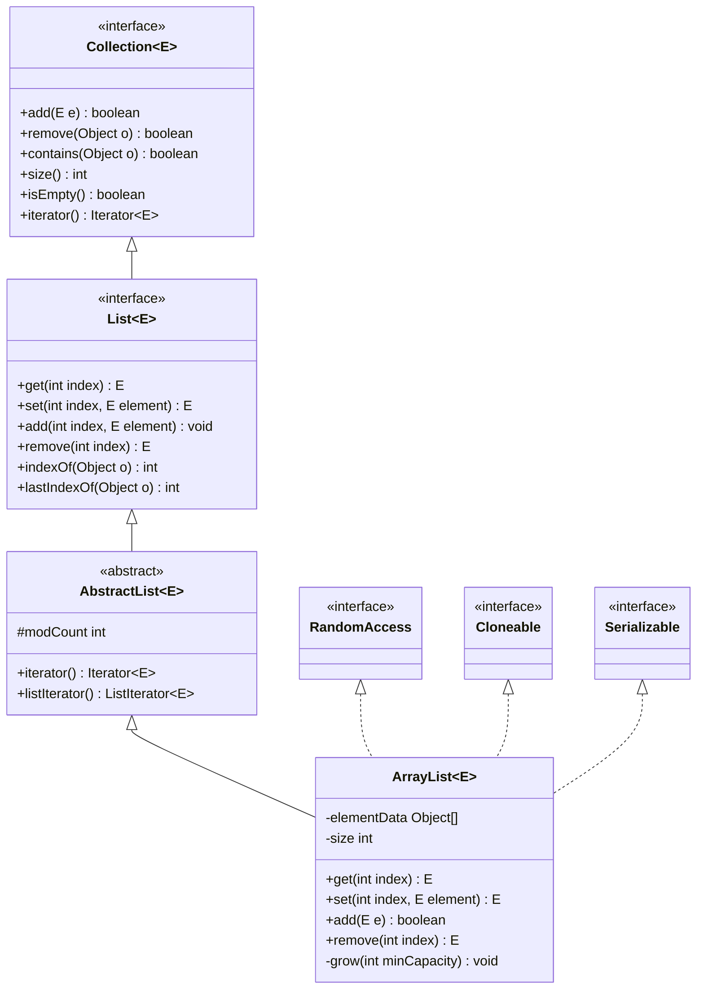
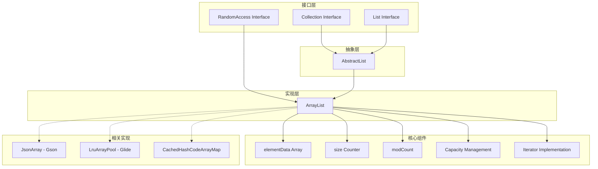
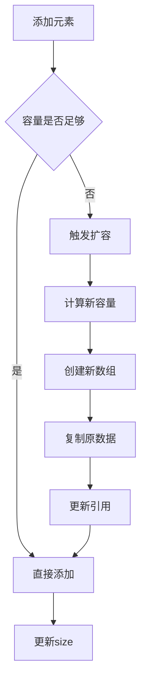
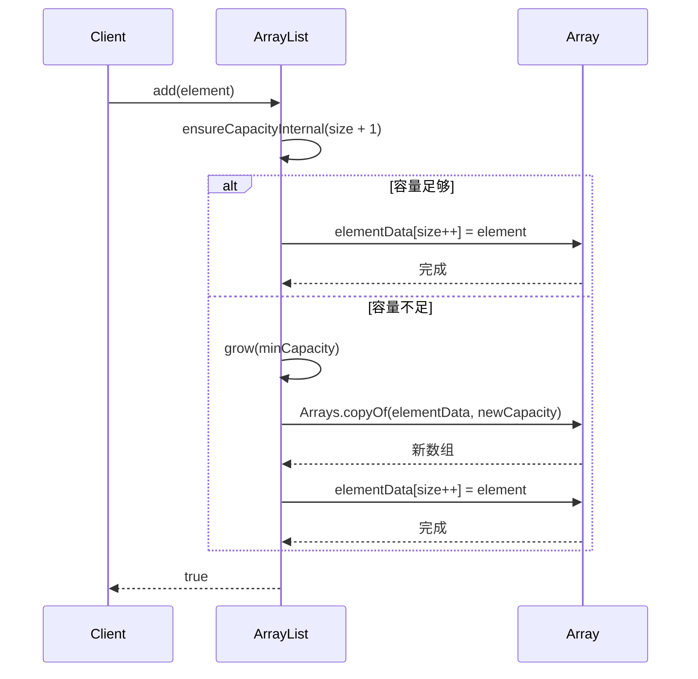
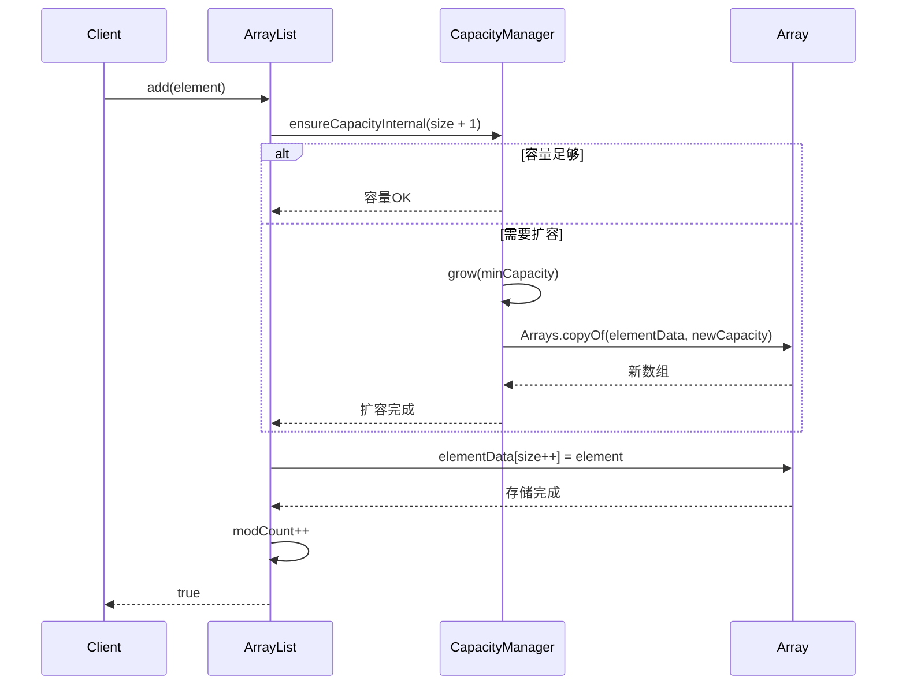
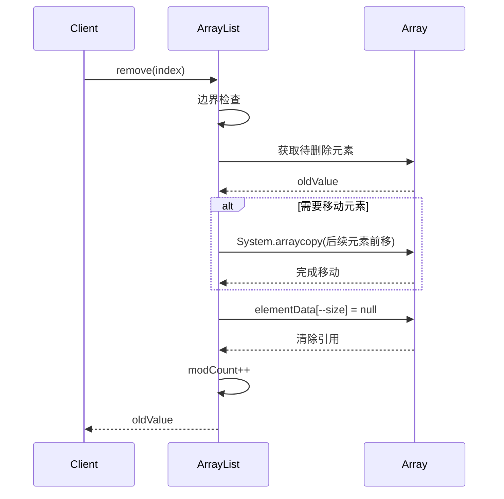
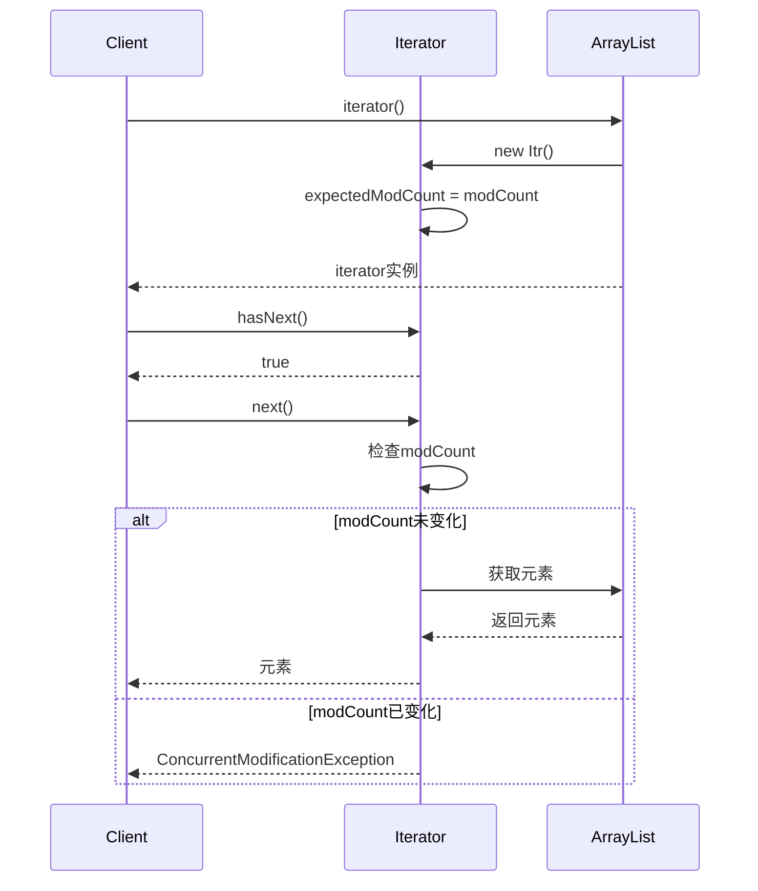
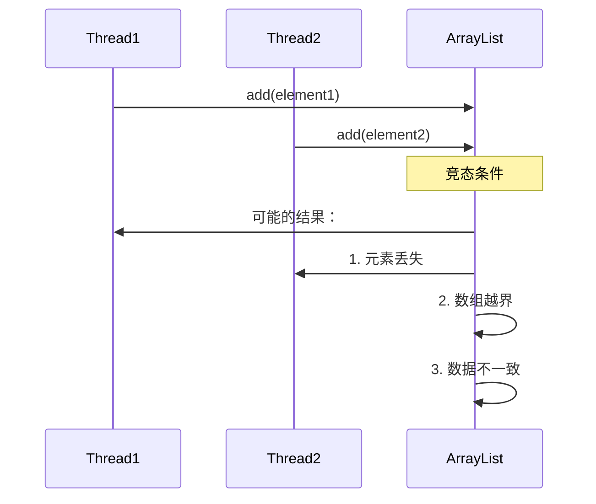
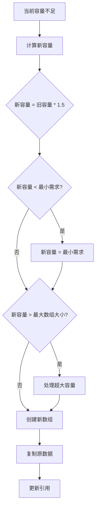
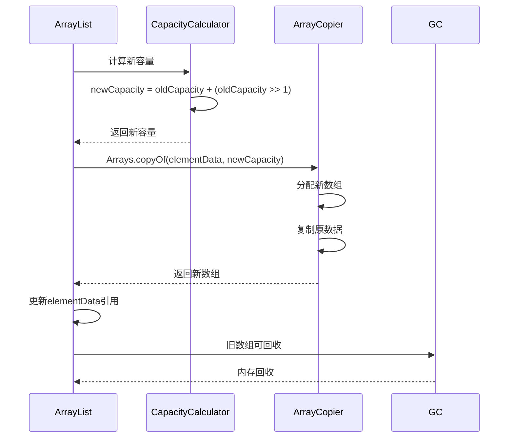

# 31.工业级List设计思想
#### 目录介绍
- 01.List核心思想
  - 1.0 List面试题
  - 1.1 核心设计理念
  - 1.2 接口层次结构
  - 1.3 整体架构图
- 02.List集合如何设计
  - 2.1 使用数组设计
  - 2.2 使用链表设计
  - 2.3 设计考虑点
  - 2.4 数据迁移和安全
  - 2.5 元素效率考量
- 03.动态数组设计
  - 3.1 解决核心痛点
  - 3.2 底层存储结构
  - 3.3 容量管理策略
  - 3.4 设计优势
  - 3.5 设计缺陷与不足
- 04.添加元素设计
  - 4.1 添加元素思路
  - 4.2 添加元素流程
  - 4.3 容量确保机制
  - 4.4 扩容算法详解
  - 4.5 数据存储和迁移策略
  - 4.6 添加元素时序图
- 05.移除元素设计
  - 5.1 移除元素思路
  - 5.2 移除元素实现
  - 5.3 高效删除设计
  - 5.4 删除操作时序图
  - 5.5 删除涉及扩容吗
- 06.元素访问设计
  - 6.1 元素访问思路
  - 6.2 随机访问实现
  - 6.3 查找操作实现
  - 6.4 访问性能特征
- 07.线程安全性分析
  - 7.1 并发修改问题
  - 7.2 fail-fast机制
  - 7.3 并发安全解决
  - 7.4 安全问题示例
- 08.容量管理设计
  - 8.1 初始化策略
  - 8.2 动态扩容机制
  - 8.3 容量优化方法
  - 8.4 扩容因子选择
  - 8.5 最大容量限制
  - 8.6 扩容操作时序图
- 09.性能分析测试
  - 9.1 时间复杂度分析
  - 9.2 空间复杂度分析
- 10.建议和总结
  - 10.1 使用场景建议
  - 10.2 设计优势总结
  - 10.3 设计局限性
  - 10.4 关键设计决策
  - 10.5 实际应用建议


## 01.List核心思想

### 1.0 List面试题

- 在arrayList中System.arraycopy()和Arrays.copyOf()方法区别联系？System.arraycopy()和Arrays.copyOf()代码说明？
- ArrayList添加元素时如何扩容？如何理解扩容因子？如何添加元素到指定位置，该操作复制是深拷贝还是浅拷贝？
- 如何理解Java集合的快速失败机制 “fail-fast”？出现这个原因是什么？有何解决办法？
- 如何理解ArrayList的扩容消耗？Arrays.asList方法后的List可以扩容吗？ArrayList如何序列化？

### 1.1 核心设计理念

List集合的设计遵循以下核心理念：

- **有序性**：维护元素的插入顺序，支持基于索引的随机访问
- **动态性**：支持运行时动态调整容量，无需预先确定大小
- **通用性**：支持任意类型的对象存储（泛型支持）
- **兼容性**：实现Collection和List接口，保证API一致性

### 1.2 接口层次结构



### 1.3 整体架构图



## 02.List集合如何设计

### 2.1 使用数组设计

ArrayList是一个相对来说比较简单的数据结构，最重要的一点就是它的自动扩容，可以认为就是我们常说的“动态数组”。

### 2.2 使用链表设计


### 2.3 设计考虑点


### 2.4 数据迁移和安全


### 2.5 元素效率考量

## 03.动态数组设计

### 3.1 解决核心痛点

ArrayList的设计主要解决以下痛点：

- **固定数组容量限制**：传统数组创建后容量固定，无法动态调整
- **内存浪费**：预分配过大数组导致内存浪费
- **容量不足**：预分配过小数组导致频繁重新分配
- **操作复杂性**：手动管理数组扩容、元素移动等操作复杂

### 3.2 底层存储结构

ArrayList类声明，从其实现的几个接口可以看出来，ArrayList 是支持快速访问，可克隆，可序列化的。

```java
public class ArrayList<E> extends AbstractList<E>
        implements List<E>, RandomAccess, Cloneable, java.io.Serializable
```

然后看一下成员属性

```java
// 核心存储数组
transient Object[] elementData;

// 实际元素数量
private int size;

// 默认初始容量
private static final int DEFAULT_CAPACITY = 10;

// 空数组实例
private static final Object[] EMPTY_ELEMENTDATA = {};
private static final Object[] DEFAULTCAPACITY_EMPTY_ELEMENTDATA = {};
```

### 3.3 容量管理策略



### 3.4 设计优势

- **摊销时间复杂度**：虽然单次扩容成本高，但摊销后添加操作仍为O(1)
- **内存局部性**：连续内存布局提供良好的缓存性能
- **随机访问**：O(1)时间复杂度的索引访问
- **空间效率**：相比链表结构，无需额外存储指针信息

### 3.5 设计缺陷与不足

- **扩容成本**：扩容时需要复制整个数组，时间复杂度O(n)
- **内存峰值**：扩容瞬间需要2倍内存空间
- **插入/删除效率**：中间位置插入/删除需要移动大量元素
- **内存碎片**：频繁扩容可能导致内存碎片

## 4.1 添加元素设计

### 4.1 添加元素思路


### 4.2 添加元素流程

尾部添加（add方法）

```java
public boolean add(E e) {
    ensureCapacityInternal(size + 1);  // 确保容量足够
    elementData[size++] = e;           // 添加元素并更新size
    return true;
}
```

指定位置插入（add(index, element)方法）

```java
public void add(int index, E element) {
    if (index > size || index < 0)
        throw new IndexOutOfBoundsException(outOfBoundsMsg(index));

    ensureCapacityInternal(size + 1);  // 确保容量
    // 将index及之后的元素向后移动一位
    System.arraycopy(elementData, index, elementData, index + 1, size - index);
    elementData[index] = element;      // 插入新元素
    size++;
}
```

### 4.3 容量确保机制



### 4.4 扩容算法详解

```java
private void grow(int minCapacity) {
    int oldCapacity = elementData.length;
    // 新容量 = 旧容量 + 旧容量/2 (即1.5倍扩容)
    int newCapacity = oldCapacity + (oldCapacity >> 1);
    
    if (newCapacity - minCapacity < 0)
        newCapacity = minCapacity;
    if (newCapacity - MAX_ARRAY_SIZE > 0)
        newCapacity = hugeCapacity(minCapacity);
    
    // 创建新数组并复制数据
    elementData = Arrays.copyOf(elementData, newCapacity);
}
```

### 4.5 数据存储和迁移策略

- **1.5倍扩容策略**：平衡内存使用和扩容频率
- **System.arraycopy**：使用本地方法实现高效数组复制
- **延迟初始化**：默认构造函数创建空数组，首次添加时才分配容量

### 4.6 添加元素时序图




## 05.移除元素设计

### 5.1 移除元素思路


### 5.2 移除元素实现

按索引移除

```java
public E remove(int index) {
    if (index >= size)
        throw new IndexOutOfBoundsException(outOfBoundsMsg(index));

    modCount++;
    E oldValue = (E) elementData[index];

    int numMoved = size - index - 1;
    if (numMoved > 0)
        // 将index+1及之后的元素向前移动一位
        System.arraycopy(elementData, index+1, elementData, index, numMoved);
    
    elementData[--size] = null; // 清除引用，帮助GC
    return oldValue;
}
```

按对象移除

```java
public boolean remove(Object o) {
    if (o == null) {
        for (int index = 0; index < size; index++)
            if (elementData[index] == null) {
                fastRemove(index);
                return true;
            }
    } else {
        for (int index = 0; index < size; index++)
            if (o.equals(elementData[index])) {
                fastRemove(index);
                return true;
            }
    }
    return false;
}
```

### 5.3 高效删除设计

快速删除方法

```java
private void fastRemove(int index) {
    modCount++;
    int numMoved = size - index - 1;
    if (numMoved > 0)
        System.arraycopy(elementData, index+1, elementData, index, numMoved);
    elementData[--size] = null; // 帮助GC
}
```

批量删除优化

```java
private boolean batchRemove(Collection<?> c, boolean complement) {
    final Object[] elementData = this.elementData;
    int r = 0, w = 0;
    boolean modified = false;
    try {
        for (; r < size; r++)
            if (c.contains(elementData[r]) == complement)
                elementData[w++] = elementData[r];
    } finally {
        // 保持与AbstractCollection的行为兼容性
        if (r != size) {
            System.arraycopy(elementData, r, elementData, w, size - r);
            w += size - r;
        }
        if (w != size) {
            // 清除引用帮助GC
            for (int i = w; i < size; i++)
                elementData[i] = null;
            modCount += size - w;
            size = w;
            modified = true;
        }
    }
    return modified;
}
```

### 5.4 删除操作时序图




### 5.5 删除涉及扩容吗


## 06.元素访问设计

### 6.1 元素访问思路


### 6.2 随机访问实现

```java
public E get(int index) {
    if (index >= size)
        throw new IndexOutOfBoundsException(outOfBoundsMsg(index));
    
    return (E) elementData[index];
}

public E set(int index, E element) {
    if (index >= size)
        throw new IndexOutOfBoundsException(outOfBoundsMsg(index));

    E oldValue = (E) elementData[index];
    elementData[index] = element;
    return oldValue;
}
```

### 6.3 查找操作实现

```java
public int indexOf(Object o) {
    if (o == null) {
        for (int i = 0; i < size; i++)
            if (elementData[i]==null)
                return i;
    } else {
        for (int i = 0; i < size; i++)
            if (o.equals(elementData[i]))
                return i;
    }
    return -1;
}

public int lastIndexOf(Object o) {
    if (o == null) {
        for (int i = size-1; i >= 0; i--)
            if (elementData[i]==null)
                return i;
    } else {
        for (int i = size-1; i >= 0; i--)
            if (o.equals(elementData[i]))
                return i;
    }
    return -1;
}
```

### 6.4 访问性能特征

- **随机访问**：O(1)时间复杂度，直接通过索引访问
- **顺序查找**：O(n)时间复杂度，需要遍历数组
- **边界检查**：每次访问都进行边界检查，保证安全性

## 07.线程安全性分析

### 7.1 并发修改问题

ArrayList**不是线程安全的**，主要体现在：

```java
// 两个线程同时执行以下操作可能导致数据不一致
Thread1: list.add(element1);  // size++
Thread2: list.add(element2);  // size++
// 可能导致：1. 元素覆盖 2. size计算错误 3. 数组越界
```


### 7.2 fail-fast机制

```java
private class Itr implements Iterator<E> {
    int expectedModCount = modCount;
    
    public E next() {
        if (modCount != expectedModCount)
            throw new ConcurrentModificationException();
        // ...
    }
}
```

迭代器fail-fast时序图


### 7.3 并发安全解决

外部同步

```java
List list = Collections.synchronizedList(new ArrayList(...));
```

使用并发集合

```java
List<String> list = new CopyOnWriteArrayList<>();
```

### 7.4 安全问题示例



## 08.容量管理设计

### 8.1 初始化策略

```java
// 默认构造函数 - 延迟初始化
public ArrayList() {
    this.elementData = DEFAULTCAPACITY_EMPTY_ELEMENTDATA;
}

// 指定初始容量
public ArrayList(int initialCapacity) {
    if (initialCapacity > 0) {
        this.elementData = new Object[initialCapacity];
    } else if (initialCapacity == 0) {
        this.elementData = EMPTY_ELEMENTDATA;
    } else {
        throw new IllegalArgumentException("Illegal Capacity: " + initialCapacity);
    }
}
```

### 8.2 动态扩容机制



### 8.3 容量优化方法

```java
// 手动扩容
public void ensureCapacity(int minCapacity) {
    int minExpand = (elementData != DEFAULTCAPACITY_EMPTY_ELEMENTDATA) ? 0 : DEFAULT_CAPACITY;
    if (minCapacity > minExpand) {
        ensureExplicitCapacity(minCapacity);
    }
}

// 缩减到实际大小
public void trimToSize() {
    modCount++;
    if (size < elementData.length) {
        elementData = (size == 0) ? EMPTY_ELEMENTDATA : Arrays.copyOf(elementData, size);
    }
}
```

### 8.4 扩容因子选择

- **内存效率**：相比2倍扩容，1.5倍扩容减少内存浪费
- **性能平衡**：减少扩容频率，同时控制内存使用
- **数学优化**：1.5倍扩容使得旧数组可以被新数组的空间重用

### 8.5 最大容量限制

```java
private static final int MAX_ARRAY_SIZE = Integer.MAX_VALUE - 8;

private static int hugeCapacity(int minCapacity) {
    if (minCapacity < 0) // overflow
        throw new OutOfMemoryError();
    return (minCapacity > MAX_ARRAY_SIZE) ? Integer.MAX_VALUE : MAX_ARRAY_SIZE;
}
```

### 8.6 扩容操作时序图



## 09.性能分析测试

### 9.1 时间复杂度分析

| 操作 | 平均时间复杂度 | 最坏时间复杂度 | 说明 |
|------|----------------|----------------|------|
| get(index) | O(1) | O(1) | 直接数组访问 |
| set(index, element) | O(1) | O(1) | 直接数组赋值 |
| add(element) | O(1) | O(n) | 摊销O(1)，扩容时O(n) |
| add(index, element) | O(n) | O(n) | 需要移动元素 |
| remove(index) | O(n) | O(n) | 需要移动元素 |
| indexOf(element) | O(n) | O(n) | 线性查找 |
| contains(element) | O(n) | O(n) | 线性查找 |

### 9.2 空间复杂度分析

- **存储空间**：O(n)，其中n为元素数量
- **额外空间**：O(1)，除了存储元素外的固定开销
- **扩容开销**：临时需要2倍空间进行数组复制

## 10.建议和总结

### 10.1 使用场景建议

适用场景

- **随机访问频繁**：需要大量get/set操作
- **尾部操作为主**：主要在末尾添加/删除元素
- **读多写少**：查询操作远多于修改操作
- **内存敏感**：相比LinkedList节省内存

不适用场景

- **频繁中间插入/删除**：考虑使用LinkedList
- **线程安全需求**：考虑使用Vector或CopyOnWriteArrayList
- **固定大小**：考虑使用数组
- **大量并发修改**：考虑使用ConcurrentLinkedQueue

### 10.2 设计优势总结

1. **高效随机访问**：O(1)时间复杂度的索引访问
2. **内存效率**：连续内存布局，良好的缓存局部性
3. **动态扩容**：自动管理容量，使用便捷
4. **摊销性能**：虽然扩容成本高，但摊销后性能优秀

### 10.3 设计局限性

1. **插入/删除效率**：中间位置操作需要移动大量元素
2. **扩容成本**：扩容时需要复制整个数组
3. **线程安全**：非线程安全，需要外部同步
4. **内存峰值**：扩容时临时需要双倍内存

### 10.4 关键设计决策

1. **1.5倍扩容策略**：平衡内存使用和性能
2. **延迟初始化**：节省初始内存开销
3. **fail-fast迭代器**：快速检测并发修改
4. **边界检查**：保证访问安全性

### 10.5 实际应用建议

1. **合理预估容量**：减少扩容次数
2. **选择合适场景**：根据访问模式选择集合类型
3. **注意线程安全**：多线程环境下使用同步机制
4. **及时内存优化**：使用trimToSize()释放多余容量


