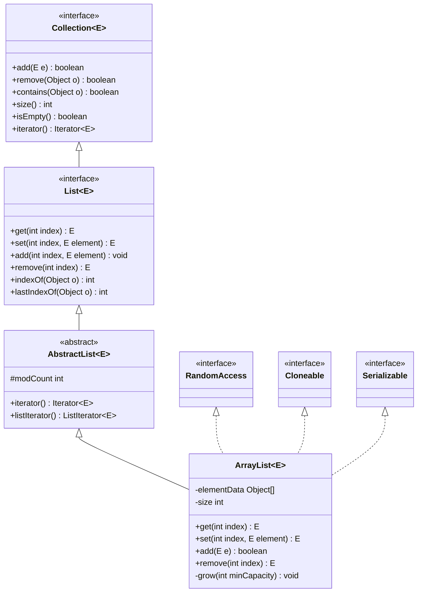
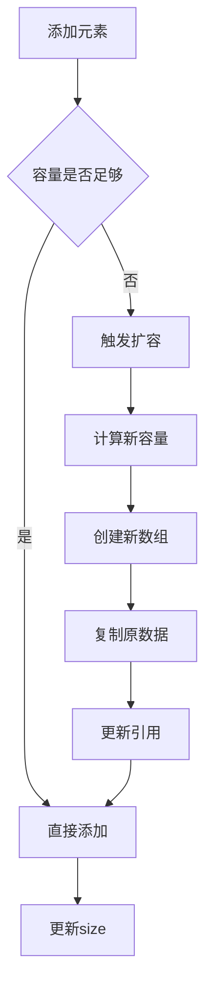

# 31.工业级List设计思想
#### 目录介绍
- 01.List集合核心思想
  - 1.1 核心设计理念
  - 1.2 接口层次结构
- 02.List集合如何设计
  - 2.1 使用数组设计
  - 2.2 使用链表设计
  - 2.3 设计考虑点
  - 2.4 数据迁移和安全
  - 2.5 元素效率考量
- 03.动态数组设计
  - 3.1 解决核心痛点
  - 3.2 底层存储结构
  - 3.3 容量管理策略
  - 3.4 设计优势
  - 3.5 设计缺陷与不足


## 01.List集合核心思想

### 1.1 核心设计理念

List集合的设计遵循以下核心理念：

- **有序性**：维护元素的插入顺序，支持基于索引的随机访问
- **动态性**：支持运行时动态调整容量，无需预先确定大小
- **通用性**：支持任意类型的对象存储（泛型支持）
- **兼容性**：实现Collection和List接口，保证API一致性

### 1.2 接口层次结构



## 02.List集合如何设计

### 2.1 使用数组设计


### 2.2 使用链表设计


### 2.3 设计考虑点


### 2.4 数据迁移和安全


### 2.5 元素效率考量

## 03.动态数组设计

### 3.1 解决核心痛点

ArrayList的设计主要解决以下痛点：

- **固定数组容量限制**：传统数组创建后容量固定，无法动态调整
- **内存浪费**：预分配过大数组导致内存浪费
- **容量不足**：预分配过小数组导致频繁重新分配
- **操作复杂性**：手动管理数组扩容、元素移动等操作复杂

### 3.2 底层存储结构

```java
// 核心存储数组
transient Object[] elementData;

// 实际元素数量
private int size;

// 默认初始容量
private static final int DEFAULT_CAPACITY = 10;

// 空数组实例
private static final Object[] EMPTY_ELEMENTDATA = {};
private static final Object[] DEFAULTCAPACITY_EMPTY_ELEMENTDATA = {};
```

### 3.3 容量管理策略



### 3.4 设计优势

- **摊销时间复杂度**：虽然单次扩容成本高，但摊销后添加操作仍为O(1)
- **内存局部性**：连续内存布局提供良好的缓存性能
- **随机访问**：O(1)时间复杂度的索引访问
- **空间效率**：相比链表结构，无需额外存储指针信息

### 3.5 设计缺陷与不足


