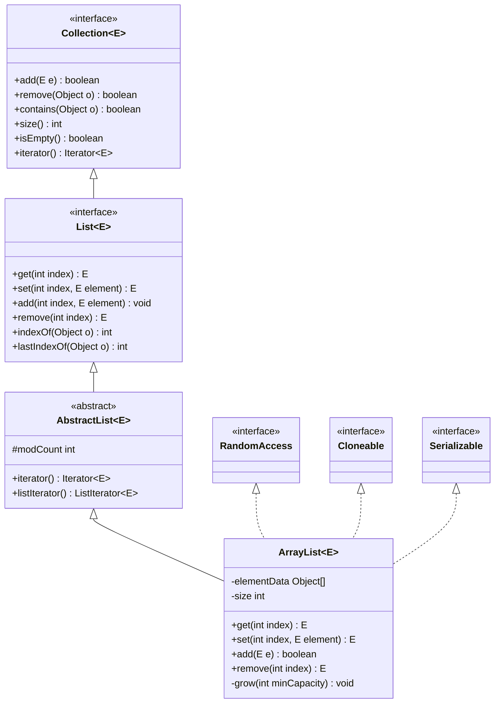
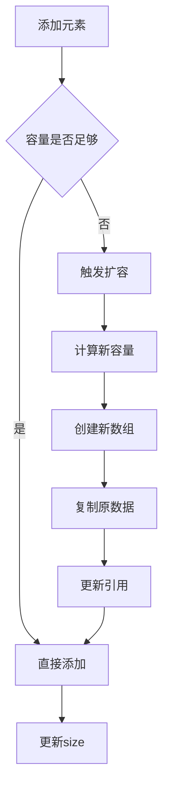
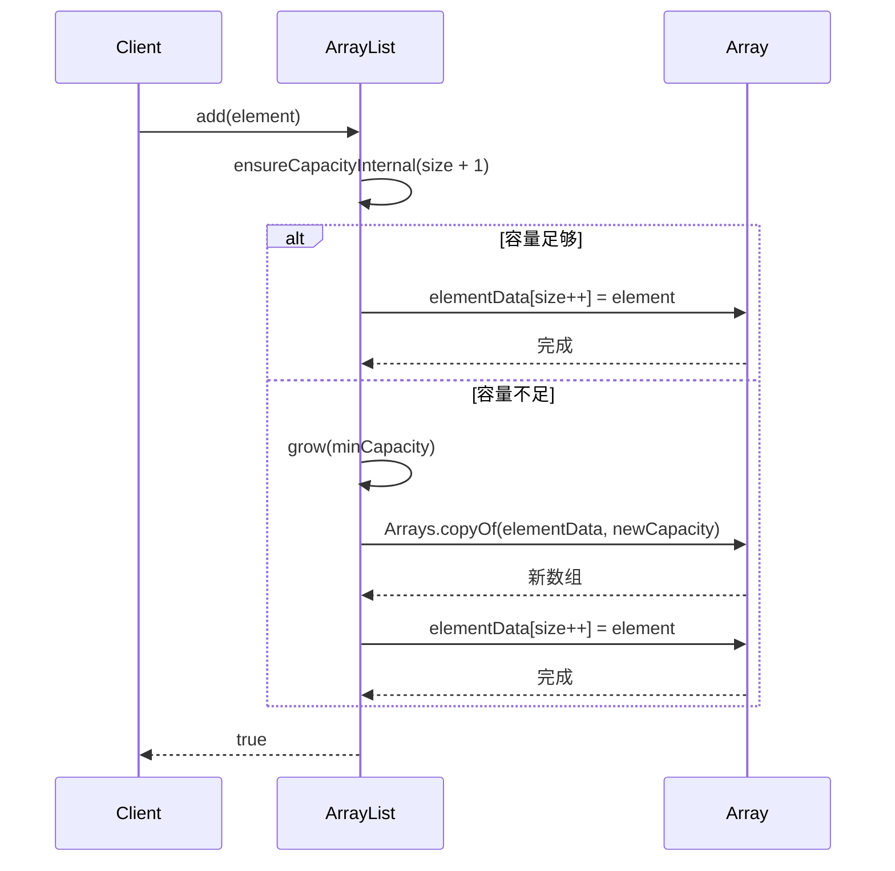
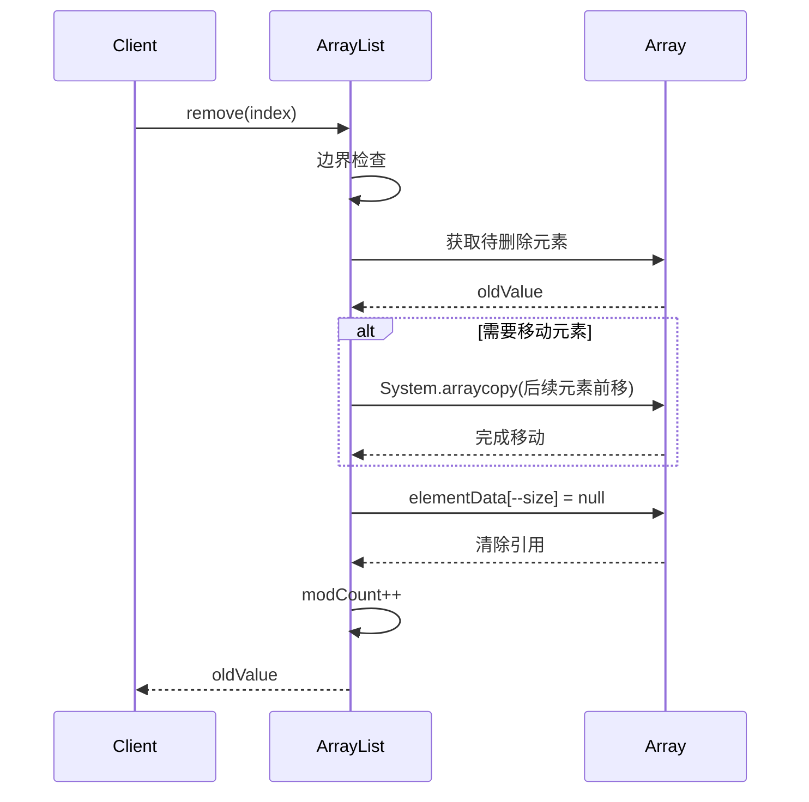

# 31.工业级List设计思想
#### 目录介绍
- 01.List集合核心思想
  - 1.1 核心设计理念
  - 1.2 接口层次结构
- 02.List集合如何设计
  - 2.1 使用数组设计
  - 2.2 使用链表设计
  - 2.3 设计考虑点
  - 2.4 数据迁移和安全
  - 2.5 元素效率考量
- 03.动态数组设计
  - 3.1 解决核心痛点
  - 3.2 底层存储结构
  - 3.3 容量管理策略
  - 3.4 设计优势
  - 3.5 设计缺陷与不足
- 04.添加元素设计
  - 4.1 添加元素思路
  - 4.2 添加元素流程
  - 4.3 容量确保机制
  - 4.4 扩容算法详解
  - 4.5 数据存储和迁移策略
- 05.移除元素设计
  - 5.1 移除元素思路
  - 5.2 移除元素实现
  - 5.3 高效删除设计
  - 5.4 删除操作时序图
  - 5.5 删除涉及扩容吗
- 06.元素访问设计
  - 6.1 元素访问思路
  - 6.2 随机访问实现
  - 6.3 查找操作实现
  - 6.4 访问性能特征


## 01.List集合核心思想

### 1.1 核心设计理念

List集合的设计遵循以下核心理念：

- **有序性**：维护元素的插入顺序，支持基于索引的随机访问
- **动态性**：支持运行时动态调整容量，无需预先确定大小
- **通用性**：支持任意类型的对象存储（泛型支持）
- **兼容性**：实现Collection和List接口，保证API一致性

### 1.2 接口层次结构



## 02.List集合如何设计

### 2.1 使用数组设计


### 2.2 使用链表设计


### 2.3 设计考虑点


### 2.4 数据迁移和安全


### 2.5 元素效率考量

## 03.动态数组设计

### 3.1 解决核心痛点

ArrayList的设计主要解决以下痛点：

- **固定数组容量限制**：传统数组创建后容量固定，无法动态调整
- **内存浪费**：预分配过大数组导致内存浪费
- **容量不足**：预分配过小数组导致频繁重新分配
- **操作复杂性**：手动管理数组扩容、元素移动等操作复杂

### 3.2 底层存储结构

```java
// 核心存储数组
transient Object[] elementData;

// 实际元素数量
private int size;

// 默认初始容量
private static final int DEFAULT_CAPACITY = 10;

// 空数组实例
private static final Object[] EMPTY_ELEMENTDATA = {};
private static final Object[] DEFAULTCAPACITY_EMPTY_ELEMENTDATA = {};
```

### 3.3 容量管理策略



### 3.4 设计优势

- **摊销时间复杂度**：虽然单次扩容成本高，但摊销后添加操作仍为O(1)
- **内存局部性**：连续内存布局提供良好的缓存性能
- **随机访问**：O(1)时间复杂度的索引访问
- **空间效率**：相比链表结构，无需额外存储指针信息

### 3.5 设计缺陷与不足

- **扩容成本**：扩容时需要复制整个数组，时间复杂度O(n)
- **内存峰值**：扩容瞬间需要2倍内存空间
- **插入/删除效率**：中间位置插入/删除需要移动大量元素
- **内存碎片**：频繁扩容可能导致内存碎片

## 4.1 添加元素设计

### 4.1 添加元素思路


### 4.2 添加元素流程

尾部添加（add方法）

```java
public boolean add(E e) {
    ensureCapacityInternal(size + 1);  // 确保容量足够
    elementData[size++] = e;           // 添加元素并更新size
    return true;
}
```

指定位置插入（add(index, element)方法）

```java
public void add(int index, E element) {
    if (index > size || index < 0)
        throw new IndexOutOfBoundsException(outOfBoundsMsg(index));

    ensureCapacityInternal(size + 1);  // 确保容量
    // 将index及之后的元素向后移动一位
    System.arraycopy(elementData, index, elementData, index + 1, size - index);
    elementData[index] = element;      // 插入新元素
    size++;
}
```

### 4.3 容量确保机制



### 4.4 扩容算法详解

```java
private void grow(int minCapacity) {
    int oldCapacity = elementData.length;
    // 新容量 = 旧容量 + 旧容量/2 (即1.5倍扩容)
    int newCapacity = oldCapacity + (oldCapacity >> 1);
    
    if (newCapacity - minCapacity < 0)
        newCapacity = minCapacity;
    if (newCapacity - MAX_ARRAY_SIZE > 0)
        newCapacity = hugeCapacity(minCapacity);
    
    // 创建新数组并复制数据
    elementData = Arrays.copyOf(elementData, newCapacity);
}
```

### 4.5 数据存储和迁移策略

- **1.5倍扩容策略**：平衡内存使用和扩容频率
- **System.arraycopy**：使用本地方法实现高效数组复制
- **延迟初始化**：默认构造函数创建空数组，首次添加时才分配容量

## 05.移除元素设计

### 5.1 移除元素思路


### 5.2 移除元素实现

按索引移除

```java
public E remove(int index) {
    if (index >= size)
        throw new IndexOutOfBoundsException(outOfBoundsMsg(index));

    modCount++;
    E oldValue = (E) elementData[index];

    int numMoved = size - index - 1;
    if (numMoved > 0)
        // 将index+1及之后的元素向前移动一位
        System.arraycopy(elementData, index+1, elementData, index, numMoved);
    
    elementData[--size] = null; // 清除引用，帮助GC
    return oldValue;
}
```

按对象移除

```java
public boolean remove(Object o) {
    if (o == null) {
        for (int index = 0; index < size; index++)
            if (elementData[index] == null) {
                fastRemove(index);
                return true;
            }
    } else {
        for (int index = 0; index < size; index++)
            if (o.equals(elementData[index])) {
                fastRemove(index);
                return true;
            }
    }
    return false;
}
```

### 5.3 高效删除设计

快速删除方法

```java
private void fastRemove(int index) {
    modCount++;
    int numMoved = size - index - 1;
    if (numMoved > 0)
        System.arraycopy(elementData, index+1, elementData, index, numMoved);
    elementData[--size] = null; // 帮助GC
}
```

批量删除优化

```java
private boolean batchRemove(Collection<?> c, boolean complement) {
    final Object[] elementData = this.elementData;
    int r = 0, w = 0;
    boolean modified = false;
    try {
        for (; r < size; r++)
            if (c.contains(elementData[r]) == complement)
                elementData[w++] = elementData[r];
    } finally {
        // 保持与AbstractCollection的行为兼容性
        if (r != size) {
            System.arraycopy(elementData, r, elementData, w, size - r);
            w += size - r;
        }
        if (w != size) {
            // 清除引用帮助GC
            for (int i = w; i < size; i++)
                elementData[i] = null;
            modCount += size - w;
            size = w;
            modified = true;
        }
    }
    return modified;
}
```

### 5.4 删除操作时序图




### 5.5 删除涉及扩容吗


## 06.元素访问设计

### 6.1 元素访问思路


### 6.2 随机访问实现

```java
public E get(int index) {
    if (index >= size)
        throw new IndexOutOfBoundsException(outOfBoundsMsg(index));
    
    return (E) elementData[index];
}

public E set(int index, E element) {
    if (index >= size)
        throw new IndexOutOfBoundsException(outOfBoundsMsg(index));

    E oldValue = (E) elementData[index];
    elementData[index] = element;
    return oldValue;
}
```

### 6.3 查找操作实现

```java
public int indexOf(Object o) {
    if (o == null) {
        for (int i = 0; i < size; i++)
            if (elementData[i]==null)
                return i;
    } else {
        for (int i = 0; i < size; i++)
            if (o.equals(elementData[i]))
                return i;
    }
    return -1;
}

public int lastIndexOf(Object o) {
    if (o == null) {
        for (int i = size-1; i >= 0; i--)
            if (elementData[i]==null)
                return i;
    } else {
        for (int i = size-1; i >= 0; i--)
            if (o.equals(elementData[i]))
                return i;
    }
    return -1;
}
```

### 6.4 访问性能特征


