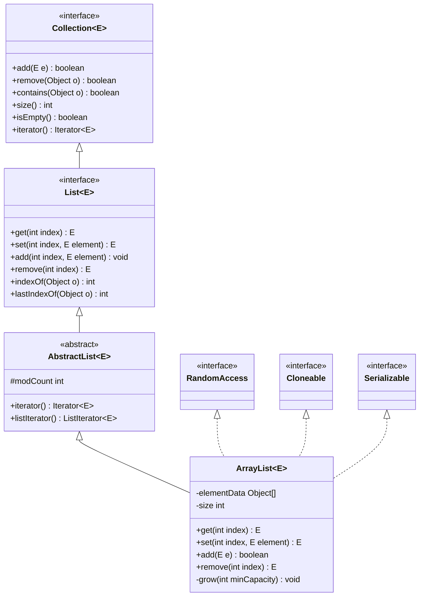

# 31.工业级List设计思想
#### 目录介绍
- 01.List集合核心思想
  - 1.1 核心设计理念
  - 1.2 接口层次结构

## 01.List集合核心思想

### 1.1 核心设计理念

List集合的设计遵循以下核心理念：

- **有序性**：维护元素的插入顺序，支持基于索引的随机访问
- **动态性**：支持运行时动态调整容量，无需预先确定大小
- **通用性**：支持任意类型的对象存储（泛型支持）
- **兼容性**：实现Collection和List接口，保证API一致性

### 1.2 接口层次结构

